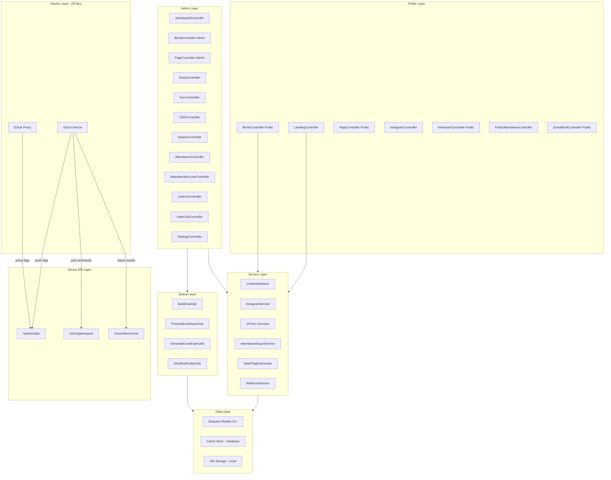
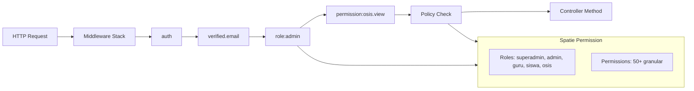
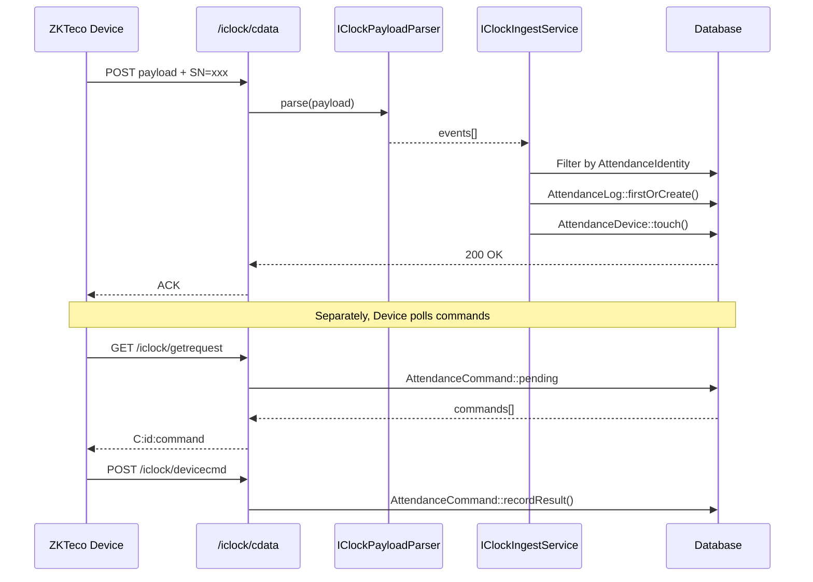

# Analisis Mendalam Arsitektur & Pola Coding Project SMK Telekomunikasi

> **Tanggal Analisis**: 27 September 2026
> **Framework**: Laravel 12 | **PHP**: ≥ 8.2 | **Database**: MySQL
> **Total Controllers**: 50+ | **Total Models**: 41+ | **Total Policies**: 18 | **Total Tests**: 25+ file

---

## Daftar Isi

1. [Modul Landing Page & CMS](#1-modul-landing-page--cms)
2. [Modul Absensi ZKTeco](#2-modul-absensi-zkteco)
3. [Modul OSIS Voting](#3-modul-osis-voting)
4. [Modul Sarpras & Sarana](#4-modul-sarpras--sarana)
5. [Modul Surat Menyurat](#5-modul-surat-menyurat)
6. [Modul Instagram Integration](#6-modul-instagram-integration)
7. [Pola Coding & Konvensi](#7-pola-coding--konvensi)
8. [Testing Coverage](#8-testing-coverage)
9. [Diagram Arsitektur](#9-diagram-arsitektur)

---

## 1. Modul Landing Page & CMS

### 1.1 LandingController — [`app/Http/Controllers/LandingController.php`](app/Http/Controllers/LandingController.php)

**Arsitektur**: Generic, multi-theme, zero-hardcoded theme names.

```
LandingController
├── index()            → GET / → view(current_theme())
├── telkom()           → GET /telkom → view('telkom') [deprecated]
├── maudu()            → GET /maudu → view('maudu') [deprecated]
├── buildData()        → private: mengumpulkan semua data landing
│   ├── getSiswaCount()
│   ├── getKelulusanPercentage()
│   ├── getTestimonials()
│   ├── getBlogs()
│   ├── getPartners()
│   ├── getEvents()
│   └── getInstagramPosts()
├── getSiteSettings()  → private: 100+ site settings dengan theme-aware defaults
└── createStaticPages() → delegate ke StaticPageGenerator
```

**Pola Penting**:
- **Convention-based view**: Nama view = nama theme (`telkom.blade.php`, `maudu.blade.php`)
- **Cache per theme**: Setiap query menggunakan cache key `landing_{theme}_*` dengan TTL 86400 detik
- **Theme-aware defaults**: Setiap setting menggunakan 3-tier fallback: `theme_config()` → config file → hardcoded default
- **View::share()**: `themeConfig`, `currentTheme`, `siteSettings` di-share ke semua Blade views

**Dependencies**:
- [`InstagramService`](app/Services/InstagramService.php) untuk gallery posts
- [`StaticPageGenerator`](app/Services/StaticPageGenerator.php) untuk generate halaman statis
- 6 Model: `Siswa`, `Kelulusan`, `Testimonial`, `Page`, `Partner`, `Events`

### 1.2 BeritaController — [`app/Http/Controllers/BeritaController.php`](app/Http/Controllers/BeritaController.php)

**Dual Interface**: Admin CRUD + Public browsing dalam satu controller.

| Section | Methods | Keterangan |
|---------|---------|------------|
| Admin | `index`, `create`, `store`, `show`, `edit`, `update`, `destroy` | CRUD berita dengan category `berita` |
| Public | `publicIndex`, `publicShow` | Theme-aware views via `theme_view()` |

**Pola Penting**:
- **Content Sanitization**: `ContentSanitizer->sanitize()` pada store/update untuk mencegah XSS
- **Category constraint**: `self::CATEGORY = 'berita'` — semua query di-filter berdasarkan category
- **Cache invalidation**: `clearBlogsCache()` dipanggil setelah create/update/delete
- **Theme-aware views**: `theme_view('berita.public.index')` → fallback ke `berita/public/index.blade.php`
- **Slug generation**: `uniqueSlug()` method custom untuk unique slug

### 1.3 PageController — [`app/Http/Controllers/PageController.php`](app/Http/Controllers/PageController.php)

**CMS terlengkap** — 527 baris, mendukung:

| Fitur | Detail |
|-------|--------|
| CRUD Pages | Admin listing, create, store, update, delete |
| Page Versioning | `PageVersion::createFromPage()` — setiap edit membuat versi baru |
| Menu System | `is_menu`, `menu_title`, `menu_position`, `parent_id`, `menu_icon`, `menu_url` |
| SEO Meta | `seo_title`, `seo_description`, `seo_keywords` disimpan sebagai JSON |
| Templates | `getAvailableTemplates()` — pilihan template saat create |
| Public View | `publicIndex`, `publicShow` — browse pages published |
| DB Transaction | `DB::transaction()` untuk create page + versi awal |

**Pola Penting**:
- **Content Sanitization**: `ContentSanitizer->sanitize()` pada store/update
- **Cache management**: `cache()->forget('header_menus')` dan `cache()->forget('footer_menus')` setelah perubahan menu
- **Menu URL validation**: Filter manual — hanya terima full URL atau path `/`, bukan slug
- **Nested pages**: `parent_id` mendukung hierarchical menu structure

### 1.4 TestimonialController — [`app/Http/Controllers/TestimonialController.php`](app/Http/Controllers/TestimonialController.php)

**Public submission + Admin moderation**:

| Flow | Detail |
|------|--------|
| Public `create` → `store` | Form publik tanpa login, IP + user agent dicapture |
| Admin `index` → `show` | Filter by status (approved/pending/featured), position, search |
| Admin moderation | `approve()`, `reject()`, `toggleFeatured()`, `destroy()` |

**Pola Penting**:
- **Content Sanitization**: `ContentSanitizer->sanitizeSimple()` — tanpa iframe (konten sederhana)
- **Manual Validator**: Menggunakan `Validator::make()` bukan `$request->validate()` untuk kontrol lebih
- **JSON support**: `show()` mendukung AJAX/JSON response
- **Photo cleanup**: `Storage::disk('public')->exists()` sebelum delete

---

## 2. Modul Absensi ZKTeco

### 2.1 Arsitektur Keseluruhan

```
┌─────────────────────────────────────────────────────────────┐
│                    ZKTeco iClock Device                       │
│  (Push attendance logs via HTTP POST /iclock/cdata)          │
│  (Pull commands via GET /iclock/getrequest)                  │
│  (Report results via POST /iclock/devicecmd)                 │
└─────────────┬───────────────────────────┬───────────────────┘
              │                           │
              ▼                           ▼
┌─────────────────────┐    ┌──────────────────────────────┐
│ IClockIngestService  │    │ IClockCommandQueue            │
│ (Parse & store logs) │    │ (Queue commands to device)    │
└─────────┬───────────┘    └──────────┬───────────────────┘
          │                           │
          ▼                           ▼
┌─────────────────────┐    ┌──────────────────────────────┐
│ IClockPayloadParser  │    │ UserSyncService               │
│ (Multi-format parse) │    │ (Add/Update/Delete users)     │
└─────────────────────┘    └──────────────────────────────┘
          │                           │
          ▼                           ▼
┌─────────────────────┐    ┌──────────────────────────────┐
│ AttendanceLog        │    │ AttendanceCommand              │
│ (Raw device logs)    │    │ (Pending commands queue)      │
└─────────┬───────────┘    └──────────────────────────────┘
          │
          ▼
┌─────────────────────┐
│ Attendance           │
│ (Daily aggregated)   │
└─────────────────────┘
```

### 2.2 Controllers

#### [`AttendanceController`](app/Http/Controllers/AttendanceController.php)
- **Extends `BaseController`** (bukan `Controller`) — menggunakan `AttendanceAuthorization` trait
- Methods: `index()`, `logs()`, `devices()`, `updateDevice()`, `destroyDevice()`, `mapping()`, `storeMapping()`
- **Authorization**: `$this->requireAdminOrPermission('attendance.view')` — role-based + permission-based

#### [`AttendanceExcuseController`](app/Http/Controllers/AttendanceExcuseController.php)
- CRUD Izin/Sakit/Cuti/Dinas/Alpha
- **Duplicate check**: Cek izin ganda per identity per tanggal
- **File attachment**: Upload bukti (JPG/PNG/PDF, max 5MB)
- **Status workflow**: `pending` → `approved`/`rejected` dengan audit trail
- **Audit logging**: `AuditLog::createLog()` pada approve/reject

#### [`AttendanceReportController`](app/Http/Controllers/AttendanceReportController.php)
- Report harian, mingguan, bulanan, keterlambatan, detail per user
- Export via [`AttendanceExportService`](app/Services/AttendanceExportService.php)

#### [`ZKTecoIClockController`](app/Http/Controllers/ZKTecoIClockController.php)
- **Device-facing API** — tidak butuh auth, menggunakan secret token
- `cdata()` — POST attendance data dari device
- `getrequest()` — GET pending commands untuk device
- `devicecmd()` — POST command execution results
- **Rate limiting**: `throttle:device-api` (120 req/min)

### 2.3 ZKTeco Services

#### [`IClockPayloadParser`](app/Services/ZKTeco/IClockPayloadParser.php)
Multi-format parser yang mendukung:
1. **ZKTeco standard**: `PIN=xxx\tDateTime=YYYY-MM-DD HH:MM:SS\tVerified=xx\tStatus=xx`
2. **Tab-separated**: `PIN\tDateTime\tInOutMode\tVerifyMode`
3. **Comma-separated**: `PIN,DateTime,VerifyMode,InOutMode`
4. **iClock Proxy format**: Salah satu dari di atas

**Metadata filtering**: Skip baris `table=`, `Stamp=`, `OpStamp=`, `GET OPTION FROM`, `CHECKOPTION`, `STARTUP`, `Systime`, `VERSION`, `INFO=`, `ACK`, `NACK`, `CONNECT`

**DateTime parsing**: Mendukung format `YYYY-MM-DD`, `YYYY/MM/DD`, `DD-MM-YYYY`, `DD/MM/YYYY`, `MM/DD/YYYY` dengan fallback ke `Carbon::parse()`

#### [`IClockIngestService`](app/Services/ZKTeco/IClockIngestService.php)
- **Identity filtering**: Hanya terima log dari PIN yang terdaftar di `attendance_identities` (jika `require_user_identity = true`)
- **Verification filtering**: Opsional — hanya terima user terverifikasi
- **Idempotent**: Menggunakan `firstOrCreate` untuk mencegah duplikat
- **DB Transaction**: Semua operasi dalam satu transaction
- **Device auto-registration**: Device baru otomatis terdaftar saat pertama push log

#### [`UserSyncService`](app/Services/ZKTeco/UserSyncService.php)
- **Command queue pattern**: Enqueue ADD/UPDATE/DELETE ke database, device pull saat poll
- Commands: `DATA APPEND USERINFO`, `DATA UPDATE USERINFO`, `DATA DELETE USERINFO`
- **Bulk sync**: `syncAllUsers()` — sync semua identity ke semua device aktif
- **Status tracking**: `getSyncStatus()` — status command per PIN

#### [`IClockCommandQueue`](app/Services/ZKTeco/IClockCommandQueue.php)
- **Pull-based**: Device poll `/iclock/getrequest` untuk mendapat pending commands
- **State machine**: `pending` → `sent` → `done`/`failed`
- **Result recording**: `recordResult()` — device laporkan hasil eksekusi command

#### [`BiometricEnrollmentService`](app/Services/ZKTeco/BiometricEnrollmentService.php)
- **Direct socket connection** ke device (port 4370 default)
- **Queue-based enrollment**: Fingerprint, Face, RFID via command queue
- **Multi-device**: Command di-queue ke semua device aktif
- Socket operations: `connect()`, `disconnect()`, `getUsers()`

### 2.4 Configuration — [`config/attendance.php`](config/attendance.php)

| Section | Key Settings |
|---------|-------------|
| iClock Integration | `iclock_secret`, `require_user_identity`, `require_user_verified` |
| Sync Settings | `sync_enabled`, `sync_interval` (5 min), `sync_batch_size` (100) |
| Work Hours | `start` (07:00), `end` (15:00), `late_threshold` (07:30) |
| Alpha Mark | `alpha_mark_time` (23:00) |
| Overtime | `overtime_enabled`, `overtime_start`, `overtime_rate_per_hour` |
| Export | `export_format` (xlsx), `export_institution` |
| Notification | `daily_summary_time` (16:00), `notify_late`, `notify_alpha` |
| Report | `work_days_per_week` (6), `work_days_per_month` (25) |
| Biometric | `biometric_mode` (fingerprint), `multi_template` |
| Cleanup | `cleanup_enabled`, `cleanup_retention_days` (365) |

Semua setting bisa di-override via env vars `ATTENDANCE_*`.

### 2.5 Trait — [`AttendanceAuthorization`](app/Traits/AttendanceAuthorization.php)

```php
protected function requireAdminOrPermission(string $permission): void
{
    // 1. Check admin/superadmin role → allow
    // 2. Check guru role + 'attendance.view' permission → allow
    // 3. Check specific permission → allow
    // 4. Otherwise → abort(403)
}
```

### 2.6 Observer — [`AttendanceIdentityObserver`](app/Observers/AttendanceIdentityObserver.php)

**Auto-sync ke device** saat identity di-update/dihapus:
- `updated()`: Jika `is_active` berubah ke false atau `user_id` jadi null → enqueue delete user
- `deleted()`: Enqueue delete user ke semua device aktif

---

## 3. Modul OSIS Voting

### 3.1 Arsitektur

```
┌─────────────────────────────────────────────┐
│              OSISController (1186 baris)      │
├─────────────────────────────────────────────┤
│ Dashboard: index(), analytics()              │
│ Calon CRUD: calonIndex, createCalon,         │
│   storeCalon, editCalon, updateCalon,        │
│   destroyCalon, showCalon                    │
│ Pemilih CRUD: pemilihIndex, createPemilih,   │
│   storePemilih, editPemilih, updatePemilih,  │
│   destroyPemilih, generatePemilihFromUsers   │
│ Import/Export: importCalon, exportCalon,     │
│   importPemilih, exportPemilih, downloadTemplate │
│ Voting: voting(), processVote()              │
│ Results: results(), teacherView()            │
└─────────────────────────────────────────────┘
```

### 3.2 Models

#### [`Calon`](app/Models/Calon.php)
- Fields: `nama_ketua`, `foto_ketua`, `nama_wakil`, `foto_wakil`, `jenis_kelamin`, `visi_misi`, `jenis_pencalonan`, `is_active`
- **Scopes**: `scopeActive()`, `scopeOrdered()`, `scopeByGender()`
- **Accessors**: `ketua_photo_url`, `wakil_photo_url`, `total_votes`
- **Relations**: `votings()` (HasMany)
- **Boot**: Auto-delete photos on model deletion
- **Uses**: `Auditable` trait untuk audit logging

#### [`Voting`](app/Models/Voting.php)
- Fields: `calon_id`, `pemilih_id`, `siswa_id`, `election_id`, `waktu_voting`, `ip_address`, `user_agent`, `is_valid`
- **Scopes**: `scopeValid()`, `scopeInvalid()`, `scopeDateRange()`, `scopeForCalon()`, `scopeForPemilih()`
- **Relations**: `calon()`, `pemilih()`, `siswa()`, `election()`

#### [`Pemilih`](app/Models/Pemilih.php)
- **Scopes**: `scopeActive()`, `scopeSudahMemilih()`, `scopeBelumMemilih()`, `scopeKelas()`

### 3.3 Voting Flow

```
1. Siswa login → GET /admin/osis/voting
2. Cek role = 'siswa' → Cek Siswa data → Cek belum voted
3. Cek OsisElection::active() → Cek allowed_classes
4. Filter calon by gender (siswa only sees same-gender candidates)
5. POST /admin/osis/voting → Validate calon_id
6. Cek double vote → Validate gender match
7. Create Voting record (calon_id, siswa_id, election_id, ip, user_agent)
8. $siswa->markAsVoted() → Redirect to results
```

### 3.4 Anti-Fraud Measures
- **Double vote prevention**: `siswa->hasVotedOsis()` check + DB constraint
- **IP tracking**: `ip_address` dan `user_agent` disimpan di Voting record
- **Gender filtering**: Siswa hanya bisa pilih calon dengan jenis kelamin sama
- **Election scoping**: `OsisElection::active()` — hanya 1 election aktif
- **Rate limiting**: `throttle:voting` (5 votes/menit)

### 3.5 Import/Export Pattern
- **Maatwebsite Excel**: `CalonImport`, `CalonExport`, `PemilihImport`, `PemilihExport`
- **Template download**: `downloadCalonTemplate()` — generate Excel template dengan sample data
- **PDF export**: `Barryvdh\DomPDF` untuk cetak hasil voting
- **Auto-generate**: `generatePemilihFromUsers()` — sync dari Siswa + Guru models

---

## 4. Modul Sarpras & Sarana

### 4.1 [`SarprasController`](app/Http/Controllers/SarprasController.php) — 1332 baris

**Monolithic controller** yang mengelola semua aspek Sarpras:

| Sub-Module | Methods | Models |
|------------|---------|--------|
| Dashboard | `index()` | Aggregated stats dengan cache 5 menit |
| Kategori | `kategoriIndex`, `createKategori`, `storeKategori`, `editKategori`, `updateKategori`, `destroyKategori` | `KategoriSarpras` |
| Barang | `barangIndex`, `createBarang`, `storeBarang`, `editBarang`, `updateBarang`, `destroyBarang` | `Barang` |
| Ruang | `ruangIndex`, `createRuang`, `storeRuang`, `editRuang`, `updateRuang`, `destroyRuang` | `Ruang` |
| Maintenance | `maintenanceIndex`, `createMaintenance`, `storeMaintenance`, `editMaintenance`, `updateMaintenance`, `destroyMaintenance` | `Maintenance` |
| Sarana | `saranaIndex`, `createSarana`, `storeSarana`, `editSarana`, `updateSarana`, `destroySarana` | `Sarana` |
| Barcode | `generateBarcode()`, `printBarcode()` | `DNS1DFacade`, `DNS2DFacade` |
| Import/Export | `importBarang()`, `exportBarang()` | `BarangImport`, `BarangExport` |
| Report | Report views | `Pdf::loadView()` |

**Pola Penting**:
- **Content Sanitization**: `sanitizeText()` untuk nama, `sanitizeSimple()` untuk deskripsi
- **Cache management**: `cache()->forget('sarpras_dashboard_stats')` setiap perubahan
- **Barcode generation**: DNS1D (linear) dan DNS2D (QR code) via Milon Barcode package
- **Relationship validation**: Cek referensi sebelum hapus (kategori → barang, ruang → barang)

---

## 5. Modul Surat Menyurat

### 5.1 [`LetterInController`](app/Http/Controllers/LetterInController.php) — 91 baris

**Sederhana dan clean**:
- **Middleware-based auth**: `$this->middleware('permission:surat.in.view')` di constructor
- **Activity logging**: `LetterActivityLog::create()` pada setiap aksi
- **Content Sanitization**: `sanitizeText()` untuk subject, `sanitizeSimple()` untuk description
- **File upload**: PDF/JPG/PNG, max 2MB, disimpan di `letters/incoming`

### 5.2 [`LetterOutController`](app/Http/Controllers/LetterOutController.php)

**Lebih kompleks** dengan fitur:
- CRUD surat keluar
- **Print view**: Format cetak surat resmi
- **Upload processed**: Upload surat yang sudah diproses/ditandatangani
- **Format templates**: `LetterFormatController` untuk mengelola format surat

### 5.3 Routes Structure

```php
Route::prefix('admin/surat')->name('admin.letters.')->middleware(['auth', 'verified'])->group(function () {
    // Surat Keluar: CRUD + print + upload
    Route::prefix('out')->name('out.')->group(function () { ... });
    // Surat Masuk: CRUD
    Route::prefix('in')->name('in.')->group(function () { ... });
    // Format Surat: Resource controller
    Route::resource('formats', LetterFormatController::class);
});
```

---

## 6. Modul Instagram Integration

### 6.1 [`InstagramService`](app/Services/InstagramService.php) — 749 baris

**Full Instagram Graph API integration**:

| Method | Fungsi |
|--------|--------|
| `fetchPosts()` | Fetch dari Instagram Platform API v20.0 |
| `getCachedPosts()` | Cached 1 jam via `Cache::remember()` |
| `refreshPosts()` | Clear cache + fetch ulang |
| `getMockPosts()` | 8 sample posts sebagai fallback |
| `exchangeCodeForToken()` | OAuth code → access token |
| `getLongLivedToken()` | Short-lived → long-lived token |
| `verifyWebhook()` | Meta webhook verification |
| `handleWebhook()` | Process webhook notifications |
| `getAnalytics()` | Engagement metrics |

**Credential resolution**: Database (`InstagramSetting::active()`) → env fallback (`config('services.instagram')`)

**Fallback pattern**: Jika API gagal → return `getMockPosts()` (8 Unsplash placeholder images)

### 6.2 [`InstagramController`](app/Http/Controllers/InstagramController.php)

| Method | Route | Keterangan |
|--------|-------|------------|
| `index()` | `GET /kegiatan` | Public gallery page |
| `refresh()` | `GET /kegiatan/refresh` | Force refresh posts |
| `getPosts()` | `GET /kegiatan/posts` | JSON API |
| `verifyWebhook()` | `GET /instagram/webhook` | Meta verification |
| `handleWebhook()` | `POST /instagram/webhook` | Process notifications |
| `handleOAuthCallback()` | `GET /instagram/callback` | OAuth token exchange |

---

## 7. Pola Coding & Konvensi

### 7.1 ContentSanitizer — [`app/Services/ContentSanitizer.php`](app/Services/ContentSanitizer.php)

**XSS Prevention Service** dengan 8-step sanitization pipeline:

```
1. html_entity_decode()     → Decode HTML entities
2. Strip HTML comments      → Hapus <!-- comments -->
3. stripDisallowedTags()    → Hapus script, style, object, embed, form, iframe
4. stripDisallowedAttributes() → Hapus atribut yang tidak diizinkan
5. sanitizeUrls()           → Hapus javascript: protocol
6. sandboxIframes()         → Sandbox iframe embeds
7. stripEventHandlers()     → Hapus onclick, onerror, dll
8. Trim whitespace
```

**3 Level Sanitasi**:

| Method | Use Case | Iframe | Contoh |
|--------|----------|--------|--------|
| `sanitize()` | Rich content (CMS pages, berita) | ✅ Allowed (sandboxed) | Page content, berita content |
| `sanitizeSimple()` | Simple content (testimonials, comments) | ❌ Stripped | Testimonial text, deskripsi |
| `sanitizeText()` | Plain text (names, titles) | ❌ All tags stripped | Kategori name, letter subject |

**Usage Across Controllers**:

| Controller | Field | Method |
|------------|-------|--------|
| `BeritaController` | `content` | `sanitize()` |
| `PageController` | `content` | `sanitize()` |
| `TestimonialController` | `testimonial` | `sanitizeSimple()` |
| `LetterInController` | `subject`, `description` | `sanitizeText()`, `sanitizeSimple()` |
| `SarprasController` | `nama_kategori`, `deskripsi` | `sanitizeText()`, `sanitizeSimple()` |
| `SettingsController` | Multiple HTML fields | `sanitize()` |

**Tag Whitelist** (ALLOWED_TAGS):
- Text: `p`, `br`, `hr`, `h1`-`h6`, `strong`, `b`, `em`, `i`, `u`, `s`, `del`, `ins`, `mark`, `small`, `sub`, `sup`, `blockquote`, `cite`, `q`
- Lists: `ul`, `ol`, `li`, `dl`, `dt`, `dd`
- Links/Media: `a`, `img`, `figure`, `figcaption`
- Tables: `table`, `thead`, `tbody`, `tfoot`, `tr`, `th`, `td`, `caption`, `colgroup`, `col`
- Layout: `div`, `span`, `pre`, `code`, `abbr`, `address`
- Embedded: `iframe` (sandboxed), `video`, `source`, `audio`

### 7.2 Safe Helper Pattern

Pattern `safe()` yang digunakan di controllers untuk try-catch konsolidasi:

```php
private function safe(callable $callback, mixed $fallback = null): mixed
{
    try { return $callback(); }
    catch (\Exception $e) { return $fallback; }
}
```

**Catatan**: Pattern ini didefinisikan di AGENTS.md sebagai best practice, namun dari analisis codebase, **tidak ditemukan penggunaan aktif** di controllers yang dibaca. Controllers lebih memilih try-catch langsung atau menggunakan cache fallback pattern.

### 7.3 Spatie Permission / RBAC

**Registration** di [`AuthServiceProvider`](app/Providers/AuthServiceProvider.php):

```php
protected $policies = [
    User::class => UserPolicy::class,
    Barang::class => SarprasPolicy::class,
    Calon::class => OSISPolicy::class,
    Pemilih::class => PemilihPolicy::class,
    Siswa::class => SiswaPolicy::class,
    Guru::class => GuruPolicy::class,
    Kelulusan::class => KelulusanPolicy::class,
    Page::class => PagePolicy::class,
    AuditLog::class => AuditLogPolicy::class,
    JadwalPelajaran::class => JadwalPelajaranPolicy::class,
    Attendance::class => AttendancePolicy::class,
    AttendanceExcuse::class => AttendancePolicy::class,
    AttendanceIdentity::class => AttendancePolicy::class,
];
```

**Gate definitions**:
- `accessAdminPanel` → superadmin only
- `manageRolesAndPermissions` → superadmin only
- `viewAnalytics` → superadmin OR `system.analytics` permission
- `viewSystemHealth` → superadmin OR `system.health` permission

**3 Layer Authorization**:

| Layer | Mechanism | Example |
|-------|-----------|---------|
| Route middleware | `role:superadmin`, `permission:osis.view` | Route-level protection |
| Controller trait | `requireAdminOrPermission()` | AttendanceAuthorization trait |
| Policy methods | `$user->can('osis.view')` | Model-level authorization |

**Roles**: `superadmin`, `admin`, `guru`, `siswa`, `osis`

**Policy Pattern** — contoh [`OSISPolicy`](app/Policies/OSISPolicy.php):

```php
public function viewAny(User $user): bool
{
    return $user->can('osis.view') 
        || $user->can('osis.read') 
        || $user->hasRole(['superadmin', 'admin', 'osis']);
}
```

### 7.4 Job Queue Pattern

#### [`BulkEmailJob`](app/Jobs/BulkEmailJob.php)
- **ShouldQueue** dengan retry 3x, backoff 120s
- **Batch processing**: Chunk users per 50 untuk hindari memory issues
- **Preference check**: Cek `notification_preferences` per user sebelum kirim
- **Mailable**: `NotificationMail` dengan template

#### [`ProcessExcelImportJob`](app/Jobs/ProcessExcelImportJob.php)
- **ShouldQueue** dengan retry 3x, backoff 30s
- **Queue**: `imports` queue
- **AsyncJob tracking**: `AsyncJob::markRunning()` → `markCompleted()`/`markFailed()`
- **Module resolution**: `match` expression untuk resolve Import class per module

#### [`GenerateExcelExportJob`](app/Jobs/GenerateExcelExportJob.php)
- **ShouldQueue** dengan retry 3x, backoff 30s
- **Queue**: `exports` queue
- **Filter support**: `filters` array untuk scope export data
- **File storage**: Export disimpan ke `exports/` directory, URL di-generate via route

#### [`SendNotificationJob`](app/Jobs/SendNotificationJob.php)
- Push notification delivery

### 7.5 Observer Pattern

#### [`AttendanceIdentityObserver`](app/Observers/AttendanceIdentityObserver.php)
- **Active observer** — auto-sync identity changes ke ZKTeco devices
- Triggered on `updated` dan `deleted` events
- Enqueues delete command via `IClockCommandQueue`

#### [`UserObserver`](app/Observers/UserObserver.php)
- **Empty** — role management delegated ke Spatie Permission package
- Historical artifact, observer methods removed

### 7.6 Auditable Trait — [`app/Traits/Auditable.php`](app/Traits/Auditable.php)

**Automatic audit logging** untuk model events:

```php
static::created(fn($model) => $model->auditLog('create', ...));
static::updated(fn($model) => $model->auditLog('update', ...));
static::deleted(fn($model) => $model->auditLog('delete', ...));
```

- **Sensitive field filtering**: Excludes `password`, `remember_token`, `api_token`
- **Request context**: Captures `ip_address` dan `user_agent`
- **Auth check**: Skips logging jika user tidak authenticated (untuk seeders)

### 7.7 Export/Import Pattern

**Maatwebsite Excel** digunakan secara konsisten:

| Module | Import Class | Export Class |
|--------|-------------|-------------|
| Users | `UserImport` | `UserExport` |
| Siswa | `SiswaImport` | `SiswaExport` |
| Guru | `GuruImport` | `GuruExport` |
| Barang | `BarangImport` | `BarangExport` |
| Calon | `CalonImport` | `CalonExport` |
| Pemilih | `PemilihImport` | `PemlehExport` |
| Kelulusan | `KelulusanImport` | `KelulusanExport` |

**Sync vs Async**:
- **Sync**: Direct `Excel::import()` / `Excel::download()` di controller
- **Async**: Via Jobs (`ProcessExcelImportJob`, `GenerateExcelExportJob`) dengan `AsyncJob` tracking

### 7.8 Cache Strategy

**Konsisten** di seluruh controllers:

```php
// Landing page — per-theme cache
Cache::remember("landing_{$theme}_siswa_count", 86400, fn() => ...);

// OSIS dashboard — 2 menit
cache()->remember('osis_dashboard_stats', 120, fn() => ...);

// Sarpras dashboard — 5 menit
cache()->remember('sarpras_dashboard_stats', 300, fn() => ...);

// Instagram — 1 jam
Cache::remember('instagram_posts', 3600, fn() => ...);

// Selective invalidation
cache()->forget('sarpras_dashboard_stats');
cache()->forget('osis_dashboard_stats');
```

### 7.9 Rate Limiting

**42+ routes dilindungi** throttle middleware:

| Rate | Routes |
|------|--------|
| `5,1` | Login, user invite, testimonial, Instagram test-connection |
| `10,1` | Import/export, excuses store, bulk ops |
| `20,1` | Excuses approve/reject |
| `30,1` | Image upload, push subscribe |
| `3,1` | Password reset |
| `6,1` | Email verification |
| `voting` (custom) | OSIS voting — 5 votes/menit |
| `webhook` (custom) | Instagram webhook — 120 req/menit |
| `device-api` (custom) | ZKTeco iClock — 120 req/menit |
| `bulk` (custom) | Bulk import/seed — 5 ops/menit |

---

## 8. Testing Coverage

### 8.1 Test Files

| File | Coverage | Key Assertions |
|------|----------|----------------|
| `OSISVotingFlowTest.php` | Full voting flow | Create calon, create pemilih, vote, double vote prevention, results |
| `AttendanceIClockIngestTest.php` | ZKTeco integration | Device registration, log ingestion, identity filtering, command queue |
| `LandingControllerComprehensiveTest.php` | Landing page | Theme rendering, data population, caching |
| `TelkomLandingTest.php` | Telkom theme | Theme-specific views |
| `DashboardControllerTest.php` | Dashboard | Stats, role-based access |
| `EventControllerTest.php` | Events | CRUD, public view |
| `GuestBookTest.php` | Guest book | Admin CRUD |
| `GuestBookPublicTest.php` | Public guest book | Self check-in, anti-spam |
| `KelulusanFlowTest.php` | Graduation | Check status, certificate |
| `LetterControllerTest.php` | Letters | CRUD, permission |
| `PageControllerTest.php` | CMS pages | CRUD, versioning, menus |
| `SarprasTest.php` | Sarpras | CRUD, barcode, import/export |
| `SecurityTest.php` | Security | CSP headers, XSS prevention |
| `SettingsControllerTest.php` | Settings | Theme settings |
| `RolePermissionTest.php` | RBAC | Role assignment, permission checks |
| `UserManagementTest.php` | User mgmt | CRUD, invite |
| `ProfileTest.php` | Profile | Edit, password update |

### 8.2 Auth Tests

| File | Coverage |
|------|----------|
| `AuthenticationTest.php` | Login, logout |
| `RegistrationTest.php` | User registration |
| `PasswordResetTest.php` | Password reset flow |
| `PasswordConfirmationTest.php` | Password confirmation |
| `PasswordUpdateTest.php` | Password update |
| `EmailVerificationTest.php` | Email verification |

### 8.3 Testing Patterns

- **`RefreshDatabase`**: Semua tests menggunakan trait ini untuk database isolation
- **Role setup**: Manual role creation via `getOrCreateRole()` helper
- **Factory usage**: `User::factory()->create()`, `Siswa::factory()->create()`, `Calon::factory()->create()`
- **Route testing**: `route('admin.osis.calon.store')` — named route assertions
- **Session assertions**: `assertSessionHasErrors()`, `assertRedirect()`
- **Database assertions**: `assertDatabaseHas()`, `assertDatabaseCount()`

---

## 9. Diagram Arsitektur

### 9.1 High-Level Architecture



### 9.2 Authentication & Authorization Flow



### 9.3 Data Flow Absensi



---

## Kesimpulan

### Kekuatan Arsitektur

1. **Theme system yang mature** — Generic, zero-hardcoded, convention-based views, 4-tier image resolution
2. **ZKTeco integration yang lengkap** — Full bidirectional communication, command queue, multi-format parsing, biometric enrollment
3. **Security layers berlapis** — ContentSanitizer, CSP headers, rate limiting, RBAC + permissions, audit logging
4. **Async processing** — Jobs untuk email, import/export dengan progress tracking
5. **Consistent caching** — Semua heavy queries di-cache dengan invalidation pattern
6. **Comprehensive testing** — Feature tests untuk critical flows (voting, attendance, auth)

### Area Potensial untuk Improvement

1. **Fat controllers** — `OSISController` (1186 baris) dan `SarprasController` (1332 baris) bisa di-split ke smaller controllers atau actions
2. **Safe() helper** — Didefinisikan di AGENTS.md tapi belum di-adopt secara luas di codebase
3. **UserObserver** — Empty observer, bisa di-remove jika tidak diperlukan
4. **Service injection** — Beberapa controllers instantiate services langsung (`new ContentSanitizer()`) alih-alih menggunakan DI
