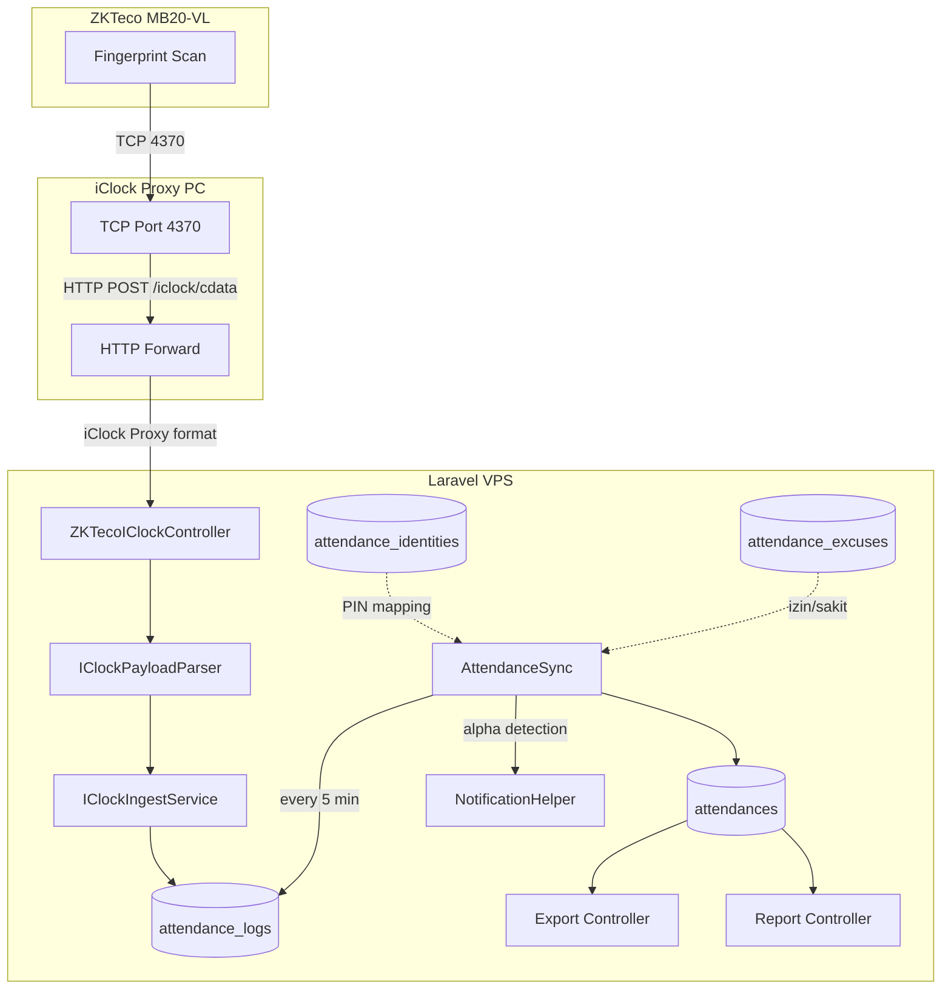
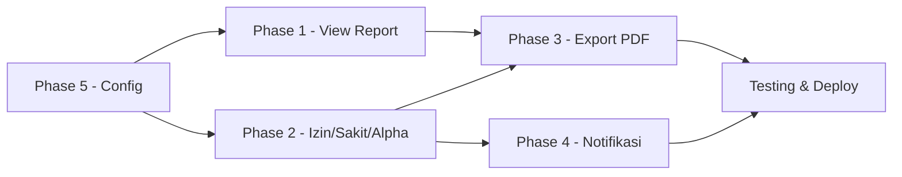

# Plan Lengkap: Fitur Absensi SMK Telekomunikasi

## Status Saat Ini

### Yang Sudah Ada dan Berfungsi
| Fitur | Status | File |
|-------|--------|------|
| Export Excel (harian/periode/summary/user) | ✅ Working | [`AttendanceExportController`](app/Http/Controllers/AttendanceExportController.php), [`AttendanceExportService`](app/Services/AttendanceExportService.php) |
| Report Harian | ✅ Working | [`AttendanceReportController::daily()`](app/Http/Controllers/AttendanceReportController.php:29), view [`report/daily.blade.php`](resources/views/attendance/report/daily.blade.php) |
| Report Mingguan/Bulanan/Keterlambatan | ⚠️ Controller ada, view BELUM ADA | [`AttendanceReportController`](app/Http/Controllers/AttendanceReportController.php) |
| User Management + Sync | ✅ Working | [`AttendanceUserController`](app/Http/Controllers/AttendanceUserController.php) |
| Biometric Enrollment | ✅ Working | [`BiometricEnrollmentController`](app/Http/Controllers/BiometricEnrollmentController.php) |
| Device Management | ✅ Working | [`AttendanceController`](app/Http/Controllers/AttendanceController.php) |
| PIN Mapping | ✅ Working | [`AttendanceController::mapping()`](app/Http/Controllers/AttendanceController.php:118) |
| Raw Logs Viewer | ✅ Working | [`AttendanceController::logs()`](app/Http/Controllers/AttendanceController.php:43) |
| iClock Proxy Integration | ✅ Working | [`ZKTecoIClockController`](app/Http/Controllers/ZKTecoIClockController.php) |
| AttendanceSync (cron) | ✅ Working | [`AttendanceSync`](app/Console/Commands/AttendanceSync.php) — setiap 5 menit |
| Notification System (general) | ✅ Working | [`NotificationHelper`](app/Helpers/NotificationHelper.php), [`SendNotificationJob`](app/Jobs/SendNotificationJob.php) |
| Config (.env) | ✅ Working | `ATTENDANCE_*` di `.env` |

### Yang BELUM Ada (Missing Features)
| Fitur | Prioritas | Keterangan |
|-------|-----------|------------|
| View Report Mingguan | 🔴 Tinggi | Controller sudah ada, view belum dibuat |
| View Report Bulanan | 🔴 Tinggi | Controller sudah ada, view belum dibuat |
| View Report Keterlambatan | 🔴 Tinggi | Controller sudah ada, view belum dibuat |
| View Report User Detail | 🔴 Tinggi | Controller sudah ada, view belum dibuat |
| Izin/Sakit/Alpha | 🔴 Tinggi | Tidak ada model, migration, controller, atau view |
| Export PDF | 🟡 Sedang | Hanya Excel via Maatwebsite, PDF belum ada |
| Notifikasi Absensi | 🟡 Sedang | Infrastructure ada, tapi belum diintegrasi dengan attendance |
| Centralized Config | 🟢 Rendah | Tidak ada `config/attendance.php` |

---

## Arsitektur Sistem



---

## Phase 1: Lengkapi View Report yang Missing

> **Catatan**: Controller sudah ada, hanya perlu buat 4 view Blade.

### 1.1 View Report Mingguan
- **File**: `resources/views/attendance/report/weekly.blade.php`
- **Controller**: [`AttendanceReportController::weekly()`](app/Http/Controllers/AttendanceReportController.php:57)
- **Data**: `$attendances` (grouped by date), `$start`, `$end`, `$stats`
- **Layout**: Tabel per tanggal dengan statistik total_days, total_records, avg_per_day

### 1.2 View Report Bulanan
- **File**: `resources/views/attendance/report/monthly.blade.php`
- **Controller**: [`AttendanceReportController::monthly()`](app/Http/Controllers/AttendanceReportController.php:89)
- **Data**: `$report` (array per user: nama, kind, pin, total_days, hadir, tidak_hadir, persentase), `$month`, `$stats`
- **Layout**: Tabel per user dengan persentase kehadiran, warna hijau/kuning/merah

### 1.3 View Report Keterlambatan
- **File**: `resources/views/attendance/report/latecomers.blade.php`
- **Controller**: [`AttendanceReportController::latecomers()`](app/Http/Controllers/AttendanceReportController.php:193)
- **Data**: `$attendances` (filtered latecomers), `$start`, `$end`, `$stats`
- **Layout**: Tabel dengan kolom nama, tanggal, jam masuk, threshold time, keterlambatan (menit)

### 1.4 View Report User Detail
- **File**: `resources/views/attendance/report/user-detail.blade.php`
- **Controller**: [`AttendanceReportController::userDetail()`](app/Http/Controllers/AttendanceReportController.php:150)
- **Data**: `$identity`, `$attendances` (paginated), `$nama`, `$start`, `$end`, `$stats`
- **Layout**: Header info user + tabel detail per hari + statistik ringkasan

---

## Phase 2: Sistem Izin/Sakit/Alpha

> **Fitur ini BELUM ADA sama sekali.** Perlu membuat dari nol.

### 2.1 Database

#### Migration: `create_attendance_excuses_table`
```sql
attendance_excuses:
  id                  bigint PK
  attendance_identity_id  bigint FK -> attendance_identities
  type                enum: izin, sakit, cuti, dinas, alpha
  date                date
  reason              text
  attachment_path     string nullable  -- surat dokumen / bukti
  status              enum: pending, approved, rejected
  approved_by         bigint FK -> users nullable
  approved_at         timestamp nullable
  rejection_reason    text nullable
  created_by          bigint FK -> users
  timestamps

  UNIQUE: [attendance_identity_id, date]
```

#### Migration: Tambah kolom `status` ke `attendances`
Kolom `status` sudah ada (default 'present'). Perlu tambah nilai: `late`, `excused`.

### 2.2 Model: `AttendanceExcuse`
- **File**: `app/Models/AttendanceExcuse.php`
- Relasi: `belongsTo(AttendanceIdentity)`, `belongsTo(User, 'approved_by')`, `belongsTo(User, 'created_by')`
- Scope: `scopePending()`, `scopeApproved()`, `scopeForDate($date)`

### 2.3 Controller: `AttendanceExcuseController`
- **File**: `app/Http/Controllers/AttendanceExcuseController.php`
- Methods:
  - `index()` — List semua izin/sakit (filter by type, status, date range)
  - `create()` — Form tambah izin/sakit
  - `store(Request $request)` — Simpan izin/sakit baru
  - `show(AttendanceExcuse $excuse)` — Detail izin/sakit
  - `edit(AttendanceExcuse $excuse)` — Form edit
  - `update(Request $request, AttendanceExcuse $excuse)` — Update izin/sakit
  - `destroy(AttendanceExcuse $excuse)` — Hapus izin/sakit
  - `approve(AttendanceExcuse $excuse)` — Approve izin/sakit
  - `reject(Request $request, AttendanceExcuse $excuse)` — Reject izin/sakit

### 2.4 Views
- `resources/views/attendance/excuses/index.blade.php` — List izin/sakit dengan filter
- `resources/views/attendance/excuses/create.blade.php` — Form tambah
- `resources/views/attendance/excuses/edit.blade.php` — Form edit
- `resources/views/attendance/excuses/show.blade.php` — Detail

### 2.5 Integrasi dengan AttendanceSync
Update [`AttendanceSync::handle()`](app/Console/Commands/AttendanceSync.php:19):
- Setelah sync, jalankan `MarkAlphaCommand` untuk menandai user yang tidak hadir sebagai `alpha` jika tidak ada izin/sakit yang approved

### 2.6 Console Command: `attendance:mark-alpha`
- **File**: `app/Console/Commands/MarkAlphaCommand.php`
- Dijalankan setiap malam (jam 23:00) via scheduler
- Logic: Untuk setiap `AttendanceIdentity` yang aktif, cek apakah ada record `attendances` untuk hari ini. Jika tidak ada, cek apakah ada `attendance_excuses` yang approved. Jika tidak ada, buat record dengan status `alpha`.

### 2.7 Routes
```php
// Izin/Sakit/Alpha
Route::resource('excuses', AttendanceExcuseController::class);
Route::post('/excuses/{excuse}/approve', [AttendanceExcuseController::class, 'approve'])->name('excuses.approve');
Route::post('/excuses/{excuse}/reject', [AttendanceExcuseController::class, 'reject'])->name('excuses.reject');
```

### 2.8 Spatie Permissions
Tambah permission baru:
- `attendance.excuses.view`
- `attendance.excuses.create`
- `attendance.excuses.approve`

---

## Phase 3: Export PDF

### 3.1 Dependensi
`barryvdh/laravel-dompdf` sudah terinstall (digunakan di modul lain: guru, siswa, sarpras, dll).

### 3.2 Service: Update `AttendanceExportService`
Tambah method:
- `exportDailyPdf(string $date): BinaryFileResponse`
- `exportPeriodPdf(string $startDate, string $endDate): BinaryFileResponse`
- `exportSummaryPdf(string $startDate, string $endDate): BinaryFileResponse`

### 3.3 Views PDF
- `resources/views/attendance/pdf/daily.blade.php` — PDF rekap harian
- `resources/views/attendance/pdf/period.blade.php` — PDF rekap periode
- `resources/views/attendance/pdf/summary.blade.php` — PDF summary per user

### 3.4 Controller: Update `AttendanceExportController`
Tambah method:
- `exportDailyPdf(Request $request)`
- `exportPeriodPdf(Request $request)`
- `exportSummaryPdf(Request $request)`

### 3.5 Routes
```php
Route::post('/export/pdf/daily', [AttendanceExportController::class, 'exportDailyPdf'])->name('export.pdf.daily');
Route::post('/export/pdf/period', [AttendanceExportController::class, 'exportPeriodPdf'])->name('export.pdf.period');
Route::post('/export/pdf/summary', [AttendanceExportController::class, 'exportSummaryPdf'])->name('export.pdf.summary');
```

### 3.6 Update View Export Index
Tambah tombol PDF di [`attendance/export/index.blade.php`](resources/views/attendance/export/index.blade.php):
- Export PDF Harian
- Export PDF Periode
- Export PDF Summary

---

## Phase 4: Notifikasi Absensi

### 4.1 Notification Class: `AttendanceNotification`
- **File**: `app/Notifications/AttendanceNotification.php`
- Type: `daily_summary`, `late_arrival`, `absent_today`, `excuse_approved`, `excuse_rejected`
- Channels: database (in-app), email (optional)

### 4.2 Artisan Command: `attendance:notify`
- **File**: `app/Console/Commands/AttendanceNotifyCommand.php`
- Dijalankan setiap sore (jam 16:00) via scheduler
- Logic:
  1. Kirim ringkasan harian ke admin
  2. Kirim notifikasi keterlambatan ke guru/siswa yang terlambat
  3. Kirim notifikasi alpha ke admin

### 4.3 NotificationHelper: Tambah Method
```php
public static function sendAttendanceNotification(string $title, string $message, string $type = 'info'): void
```

### 4.4 Scheduler
```php
// routes/console.php
Schedule::command('attendance:mark-alpha')->dailyAt('23:00');
Schedule::command('attendance:notify')->dailyAt('16:00');
```

### 4.5 User Preferences
Manfaatkan sistem `notification_preferences` yang sudah ada di User model. Tambah kategori:
```php
'attendance' => [
    'daily_summary' => true,
    'late_arrival' => true,
    'absent_alert' => true,
]
```

---

## Phase 5: Centralized Config

### 5.1 File: `config/attendance.php`
```php
return [
    'require_user_identity' => env('ATTENDANCE_REQUIRE_USER_IDENTITY', true),
    'require_user_verified' => env('ATTENDANCE_REQUIRE_USER_VERIFIED', false),
    'iclock_secret' => env('ATTENDANCE_ICLOCK_SECRET', ''),
    'sync_enabled' => env('ATTENDANCE_SYNC_ENABLED', true),
    'sync_interval' => env('ATTENDANCE_SYNC_INTERVAL', 5), // minutes
    'late_threshold' => env('ATTENDANCE_LATE_THRESHOLD', '07:30'),
    'work_hours' => [
        'start' => env('ATTENDANCE_WORK_START', '07:00'),
        'end' => env('ATTENDANCE_WORK_END', '15:00'),
    ],
    'notify' => [
        'enabled' => env('ATTENDANCE_NOTIFY_ENABLED', true),
        'daily_summary_time' => '16:00',
        'alpha_mark_time' => '23:00',
    ],
];
```

### 5.2 Update `.env.example`
Tambah environment variables baru.

---

## File yang Perlu Dibuat Baru

| File | Tipe | Phase |
|------|------|-------|
| `resources/views/attendance/report/weekly.blade.php` | View | 1 |
| `resources/views/attendance/report/monthly.blade.php` | View | 1 |
| `resources/views/attendance/report/latecomers.blade.php` | View | 1 |
| `resources/views/attendance/report/user-detail.blade.php` | View | 1 |
| `database/migrations/xxxx_create_attendance_excuses_table.php` | Migration | 2 |
| `app/Models/AttendanceExcuse.php` | Model | 2 |
| `app/Http/Controllers/AttendanceExcuseController.php` | Controller | 2 |
| `resources/views/attendance/excuses/index.blade.php` | View | 2 |
| `resources/views/attendance/excuses/create.blade.php` | View | 2 |
| `resources/views/attendance/excuses/edit.blade.php` | View | 2 |
| `resources/views/attendance/excuses/show.blade.php` | View | 2 |
| `app/Console/Commands/MarkAlphaCommand.php` | Command | 2 |
| `resources/views/attendance/pdf/daily.blade.php` | PDF View | 3 |
| `resources/views/attendance/pdf/period.blade.php` | PDF View | 3 |
| `resources/views/attendance/pdf/summary.blade.php` | PDF View | 3 |
| `app/Notifications/AttendanceNotification.php` | Notification | 4 |
| `app/Console/Commands/AttendanceNotifyCommand.php` | Command | 4 |
| `config/attendance.php` | Config | 5 |

## File yang Perlu Diupdate

| File | Phase | Perubahan |
|------|-------|-----------|
| `app/Console/Commands/AttendanceSync.php` | 2 | Integrasi excused check |
| `app/Http/Controllers/AttendanceExportController.php` | 3 | Tambah PDF export methods |
| `app/Services/AttendanceExportService.php` | 3 | Tambah PDF export methods |
| `resources/views/attendance/export/index.blade.php` | 3 | Tambah tombol PDF |
| `routes/web.php` | 2,3,4 | Tambah routes baru |
| `routes/console.php` | 2,4 | Tambah scheduler |
| `.env.example` | 5 | Tambah config vars |
| `app/Console/Commands/FixUserRoles.php` | 2 | Tambah permissions baru |
| `app/Models/Attendance.php` | 2 | Update status enum |
| `resources/views/attendance/index.blade.php` | 2 | Tambah link ke Excuses |

---

## Urutan Eksekusi



**Catatan**: Phase 5 (config) bisa dikerjakan duluan karena hanya config file. Phase 1-4 bisa paralel karena independen, tapi Phase 2 dan 4 saling terkait (notif bergantung pada data excused).

---

## Testing Checklist

### Phase 1
- [ ] Report mingguan tampil dengan benar
- [ ] Report bulanan tampil dengan benar
- [ ] Report keterlambatan tampil dengan benar
- [ ] Report user detail tampil dengan benar
- [ ] Pagination berfungsi
- [ ] Filter tanggal berfungsi

### Phase 2
- [ ] CRUD izin/sakit berfungsi
- [ ] Approve/reject izin berfungsi
- [ ] AttendanceSync memperhitungkan izin yang approved
- [ ] MarkAlphaCommand menandai alpha dengan benar
- [ ] Tidak ada duplicate izin untuk tanggal yang sama

### Phase 3
- [ ] Export PDF harian berfungsi
- [ ] Export PDF periode berfungsi
- [ ] Export PDF summary berfungsi
- [ ] PDF format rapi dan readable

### Phase 4
- [ ] Notifikasi harian terkirim ke admin
- [ ] Notifikasi keterlambatan terkirim
- [ ] Notifikasi alpha terkirim
- [ ] User preferences berfungsi (bisa on/off)

### Phase 5
- [ ] Config baru terbaca dengan benar
- [ ] Default values berfungsi
- [ ] `.env` override berfungsi

### Integration
- [ ] Data izin muncul di report bulanan (status: excused)
- [ ] Data alpha muncul di report bulanan (status: alpha)
- [ ] Export PDF memperhitungkan izin/sakit
- [ ] Notifikasi menggunakan data terkini
