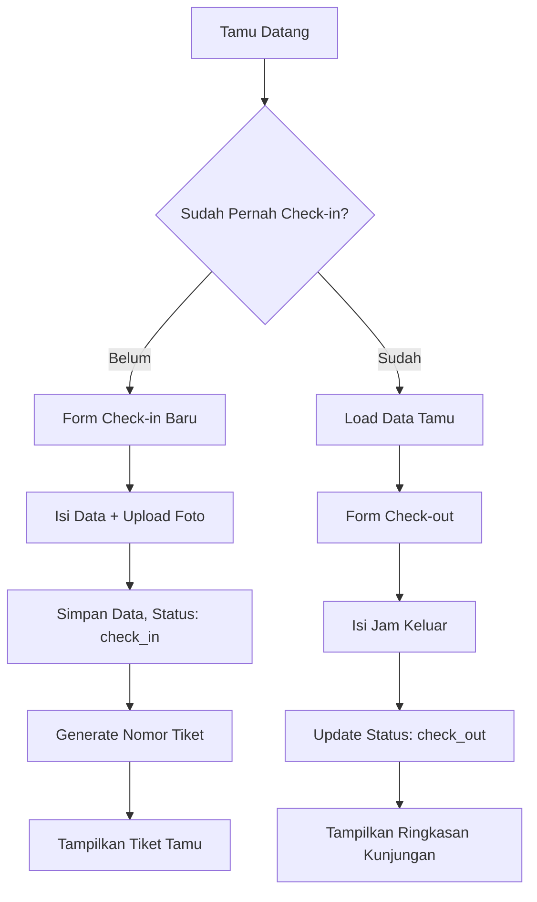
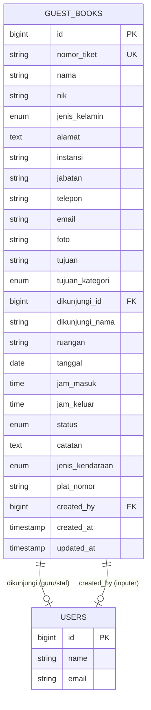
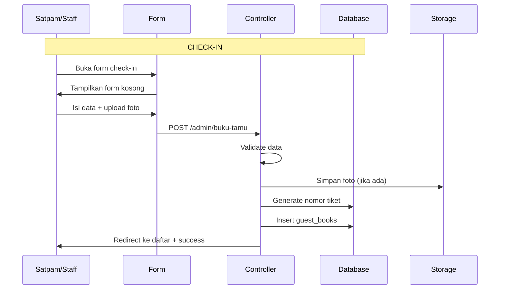
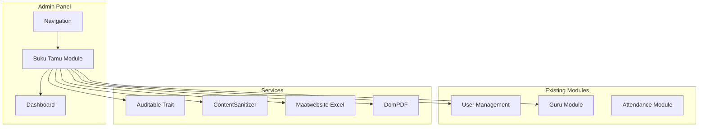

# Analisis & Rencana Fitur Buku Tamu (Guest Book)

> **Project**: SMK Telekomunikasi Darul Ulum
> **Tanggal**: 20 September 2026
> **Status**: Rencana / Analisis
> **Dibuat oleh**: Architect Mode

---

## Table of Contents

1. [Definisi & Tujuan](#1-definisi--tujuan)
2. [Data Fields](#2-data-fields)
3. [Database Schema](#3-database-schema)
4. [Fitur CRUD](#4-fitur-crud)
5. [Fitur Tambahan](#5-fitur-tambahan)
6. [Arsitektur Implementation](#6-arsitektur-implementation)
7. [Konsistensi dengan Project](#7-konsistensi-dengan-project)
8. [Mermaid Diagram](#8-mermaid-diagram)
9. [Checklist Implementasi](#9-checklist-implementasi)

---

## 1. Definisi & Tujuan

### Apa itu Buku Tamu?

Buku Tamu adalah modul admin panel untuk mencatat setiap kunjungan tamu ke sekolah SMK Telekomunikasi Darul Ulum. Modul ini menggantikan buku tamu fisik (buku tulis biasa) dengan sistem digital yang terintegrasi dengan dashboard admin.

### Konteks SMK

Di lingkungan SMK, tamu yang datang bisa berupa:
- **Orang tua/wali siswa** — konsultasi dengan guru BK, ambil rapor, urusan administrasi
- **Siswa baru / calon siswa** — PPDB, orientasi, ujian masuk
- **Pihak industry/mitra** — magang, kerja sama, kunjungan industri
- **Dinas/Pemerintah** — inspeksi, akreditasi, supervisi
- **Tam undangan** — seminar, workshop, acara sekolah
- **Supplier/vendor** — pengiriman barang, perbaikan fasilitas
- **Umum** — surat menyurat, pertanyaan umum

### Pengguna Sistem

| Pengguna | Peran | Akses |
|----------|-------|-------|
| **Satpam / Security** | Front-line input | Input tamu masuk & check-out (role: `satpam`) |
| **Resepsionis / TU** | Operator utama | CRUD lengkap, filter, cetak laporan (role: `admin`) |
| **Guru / Staff** | Input mandiri | Input tamu yang berkunjung ke dirinya (role: `guru`) |
| **Kepala Sekolah** | Monitoring | Lihat dashboard, laporan kunjungan (role: `admin`) |
| **Superadmin** | Pengelola sistem | Full access + pengaturan modul |

### Tujuan Utama

1. **Digitalisasi** pencatatan kunjungan tamu
2. **Keamanan** — tracking siapa yang masuk/keluar gedung sekolah
3. **Laporan** — data kunjungan untuk keperluan administrasi & akreditasi
4. **Efisiensi** — pencarian cepat, tidak perlu buka buku fisik
5. **Integrasi** — terhubung dengan data guru/siswa yang ada

---

## 2. Data Fields

### 2.1 Identitas Tamu

| Field | Tipe | Wajib | Keterangan |
|-------|------|-------|------------|
| `nama` | string(255) | Ya | Nama lengkap tamu |
| `nik` | string(20) | Tidak | NIK/KTP (untuk identifikasi resmi) |
| `jenis_kelamin` | enum | Tidak | `laki_laki`, `perempuan` |
| `alamat` | text | Tidak | Alamat lengkap tamu |
| `instansi` | string(255) | Tidak | Nama instansi/organisasi/perusahaan |
| `jabatan` | string(255) | Tidak | Jabatan di instansi |

### 2.2 Kontak

| Field | Tipe | Wajib | Keterangan |
|-------|------|-------|------------|
| `telepon` | string(20) | Tidak | Nomor telepon/HP |
| `email` | string(255) | Tidak | Alamat email |

### 2.3 Foto Tamu 4x6

| Field | Tipe | Wajib | Keterangan |
|-------|------|-------|------------|
| `foto` | string(500) | Tidak | Path file foto tamu format 4x6 di storage |

**Spesifikasi Foto 4x6:**
- **Ukuran cetak**: 4cm x 6cm (portrait)
- **Rasio aspek**: 2:3
- **Resolusi minimum**: 400x600 pixel
- **Format**: JPG, JPEG, PNG, WEBP
- **Ukuran maksimal**: 2MB
- **Penyimpanan**: `storage/app/public/guest-photos/`
- **Akses**: Via `Storage::disk('public')` → URL: `/storage/guest-photos/{filename}`

**Cara Upload & Penyimpanan:**
1. User upload foto melalui form
2. Controller validasi: image mimes, max 2MB
3. File disimpan ke `guest-photos/` di storage public
4. Path relatif disimpan di kolom `foto` (misal: `guest-photos/nama-file.jpg`)
5. Tampilkan via `Storage::url($guest->foto)` atau `asset('storage/' . $guest->foto)`
6. **Crop mandiri**: Frontend bisa menggunakan cropper.js atau CropperJS untuk crop ke rasio 2:3 sebelum upload
7. **Fallback**: Jika tidak ada foto, tampilkan placeholder/default avatar

### 2.4 Tujuan Kunjungan

| Field | Tipe | Wajib | Keterangan |
|-------|------|-------|------------|
| `tujuan` | string(500) | Ya | Tujuan kunjungan (bebas tulis) |
| `tujuan_kategori` | enum | Tidak | Kategori tujuan: `ppdb`, `ortu_wali`, `konsultasi`, `dinas`, `supplier`, `acara`, `lainnya` |
| `dikunjungi_id` | foreignId | Tidak | FK ke `users` atau `gurus` — guru/staf yang dituju |
| `dikunjungi_nama` | string(255) | Tidak | Nama yang dituju (backup jika guru tidak ada di sistem) |
| `ruangan` | string(100) | Tidak | Ruangan yang dituju |

### 2.5 Waktu Kunjungan

| Field | Tipe | Wajib | Keterangan |
|-------|------|-------|------------|
| `tanggal` | date | Ya | Tanggal kunjungan |
| `jam_masuk` | time | Ya | Jam tamu masuk |
| `jam_keluar` | time | Tidak | Jam tamu keluar (null = belum keluar) |
| `durasi_kunjungan` | integer | Otomatis | Durasi dalam menit (computed) |

### 2.6 Status & Metadata

| Field | Tipe | Wajib | Keterangan |
|-------|------|-------|------------|
| `status` | enum | Ya | `check_in`, `check_out`, `dibatalkan` |
| `nomor_tiket` | string(20) | Otomatis | Nomor urut tiket tamu (format: `BT-YYYYMMDD-XXXX`) |
| `catatan` | text | Tidak | Catatan tambahan |
| `created_by` | foreignId | Otomatis | User ID yang input data |
| `created_at` | timestamp | Otomatis | Waktu record dibuat |
| `updated_at` | timestamp | Otomatis | Waktu record diupdate |

### 2.7 Kendaran (Opsional)

| Field | Tipe | Wajib | Keterangan |
|-------|------|-------|------------|
| `jenis_kendaraan` | enum | Tidak | `mobil`, `motor`, `sepeda`, `jalan_kaki`, `lainnya` |
| `plat_nomor` | string(20) | Tidak | Plat nomor kendaraan |

---

## 3. Database Schema

### 3.1 Tabel Utama: `guest_books`

```php
Schema::create('guest_books', function (Blueprint $table) {
    $table->id();
    $table->string('nomor_tiket', 20)->unique();           // BT-20260920-0001

    // Identitas Tamu
    $table->string('nama', 255);
    $table->string('nik', 20)->nullable();
    $table->enum('jenis_kelamin', ['laki_laki', 'perempuan'])->nullable();
    $table->text('alamat')->nullable();
    $table->string('instansi', 255)->nullable();
    $table->string('jabatan', 255)->nullable();

    // Kontak
    $table->string('telepon', 20)->nullable();
    $table->string('email', 255)->nullable();

    // Foto
    $table->string('foto', 500)->nullable();                // Path foto 4x6

    // Tujuan Kunjungan
    $table->string('tujuan', 500);
    $table->enum('tujuan_kategori', [
        'ppdb', 'ortu_wali', 'konsultasi', 'dinas',
        'supplier', 'acara', 'lainnya'
    ])->default('lainnya');
    $table->foreignId('dikunjungi_id')->nullable()->constrained('users')->nullOnDelete();
    $table->string('dikunjungi_nama', 255)->nullable();
    $table->string('ruangan', 100)->nullable();

    // Waktu
    $table->date('tanggal');
    $table->time('jam_masuk');
    $table->time('jam_keluar')->nullable();

    // Status
    $table->enum('status', ['check_in', 'check_out', 'dibatalkan'])->default('check_in');
    $table->text('catatan')->nullable();

    // Kendaraan
    $table->enum('jenis_kendaraan', [
        'mobil', 'motor', 'sepeda', 'jalan_kaki', 'lainnya'
    ])->nullable();
    $table->string('plat_nomor', 20)->nullable();

    // Metadata
    $table->foreignId('created_by')->nullable()->constrained('users')->nullOnDelete();

    $table->timestamps();

    // Indexes untuk performa
    $table->index('tanggal');
    $table->index('status');
    $table->index('nama');
    $table->index('instansi');
    $table->index('tujuan_kategori');
    $table->index(['tanggal', 'status']);                   // Composite: untuk filter tanggal + status
    $table->index(['created_at', 'status']);                // Composite: untuk dashboard stats
});
```

### 3.2 Naming Convention

- **Tabel**: `guest_books` (snake_case, plural)
- **Foreign keys**: `{model}_id` (misal: `dikunjungi_id`, `created_by`)
- **Primary key**: `id` (auto-increment)
- **Timestamps**: `created_at`, `updated_at`
- **Soft delete**: Tidak diaktifkan (data tamu bersifat history, lebih baik hard delete atau gunakan status `dibatalkan`)

### 3.3 Nomor Tiket Auto-Generate

Format: `BT-YYYYMMDD-XXXX`

- `BT` = prefix Buku Tamu
- `YYYYMMDD` = tanggal masuk
- `XXXX` = nomor urut harian (0001, 0002, dst.)

Contoh: `BT-20260920-0001` (tamu pertama tanggal 20 September 2026)

---

## 4. Fitur CRUD

### 4.1 Create — Pendaftaran Tamu

**Flow:**
1. User klik "Tambah Tamu" atau "Check-in Tamu"
2. Form ditampilkan dengan field-field yang diperlukan
3. User mengisi data & upload foto (opsional)
4. Sistem generate `nomor_tiket` otomatis
5. Status default: `check_in`
6. Data disimpan, redirect ke halaman daftar dengan notifikasi sukses

**Form Fields:**
```
┌─────────────────────────────────────────────┐
│  FORM CHECK-IN TAMU                         │
├─────────────────────────────────────────────┤
│  * Nama Lengkap: [________________]         │
│    NIK/KTP:      [________________]         │
│    Jenis Kelamin: [Laki-laki ▼] [Perempuan] │
│    Alamat:        [________________]         │
│    Instansi:      [________________]         │
│    Jabatan:       [________________]         │
│    Telepon:       [________________]         │
│    Email:         [________________]         │
│                                             │
│  ── Foto Tamu 4x6 ──                        │
│    [📷 Upload Foto] (max 2MB, JPG/PNG)      │
│    Preview: [  thumbnail  ]                 │
│                                             │
│  ── Tujuan Kunjungan ──                     │
│  * Tujuan:        [________________]         │
│    Kategori:      [PPDB ▼]                   │
│    Dikunjungi:    [Guru/Staff ▼] (optional)  │
│    Ruangan:       [________________]         │
│                                             │
│  ── Waktu ──                                │
│  * Tanggal:       [📅 20/09/2026]           │
│  * Jam Masuk:     [🕐 08:30]                │
│                                             │
│  ── Kendaraan ──                            │
│    Jenis:         [Motor ▼]                  │
│    Plat Nomor:    [________________]         │
│                                             │
│    Catatan:        [________________]         │
│                                             │
│  [💾 Check-in Tamu]  [❌ Batal]              │
└─────────────────────────────────────────────┘
```

### 4.2 Read — Daftar Tamu

**Fitur:**
- **Tabel daftar** dengan kolom: No, Tiket, Nama, Instansi, Tujuan, Status, Jam Masuk, Jam Keluar, Aksi
- **Pencarian** berdasarkan: nama, instansi, nomor tiket, tujuan
- **Filter**:
  - Tanggal (hari ini, kemarin, minggu ini, bulan ini, custom range)
  - Status (check_in, check_out, dibatalkan)
  - Kategori tujuan
- **Paginasi**: 15 item per halaman (konsisten dengan project)
- **Sorting**: Default terbaru di atas (`latest()`)

**Detail Tamu:**
- Klik nama → halaman detail menampilkan semua data termasuk foto 4x6
- Tombol: Edit, Check-out, Hapus, Cetak Tiket

### 4.3 Update — Edit Data Tamu

- Form edit dengan data yang sudah terisi
- Bisa update semua field kecuali `nomor_tiket` (readonly)
- Bisa upload foto baru (foto lama di-replace)

### 4.4 Delete — Hapus Data

- Konfirmasi sebelum hapus (modal/dialog)
- Hard delete (tidak soft delete — data tamu bersifat transaksional)
- Hanya bisa dihapus oleh admin/superadmin
- Foto terkait ikut dihapus dari storage

### 4.5 Check-in / Check-out Flow



**Check-out Flow:**
1. Di halaman daftar, tamu dengan status `check_in` ada tombol "Check-out"
2. Klik → form mini (hanya jam keluar + catatan)
3. Status berubah ke `check_out`, `jam_keluar` terisi

---

## 5. Fitur Tambahan

### 5.1 Export Data (PDF & Excel)

**Export Excel (`.xlsx`):**
- Data tamu dengan filter tanggal range
- Kolom: Tiket, Nama, NIK, Instansi, Tujuan, Kategori, Dikunjungi, Tanggal, Jam Masuk, Jam Keluar, Status
- Menggunakan `Maatwebsite\Excel` (sudah ada di project)

**Export PDF:**
- Laporan kunjungan per hari/minggu/bulan
- Format tabel dengan header sekolah
- Menggunakan `Barryvdh\DomPDF` (sudah ada di project)
- Bisa cetak per tamu (tiket kunjungan)

### 5.2 Dashboard Widget

Widget di admin dashboard ([`DashboardController`](app/Http/Controllers/DashboardController.php)):

```
┌────────────────────────────────────────────────────┐
│  DASHBOARD                                         │
├──────────────┬──────────────┬──────────────────────┤
│  👤 Tamu     │  ✅ Check-in │  ⏱️ Durasi           │
│  Hari Ini: 12│  Aktif: 5   │  Rata-rata: 45 menit │
├──────────────┴──────────────┴──────────────────────┤
│  📊 Kunjungan Bulan Ini                            │
│  ████████████████░░░░  120 tamu                    │
│                                                    │
│  📋 Tamu Terakhir:                                 │
│  1. Ahmad (Telkomsel) - Check-in 08:30             │
│  2. Siti (Dinas Pendidikan) - Check-out 10:15      │
└────────────────────────────────────────────────────┘
```

**Statistik yang ditampilkan:**
- Total tamu hari ini
- Jumlah tamu yang sedang check-in (belum keluar)
- Total tamu bulan ini
- Rata-rata durasi kunjungan
- 5 tamu terakhir
- Chart kunjungan per minggu/bulan

### 5.3 Notifikasi (Optional)

- **Notifikasi ke guru/staf** saat ada tamu yang ingin menemuinya
- **Notifikasi ke admin** saat tamu check-out melebihi waktu normal
- Integrasi dengan sistem push notification yang sudah ada

### 5.4 Role & Permission

Menggunakan **Spatie Laravel-Permission** (sudah ada di project).

**Permissions:**

| Permission | Deskripsi | Role Default |
|-----------|-----------|--------------|
| `buku-tamu.view` | Melihat daftar tamu | satpam, guru, admin, superadmin |
| `buku-tamu.create` | Input tamu baru (check-in) | satpam, guru, admin, superadmin |
| `buku-tamu.update` | Edit data tamu | admin, superadmin |
| `buku-tamu.delete` | Hapus data tamu | superadmin |
| `buku-tamu.export` | Export data (PDF/Excel) | admin, superadmin |
| `buku-tamu.checkout` | Melakukan check-out tamu | satpam, admin, superadmin |

**Role Mapping:**

| Role | Akses |
|------|-------|
| `satpam` | view, create, checkout |
| `guru` | view, create (hanya tamu yang menemuinya) |
| `admin` | view, create, update, checkout, export |
| `superadmin` | Full access (semua permission) |

---

## 6. Arsitektur Implementation

### 6.1 File Structure

```
app/
├── Http/Controllers/
│   └── GuestBookController.php        # Controller utama
├── Models/
│   └── GuestBook.php                  # Model Eloquent
├── Imports/
│   └── GuestBookImport.php            # Import Excel (opsional)
├── Exports/
│   └── GuestBookExport.php            # Export Excel

database/
├── migrations/
│   └── 2026_09_20_000000_create_guest_books_table.php

resources/
├── views/
│   └── guest-book/
│       ├── index.blade.php            # Daftar tamu
│       ├── create.blade.php           # Form check-in
│       ├── show.blade.php             # Detail tamu
│       ├── edit.blade.php             # Edit data
│       ├── print-ticket.blade.php     # Cetak tiket kunjungan
│       └── export.blade.php           # Form export

routes/
└── web.php                            # Route ditambahkan di sini
```

### 6.2 Routes

```php
// Guest Book Management (Access: satpam, guru, admin, superadmin)
Route::middleware(['auth', 'verified', 'role:satpam|guru|admin|superadmin'])
    ->prefix('admin/buku-tamu')->name('admin.guest-book.')->group(function () {

    Route::get('/', [GuestBookController::class, 'index'])
        ->name('index')
        ->middleware('permission:buku-tamu.view');

    Route::get('/create', [GuestBookController::class, 'create'])
        ->name('create')
        ->middleware('permission:buku-tamu.create');

    Route::post('/', [GuestBookController::class, 'store'])
        ->name('store')
        ->middleware('permission:buku-tamu.create');

    Route::get('/{guestBook}', [GuestBookController::class, 'show'])
        ->name('show')
        ->middleware('permission:buku-tamu.view');

    Route::get('/{guestBook}/edit', [GuestBookController::class, 'edit'])
        ->name('edit')
        ->middleware('permission:buku-tamu.update');

    Route::put('/{guestBook}', [GuestBookController::class, 'update'])
        ->name('update')
        ->middleware('permission:buku-tamu.update');

    Route::delete('/{guestBook}', [GuestBookController::class, 'destroy'])
        ->name('destroy')
        ->middleware('permission:buku-tamu.delete');

    // Check-out action
    Route::post('/{guestBook}/checkout', [GuestBookController::class, 'checkout'])
        ->name('checkout')
        ->middleware('permission:buku-tamu.checkout');

    // Export
    Route::get('/export', [GuestBookController::class, 'exportForm'])
        ->name('export.form')
        ->middleware('permission:buku-tamu.export');

    Route::post('/export/excel', [GuestBookController::class, 'exportExcel'])
        ->name('export.excel')
        ->middleware('permission:buku-tamu.export')
        ->middleware('throttle:10,1');

    Route::post('/export/pdf', [GuestBookController::class, 'exportPdf'])
        ->name('export.pdf')
        ->middleware('permission:buku-tamu.export')
        ->middleware('throttle:10,1');

    // Print ticket
    Route::get('/{guestBook}/print', [GuestBookController::class, 'printTicket'])
        ->name('print-ticket')
        ->middleware('permission:buku-tamu.view');
});
```

### 6.3 Controller: GuestBookController

**Constructor:**
```php
public function __construct()
{
    $this->middleware('permission:buku-tamu.view')->only(['index', 'show', 'printTicket']);
    $this->middleware('permission:buku-tamu.create')->only(['create', 'store']);
    $this->middleware('permission:buku-tamu.update')->only(['edit', 'update']);
    $this->middleware('permission:buku-tamu.delete')->only(['destroy']);
    $this->middleware('permission:buku-tamu.checkout')->only(['checkout']);
    $this->middleware('permission:buku-tamu.export')->only(['exportForm', 'exportExcel', 'exportPdf']);
}
```

**Methods:**

| Method | HTTP | Route | Deskripsi |
|--------|------|-------|-----------|
| `index()` | GET | `/` | Daftar tamu dengan filter & search |
| `create()` | GET | `/create` | Form check-in |
| `store()` | POST | `/` | Simpan tamu baru |
| `show()` | GET | `/{id}` | Detail tamu |
| `edit()` | GET | `/{id}/edit` | Form edit |
| `update()` | PUT | `/{id}` | Update data tamu |
| `destroy()` | DELETE | `/{id}` | Hapus data |
| `checkout()` | POST | `/{id}/checkout` | Proses check-out |
| `exportForm()` | GET | `/export` | Form export |
| `exportExcel()` | POST | `/export/excel` | Export ke Excel |
| `exportPdf()` | POST | `/export/pdf` | Export ke PDF |
| `printTicket()` | GET | `/{id}/print` | Cetak tiket kunjungan |

### 6.4 Model: GuestBook

```php
class GuestBook extends Model
{
    use HasFactory, Auditable;

    protected $table = 'guest_books';

    protected $fillable = [
        'nomor_tiket', 'nama', 'nik', 'jenis_kelamin', 'alamat',
        'instansi', 'jabatan', 'telepon', 'email', 'foto',
        'tujuan', 'tujuan_kategori', 'dikunjungi_id', 'dikunjungi_nama',
        'ruangan', 'tanggal', 'jam_masuk', 'jam_keluar', 'status',
        'catatan', 'jenis_kendaraan', 'plat_nomor', 'created_by',
    ];

    protected $casts = [
        'tanggal' => 'date',
        'jam_masuk' => 'datetime:H:i',
        'jam_keluar' => 'datetime:H:i',
    ];

    // Relationships
    public function dikunjungi(): BelongsTo
    {
        return $this->belongsTo(User::class, 'dikunjungi_id');
    }

    public function creator(): BelongsTo
    {
        return $this->belongsTo(User::class, 'created_by');
    }

    // Accessors
    public function getDurasiKunjunganAttribute(): ?int
    {
        if (!$this->jam_keluar) return null;
        $masuk = Carbon::parse($this->jam_masuk);
        $keluar = Carbon::parse($this->jam_keluar);
        return $masuk->diffInMinutes($keluar);
    }

    // Scopes
    public function scopeCheckIn($query) { ... }
    public function scopeCheckOut($query) { ... }
    public function scopeToday($query) { ... }
    public function scopeThisMonth($query) { ... }

    // Static: Generate nomor tiket
    public static function generateNomorTiket(): string { ... }
}
```

### 6.5 Views

**Naming convention** (konsisten dengan project): `resources/views/guest-book/{view}.blade.php`

**Layout**: Menggunakan `layouts.app.blade.php` (admin layout)

**View components**:
- Form fields menggunakan Bootstrap 5 (konsisten dengan admin panel)
- Photo upload dengan preview
- Status badge (warna berbeda per status)
- Action buttons (check-out, edit, hapus, print)

---

## 7. Konsistensi dengan Project

### 7.1 Coding Conventions

| Konvensi | Implementasi |
|----------|-------------|
| **Typed properties** | Semua property di Model & Controller pakai type hint |
| **Return types** | Semua method pakai return type (`string`, `View`, `RedirectResponse`, dll) |
| **Eloquent** | Query menggunakan Eloquent, bukan raw SQL |
| **`safe()` pattern** | Gunakan try-catch konsolidasi untuk operasi yang mungkin gagal |
| **Cache** | Dashboard stats di-cache 300 detik (`Cache::remember`) |
| **ContentSanitizer** | Gunakan untuk field `catatan` yang mungkin mengandung HTML |
| **Auditable trait** | Model pakai `App\Traits\Auditable` untuk audit logging |

### 7.2 Route Conventions

| Konvensi | Implementasi |
|----------|-------------|
| **Prefix** | `admin/buku-tamu` |
| **Name prefix** | `admin.guest-book.` |
| **Middleware** | `auth`, `verified`, `role:satpam\|guru\|admin\|superadmin` |
| **Permission** | `permission:buku-tamu.*` |
| **Rate limiting** | Export routes: `throttle:10,1` |

### 7.3 View Conventions

| Konvensi | Implementasi |
|----------|-------------|
| **Directory** | `resources/views/guest-book/` |
| **Layout** | `@extends('layouts.app')` |
| **Breadcrumb** | `<x-admin.breadcrumb>` |
| **Flash messages** | `->with('success', '...')` |
| **Pagination** | `->paginate(15)->withQueryString()` |

### 7.4 Storage Conventions

| Konvensi | Implementasi |
|----------|-------------|
| **Disk** | `public` (sudah ada symlink) |
| **Path** | `guest-photos/` |
| **Naming** | `{timestamp}_{random}.{ext}` untuk menghindari conflict |

---

## 8. Mermaid Diagram

### 8.1 Entity Relationship



### 8.2 Workflow Check-in/Check-out



### 8.3 Integration Diagram



---

## 9. Checklist Implementasi

### Tahap 1: Foundation
- [ ] Buat migration `create_guest_books_table`
- [ ] Jalankan `php artisan migrate`
- [ ] Buat Model `GuestBook` dengan relationships, scopes, accessors
- [ ] Jalankan `php artisan tinker` untuk test model

### Tahap 2: Controller & Routes
- [ ] Buat `GuestBookController` dengan semua methods
- [ ] Tambahkan routes di `routes/web.php`
- [ ] Buat permission `buku-tamu.*` (6 permissions)
- [ ] Assign permissions ke roles (satpam, guru, admin, superadmin)
- [ ] Tambahkan role `satpam` jika belum ada

### Tahap 3: Views
- [ ] Buat `resources/views/guest-book/index.blade.php` (daftar + filter + search)
- [ ] Buat `resources/views/guest-book/create.blade.php` (form check-in + foto upload)
- [ ] Buat `resources/views/guest-book/show.blade.php` (detail tamu)
- [ ] Buat `resources/views/guest-book/edit.blade.php` (form edit)
- [ ] Buat `resources/views/guest-book/print-ticket.blade.php` (cetak tiket)

### Tahap 4: Fitur Tambahan
- [ ] Implementasi check-out flow
- [ ] Implementasi export Excel
- [ ] Implementasi export PDF
- [ ] Tambahkan widget ke DashboardController
- [ ] Update navigation menu (navigation.blade.php)

### Tahap 5: Testing & Polish
- [ ] Test CRUD lengkap
- [ ] Test check-in/check-out flow
- [ ] Test foto upload & display
- [ ] Test export Excel & PDF
- [ ] Test permission per role
- [ ] Test search & filter
- [ ] Clear cache: `php artisan cache:clear && php artisan view:clear`

---

## Catatan Tambahan

### Kenapa Tidak Soft Delete?

Data buku tamu bersifat **historis & transaksional**. Jika ada data yang tidak perlu ditampilkan, gunakan status `dibatalkan` atau filter berdasarkan tanggal. Hard delete hanya untuk data yang benar-benar salah input.

### Kenapa `dikunjungi_id` ke Users?

Guru dan staff sudah ada di tabel `users`. Dengan FK ke `users`, bisa:
- Auto-complete nama guru saat input
- Notifikasi ke guru via sistem yang sudah ada
- Join query untuk laporan per guru

### Kenapa Foto 4x6?

Foto 4x6 adalah format standar untuk foto identitas di Indonesia. Berguna untuk:
- Identifikasi visual tamu
- Cetak tiket kunjungan dengan foto
- Keamanan sekolah

### Integrasi Masa Depan

- **Face recognition**: Foto 4x6 bisa digunakan untuk face recognition saat tamu datang lagi
- **QR Code**: Generate QR code dari nomor tiket untuk check-out cepat
- **SMS/WA notifikasi**: Kirim notifikasi ke guru saat ada tamu
- **API**: Endpoint API untuk integrasi dengan sistem visitor management lainnya
