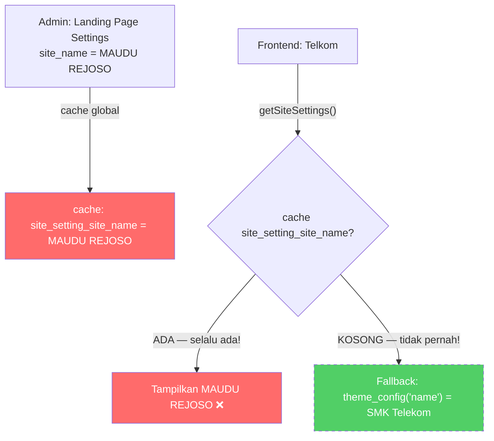
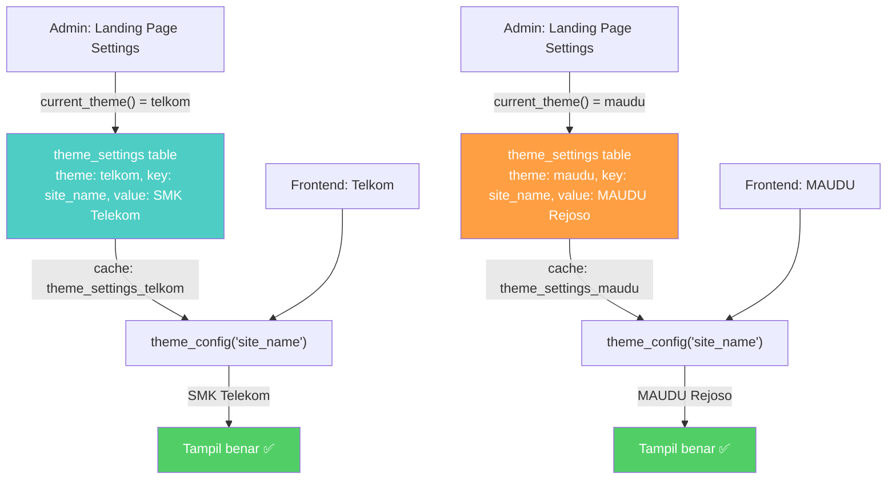

# 🎨 Plan: Landing Page Settings — Per-Theme Refactoring

> **Status**: Draft — Menunggu approval
> **Tanggal**: 2026-08-16
> **Masalah**: Landing Page Settings bersifat GLOBAL (cache), bukan per-theme. Admin yang mengisi "MAUDU REJOSO" akan mengalahkan fallback theme_config() untuk Telkom.

---

## 1. Ringkasan Masalah

### Kondisi Saat Ini



### File yang Terlibat

| File | Masalah |
|------|---------|
| [`SettingsController::landingPage()`](app/Http/Controllers/SettingsController.php:49) | Render form TANPA tema context |
| [`SettingsController::updateLandingPage()`](app/Http/Controllers/SettingsController.php:66) | Simpan ke `cache('site_setting_X')` — global |
| [`SettingsController::resetLandingPage()`](app/Http/Controllers/SettingsController.php:467) | Hapus cache SEMUA tema |
| [`LandingController::getSiteSettings()`](app/Http/Controllers/LandingController.php:205) | Baca global cache → fallback theme_config (tidak tercapai) |
| [`landing-page.blade.php`](resources/views/settings/landing-page.blade.php:46) | `cache('site_setting_site_name', 'MAUDU REJOSO')` — hardcoded fallback |

---

## 2. Solusi: Manfaatkan Tabel `theme_settings` yang Sudah Ada

### Mengapa Tidak Perlu Tabel Baru?

Tabel `theme_settings` sudah memiliki struktur yang sempurna:

```sql
-- database/migrations/2026_07_13_000000_create_theme_settings_table.php
theme_settings
├── id (bigint, PK)
├── theme (varchar 50, indexed)     -- 'telkom' atau 'maudu'
├── key (varchar 100)               -- 'site_name', 'hero_slide1_title', dll
├── value (text, nullable)          -- nilai setting
├── type (varchar 20)               -- text, textarea, image, json, url, color
├── group_name (varchar 50)         -- general, hero, about, contact, social, cta, dll
├── sort_order (int)
├── created_at / updated_at
└── UNIQUE KEY (theme, key)
```

Model [`ThemeSetting`](app/Models/ThemeSetting.php) sudah punya:
- `getThemeConfig($theme)` — ambil semua settings per tema
- `saveThemeConfig($theme, $data, $types)` — simpan batch per tema
- `seedDefaults($theme)` — seed dari config file
- `clearCache($theme)` — clear cache per tema
- `scopeByTheme()`, `scopeByGroup()`, `scopeOrdered()` — query scopes

Helper [`theme_config()`](app/Helpers/ThemeHelper.php:34) sudah resolve:
```
Priority: DB (theme_settings) → Config file (config/themes/{theme}.php) → Default
```

### Arsitektur Setelah Refactoring



---

## 3. Daftar File yang Perlu Diubah

### Fase 1: Model — Tambah Landing Page Keys

#### 3.1 [`app/Models/ThemeSetting.php`](app/Models/ThemeSetting.php)

**Ubah**: [`getDefaultGroupMap()`](app/Models/ThemeSetting.php:252) — tambahkan semua landing page setting keys

```php
private static function getDefaultGroupMap(): array
{
    return [
        // ═══ EXISTING (sudah ada) ═══
        'name' => 'general',
        'short_name' => 'general',
        'tagline' => 'general',
        // ... existing keys ...

        // ═══ BARU: Landing Page Settings ═══

        // General — Site Info
        'site_name' => 'general',
        'site_description' => 'general',
        'site_keywords' => 'general',
        'footer_text' => 'general',

        // Hero — Slides
        'hero_slide1_subtitle' => 'hero',
        'hero_slide1_title' => 'hero',
        'hero_slide1_description' => 'hero',
        'hero_slide2_subtitle' => 'hero',
        'hero_slide2_title' => 'hero',
        'hero_slide2_description' => 'hero',
        'hero_slide3_subtitle' => 'hero',
        'hero_slide3_title' => 'hero',
        'hero_slide3_description' => 'hero',

        // Features — Cards
        'feature1_title' => 'features',
        'feature1_description' => 'features',
        'feature2_title' => 'features',
        'feature2_description' => 'features',
        'feature3_title' => 'features',
        'feature3_description' => 'features',

        // About — Section
        'about_section_title' => 'about',
        'about_section_subtitle' => 'about',
        'about_section_description' => 'about',
        'about_feature_1_title' => 'about',
        'about_feature_1_description' => 'about',
        'about_feature_2_title' => 'about',
        'about_feature_2_description' => 'about',
        'about_feature_3_title' => 'about',
        'about_feature_3_description' => 'about',
        'about_feature_4_title' => 'about',
        'about_feature_4_description' => 'about',
        'about_button_text' => 'about',
        'about_contact_text' => 'about',
        'about_contact_phone' => 'about',

        // Headmaster
        'headmaster_name' => 'about',
        'headmaster_description' => 'about',
        'headmaster_vision' => 'about',
        // headmaster_photo sudah ada di existing

        // Campus Life Headmaster
        'campus_life_headmaster_name' => 'about',
        'campus_life_headmaster_description' => 'about',
        'campus_life_headmaster_vision' => 'about',
        // campus_life_headmaster_photo sudah ada di existing

        // Programs
        'program_section_title' => 'programs',
        'program_section_subtitle' => 'programs',
        'program_ipa_title' => 'programs',
        'program_ipa_description' => 'programs',
        'program_ips_title' => 'programs',
        'program_ips_description' => 'programs',
        'program_religion_title' => 'programs',
        'program_religion_description' => 'programs',
        // program_section_image sudah ada di existing

        // Counter
        // counter1/2/3_number dan label sudah ada di existing

        // Gallery
        'gallery_title' => 'general',
        'gallery_subtitle' => 'general',

        // CTA
        // cta_title, cta_description, cta_button_url, cta_button_text sudah ada di existing
        'cta_video_title' => 'cta',

        // Contact
        // contact_email, contact_phone, contact_address sudah ada di existing
        'contact_section_subtitle' => 'contact',
        'contact_section_title' => 'contact',
        'contact_section_description' => 'contact',
        'contact_map_url' => 'contact',
        'contact_operational_hours' => 'contact',

        // Social Media
        // facebook_url, instagram_url, youtube_url sudah ada di existing

        // Video
        // video_url, video_thumbnail sudah ada di existing
    ];
}
```

---

### Fase 2: Controller — SettingsController

#### 3.2 [`app/Http/Controllers/SettingsController.php`](app/Http/Controllers/SettingsController.php)

**Tambah import**:
```php
use App\Models\ThemeSetting;
use Illuminate\Support\Facades\Artisan;
```

**Ubah method [`landingPage()`](app/Http/Controllers/SettingsController.php:49)**:
```php
public function landingPage()
{
    $theme = current_theme();

    $pages = Page::where('is_menu', true)
        ->with('children')
        ->orderBy('menu_sort_order')
        ->get();

    $headerMenus = $pages->where('menu_position', 'header')->whereNull('parent_id');
    $footerMenus = $pages->where('menu_position', 'footer')->whereNull('parent_id');

    // ⭐ Load settings per tema aktif
    $settings = theme_config() ?: [];

    // Daftar tema yang tersedia untuk tab switching
    $availableThemes = \App\Models\ThemeSetting::getRegisteredThemes();
    $activeTheme = $theme;

    return view('settings.landing-page', compact(
        'pages', 'headerMenus', 'footerMenus',
        'settings', 'availableThemes', 'activeTheme'
    ));
}
```

**Ubah method [`updateLandingPage()`](app/Http/Controllers/SettingsController.php:66)**:

Ganti seluruh method — inti perubahan ada di bagian penyimpanan:

```php
public function updateLandingPage(Request $request)
{
    $theme = current_theme(); // ⭐ Ambil tema aktif

    $request->validate([
        'site_name' => 'required|string|max:255',
        'site_description' => 'nullable|string',
        'site_keywords' => 'nullable|string',
        // ... validasi sama seperti sebelumnya ...
    ]);

    // Build settings array — SAMA seperti sebelumnya
    $settings = [
        'site_name' => $request->site_name,
        'site_description' => $request->site_description,
        // ... semua field sama ...
    ];

    // Handle file uploads — SAMA seperti sebelumnya
    try {
        // ... upload logic sama ...
    } catch (\Exception $e) {
        return redirect()->back()->withInput()->with('error', ...);
    }

    try {
        // ⭐ Simpan ke theme_settings table (per-theme)
        ThemeSetting::saveThemeConfig($theme, $settings);

        // ⭐ Clear cache per tema saja (bukan semua)
        ThemeSetting::clearCache($theme);

        Artisan::call('view:clear');

        return redirect()->back()->with('success', "Landing page settings untuk tema [{$theme}] berhasil diupdate!");
    } catch (\Exception $e) {
        return redirect()->back()->withInput()->with('error', ...);
    }
}
```

**Ubah method [`resetLandingPage()`](app/Http/Controllers/SettingsController.php:467)**:

```php
public function resetLandingPage()
{
    $theme = current_theme(); // ⭐ Ambil tema aktif

    // Hapus semua landing page settings untuk tema ini
    $landingPageKeys = [
        'site_name', 'site_description', 'site_keywords', 'footer_text',
        'logo', 'favicon', 'hero_title', 'hero_subtitle', 'hero_images',
        'headmaster_name', 'headmaster_description', 'headmaster_vision', 'headmaster_photo',
        'campus_life_headmaster_name', 'campus_life_headmaster_description',
        'campus_life_headmaster_vision', 'campus_life_headmaster_photo',
        'program_section_title', 'program_section_subtitle',
        'program_ipa_title', 'program_ipa_description',
        'program_ips_title', 'program_ips_description',
        'program_religion_title', 'program_religion_description',
        'program_section_image',
        'about_section_title', 'about_section_subtitle', 'about_section_description',
        'about_image_1', 'about_image_2', 'about_image_3',
        'about_feature_1_title', 'about_feature_1_description',
        'about_feature_2_title', 'about_feature_2_description',
        'about_feature_3_title', 'about_feature_3_description',
        'about_feature_4_title', 'about_feature_4_description',
        'about_button_text', 'about_contact_text', 'about_contact_phone',
        'hero_slide1_subtitle', 'hero_slide1_title', 'hero_slide1_description',
        'hero_slide2_subtitle', 'hero_slide2_title', 'hero_slide2_description',
        'hero_slide3_subtitle', 'hero_slide3_title', 'hero_slide3_description',
        'feature1_title', 'feature1_description',
        'feature2_title', 'feature2_description',
        'feature3_title', 'feature3_description',
        'counter1_number', 'counter1_label',
        'counter2_number', 'counter2_label',
        'counter3_number', 'counter3_label',
        'gallery_title', 'gallery_subtitle',
        'cta_title', 'cta_description', 'cta_button_text', 'cta_button_url', 'cta_video_title',
        'contact_email', 'contact_phone', 'contact_address',
        'contact_section_subtitle', 'contact_section_title', 'contact_section_description',
        'contact_map_url', 'contact_operational_hours',
        'social_facebook', 'social_instagram', 'social_youtube', 'social_whatsapp',
        'video_url', 'video_thumbnail',
    ];

    // ⭐ Hapus per tema saja
    foreach ($landingPageKeys as $key) {
        ThemeSetting::where('theme', $theme)->where('key', $key)->delete();
    }

    ThemeSetting::clearCache($theme);

    return redirect()->back()->with('success', "Settings tema [{$theme}] berhasil direset ke default!");
}
```

---

### Fase 3: Controller — LandingController

#### 3.3 [`app/Http/Controllers/LandingController.php`](app/Http/Controllers/LandingController.php)

**Ubah method [`getSiteSettings()`](app/Http/Controllers/LandingController.php:205)**:

Ganti semua `cache('site_setting_X')` dengan `theme_config('X')`:

```php
private function getSiteSettings(): array
{
    $theme = current_theme();
    $themeConfig = config("themes.available.{$theme}", []);
    $themeData = theme_config() ?: [];

    return [
        // Basic site info — ⭐ pakai theme_config() langsung
        'site_name' => theme_config('site_name') ?? $themeData['name'] ?? config('app.name'),
        'site_description' => theme_config('site_description') ?? $themeData['tagline'] ?? '',
        'site_keywords' => theme_config('site_keywords') ?? $themeData['short_name'] ?? '',
        'logo' => theme_config('logo') ?? null,
        'favicon' => theme_config('favicon') ?? null,

        // Hero section
        'hero_title' => theme_config('hero_title') ?? $themeData['tagline'] ?? '',
        'hero_subtitle' => theme_config('hero_subtitle') ?? '',
        'hero_images' => theme_config('hero_images') ?? ($themeData['hero_images'] ?? []),

        // Hero slides
        'hero_slide1_subtitle' => theme_config('hero_slide1_subtitle') ?? ($themeData['hero_slides'][0]['subtitle'] ?? 'Slide 1'),
        'hero_slide1_title' => theme_config('hero_slide1_title') ?? ($themeData['hero_slides'][0]['title'] ?? ''),
        'hero_slide1_description' => theme_config('hero_slide1_description') ?? ($themeData['hero_slides'][0]['description'] ?? ''),
        'hero_slide2_subtitle' => theme_config('hero_slide2_subtitle') ?? ($themeData['hero_slides'][1]['subtitle'] ?? 'Slide 2'),
        'hero_slide2_title' => theme_config('hero_slide2_title') ?? ($themeData['hero_slides'][1]['title'] ?? ''),
        'hero_slide2_description' => theme_config('hero_slide2_description') ?? ($themeData['hero_slides'][1]['description'] ?? ''),
        'hero_slide3_subtitle' => theme_config('hero_slide3_subtitle') ?? ($themeData['hero_slides'][2]['subtitle'] ?? 'Slide 3'),
        'hero_slide3_title' => theme_config('hero_slide3_title') ?? ($themeData['hero_slides'][2]['title'] ?? ''),
        'hero_slide3_description' => theme_config('hero_slide3_description') ?? ($themeData['hero_slides'][2]['description'] ?? ''),

        // Features
        'feature1_title' => theme_config('feature1_title') ?? ($themeData['features'][0]['title'] ?? ''),
        'feature1_description' => theme_config('feature1_description') ?? ($themeData['features'][0]['desc'] ?? ''),
        'feature2_title' => theme_config('feature2_title') ?? ($themeData['features'][1]['title'] ?? ''),
        'feature2_description' => theme_config('feature2_description') ?? ($themeData['features'][1]['desc'] ?? ''),
        'feature3_title' => theme_config('feature3_title') ?? ($themeData['features'][2]['title'] ?? ''),
        'feature3_description' => theme_config('feature3_description') ?? ($themeData['features'][2]['desc'] ?? ''),

        // About section
        'about_section_title' => theme_config('about_section_title') ?? 'Tentang Kami',
        'about_section_subtitle' => theme_config('about_section_subtitle') ?? 'Mengenal Lebih Dekat',
        'about_section_description' => theme_config('about_section_description') ?? '',
        'about_image_1' => theme_config('about_image_1') ?? null,
        'about_image_2' => theme_config('about_image_2') ?? null,
        'about_image_3' => theme_config('about_image_3') ?? null,
        'about_feature_1_title' => theme_config('about_feature_1_title') ?? '',
        'about_feature_1_description' => theme_config('about_feature_1_description') ?? '',
        'about_feature_2_title' => theme_config('about_feature_2_title') ?? '',
        'about_feature_2_description' => theme_config('about_feature_2_description') ?? '',
        'about_feature_3_title' => theme_config('about_feature_3_title') ?? '',
        'about_feature_3_description' => theme_config('about_feature_3_description') ?? '',
        'about_feature_4_title' => theme_config('about_feature_4_title') ?? '',
        'about_feature_4_description' => theme_config('about_feature_4_description') ?? '',
        'about_button_text' => theme_config('about_button_text') ?? 'Selengkapnya',
        'about_contact_text' => theme_config('about_contact_text') ?? 'Hubungi Kami',
        'about_contact_phone' => theme_config('about_contact_phone') ?? '',

        // Headmaster
        'headmaster_name' => theme_config('headmaster_name') ?? ($themeData['kepala_sekolah']['name'] ?? ''),
        'headmaster_description' => theme_config('headmaster_description') ?? ($themeData['kepala_sekolah']['description'] ?? ''),
        'headmaster_vision' => theme_config('headmaster_vision') ?? ($themeData['kepala_sekolah']['description_2'] ?? ''),
        'headmaster_photo' => theme_config('headmaster_photo') ?? ($themeData['kepala_sekolah']['photo'] ?? null),

        // Campus life headmaster
        'campus_life_headmaster_name' => theme_config('campus_life_headmaster_name') ?? ($themeData['kepala_sekolah']['name'] ?? ''),
        'campus_life_headmaster_description' => theme_config('campus_life_headmaster_description') ?? ($themeData['kepala_sekolah']['description'] ?? ''),
        'campus_life_headmaster_vision' => theme_config('campus_life_headmaster_vision') ?? ($themeData['kepala_sekolah']['description_2'] ?? ''),
        'campus_life_headmaster_photo' => theme_config('campus_life_headmaster_photo') ?? ($themeData['kepala_sekolah']['photo'] ?? null),

        // Programs
        'program_section_title' => theme_config('program_section_title') ?? 'Program Unggulan',
        'program_section_subtitle' => theme_config('program_section_subtitle') ?? '',
        'program_ipa_title' => theme_config('program_ipa_title') ?? ($themeData['program_peminatan'][0]['full_name'] ?? 'Program IPA'),
        'program_ipa_description' => theme_config('program_ipa_description') ?? ($themeData['program_peminatan'][0]['desc'] ?? ''),
        'program_ips_title' => theme_config('program_ips_title') ?? ($themeData['program_peminatan'][1]['full_name'] ?? 'Program IPS'),
        'program_ips_description' => theme_config('program_ips_description') ?? ($themeData['program_peminatan'][1]['desc'] ?? ''),
        'program_religion_title' => theme_config('program_religion_title') ?? ($themeData['program_peminatan'][2]['full_name'] ?? 'Program Keagamaan'),
        'program_religion_description' => theme_config('program_religion_description') ?? ($themeData['program_peminatan'][2]['desc'] ?? ''),
        'program_section_image' => theme_config('program_section_image') ?? null,

        // Counters
        'counter1_number' => theme_config('counter1_number') ?? '24',
        'counter1_label' => theme_config('counter1_label') ?? 'Mata Pelajaran',
        'counter2_number' => theme_config('counter2_number') ?? '800',
        'counter2_label' => theme_config('counter2_label') ?? '+ Peserta Didik',
        'counter3_number' => theme_config('counter3_number') ?? '98',
        'counter3_label' => theme_config('counter3_label') ?? '+ Tenaga Pendidik & KEPENDIDIKAN',

        // Gallery
        'gallery_title' => theme_config('gallery_title') ?? 'Galeri',
        'gallery_subtitle' => theme_config('gallery_subtitle') ?? 'Kegiatan Sekolah',

        // Contact
        'contact_email' => theme_config('contact_email') ?? ($themeData['email'] ?? 'info@smktelekom.sch.id'),
        'contact_phone' => theme_config('contact_phone') ?? ($themeData['phone'] ?? ''),
        'contact_address' => theme_config('contact_address') ?? ($themeData['address'] ?? ''),
        'contact_section_subtitle' => theme_config('contact_section_subtitle') ?? 'Hubungi Kami',
        'contact_section_title' => theme_config('contact_section_title') ?? 'Kontak',
        'contact_section_description' => theme_config('contact_section_description') ?? 'Jangan ragu untuk menghubungi kami',

        // Social media
        'social_facebook' => theme_config('social_facebook') ?? ($themeData['facebook_url'] ?? ''),
        'social_instagram' => theme_config('social_instagram') ?? ($themeData['instagram_url'] ?? ''),
        'social_youtube' => theme_config('social_youtube') ?? ($themeData['youtube_url'] ?? ''),
        'social_whatsapp' => theme_config('social_whatsapp') ?? ($themeData['whatsapp'] ?? ''),

        // Video
        'video_url' => theme_config('video_url') ?? ($themeData['video_url'] ?? ''),
        'video_thumbnail' => theme_config('video_thumbnail') ?? ($themeData['video_thumbnail'] ?? null),

        // CTA
        'cta_title' => theme_config('cta_title') ?? ($themeData['cta_title'] ?? 'Pendaftaran Siswa Baru ' . date('Y')),
        'cta_description' => theme_config('cta_description') ?? ($themeData['cta_description'] ?? ''),
        'cta_button_text' => theme_config('cta_button_text') ?? ($themeData['cta_button_text'] ?? 'DAFTAR'),
        'cta_button_url' => theme_config('cta_button_url') ?? ($themeData['cta_button_url'] ?? '#'),
        'cta_video_title' => theme_config('cta_video_title') ?? '',

        // Contact Map & Hours
        'contact_map_url' => theme_config('contact_map_url') ?? ($themeData['google_maps_url'] ?? ''),
        'contact_operational_hours' => theme_config('contact_operational_hours') ?? (($themeData['working_hours']['days'] ?? 'Senin - Sabtu') . ': ' . ($themeData['working_hours']['hours'] ?? '07.00 - 16.00 WIB')),

        // Footer
        'footer_text' => theme_config('footer_text') ?? '© ' . date('Y') . ' ' . ($themeData['name'] ?? config('app.name')) . '. All rights reserved.',
    ];
}
```

---

### Fase 4: Blade View

#### 3.4 [`resources/views/settings/landing-page.blade.php`](resources/views/settings/landing-page.blade.php)

**Perubahan Utama**:

1. **Tambah badge tema aktif** di header form
2. **Ganti semua `cache('site_setting_X')`** dengan `$settings['X'] ?? default`
3. **Tambah hidden input** `current_theme` untuk memastikan save ke tema yang benar

**Contoh perubahan per-field**:

```blade
{{-- SEBELUM --}}
<input type="text" name="site_name"
    value="{{ cache('site_setting_site_name', 'MAUDU REJOSO') }}">

{{-- SESUDAH --}}
<input type="text" name="site_name"
    value="{{ $settings['site_name'] ?? theme_config('name', config('app.name')) }}">
```

**Template perubahan untuk semua field**:

| Field | Sebelum | Sesudah |
|-------|---------|---------|
| site_name | `cache('site_setting_site_name', 'MAUDU REJOSO')` | `$settings['site_name'] ?? theme_config('name')` |
| site_description | `cache('site_setting_site_description')` | `$settings['site_description'] ?? ''` |
| hero_slide1_title | `cache('site_setting_hero_slide1_title')` | `$settings['hero_slide1_title'] ?? ''` |
| headmaster_name | `cache('site_setting_headmaster_name')` | `$settings['headmaster_name'] ?? ''` |
| contact_email | `cache('site_setting_contact_email')` | `$settings['contact_email'] ?? ''` |
| social_facebook | `cache('site_setting_social_facebook')` | `$settings['social_facebook'] ?? ''` |
| cta_button_url | `cache('site_setting_cta_button_url')` | `$settings['cta_button_url'] ?? ''` |
| ... | `cache('site_setting_X')` | `$settings['X'] ?? ''` |

**Tambah di header form**:
```blade
<div class="mb-4 p-3 bg-blue-50 border border-blue-200 rounded-lg flex items-center justify-between">
    <span class="text-sm text-blue-700">
        🎨 Mengedit settings untuk tema: <strong>{{ ucfirst($activeTheme) }}</strong>
    </span>
    @if(count($availableThemes) > 1)
        <div class="flex space-x-2">
            @foreach($availableThemes as $themeKey => $themeInfo)
                <a href="{{ route('admin.settings.landing-page', ['theme' => $themeKey]) }}"
                    class="px-3 py-1 rounded text-xs font-medium {{ $themeKey === $activeTheme ? 'bg-blue-600 text-white' : 'bg-white text-blue-600 border border-blue-300 hover:bg-blue-50' }}">
                    {{ $themeInfo['name'] }}
                </a>
            @endforeach
        </div>
    @endif
</div>
```

**Tambah route support untuk theme switching**:
```php
// Di routes/web.php — update route untuk support ?theme= parameter
Route::get('/settings/landing-page', [SettingsController::class, 'landingPage'])
    ->name('settings.landing-page');
```

Di `SettingsController::landingPage()`, support theme override via query parameter:
```php
public function landingPage(Request $request)
{
    // Support theme switching via query parameter
    if ($request->has('theme') && in_array($request->theme, array_keys(ThemeSetting::getRegisteredThemes()))) {
        session(['admin_theme_override' => $request->theme]);
    }

    $theme = current_theme();
    // ... rest of method
}
```

---

### Fase 5: Migration — Seed Existing Cache Values

#### 3.5 [`database/migrations/xxxx_migrate_landing_page_settings_to_theme_settings.php`](database/migrations/)

```php
<?php

use Illuminate\Database\Migrations\Migration;
use Illuminate\Support\Facades\Cache;
use Illuminate\Support\Facades\DB;

return new class extends Migration
{
    public function up(): void
    {
        // Daftar semua site_setting_* keys yang mungkin ada di cache
        $keys = [
            'site_name', 'site_description', 'site_keywords', 'logo', 'favicon',
            'hero_title', 'hero_subtitle', 'hero_images',
            'headmaster_name', 'headmaster_description', 'headmaster_vision', 'headmaster_photo',
            'campus_life_headmaster_name', 'campus_life_headmaster_description',
            'campus_life_headmaster_vision', 'campus_life_headmaster_photo',
            'program_section_title', 'program_section_subtitle',
            'program_ipa_title', 'program_ipa_description',
            'program_ips_title', 'program_ips_description',
            'program_religion_title', 'program_religion_description',
            'program_section_image',
            'about_section_title', 'about_section_subtitle', 'about_section_description',
            'about_image_1', 'about_image_2', 'about_image_3',
            'about_feature_1_title', 'about_feature_1_description',
            'about_feature_2_title', 'about_feature_2_description',
            'about_feature_3_title', 'about_feature_3_description',
            'about_feature_4_title', 'about_feature_4_description',
            'about_button_text', 'about_contact_text', 'about_contact_phone',
            'hero_slide1_subtitle', 'hero_slide1_title', 'hero_slide1_description',
            'hero_slide2_subtitle', 'hero_slide2_title', 'hero_slide2_description',
            'hero_slide3_subtitle', 'hero_slide3_title', 'hero_slide3_description',
            'feature1_title', 'feature1_description',
            'feature2_title', 'feature2_description',
            'feature3_title', 'feature3_description',
            'counter1_number', 'counter1_label',
            'counter2_number', 'counter2_label',
            'counter3_number', 'counter3_label',
            'gallery_title', 'gallery_subtitle',
            'cta_title', 'cta_description', 'cta_button_text', 'cta_button_url', 'cta_video_title',
            'contact_email', 'contact_phone', 'contact_address',
            'contact_section_subtitle', 'contact_section_title', 'contact_section_description',
            'contact_map_url', 'contact_operational_hours',
            'social_facebook', 'social_instagram', 'social_youtube', 'social_whatsapp',
            'video_url', 'video_thumbnail',
            'footer_text',
        ];

        // Migrate ke theme_settings untuk SEMUA tema yang registered
        $themes = ['telkom', 'maudu'];

        foreach ($themes as $theme) {
            $migrated = 0;
            foreach ($keys as $key) {
                $cacheKey = "site_setting_{$key}";
                $value = Cache::get($cacheKey);

                if ($value !== null) {
                    DB::table('theme_settings')->updateOrInsert(
                        ['theme' => $theme, 'key' => $key],
                        [
                            'value' => $value,
                            'type' => 'text',
                            'group_name' => 'general',
                            'sort_order' => array_search($key, $keys),
                            'created_at' => now(),
                            'updated_at' => now(),
                        ]
                    );
                    $migrated++;
                }
            }

            // Clear old cache keys
            if ($migrated > 0) {
                Cache::forget("theme_settings_{$theme}");
            }
        }

        // Hapus semua site_setting_* dari cache global
        foreach ($keys as $key) {
            Cache::forget("site_setting_{$key}");
        }
    }

    public function down(): void
    {
        // Tidak perlu rollback — data sudah di theme_settings
    }
};
```

---

### Fase 6: Routes — Theme Override Support

#### 3.6 [`routes/web.php`](routes/web.php)

**Tidak perlu ubah routes** — cukup support query parameter `?theme=X` di controller.

---

## 4. Diagram Alur Eksekusi

```mermaid
flowchart TD
    A["Fase 1: ThemeSetting Model"] -->|"Tambah keys ke group_map"| B["Fase 2: SettingsController"]
    B -->|"Update 3 methods"| C["Fase 3: LandingController"]
    C -->|"Ganti cache → theme_config()"| D["Fase 4: Blade View"]
    D -->|"Ganti cache → $settings" E["Fase 5: Migration"]
    E -->|"Seed existing cache values"| F["Fase 6: Testing"]
    
    style A fill:#4ecdc4,color:#fff
    style F fill:#51cf66,color:#fff
```

---

## 5. Urutan Eksekusi

| # | Task | File | Dependencies |
|---|------|------|--------------|
| 1 | Tambah landing page keys ke `getDefaultGroupMap()` | [`ThemeSetting.php`](app/Models/ThemeSetting.php:252) | — |
| 2 | Update `landingPage()` — load per tema | [`SettingsController.php`](app/Http/Controllers/SettingsController.php:49) | #1 |
| 3 | Update `updateLandingPage()` — save ke theme_settings | [`SettingsController.php`](app/Http/Controllers/SettingsController.php:66) | #1 |
| 4 | Update `resetLandingPage()` — delete per tema | [`SettingsController.php`](app/Http/Controllers/SettingsController.php:467) | #1 |
| 5 | Update `getSiteSettings()` — ganti cache → theme_config() | [`LandingController.php`](app/Http/Controllers/LandingController.php:205) | #1 |
| 6 | Update Blade view — cache → $settings + theme badge | [`landing-page.blade.php`](resources/views/settings/landing-page.blade.php:1) | #2 |
| 7 | Buat migration — migrate existing cache values | `database/migrations/` | #1 |
| 8 | Run migration + clear cache | Terminal | #7 |
| 9 | PHP syntax check semua file yang diubah | Terminal | #2-#7 |
| 10 | Visual testing — admin panel | Browser | #8 |
| 11 | Visual testing — frontend per tema | Browser | #8 |

---

## 6. Testing Checklist

### Admin Panel
- [ ] `/admin/settings/landing-page` — form menampilkan data tema aktif (Telkom)
- [ ] Ubah site_name → simpan → cek `theme_settings` table → harus ada `theme: 'telkom', key: 'site_name'`
- [ ] Switch ke MAUDU (query param `?theme=maudu`) → form menampilkan data MAUDU
- [ ] Ubah site_name untuk MAUDU → simpan → cek `theme_settings` table → harus ada `theme: 'maudu', key: 'site_name'`
- [ ] Reset settings untuk Telkom → hanya data Telkom yang hilang, MAUDU tetap ada

### Frontend
- [ ] Telkom landing page → site_name = "SMK Telekomunikasi Darul Ulum"
- [ ] MAUDU landing page → site_name = "MAUDU Rejoso"
- [ ] Hero slides berbeda per tema
- [ ] Headmaster berbeda per tema
- [ ] CTA berbeda per tema
- [ ] Contact info berbeda per tema
- [ ] Social media links berbeda per tema
- [ ] Footer text berbeda per tema

### Regression
- [ ] Theme Settings (`/admin/settings/themes`) — tidak terpengaruh
- [ ] Favicon/Logo tetap benar per tema (via `theme_image()`)
- [ ] Landing page tetap berfungsi jika cache di-clear
- [ ] Config file fallback tetap berfungsi jika DB kosong

---

## 7. Catatan Penting

1. **Backward Compatible**: Jika admin tidak pernah mengisi Landing Page Settings, `theme_config()` akan fallback ke config file → tidak ada perubahan behavior
2. **Cache Strategy**: `theme_config()` sudah cache 1 jam (`cache()->remember("theme_settings_{$theme}", 3600)`), tidak perlu tambah cache lagi
3. **File Uploads**: Path file (logo, favicon, headmaster_photo) juga disimpan di `theme_settings` — setiap tema bisa punya file sendiri
4. **Theme Override via Query**: Admin bisa switch tema di form settings via `?theme=telkom` atau `?theme=maudu`
5. **Existing Theme Settings**: Semua setting yang sudah ada di Theme Settings (`/admin/settings/themes`) tetap berfungsi — tidak ada konflik karena key yang berbeda
