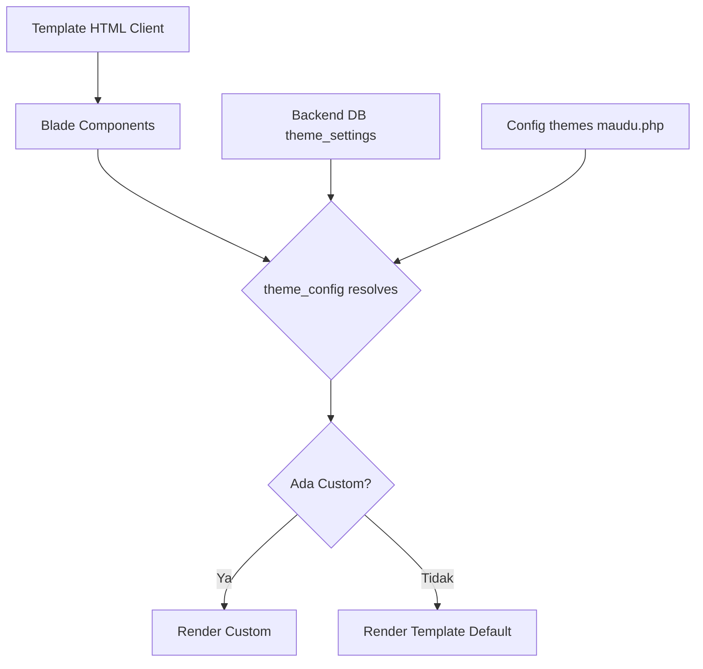
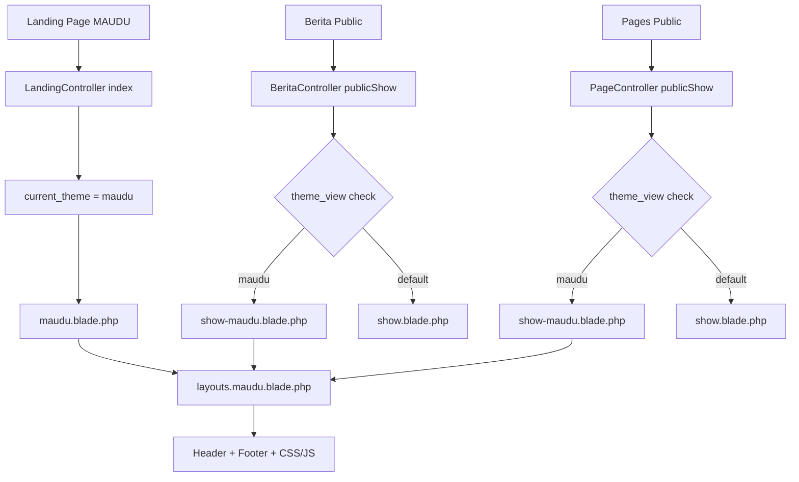

# 🎨 Plan: Integrasi Template MAUDU dengan Backend

> **PRINSIP UTAMA: TEMPLATE ADALAH DEFAULT. BACKEND ADALAH OVERRIDE.**

---

## 1. Source of Truth

- **Template:** `public/assets_maudu/index.html` + seluruh asset di `public/assets_maudu/`
- **Backend:** Laravel controllers, models, config, ThemeHelper, theme_settings DB
- **Integration Layer:** Blade components di `resources/views/components/maudu/`

**Aturan:**
- Template HTML client **TIDAK BOLEH DIUBAH**
- Asset di `public/assets_maudu/` **TIDAK BOLEH DIUBAH**
- Yang diubah: **Blade components** (sebagai penghubung template ↔ backend)
- Yang diubah: **Config** (untuk menyimpan default values dari template)
- Yang diubah: **Controller** (jika ada data yang perlu disediakan)

---

## 2. Mapping Template → Backend

### 2.1 Header / Navbar

| Elemen Template | Data Backend | Status | Keterangan |
|-----------------|--------------|--------|------------|
| Logo (favicon.png + logo nama.png) | `theme_image('logo')` | ✅ Ada | 4-tier resolution sudah berfungsi |
| Social: Facebook | `theme_config('facebook_url')` | ✅ Ada | Config sudah ada |
| Social: Instagram | `theme_config('instagram_url')` | ✅ Ada | Config sudah ada |
| Social: YouTube | `theme_config('youtube_url')` | ✅ Ada | Config sudah ada |
| Social: WhatsApp | `theme_config('whatsapp_url')` | ✅ Ada | Config sudah ada |
| Alamat (topbar) | `theme_config('address')` | ✅ Ada | Config sudah ada |
| Email (topbar) | `theme_config('email')` | ✅ Ada | Config sudah ada |
| Telepon (topbar) | `theme_config('phone')` | ✅ Ada | Config sudah ada |
| Google Maps URL | `theme_config('google_maps_url')` | ✅ Ada | Config sudah ada |
| Navbar Menu: PROFIL | `theme_config('menu[0]')` | ✅ Ada | Menu sudah ada di config |
| Navbar Menu: AKADEMIK | `theme_config('menu[1]')` | ✅ Ada | Menu sudah ada di config |
| Navbar Menu: LAYANAN PESERTA DIDIK | `theme_config('menu[2]')` | ✅ Ada | Menu sudah ada di config |
| Navbar Menu: EVENT MAUDU | `theme_config('menu[3]')` | ✅ Ada | Menu sudah ada di config |
| INFORMASI PENDAFTARAN button | `theme_config('linktree_url')` / `theme_config('ppdb_url')` | ✅ Ada | Config sudah ada |
| Login/Dashboard button | `@auth` / `route('login')` | ✅ Ada | Sudah ada di Blade |

**Gap:** Tidak ada. Semua data header sudah tersedia di backend.

**Yang perlu disesuaikan:** Struktur HTML Blade agar **identik** dengan template (class names, animasi, struktur).

---

### 2.2 Hero Slider

| Elemen Template | Data Backend | Status | Keterangan |
|-----------------|--------------|--------|------------|
| Slide 1 Background | `theme_config('hero_images.0')` | ✅ Ada | Config sudah ada |
| Slide 2 Background | `theme_config('hero_images.1')` | ✅ Ada | Config sudah ada |
| Slide 3 Background | `theme_config('hero_images.2')` | ✅ Ada | Config sudah ada |
| Slide 1 Subtitle | `theme_config('hero_slide1_subtitle')` | ⚠️ Partial | Perlu ditambah di config |
| Slide 1 Title | `theme_config('hero_slide1_title')` | ⚠️ Partial | Perlu ditambah di config |
| Slide 2 Subtitle | `theme_config('hero_slide2_subtitle')` | ⚠️ Partial | Perlu ditambah di config |
| Slide 2 Title | `theme_config('hero_slide2_title')` | ⚠️ Partial | Perlu ditambah di config |
| Slide 3 Subtitle | `theme_config('hero_slide3_subtitle')` | ⚠️ Partial | Perlu ditambah di config |
| Slide 3 Title | `theme_config('hero_slide3_title')` | ⚠️ Partial | Perlu ditambah di config |
| PPDB button URL | `theme_config('ppdb_url')` | ✅ Ada | Config sudah ada |

**Gap:**
1. Perlu tambah field hero slide text di `config/themes/maudu.php`
2. Default values dari template HTML:
   - Slide 1: subtitle="Welcome To MAUDU Library", title="Grand Opening MAUDU Library"
   - Slide 2: subtitle="Studi Edukasi Sosial", title="Gedung DPRD Kabupaten Jombang"
   - Slide 3: subtitle="Event KOMPASS", title="Kompetisi Agama, Sains, dan Seni 2024"

---

### 2.3 Feature Area

| Elemen Template | Data Backend | Status | Keterangan |
|-----------------|--------------|--------|------------|
| Feature 1: E-LIBRARY | `theme_config('features[0]')` | ✅ Ada | Config sudah ada |
| Feature 2: SERTIFIKASI KOMPETENSI | `theme_config('features[1]')` | ✅ Ada | Config sudah ada |
| Feature 3: KARYA LITERASI | `theme_config('features[2]')` | ✅ Ada | Config sudah ada |

**Gap:** Tidak ada data gap. Struktur HTML Blade perlu disesuaikan (tambah numbering, icon path).

---

### 2.4 Campus Life / Kepala Madrasah

| Elemen Template | Data Backend | Status | Keterangan |
|-----------------|--------------|--------|------------|
| Photo | `theme_config('kepala_sekolah.photo')` | ❌ Kosong | Perlu diisi (template pakai `campus-life/01.jpg`) |
| Nama | `theme_config('kepala_sekolah.name')` | ❌ Kosong | **Perlu diisi:** "Khoiruddinul Qoyyum,S.S.,M.Pd" |
| Deskripsi | `theme_config('kepala_sekolah.description')` | ❌ Kosong | **Perlu diisi:** 2 paragraf dari template |

**Gap:**
1. Field `kepala_sekolah` di config sudah ada tapi **kosong**
2. Perlu isi default values dari template
3. Fallback image: template pakai `campus-life/01.jpg`, Blade pakai `team/01.jpg`

---

### 2.5 Video Area

| Elemen Template | Data Backend | Status | Keterangan |
|-----------------|--------------|--------|------------|
| Video URL | `theme_config('video_url')` | ✅ Ada | "https://www.youtube.com/watch?v=ckHzmP1evNU" |
| Background Image | `theme_config('video_thumbnail')` | ❌ Kosong | Perlu diisi default: `assets_maudu/assets/img/video/01.jpg` |

**Gap:**
1. `video_thumbnail` kosong di config — perlu isi default

---

### 2.6 Counter Area

| Elemen Template | Data Backend | Status | Keterangan |
|-----------------|--------------|--------|------------|
| Mata Pelajaran: 24 | Hardcoded di Blade | ✅ Ada | Sudah benar |
| Peserta Didik: 800 | `$siswaCount` dari controller | ✅ Ada | Dynamic dari DB |
| Tenaga Pendidik: 98 | Hardcoded di Blade | ✅ Ada | Sudah benar |

**Gap:** Tidak ada. Counter sudah berfungsi.

---

### 2.7 About Area (Program Unggulan)

| Elemen Template | Data Backend | Status | Keterangan |
|-----------------|--------------|--------|------------|
| Gallery images | Hardcoded di Blade | ✅ Ada | 01.jpg, 02.jpg, 03.jpg |
| Experience text | Hardcoded di Blade | ✅ Ada | Perlu update teks |
| Program 1: KURIKULUM MADRASAH | `theme_config('program_unggulan[0]')` | ✅ Ada | Config sudah ada |
| Program 2: PROGRAM STUDI KE TIMUR TENGAH | `theme_config('program_unggulan[1]')` | ✅ Ada | Config sudah ada |
| Program 3: KELAS TAHFIDZ | `theme_config('program_unggulan[2]')` | ✅ Ada | Config sudah ada |
| Program 4: PROGRAM KEMASYARAKATAN | `theme_config('program_unggulan[3]')` | ✅ Ada | Config sudah ada |
| PPDB button URL | `theme_config('ppdb_url')` | ✅ Ada | Config sudah ada |
| WA number | `theme_config('whatsapp')` / `theme_config('phone')` | ✅ Ada | Config sudah ada |

**Gap:**
1. Deskripsi program perlu diupdate agar sesuai template (lebih detail)
2. Experience box teks perlu update
3. **BUG:** Extra `</div>` di baris 97 about-area.blade.php

---

### 2.8 Choose Area (Program Peminatan)

| Elemen Template | Data Backend | Status | Keterangan |
|-----------------|--------------|--------|------------|
| IPA | `theme_config('program_peminatan[0]')` | ✅ Ada | Config sudah ada |
| IPS | `theme_config('program_peminatan[1]')` | ✅ Ada | Config sudah ada |
| Keagamaan | `theme_config('program_peminatan[2]')` | ✅ Ada | Config sudah ada |

**Gap:**
1. Deskripsi perlu diupdate agar sesuai template (lebih detail)
2. `full_name` perlu diupdate ke format UPPER CASE seperti template

---

### 2.9 Portfolio / Blog

| Elemen Template | Data Backend | Status | Keterangan |
|-----------------|--------------|--------|------------|
| Blog posts | `$blogs` dari controller | ✅ Ada | Dynamic dari DB |
| Default posts (jika kosong) | Hardcoded di Blade | ✅ Ada | Default fallback sudah ada |

**Gap:**
1. **Layout:** Template pakai **grid layout** (6 items, 2 rows), Blade pakai **owl-carousel slider**
2. **Struktur HTML:** Perlu disesuaikan agar identik dengan template
3. **Pagination:** Template ada, Blade tidak ada

---

### 2.10 Testimonial

| Elemen Template | Data Backend | Status | Keterangan |
|-----------------|--------------|--------|------------|
| Testimonials | `$testimonials` dari controller | ✅ Ada | Dynamic dari DB |
| Default testimonials (jika kosong) | Hardcoded di Blade | ✅ Ada | 3 default generik |

**Gap:**
1. Default testimonials perlu diganti dengan konten asli MAUDU dari template (5 alumni)
2. Subtitle perlu update

---

### 2.11 Partner

| Elemen Template | Data Backend | Status | Keterangan |
|-----------------|--------------|--------|------------|
| Partner logos | `$partners` dari controller | ✅ Ada | Dynamic dari DB |
| Default logos (jika kosong) | Hardcoded di Blade | ✅ Ada | 10 partners sudah ada |

**Gap:** Tidak ada.

---

### 2.12 Footer

| Elemen Template | Data Backend | Status | Keterangan |
|-----------------|--------------|--------|------------|
| Logo light | `theme_image('logo_light')` | ✅ Ada | 4-tier resolution |
| About text | Hardcoded di Blade | ✅ Ada | Sudah sesuai template |
| WhatsApp | `theme_config('whatsapp_url')` | ✅ Ada | Config sudah ada |
| Address | `theme_config('address')` | ✅ Ada | Config sudah ada |
| Email | `theme_config('email')` | ✅ Ada | Config sudah ada |
| Social links | `theme_config('*_url')` | ✅ Ada | Config sudah ada |
| PPDB button | `theme_config('ppdb_url')` | ✅ Ada | Config sudah ada |
| Copyright | Dynamic dari Blade | ✅ Ada | Lebih baik dari template |

**Gap:** Tidak ada.

---

### 2.13 Sections TIDAK ADA di Template tapi ADA di Blade

| Section Blade | Ada di Template? | Keputusan |
|---------------|-------------------|-----------|
| `<x-maudu.programs>` | ❌ Tidak | **HAPUS dari urutan** — Tidak ada di template |
| `<x-maudu.cta>` | ❌ Tidak | **HAPUS dari urutan** — Tidak ada di template |
| `<x-maudu.events>` | ❌ Tidak | **HAPUS dari urutan** — Tidak ada di template |
| `<x-maudu.contact>` | ❌ Tidak | **HAPUS dari urutan** — Tidak ada di template |

---

## 3. Gap Summary

### 3.1 Config Gaps (perlu update `config/themes/maudu.php`)

| Field | Nilai Default dari Template |
|-------|-----------------------------|
| `kepala_sekolah.name` | "Khoiruddinul Qoyyum,S.S.,M.Pd" |
| `kepala_sekolah.photo` | "" (kosong, fallback ke image default) |
| `kepala_sekolah.description` | 2 paragraf dari template (lihat Section 9) |
| `video_thumbnail` | "assets_maudu/assets/img/video/01.jpg" |
| `hero_slide1_subtitle` | "Welcome To MAUDU Library" |
| `hero_slide1_title` | "Grand Opening MAUDU Library" |
| `hero_slide2_subtitle` | "Studi Edukasi Sosial" |
| `hero_slide2_title` | "Gedung DPRD Kabupaten Jombang" |
| `hero_slide3_subtitle` | "Event KOMPASS" |
| `hero_slide3_title` | "Kompetisi Agama, Sains, dan Seni 2024" |
| `program_peminatan[0].desc` | Update deskripsi IPA detail |
| `program_peminatan[1].desc` | Update deskripsi IPS detail |
| `program_peminatan[2].desc` | Update deskripsi Keagamaan detail |
| `program_peminatan[*].full_name` | Update ke UPPER CASE format |
| `program_unggulan[*].desc` | Update deskripsi detail dari template |

### 3.2 Controller Gaps

| Method | Gap |
|--------|-----|
| `getSiteSettings()` | Default values masih "SMK Telekomunikasi" — perlu update ke MAUDU values |

### 3.3 Blade Component Gaps

| Component | Gap Utama |
|-----------|-----------|
| `header.blade.php` | Struktur logo navbar, class INFORMASI PENDAFTARAN button |
| `hero-slider.blade.php` | Tambah icon subtitle, update animasi per slide, hapus CTA button & deskripsi |
| `feature-area.blade.php` | Tambah numbering (01/02/03) |
| `about-kepala.blade.php` | Animasi gambar `fadeInLeft`, fallback image path, 2 paragraf deskripsi |
| `counter.blade.php` | Label "Tenaga Pendidik & KEPENDIDIKAN", counter format |
| `about-area.blade.php` | **FIX BUG extra div**, tambah gambar 03, update experience box, class names |
| `choose-area.blade.php` | Update title, tagline, deskripsi detail |
| `blog.blade.php` | **GANTI layout dari slider ke grid**, update struktur HTML, tambah pagination |
| `testimonial.blade.php` | Update 5 default data asli MAUDU, subtitle, class names |
| `footer.blade.php` | Minor class adjustments |

### 3.4 Layout Gaps

| File | Gap |
|------|-----|
| `maudu.blade.php` | Hapus/reorder sections: hapus programs, cta, events, contact; pindah blog ke posisi #9 |
| `layouts/maudu.blade.php` | Tidak ada gap — sudah benar |

---

## 4. Rencana Implementasi

### Fase 1: Config Update
Update [`config/themes/maudu.php`](config/themes/maudu.php) dengan default values dari template.

### Fase 2: Controller Update
Update [`app/Http/Controllers/LandingController.php`](app/Http/Controllers/LandingController.php) `getSiteSettings()` defaults.

### Fase 3: Main View Reorder
Update [`resources/views/maudu.blade.php`](resources/views/maudu.blade.php) — reorder sections, hapus sections yang tidak ada di template.

**Urutan BARU (sesuai template):**
1. Hero Slider
2. Feature Area
3. Kepala Madrasah
4. Video Area
5. Counter Area
6. About Area (Program Unggulan)
7. Choose Area (Program Peminatan)
8. Blog / Berita (grid layout)
9. Testimonial
10. Partner

### Fase 4: Component Updates (urutan eksekusi)
1. `header.blade.php` — struktur logo navbar
2. `hero-slider.blade.php` — icon, animasi, hapus CTA
3. `feature-area.blade.php` — numbering
4. `about-kepala.blade.php` — animasi, fallback image
5. `counter.blade.php` — label, format
6. `about-area.blade.php` — fix bug, gambar, experience box, class names
7. `choose-area.blade.php` — title, deskripsi
8. `blog.blade.php` — layout grid, struktur, pagination
9. `testimonial.blade.php` — default data asli MAUDU
10. `footer.blade.php` — minor adjustments

### Fase 5: Testing
- Clear cache
- Test landing page MAUDU
- Test dynamic theme: default vs custom
- Test Telkom tidak terpengaruh

---

## 5. Diagram Alur



---

## 6. File yang Diupdate

### Config (1 file)
- `config/themes/maudu.php`

### Controller (1 file)
- `app/Http/Controllers/LandingController.php`

### Main View (1 file)
- `resources/views/maudu.blade.php`

### Components (10 files)
- `resources/views/components/maudu/header.blade.php`
- `resources/views/components/maudu/hero-slider.blade.php`
- `resources/views/components/maudu/feature-area.blade.php`
- `resources/views/components/maudu/about-kepala.blade.php`
- `resources/views/components/maudu/counter.blade.php`
- `resources/views/components/maudu/about-area.blade.php`
- `resources/views/components/maudu/choose-area.blade.php`
- `resources/views/components/maudu/blog.blade.php`
- `resources/views/components/maudu/testimonial.blade.php`
- `resources/views/components/maudu/footer.blade.php`

### TIDAK Diupdate
- `public/assets_maudu/` — **DILARANG DIUBAH**
- `resources/views/layouts/maudu.blade.php` — Sudah benar
- `resources/views/components/maudu/video.blade.php` — Sudah sesuai template
- `resources/views/components/maudu/partner.blade.php` — Sudah sesuai template
- `resources/views/components/maudu/portfolio.blade.php` — Tidak dipakai
- `resources/views/components/maudu/programs.blade.php` — Tidak ada di template
- `resources/views/components/maudu/cta.blade.php` — Tidak ada di template
- `resources/views/components/maudu/events.blade.php` — Tidak ada di template
- `resources/views/components/maudu/contact.blade.php` — Tidak ada di template

---

## 7. Aturan Konsistensi Halaman Detail

> **Prinsip:** Semua halaman detail harus menggunakan design system yang sama dengan template aktif.

### 7.1 Layout & Design System

Semua halaman detail MAUDU sudah benar:
- Menggunakan `@extends('layouts.maudu')` → otomatis dapat header, footer, CSS, JS yang sama
- Menggunakan `<x-maudu.breadcrumb>` → komponen breadcrumb yang konsisten
- Menggunakan CSS dari `assets_maudu/assets/css/style.css` → framework yang sama

### 7.2 File Detail Pages yang Sudah Ada

| File | Status | Catatan |
|------|--------|---------|
| `berita/public/index-maudu.blade.php` | ✅ Ada | Grid layout, search, pagination |
| `berita/public/show-maudu.blade.php` | ✅ Ada | Single article, sidebar, share buttons |
| `pages/public/index-maudu.blade.php` | ✅ Ada | Pages listing |
| `pages/public/show-maudu.blade.php` | ✅ Ada | Single page, custom fields, related |
| `instagram/activities-maudu.blade.php` | ✅ Ada | Kegiatan page |
| `public/elulus/check-maudu.blade.php` | ✅ Ada | E-Lulus check form |
| `public/elulus/result-maudu.blade.php` | ✅ Ada | E-Lulus result |
| `components/maudu/breadcrumb.blade.php` | ✅ Ada | Breadcrumb component |

### 7.3 Masalah: Hardcoded Inline Styles

Beberapa halaman detail menggunakan **inline styles** dengan warna hardcoded `#1a5632` (hijau). Ini tidak ideal karena:
1. Tidak konsisten dengan template yang menggunakan CSS classes
2. Tidak bisa di-customize via admin

**Rekomendasi:** Untuk Fase ini, **JANGAN ubah** inline styles di detail pages. Fokus ke landing page dulu. Inline styles bisa di-cleanup di fase berikutnya.

### 7.4 Urutan Pengerjaan Detail Pages

Detail pages **BUKAN bagian dari Fase 1-5** ini. Mereka sudah berfungsi dan menggunakan layout MAUDU yang benar. Perubahan detail pages (jika diperlukan) akan dilakukan di fase terpisah.

---

## 8. CSS Class Name Mapping Lengkap

> **Aturan:** Semua class names di Blade components harus **identik** dengan template HTML client.

### 8.1 Header (`header.blade.php`)

| Elemen | Class Template | Class Blade Saat Ini | Perlu Diubah? |
|--------|---------------|---------------------|---------------|
| Logo navbar | `navbar-brand d-inline-flex align-items-center gap-2 me-lg-5` | `navbar-brand` + inline style `margin-right: 25px` | ✅ Ya |
| Social text | `Follow Us:` | `Ikuti Kami:` | ⚠️ Opsional |
| Location icon | `far fa-location-dot` | `fas fa-location-dot` | ✅ Ya |
| Email icon | `far fa-envelopes` | `fas fa-envelope` | ✅ Ya |
| Phone icon | `far fa-phone-volume` | `fas fa-phone-volume` | ⚠️ Minor |
| INFORMASI PENDAFTARAN button | `theme-btn` | `btn btn-outline-primary` + inline styles | ✅ Ya |
| Search icon | `far fa-search` | `fas fa-search` | ✅ Ya |
| Toggler icon | `navbar-toggler-mobile-icon` + `<i class="far fa-bars">` | `navbar-toggler-icon` | ✅ Ya |
| Nav items | `navbar-nav align-items-center mx-auto` | `navbar-nav` | ✅ Ya |
| Nav right wrapper | `nav-right` | `nav-right d-flex align-items-center gap-2 flex-shrink-0` | ✅ Ya |

### 8.2 Hero Slider (`hero-slider.blade.php`)

| Elemen | Class Template | Class Blade Saat Ini | Perlu Diubah? |
|--------|---------------|---------------------|---------------|
| Subtitle wrapper | `<h6 class="hero-sub-title">` | `<h6 class="hero-subtitle">` | ✅ Ya — `hero-sub-title` vs `hero-subtitle` |
| Subtitle icon | `<i class="far fa-book-open-reader"></i>` | Tidak ada | ✅ Ya — perlu ditambah |
| Title wrapper | `<h1 class="hero-title">` | `<h1 class="hero-title">` | ❌ Sudah benar |
| Animasi slide 1 | `fadeInDown` / `.25s` | `fadeInUp` / `0.3s` | ✅ Ya |
| Animasi slide 2 | `fadeInRight` / `.50s` | `fadeInUp` / `0.5s` | ✅ Ya |
| Animasi slide 3 | `fadeInLeft` / `.75s` | `fadeInUp` / `0.7s` | ✅ Ya |
| CTA button | TIDAK ADA | `btn btn-primary` "Daftar Sekarang" | ✅ Ya — perlu HAPUS |
| Description `<p>` | Hanya slide 1 ada | Semua slide ada | ✅ Ya — buat conditional |

### 8.3 Feature Area (`feature-area.blade.php`)

| Elemen | Class Template | Class Blade Saat Ini | Perlu Diubah? |
|--------|---------------|---------------------|---------------|
| Numbering | `<span class="count">01</span>` | TIDAK ADA | ✅ Ya — perlu ditambah |
| Feature icon | `<div class="feature-icon">` | `<div class="feature-icon"><i class="fas fa-...">` | ❌ FA icons OK |
| Feature title | `<h4 class="feature-title">` | `<h4 class="feature-title">` | ❌ Sudah benar |
| Feature text | `<p>` (tanpa class) | `<p class="feature-text">` | ⚠️ Minor |

### 8.4 About Kepala (`about-kepala.blade.php`)

| Elemen | Class Template | Class Blade Saat Ini | Perlu Diubah? |
|--------|---------------|---------------------|---------------|
| Image wrapper animasi | `wow fadeInLeft` | `wow fadeInUp` | ✅ Ya — perlu `fadeInLeft` |
| Image fallback path | `campus-life/01.jpg` | `team/01.jpg` | ✅ Ya — perlu update |
| Image class | `` | `` | ⚠️ Minor — FA add rounded OK |
| Content wrapper animasi | `wow fadeInUp` | `wow fadeInUp` | ❌ Sudah benar |
| Heading class | `site-title` | `site-title` | ❌ Sudah benar |
| Description | 2 `<p class="content-text">` | 1 `<p class="content-text">` | ✅ Ya — perlu 2 paragraf |

### 8.5 Counter (`counter.blade.php`)

| Elemen | Class Template | Class Blade Saat Ini | Perlu Diubah? |
|--------|---------------|---------------------|---------------|
| Icon wrapper | `<div class="icon">` | `<div class="counter-icon">` | ✅ Ya — `icon` vs `counter-icon` |
| Counter number | `<span class="counter" data-count="+" data-to="24" data-speed="3000">` | `<span class="counter" data-count="24">` | ✅ Ya — perlu `data-to` dan `data-speed` |
| Title | `<h6 class="title">` | `<h4 class="counter-title">` | ✅ Ya — `h6.title` vs `h4.counter-title` |
| Label 3 | `+ Tenaga Pendidik & KEPENDIDIKAN` | `Tenaga Pendidik` | ✅ Ya — perlu update label |

### 8.6 About Area (`about-area.blade.php`)

| Elemen | Class Template | Class Blade Saat Ini | Perlu Diubah? |
|--------|---------------|---------------------|---------------|
| Experience box | `<div class="about-experience mt-4"><div class="about-experience-icon"></div><b class="text-start">Gallery Kegiatan<br> MAUDU Rejoso</b></div>` | `<div class="about-experience mt-4"><span class="experience-number">15+</span><span class="experience-text">Tahun Pengalaman</span></div>` | ✅ Ya — struktur berbeda |
| Image 03 | `` | TIDAK ADA | ✅ Ya — perlu ditambah |
| Tagline | `<span class="site-title-tagline"><i class="far fa-book-open-reader"></i> INFORMASI</span>` | `<span class="sub-title">INFORMASI</span>` | ✅ Ya — class berbeda |
| Title | `<h2 class="site-title">` | `<h2 class="title">` | ✅ Ya — `site-title` vs `title` |
| Program title | `<h5>` | `<h4>` | ✅ Ya — `h5` vs `h4` |
| About bottom button | `<a class="theme-btn">` | `<a class="btn btn-primary">` | ✅ Ya — `theme-btn` vs `btn btn-primary` |
| WA label | `WA KAMI` | `Hubungi Kami` | ✅ Ya — perlu update |
| Phone icon | `<i class="fal fa-headset">` | `<i class="fas fa-phone-alt">` | ✅ Ya — headset vs phone |
| Extra `</div>` bug | TIDAK ADA | Ada di line 97 | ✅ Ya — perlu HAPUS |

### 8.7 Choose Area (`choose-area.blade.php`)

| Elemen | Class Template | Class Blade Saat Ini | Perlu Diubah? |
|--------|---------------|---------------------|---------------|
| Tagline | `<span class="site-title-tagline"><i class="far fa-book-open-reader"></i> Program Peminatan</span>` | `<span class="sub-title">Mengapa Memilih Kami</span>` | ✅ Ya — class + teks berbeda |
| Title | `<h2 class="site-title text-white mb-10">3 <span>Program </span> Peminatan</h2>` | `<h2 class="title text-white">Program Peminatan</h2>` | ✅ Ya — `site-title` vs `title`, teks berbeda |
| Peminatan full_name | UPPER CASE format | Title Case format | ✅ Ya — perlu update |

### 8.8 Blog (`blog.blade.php`)

| Elemen | Class Template | Class Blade Saat Ini | Perlu Diubah? |
|--------|---------------|---------------------|---------------|
| Section wrapper | `<div class="portfolio-area py-120">` | `<div class="blog-area py-120">` | ✅ Ya — `portfolio-area` vs `blog-area` |
| Grid layout | `<div class="row"><div class="col-md-6 col-lg-4">` | `<div class="blog-slider owl-carousel owl-theme">` | ✅ Ya — **slider vs grid** |
| Tagline | `<span class="site-title-tagline"><i class="far fa-book-open-reader"></i> Kegiatan MAUDU</span>` | `<span class="sub-title">Berita</span>` | ✅ Ya — class + teks berbeda |
| Title | `<h2 class="site-title">Berita<span> Madrasah</span> Terbaru</h2>` | `<h2 class="title">Berita & Artikel Terbaru</h2>` | ✅ Ya — class + teks berbeda |
| Subtitle | `<p>Oleh Redaksi AFKAR</p>` | `<p class="desc">Informasi terkini...</p>` | ✅ Ya — perlu update |
| Blog date | `<div class="blog-date"><i class="fal fa-calendar-alt"></i> June 18, 2024</div>` | `<div class="blog-date"><span class="date">...</span><span class="month">...</span></div>` | ✅ Ya — struktur berbeda |
| Blog image | `<div class="blog-item-img">` | `<div class="blog-img">` | ✅ Ya — class berbeda |
| Blog meta | `<div class="blog-item-meta"><ul><li>` | `<div class="blog-meta"><span>` | ✅ Ya — class + struktur berbeda |
| Read more | `<a class="theme-btn" href="...">Read More<i class="fas fa-arrow-right-long"></i></a>` | `<a class="read-more">Baca Selengkapnya <i class="fas fa-arrow-right"></i></a>` | ✅ Ya — class + teks + icon berbeda |
| Pagination | `<div class="pagination-area"><ul class="pagination">` | TIDAK ADA | ✅ Ya — perlu ditambah |
| OwlCarousel JS | TIDAK ADA | Ada (slider script) | ✅ Ya — perlu HAPUS |

### 8.9 Testimonial (`testimonial.blade.php`)

| Elemen | Class Template | Class Blade Saat Ini | Perlu Diubah? |
|--------|---------------|---------------------|---------------|
| Tagline | `<span class="site-title-tagline"><i class="far fa-book-open-reader"></i> Testimonials</span>` | `<span class="sub-title">Testimoni</span>` | ✅ Ya — class + teks berbeda |
| Title | `<h2 class="site-title text-white">Apa Kata<span> Alumni ?</span></h2>` | `<h2 class="title">Apa Kata Mereka?</h2>` | ✅ Ya — class + teks berbeda |
| Subtitle | `<p class="text-white">Alumni kuliah di dalam Negeri dan di luar Negeri</p>` | `<p class="desc">Cerita dari alumni dan siswa...</p>` | ✅ Ya — perlu update |
| Quote icon | `<i class="fas fa-quote-left"></i>` (di dalam testimonial-quote) | `<i class="fas fa-quote-left"></i>` | ❌ Sudah benar |
| Author image wrapper | `<div class="testimonial-author-img">` | `<div class="author-img">` | ✅ Ya — class berbeda |
| Author info wrapper | `<div class="testimonial-author-info">` | `<div class="author-info">` | ✅ Ya — class berbeda |
| Quote icon (decorative) | `<span class="testimonial-quote-icon"><i class="far fa-quote-right"></i></span>` | TIDAK ADA | ✅ Ya — perlu ditambah |
| Author name format | `<h4>Riza Azkia (2012)</h4>` | `<h4>Ahmad Fauzi</h4>` | ✅ Ya — perlu update data |

### 8.10 Footer (`footer.blade.php`)

| Elemen | Class Template | Class Blade Saat Ini | Perlu Diubah? |
|--------|---------------|---------------------|---------------|
| Footer shape | TIDAK ADA | `<div class="footer-shape">` | ⚠️ Tambahan Blade — OK |
| All major classes | Identik | Identik | ❌ Sudah benar |

**Footer tidak perlu perubahan signifikan.**

---

## 9. Konten Default Lengkap dari Template

> **Semua nilai ini dijadikan default di config. Jika admin upload custom via Theme Settings, custom meng-overrite default.**

### 9.1 Hero Slide Text

```php
'hero_slides' => [
    [
        'subtitle' => 'Welcome To MAUDU Library',
        'title' => 'Grand Opening <span>MAUDU</span> Library',
        'description' => 'Acara Grandopening Dihadiri oleh Majelis Pimpinan Pondok Pesantren Darul Ulum Rejoso Peterongan Jombang',
    ],
    [
        'subtitle' => 'Studi Edukasi Sosial',
        'title' => 'Gedung <span>DPRD</span> Kabupaten Jombang',
        'description' => '',  // Slide 2 & 3 TIDAK ada deskripsi di template
    ],
    [
        'subtitle' => 'Event KOMPASS',
        'title' => 'Kompetisi Agama, <span>Sains,</span> dan Seni 2024',
        'description' => '',
    ],
],
```

### 9.2 Kepala Madrasah

```php
'kepala_sekolah' => [
    'name' => 'Khoiruddinul Qoyyum,S.S.,M.Pd',
    'photo' => '',  // Fallback ke campus-life/01.jpg
    'description' => 'Selamat datang di Website Resmi Madrasah Aliyah Unggulan Darul \'Ulum Rejoso. Dengan rahmat Allah SWT, website ini menjadi media informasi, silaturahmi, dan komunikasi bagi siswa, alumni, orang tua, serta masyarakat. Kami menyajikan profil madrasah, kegiatan, prestasi, dan berbagai layanan pendidikan.',
    'description_2' => 'Semoga kehadiran website ini memberikan manfaat, mempererat kebersamaan, serta mendukung terwujudnya pendidikan yang unggul, berkarakter, dan berorientasi pada masa depan. Kritik dan saran sangat kami harapkan demi kemajuan bersama.',
],
```

### 9.3 Program Unggulan (Detail dari Template)

```php
'program_unggulan' => [
    [
        'title' => 'KURIKULUM MADRASAH',
        'desc' => 'Kolaborasi antara kurikulum Kepesantrenan, Kemendikbud, Kemenag dan Kurikulum Muatan Lokal Madrasah',
        'icon' => 'fas fa-graduation-cap',  // Template: information.svg
    ],
    [
        'title' => 'PROGRAM STUDI KE TIMUR TENGAH',
        'desc' => 'Pembinaan Intensif dan Mediator Pemberangkatan',
        'icon' => 'fas fa-plane-departure',  // Template: global-education.svg
    ],
    [
        'title' => 'KELAS TAHFIDZ, MUATAN LOKAL KITAB TURATS',
        'desc' => 'Kelas Tahfidz, Program Tahfidz serta Program Pembiasaan Siswa',
        'icon' => 'fas fa-book-quran',  // Template: open-book.svg
    ],
    [
        'title' => 'PROGRAM KEMASYARAKATAN',
        'desc' => 'Kafilah Sholat Jum\'at, Sholat Tarawih, TPQ, Bakti Sosial dan Pengabdian Masyarakat',
        'icon' => 'fas fa-hands-helping',  // Template: location.svg
    ],
],
```

### 9.4 Program Peminatan (Detail dari Template)

```php
'program_peminatan' => [
    [
        'name' => 'IPA',
        'full_name' => 'PEMINATAN ILMU PENGETAHUAN ALAM (IPA)',
        'desc' => 'Menyiapkan peserta didik yang handal dalam kajian ilmiah dan alamiah dengan berlandaskan kepada ayat-ayat qauliyah dan kauniyah.',
        'icon' => 'fas fa-flask',
    ],
    [
        'name' => 'IPS',
        'full_name' => 'PEMINATAN ILMU PENGETAHUAN SOSIAL (IPS)',
        'desc' => 'Menyiapkan peserta didik yang dapat menguasai ilmu-ilmu sosial secara terpadu antara keislaman dan pengetahuan sehingga menjadi insan yang sosialis-agamis.',
        'icon' => 'fas fa-globe',
    ],
    [
        'name' => 'Keagamaan',
        'full_name' => 'PEMINATAN KEAGAMAAN',
        'desc' => 'Menyiapkan peserta didik yang lebih mampu menguasai ilmu-ilmu agama dengan mengkaji sumber aslinya serta mengkolaborasikan dengan perkembangan IPTEK.',
        'icon' => 'fas fa-book-quran',
    ],
],
```

### 9.5 Default Testimonials (5 Alumni Asli MAUDU)

```php
$defaultTestimonials = [
    [
        'name' => 'Riza Azkia (2012)',
        'position' => 'Al-Azhar Kairo - Staff KBRI di Baghdad, Iraq',
        'rating' => 5,
        'content' => 'Di Madrasah ini, kita tidak hanya diajarkan ilmu umum, dan agama, tapi juga ditempa dengan pengamalan akhlak yang sangat luar biasa. Belajar di Madrasah Aliyah Unggulan Darul Ulum adalah pengalaman yang sangat berharga untuk saya. Terimakasih kepada segenap Bapak Ibu guru, berkat ajaran doa beliau, saya sampai pada titik ini.',
        'photo' => 'assets_maudu/assets/img/testimonial/01.jpg',
    ],
    [
        'name' => 'NAILA KHAIRUN NAJWA (2024)',
        'position' => 'Universitas Az-Zaitunah Tunisia',
        'rating' => 5,
        'content' => 'Setelah sampai di Tunisia, saya semakin menyadari bahwa pembelajaran di MAU tidak hanya berorientasi pada akademik semata. MAU juga membentuk kepribadian kami agar siap menghadapi berbagai situasi. Kami dilatih untuk berpikir kritis, menyampaikan pendapat dengan percaya diri, dan menjaga adab dalam setiap interaksi.',
        'photo' => 'assets_maudu/assets/img/testimonial/02.jpg',
    ],
    [
        'name' => 'Naura Bya Sakan Naja (2024)',
        'position' => 'Ushuluddin - Yarmouk University, Yordania',
        'rating' => 5,
        'content' => 'Ilmu adalah cahaya yang membimbing kita menuju jalan kesuksesan. Sukses yang hendak digapai bukan semata duniawiyah tetapi berkelanjutan Ukhrawiyah. Bak asa dalam pelangitan doa yg dikenal sebagai doa sapujagat: Khasanah Fiddunya Khasanah Fil akhirah. Semoga Allah limpahkan Rahmat dan berkahNya bagi para guru.',
        'photo' => 'assets_maudu/assets/img/testimonial/03.jpg',
    ],
    [
        'name' => 'UMIT ISLAMY DAVALA (2024)',
        'position' => 'Teknik Sipil - Institut Teknologi Sepuluh Nopember',
        'rating' => 5,
        'content' => 'Di MAU Darul Ulum, saya tidak hanya belajar ilmu agama, tetapi juga dilatih untuk disiplin, fokus, dan memiliki etos kerja yang tinggi. Nilai-nilai ini sangat membantu saya selama proses persiapan SNBT. Saya percaya, setiap siswa MAU Darul Ulum memiliki potensi besar untuk bersaing dan meraih prestasi di tingkat nasional.',
        'photo' => 'assets_maudu/assets/img/testimonial/04.jpg',
    ],
    [
        'name' => 'DR. KH. Zainul Arifin, M.A, M.Ed.',
        'position' => 'Pengasuh Ponpes Darul Arifin, Jambi',
        'rating' => 5,
        'content' => 'Di Darul Ulum khususnya MAU, saya memperolah banyak sekali pengalaman yang berkesan. Bimbingan para masyayikh dan guru yang sabar dan ikhlas, baik akademik maupun non akademik, membentuk diri saya seperti yang saat ini. Sekolah sambil nyantri di Darul ulum mengajarkan Kuat Dzikir dan Pikir sehingga membentuk pribadi yang mantap secara intelektual dan matang secara spiritual.',
        'photo' => 'assets_maudu/assets/img/testimonial/05.jpg',
    ],
];
```

### 9.6 Feature Area Descriptions

```php
'features' => [
    [
        'title' => 'E-LIBRARY',
        'desc' => 'Perpustakaan digital berisi Koleksi materi dalam format elektronik',
        'icon' => 'fas fa-book-open',  // Template: library.svg
    ],
    [
        'title' => 'SERTIFIKASI KOMPETENSI',
        'desc' => 'Uji kompetensi yang sistematis dan objektif',
        'icon' => 'fas fa-certificate',  // Template: teacher-2.svg
    ],
    [
        'title' => 'KARYA LITERASI',
        'desc' => 'Penelitian di Bidang Keislaman, Sains, Teknologi, dan Sosial.',
        'icon' => 'fas fa-pen-fancy',  // Template: course.svg
    ],
],
```

### 9.7 Blog Section Heading

```
Tagline: "Kegiatan MAUDU" (dengan icon book-open-reader)
Title: "Berita Madrasah Terbaru" (dengan <span> di "Madrasah")
Subtitle: "Oleh Redaksi AFKAR"
```

### 9.8 Counter Labels

```
1. "Mata Pelajaran" (24)
2. "+ Peserta Didik" (800, dynamic)
3. "+ Tenaga Pendidik & KEPENDIDIKAN" (98)
```

### 9.9 About Area

```
Tagline: "INFORMASI" (dengan icon book-open-reader)
Title: "Unggulan MAUDU Rejoso" (MAUDU di <span>)
Experience Box: "Gallery Kegiatan MAUDU Rejoso" (dengan monitor.svg icon)
Button: "PPDB ONLINE" (theme-btn class)
WA Label: "WA KAMI" (dengan headset icon)
```

### 9.10 Choose Area

```
Tagline: "Program Peminatan" (dengan icon book-open-reader)
Title: "3 Program Peminatan" (3 dan Peminatan di <span>)
```

---

## 10. Diagram Alur Detail Pages


