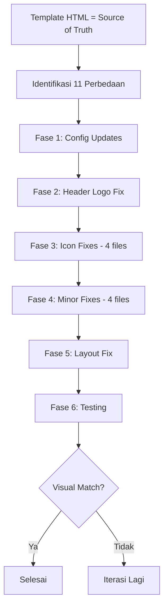

# 🔧 Plan: Perbaikan Round 2 — Template MAUDU vs Blade Implementation

## Ringkasan

Setelah analisis ulang menyeluruh terhadap template HTML [`public/assets_maudu/index.html`](public/assets_maudu/index.html) vs semua komponen Blade, ditemukan **11 perbedaan** yang belum teratasi dari implementasi sebelumnya.

**Prinsip**: TEMPLATE ADALAH DEFAULT. BACKEND ADALAH OVERRIDE.

---

## Daftar Perbedaan yang Ditemukan

### 🔴 KRITIS — Dampak Visual Besar

#### 1. Logo Header — 1 Gambar vs 2 Gambar

| Aspek | Template | Blade Saat Ini |
|-------|----------|----------------|
| Struktur | 2 ``: icon + text | 1 `` saja |
| File 1 | `favicon.png` class=`logo-icon` | — |
| File 2 | `logo nama.png` class=`logo-text` | — |
| Fallback | — | `logo.png` |

**Template HTML** ([`public/assets_maudu/index.html:78-81`](public/assets_maudu/index.html:78)):
```html
<a class="navbar-brand d-inline-flex align-items-center gap-2 me-lg-5" href="index.html">
    
    
</a>
```

**Blade Saat Ini** ([`resources/views/components/maudu/header.blade.php:44-47`](resources/views/components/maudu/header.blade.php:44)):
```html
<a class="navbar-brand d-inline-flex align-items-center gap-2 me-lg-5" href="{{ route('landing') }}">
    
</a>
```

**Yang Perlu Diubah**:
- Tambah field `logo_icon` di config untuk icon image
- Tambah field `logo_text` di config untuk text image
- Update header.blade.php untuk render 2 gambar dengan class `logo-icon` dan `logo-text`
- File yang ada: `favicon.png`, `logo nama.png`, `logo.png`, `logo-light.png`

**Config fields baru**:
```php
'logo_icon' => 'assets_maudu/assets/img/logo/favicon.png',
'logo_text' => 'assets_maudu/assets/img/logo/logo nama.png',
```

---

#### 2. Favicon Fallback Path Salah

| Aspek | Template | Blade Saat Ini |
|-------|----------|----------------|
| Path | `assets/img/logo/favicon.png` | `assets_maudu/assets/images/fav.png` |

**Template** ([`public/assets_maudu/index.html:16`](public/assets_maudu/index.html:16)):
```html
<link rel="icon" type="image/x-icon" href="assets/img/logo/favicon.png">
```

**Blade Layout** ([`resources/views/layouts/maudu.blade.php:18-19`](resources/views/layouts/maudu.blade.php:18)):
```html
<link rel="icon" type="image/x-icon"
    href="{{ theme_image('favicon', theme_info('defaults.favicon', 'assets_maudu/assets/images/fav.png')) }}">
```

**Masalah**: Fallback path `assets_maudu/assets/images/fav.png` tidak ada. Path yang benar adalah `assets_maudu/assets/img/logo/favicon.png`.

**Fix**: Ganti fallback path.

---

#### 3. Feature Area — Font Awesome vs SVG Images

| Aspek | Template | Blade Saat Ini |
|-------|----------|----------------|
| E-Library | `` | `<i class="fas fa-book-open">` |
| Sertifikasi | `` | `<i class="fas fa-certificate">` |
| Literasi | `` | `<i class="fas fa-pen-fancy">` |

**File SVG tersedia** di `public/assets_maudu/assets/img/icon/`:
- `library.svg` ✓
- `teacher-2.svg` ✓
- `course.svg` ✓

**Fix**: Update fallback icons di [`resources/views/components/maudu/feature-area.blade.php`](resources/views/components/maudu/feature-area.blade.php) untuk menggunakan `` dengan SVG path sebagai default, bukan Font Awesome `<i>`.

---

#### 4. Counter Area — Font Awesome vs SVG Images

| Aspek | Template | Blade Saat Ini |
|-------|----------|----------------|
| Mata Pelajaran | `` | `<i class="fas fa-book">` |
| Peserta Didik | `` | `<i class="fas fa-user-graduate">` |
| Tenaga Pendidik | `` | `<i class="fas fa-chalkboard-teacher">` |

**File SVG tersedia**:
- `course.svg` ✓
- `graduation.svg` ✓
- `teacher-2.svg` ✓

**Fix**: Update [`resources/views/components/maudu/counter.blade.php`](resources/views/components/maudu/counter.blade.php) default icons.

---

#### 5. About Area — Font Awesome vs SVG Images

| Aspek | Template | Blade Saat Ini |
|-------|----------|----------------|
| Monitor icon | `` | `<i class="fas fa-desktop">` |
| Kurikulum | `` | `<i class="fas fa-graduation-cap">` |
| Timur Tengah | `` | `<i class="fas fa-plane-departure">` |
| Tahfidz | `` | `<i class="fas fa-book-quran">` |
| Kemasyarakatan | `` | `<i class="fas fa-hands-helping">` |

**File SVG tersedia**:
- `monitor.svg` ✓
- `information.svg` ✓
- `global-education.svg` ✓
- `open-book.svg` ✓
- `location.svg` ✓

**Fix**: Update [`resources/views/components/maudu/about-area.blade.php`](resources/views/components/maudu/about-area.blade.php) default icons.

---

#### 6. Choose Area — Font Awesome vs SVG Images

| Aspek | Template | Blade Saat Ini |
|-------|----------|----------------|
| IPA | `` | `<i class="fas fa-flask">` |
| IPS | `` | `<i class="fas fa-globe">` |
| Keagamaan | `` | `<i class="fas fa-book-quran">` |

**Note**: Template menggunakan `course.svg` untuk SEMUA 3 item.

**Fix**: Update [`resources/views/components/maudu/choose-area.blade.php`](resources/views/components/maudu/choose-area.blade.php) default icons.

---

### 🟡 MEDIUM — Dampak Visual Moderat

#### 7. Kepala Image — Extra Classes

| Aspek | Template | Blade Saat Ini |
|-------|----------|----------------|
| Class | _(none)_ | `img-fluid rounded` |

**Template** ([`public/assets_maudu/index.html:285`](public/assets_maudu/index.html:285)):
```html

```

**Blade** ([`resources/views/components/maudu/about-kepala.blade.php:11-15`](resources/views/components/maudu/about-kepala.blade.php:11)):
```html

```

**Fix**: Hapus class `img-fluid rounded` dari fallback image. Untuk admin-uploaded photo, pertahankan `img-fluid` untuk responsive.

---

#### 8. Partner Items — Struktur Berbeda

| Aspek | Template | Blade Saat Ini |
|-------|----------|----------------|
| Struktur | `` langsung di carousel | `<div class="partner-item text-center"></div>` |

**Template** ([`public/assets_maudu/index.html:996-1006`](public/assets_maudu/index.html:996)):
```html
<div class="partner-wrapper partner-slider owl-carousel owl-theme">
    
    
    ...
</div>
```

**Blade** ([`resources/views/components/maudu/partner.blade.php:54-59`](resources/views/components/maudu/partner.blade.php:54)):
```html
<div class="partner-item text-center">
    name }}" style="max-height: 60px;">
</div>
```

**Fix**: Hapus wrapper `<div class="partner-item text-center">` dan inline style. Render `` langsung seperti template.

---

#### 9. Footer Icon Classes — `far` vs `fas`

| Icon | Template | Blade |
|------|----------|-------|
| Map marker | `far fa-map-marker-alt` | `fas fa-map-marker-alt` |
| Envelope | `far fa-envelope` | `fas fa-envelope` |
| Pencil (PPDB) | `far fa-pencil` | `fas fa-pencil` |

**File**: [`resources/views/components/maudu/footer.blade.php`](resources/views/components/maudu/footer.blade.php)

**Fix**: Ganti `fas` ke `far` untuk 3 icon tersebut.

---

#### 10. Hero Slider Delay — Cumulative vs Per-Slide Reset

| Aspek | Template | Blade Saat Ini |
|-------|----------|----------------|
| Slide 1 | `.25s`, `.50s`, `.75s` | `0s`, `0.25s`, `0.50s` |
| Slide 2 | `.25s`, `.50s` | `0.25s`, `0.50s`, `0.75s` |
| Slide 3 | `.25s`, `.50s` | `0.50s`, `0.75s`, `1.00s` |

**Template**: Setiap slide selalu mulai dari `.25s` delay yang sama.
**Blade**: Delay bertambah累计 (cumulative) per slide.

**File**: [`resources/views/components/maudu/hero-slider.blade.php:31`](resources/views/components/maudu/hero-slider.blade.php:31)

**Fix**: Set `$delay = 0.25` tetap untuk semua slide, lalu tambah `.25` untuk title dan `.50` untuk description.

---

### 🟢 MINOR — Dampak Visual Kecil

#### 11. Search Popup Close Icon

| Aspek | Template | Blade |
|-------|----------|-------|
| Element | `<span class="far fa-times">` | `<i class="fas fa-times">` |

**File**: [`resources/views/layouts/maudu.blade.php:99`](resources/views/layouts/maudu.blade.php:99)

**Fix**: Ganti `<i class="fas fa-times">` ke `<span class="far fa-times">`.

---

## Rencana Implementasi

### Fase 1: Config Updates

**File: [`config/themes/maudu.php`](config/themes/maudu.php)**
- Tambah `logo_icon` field
- Tambah `logo_text` field
- Update `defaults.favicon` path
- Update default icons di `features`, `program_unggulan`, `program_peminatan` dari Font Awesome ke SVG paths

### Fase 2: Header Logo Fix

**File: [`resources/views/components/maudu/header.blade.php`](resources/views/components/maudu/header.blade.php)**
- Render 2 gambar: icon (`logo_icon`) + text (`logo_text`)
- Tambah class `logo-icon` dan `logo-text`

### Fase 3: Icon Fixes (5 files)

**Files:**
1. [`resources/views/components/maudu/feature-area.blade.php`](resources/views/components/maudu/feature-area.blade.php) — default icons ke SVG
2. [`resources/views/components/maudu/counter.blade.php`](resources/views/components/maudu/counter.blade.php) — default icons ke SVG
3. [`resources/views/components/maudu/about-area.blade.php`](resources/views/components/maudu/about-area.blade.php) — default icons ke SVG
4. [`resources/views/components/maudu/choose-area.blade.php`](resources/views/components/maudu/choose-area.blade.php) — default icons ke SVG

**Pola perubahan**: Render SVG `` sebagai default, Font Awesome `<i>` sebagai fallback jika config menyediakan custom icon class.

```blade
{{-- Pattern: SVG icon with FA fallback --}}
@if (!empty($feature['icon_path']))
    
@elseif (!empty($feature['icon']))
    <i class="{{ $feature['icon'] }}"></i>
@endif
```

### Fase 4: Minor Fixes (4 files)

1. [`resources/views/components/maudu/about-kepala.blade.php`](resources/views/components/maudu/about-kepala.blade.php) — hapus `img-fluid rounded` dari fallback
2. [`resources/views/components/maudu/partner.blade.php`](resources/views/components/maudu/partner.blade.php) — hapus wrapper div, render `` langsung
3. [`resources/views/components/maudu/footer.blade.php`](resources/views/components/maudu/footer.blade.php) — ganti `fas` ke `far` untuk 3 icon
4. [`resources/views/components/maudu/hero-slider.blade.php`](resources/views/components/maudu/hero-slider.blade.php) — fix delay calculation

### Fase 5: Layout Fix

**File: [`resources/views/layouts/maudu.blade.php`](resources/views/layouts/maudu.blade.php)**
- Fix favicon fallback path
- Fix search popup close icon

### Fase 6: Testing

- Clear cache
- PHP syntax check semua file yang diubah
- Visual comparison template vs implementation

---

## File yang Perlu Diupdate

| # | File | Perubahan |
|---|------|-----------|
| 1 | `config/themes/maudu.php` | Tambah `logo_icon`, `logo_text`, update default icons |
| 2 | `resources/views/components/maudu/header.blade.php` | 2 gambar logo |
| 3 | `resources/views/components/maudu/feature-area.blade.php` | SVG icons |
| 4 | `resources/views/components/maudu/counter.blade.php` | SVG icons |
| 5 | `resources/views/components/maudu/about-area.blade.php` | SVG icons |
| 6 | `resources/views/components/maudu/choose-area.blade.php` | SVG icons |
| 7 | `resources/views/components/maudu/about-kepala.blade.php` | Hapus extra classes |
| 8 | `resources/views/components/maudu/partner.blade.php` | Simplify structure |
| 9 | `resources/views/components/maudu/footer.blade.php` | far vs fas |
| 10 | `resources/views/components/maudu/hero-slider.blade.php` | Fix delay |
| 11 | `resources/views/layouts/maudu.blade.php` | Favicon path + search icon |

**Total: 11 files**

---

## Diagram Alur Perbaikan


