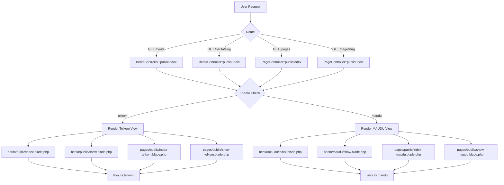

# Plan: Lengkapi Fitur Publik Tema MAUDU

> **Tanggal:** 2026-07-14
> **Tujuan:** Semua fitur publik yang tersedia di tema Telkom juga bisa diakses dengan tema MAUDU tanpa broken layout.

---

## Ringkasan Analisis

### Tema Telkom — Fitur Publik

| Fitur | Route | View | Layout |
|-------|-------|------|--------|
| Landing Page | `GET /` | `telkom.blade.php` | `layouts.telkom` |
| Berita Index | `GET /berita` | `berita/public/index.blade.php` | `layouts.telkom` |
| Berita Detail | `GET /berita/{slug}` | `berita/public/show.blade.php` | `layouts.telkom` |
| Pages Index | `GET /pages` | `pages/public/index-telkom.blade.php` | `layouts.telkom` |
| Pages Detail | `GET /page/{slug}` | `pages/public/show-telkom.blade.php` | `layouts.telkom` |
| Kegiatan | `GET /kegiatan` | `instagram/activities.blade.php` | `layouts.landing` |
| E-Lulus Check | `GET /check-graduation` | `public/elulus/check.blade.php` | `layouts.telkom` |
| E-Lulus Result | `POST /check-graduation` | `public/elulus/result.blade.php` | `layouts.telkom` |
| Testimonial Form | `GET /testimonial` | needs check | needs check |
| Header Nav | — | Profil, Akademik, Layanan, Berita, PPDB, Login | — |
| Footer | — | Berita, Kegiatan, E-Lulus, Pages links | — |
| Breadcrumb | — | `<x-telkom.breadcrumb />` | — |

### Tema MAUDU — Status Saat Ini

| Fitur | Status | Masalah |
|-------|--------|---------|
| Landing Page | ✅ OK | — |
| Berita Index | ❌ **Hardcoded Telkom** | View extends `layouts.telkom` |
| Berita Detail | ❌ **Hardcoded Telkom** | View extends `layouts.telkom` |
| Pages Index | ❌ **Hardcoded Telkom** | View = `pages.public.index-telkom` |
| Pages Detail | ❌ **Hardcoded Telkom** | View = `pages.public.show-telkom` |
| Kegiatan | ⚠️ Generic | Uses `layouts.landing` (bukan `layouts.maudu`) |
| E-Lulus Check | ❌ **Hardcoded Telkom** | View extends `layouts.telkom` |
| E-Lulus Result | ❌ **Hardcoded Telkom** | View extends `layouts.telkom` |
| Header Nav | ⚠️ **Broken** | Semua menu URL = `#`, tidak ada login button |
| Footer | ⚠️ **Broken** | Tautan Cepat semua `#`, tidak ada link real |
| Blog Component | ⚠️ **Broken** | Link ke `route('landing')` bukan detail berita |
| Events Component | ⚠️ **Broken** | Link ke `#` bukan detail event |
| Breadcrumb | ❌ **Tidak ada** | Tidak ada `<x-maudu.breadcrumb />` |

---

## Masalah Akar

1. **Controllers hardcoded ke Telkom** — `BeritaController` dan `PageController` tidak mengecek tema aktif saat merender view publik.

2. **Tidak ada view MAUDU untuk halaman publik** — Hanya ada versi Telkom dan versi generic (`layouts.landing`).

3. **Config menu MAUDU semua `#`** — Menu navigasi tidak memiliki URL real ke halaman publik.

4. **Component MAUDU tidak link ke halaman detail** — Blog link ke `route('landing')`, events link ke `#`.

5. **Tidak ada breadcrumb component untuk MAUDU** — Telkom punya `<x-telkom.breadcrumb />` tapi MAUDU tidak ada.

---

## Rencana Implementasi

### Fase 1: Theme-Aware Controllers

**Tujuan:** Controllers mendeteksi tema aktif dan render view yang sesuai.

#### 1.1 Update `BeritaController`

```php
// publicIndex() — ganti hardcoded view
private function themeView(string $telkom, string $maudu, string $generic = null): string
{
    $theme = config('app.default_theme', 'telkom');
    if ($theme === 'maudu') return $maudu;
    return $telkom;
}

public function publicIndex(Request $request)
{
    // ... query logic unchanged ...
    return view($this->themeView(
        'berita.public.index',
        'berita.maudu.index',
    ), compact('beritas', 'featured'));
}

public function publicShow(Page $berita)
{
    // ... logic unchanged ...
    return view($this->themeView(
        'berita.public.show',
        'berita.maudu.show',
    ), compact('berita', 'related'));
}
```

#### 1.2 Update `PageController`

```php
public function publicIndex(Request $request)
{
    // ... query logic unchanged ...
    return view($this->themeView(
        'pages.public.index-telkom',
        'pages.public.index-maudu',
    ), compact('pages', 'categories'));
}

public function publicShow($slug)
{
    // ... logic unchanged ...
    return view($this->themeView(
        'pages.public.show-telkom',
        'pages.public.show-maudu',
    ), compact('page'));
}
```

#### 1.3 Update `InstagramController` (Kegiatan)

```php
// index() — ganti hardcoded view
return view($this->themeView(
    'instagram.activities',
    'instagram.activities-maudu',
), $data);
```

#### 1.4 Update `KelulusanController` (E-Lulus)

```php
// publicCheckStatus() dan publicProcessCheck()
// Ganti view untuk check dan result
```

> **Catatan:** Method `themeView()` bisa di-trait atau di-helper agar bisa dipakai di semua controllers. Letakkan di `app/Helpers/ThemeHelper.php` sebagai function `theme_view(string $telkom, string $maudu)`.

---

### Fase 2: Buat View MAUDU untuk Halaman Publik

#### 2.1 `resources/views/berita/maudu/index.blade.php`

- Extend `layouts.maudu`
- Breadcrumb: `<x-maudu.breadcrumb />`
- Grid/list berita dengan styling MAUDU (Bootstrap-based, earth tones)
- Search bar
- Featured berita section
- Pagination

#### 2.2 `resources/views/berita/maudu/show.blade.php`

- Extend `layouts.maudu`
- Breadcrumb: `<x-maudu.breadcrumb />`
- Detail article layout (single column, centered)
- Featured image, meta info, content body
- Share buttons
- Related berita section

#### 2.3 `resources/views/pages/public/index-maudu.blade.php`

- Extend `layouts.maudu`
- Breadcrumb: `<x-maudu.breadcrumb />`
- Grid cards untuk pages
- Search & filter

#### 2.4 `resources/views/pages/public/show-maudu.blade.php`

- Extend `layouts.maudu`
- Breadcrumb: `<x-maudu.breadcrumb />`
- Article detail layout

#### 2.5 `resources/views/instagram/activities-maudu.blade.php`

- Extend `layouts.maudu`
- Instagram feed gallery dengan styling MAUDU

#### 2.6 `resources/views/public/elulus/check-maudu.blade.php`

- Extend `layouts.maudu`
- Form cek kelulusan

#### 2.7 `resources/views/public/elulus/result-maudu.blade.php`

- Extend `layouts.maudu`
- Hasil cek kelulusan

---

### Fase 3: Breadcrumb Component MAUDU

#### 3.1 Buat `resources/views/components/maudu/breadcrumb.blade.php`

```blade
@props([
    'title'  => '',
    'items'  => [],
])

<section class="breadcrumb-area" 
    style="background: linear-gradient(135deg, #1a5632 0%, #0d3d21 100%); 
           padding: 80px 0; position: relative; overflow: hidden;">
    <div class="container">
        <div class="row">
            <div class="col-lg-12">
                <div class="text-center">
                    <h2 style="color: #fff; font-size: 2.5rem; font-weight: 700; 
                               margin-bottom: 1rem; text-shadow: 0 2px 8px rgba(0,0,0,0.3);">
                        {{ $title }}
                    </h2>
                    <nav style="color: #ffffff; opacity: 0.95; font-size: 1rem;">
                        <a href="{{ route('landing') }}" 
                           style="color: #fff; text-decoration: none;">Home</a>
                        @foreach ($items as $item)
                            <span style="margin: 0 10px; opacity: 0.7;">/</span>
                            @if ($loop->last)
                                <span style="opacity: 0.95; font-weight: 500;">
                                    {{ $item['label'] }}
                                </span>
                            @else
                                <a href="{{ $item['url'] }}" 
                                   style="color: #fff; text-decoration: none;">
                                    {{ $item['label'] }}
                                </a>
                            @endif
                        @endforeach
                    </nav>
                </div>
            </div>
        </div>
    </div>
    <!-- Decorative shapes -->
    <div style="position: absolute; top: -50px; right: -50px; width: 200px; height: 200px; 
                background: rgba(255,255,255,0.05); border-radius: 50%;"></div>
    <div style="position: absolute; bottom: -30px; left: -30px; width: 150px; height: 150px; 
                background: rgba(255,255,255,0.05); border-radius: 50%;"></div>
</section>
```

> Warna hijau (`#1a5632`) disesuaikan dengan tema MAUDU. Perlu dicek warna primary di `config/themes/maudu.php` atau CSS.

---

### Fase 4: Fix Component MAUDU yang Broken

#### 4.1 Fix `resources/views/components/maudu/blog.blade.php`

**Masalah:** Line 39 dan 43 link ke `route('landing')` bukan ke detail berita.

**Perubahan:**
```blade
// Line 39: Ganti
<a href="{{ route('berita.public.show', $blog->slug) }}">
// Line 43: Ganti
<a href="{{ route('berita.public.show', $blog->slug) }}" class="read-more">
```

Untuk default blogs (fallback), link ke `route('berita.public.index')`.

#### 4.2 Fix `resources/views/components/maudu/events.blade.php`

**Masalah:** Line 32 dan 75 link ke `#`.

**Perubahan:** Events model `App\Models\Events` — perlu dicek apakah ada public show route. Jika belum ada, link ke section events di landing page atau buat route baru.

Opsi:
- **Opsi A:** Link ke `#event-maudu` (anchor di landing page) — simpler
- **Opsi B:** Buat route `/events/{event}` dengan detail page — lebih lengkap

> **Rekomendasi:** Opsi A dulu (anchor), Opsi B bisa di-plan berikutnya.

---

### Fase 5: Fix Navigasi Header MAUDU

#### 5.1 Update `config/themes/maudu.php` — Menu URLs

```php
'menu' => [
    [
        'label' => 'PROFIL',
        'url' => '#',
        'children' => [
            ['label' => 'Yayasan', 'url' => route('pages.public.show', 'profil-yayasan')],
            ['label' => 'MAUDU', 'url' => route('pages.public.show', 'profil-maudu')],
            ['label' => 'Prestasi Siswa', 'url' => route('pages.public.show', 'prestasi-siswa')],
            ['label' => 'Gallery', 'url' => route('public.kegiatan')],
        ],
    ],
    [
        'label' => 'AKADEMIK',
        'url' => '#',
        'children' => [
            ['label' => 'Tenaga Pendidik', 'url' => route('pages.public.show', 'tenaga-pendidik')],
            ['label' => 'Jurusan', 'url' => '#program-peminatan'],
            ['label' => 'Kalender Akademik', 'url' => '#'],
            ['label' => 'Ekstrakurikuler', 'url' => '#'],
        ],
    ],
    [
        'label' => 'LAYANAN PESERTA DIDIK',
        'url' => '#',
        'children' => [
            ['label' => 'E-Lulus', 'url' => route('public.graduation.check')],
            ['label' => 'E-Raport', 'url' => '#'],
            ['label' => 'E-OSIS', 'url' => '#'],
        ],
    ],
    [
        'label' => 'BERITA',
        'url' => route('berita.public.index'),
    ],
    [
        'label' => 'EVENT MAUDU',
        'url' => '#event-maudu',
    ],
],
```

> **Catatan:** Config file tidak bisa pakai `route()`. URL harus hardcode atau di-resolve di view. Solusi: simpan path saja di config, resolve di header component.

#### 5.2 Update Header MAUDU — Tambah Login Button

Di `resources/views/components/maudu/header.blade.php`, tambah tombol login seperti Telkom:

```blade
<div class="nav-right">
    <div class="nav-right-btn mt-2">
        @auth
            <a class="btn btn-primary" href="{{ route('admin.dashboard') }}">
                <i class="fas fa-tachometer-alt"></i> Dashboard
            </a>
        @else
            <a class="btn btn-outline-primary" href="{{ route('login') }}">
                <i class="fas fa-sign-in-alt"></i> Login
            </a>
        @endauth
        <a class="btn btn-primary ms-2" href="{{ theme_config('ppdb_url', '#') }}" target="_blank">
            DAFTAR
        </a>
    </div>
</div>
```

---

### Fase 6: Fix Footer MAUDU

#### 6.1 Update `resources/views/components/maudu/footer.blade.php`

Ganti link `#` dengan route real:

```blade
{{-- Quick Links --}}
<ul class="footer-list">
    <li><a href="{{ route('landing') }}">Beranda</a></li>
    <li><a href="{{ route('pages.public.show', 'profil-maudu') }}">Profil</a></li>
    <li><a href="{{ route('berita.public.index') }}">Berita</a></li>
    <li><a href="{{ route('public.kegiatan') }}">Kegiatan</a></li>
    <li><a href="{{ route('public.graduation.check') }}">E-Lulus</a></li>
</ul>

{{-- Layanan --}}
<ul class="footer-list">
    <li><a href="{{ route('public.graduation.check') }}">E-Lulus</a></li>
    <li><a href="#">E-Raport</a></li>
    <li><a href="#">E-OSIS</a></li>
</ul>
```

---

## Diagram Alur Theme-Aware Rendering



---

## Checklist File yang Perlu Dibuat/Diubah

### File Baru (Dibuat)

| # | File | Deskripsi |
|---|------|-----------|
| 1 | `resources/views/berita/maudu/index.blade.php` | Berita list untuk MAUDU |
| 2 | `resources/views/berita/maudu/show.blade.php` | Berita detail untuk MAUDU |
| 3 | `resources/views/pages/public/index-maudu.blade.php` | Pages list untuk MAUDU |
| 4 | `resources/views/pages/public/show-maudu.blade.php` | Pages detail untuk MAUDU |
| 5 | `resources/views/components/maudu/breadcrumb.blade.php` | Breadcrumb component |
| 6 | `resources/views/instagram/activities-maudu.blade.php` | Kegiatan untuk MAUDU |
| 7 | `resources/views/public/elulus/check-maudu.blade.php` | E-Lulus check untuk MAUDU |
| 8 | `resources/views/public/elulus/result-maudu.blade.php` | E-Lulus result untuk MAUDU |

### File yang Diubah

| # | File | Perubahan |
|---|------|-----------|
| 1 | `app/Http/Controllers/BeritaController.php` | Tambah theme-aware view rendering |
| 2 | `app/Http/Controllers/PageController.php` | Tambah theme-aware view rendering |
| 3 | `app/Http/Controllers/InstagramController.php` | Tambah theme-aware view rendering |
| 4 | `app/Http/Controllers/KelulusanController.php` | Tambah theme-aware view rendering untuk public check/result |
| 5 | `resources/views/components/maudu/blog.blade.php` | Fix links ke detail berita |
| 6 | `resources/views/components/maudu/events.blade.php` | Fix links ke section/anchor |
| 7 | `resources/views/components/maudu/header.blade.php` | Tambah login button + fix menu URLs |
| 8 | `resources/views/components/maudu/footer.blade.php` | Fix link ke halaman publik real |
| 9 | `app/Helpers/ThemeHelper.php` | Tambah `theme_view()` helper function |

---

## Urutan Eksekusi

1. **Helper Function** — Tambah `theme_view()` di ThemeHelper
2. **Controllers** — Update 4 controllers (Berita, Page, Instagram, Kelulusan)
3. **Breadcrumb Component** — Buat `<x-maudu.breadcrumb />`
4. **View Berita MAUDU** — Buat index dan show
5. **View Pages MAUDU** — Buat index dan show
6. **View Kegiatan MAUDU** — Buat activities-maudu
7. **View E-Lulus MAUDU** — Buat check-maudu dan result-maudu
8. **Fix Blog Component** — Update link di blog.blade.php
9. **Fix Events Component** — Update link di events.blade.php
10. **Fix Header** — Tambah login button, fix menu URLs
11. **Fix Footer** — Fix semua link ke halaman publik real
12. **Testing** — Set `DEFAULT_THEME=maudu` di .env, test semua rute

---

## Catatan Penting

1. **Route names tetap sama** — Tidak perlu buat route baru. Yang berubah hanya view yang di-render.

2. **`theme_view()` pattern** — Helper ini akan mengecek `config('app.default_theme')` dan return view name yang sesuai. Pattern ini bisa dipakai di semua controllers.

3. **CSS/Assets** — Semua view MAUDU harus pakai assets dari `public/assets_maudu/` dan styling yang konsisten dengan tema MAUDU (earth tones, hijau).

4. **Fallback** — Jika halaman publik belum dibuat di admin (misalnya profil yayasan), tetap tampilkan 404 atau placeholder yang sesuai tema.

5. **Test dual-theme** — Setelah selesai, test dengan `DEFAULT_THEME=telkom` dan `DEFAULT_THEME=maudu` untuk memastikan kedua tema berfungsi.
