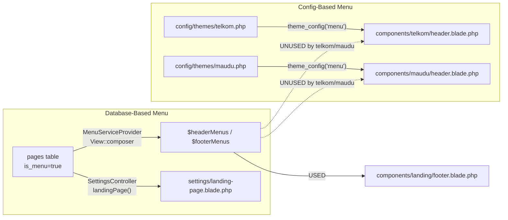
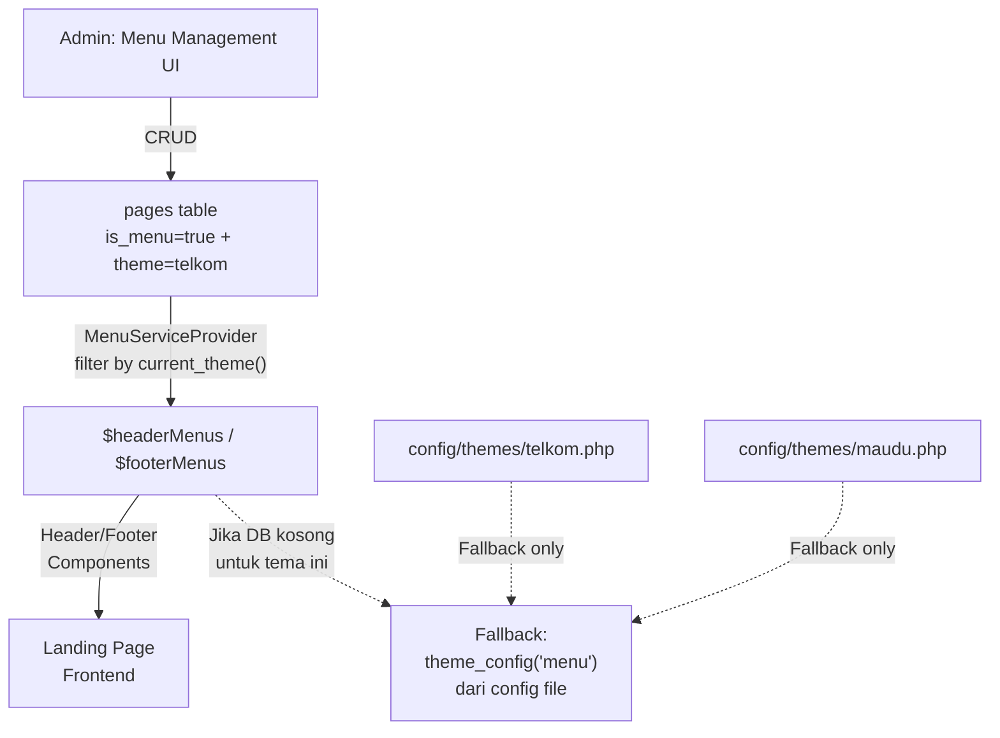
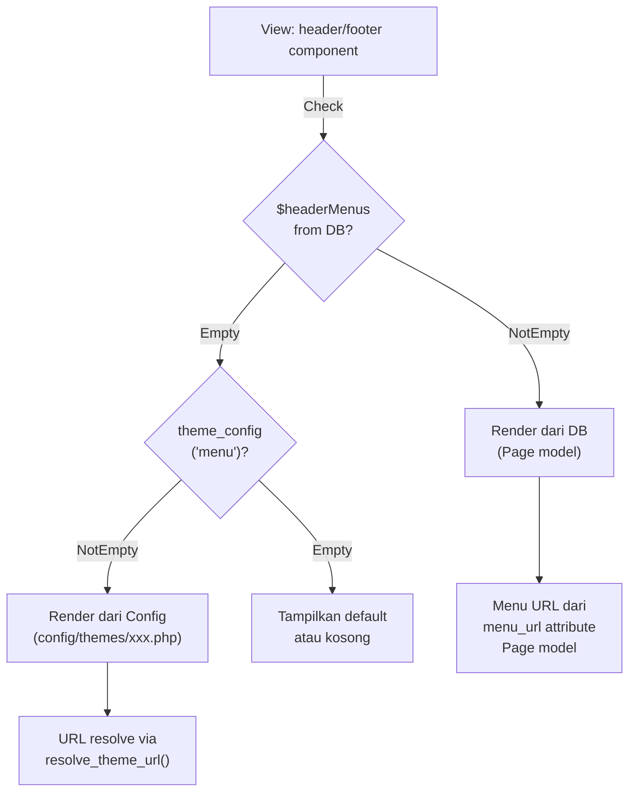
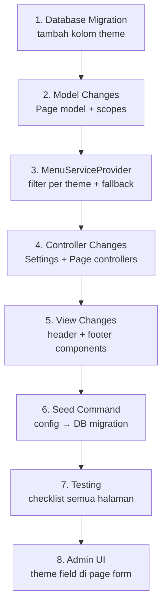

# Rencana Arsitektur: Integrasi Pages/Menu Management dengan Theme System

> **Status**: Draft
> **Dibuat**: 2026-09-29
> **Tujuan**: Menghubungkan dua sistem menu yang berjalan paralel (config-based & database-based) sehingga admin bisa mengelola menu landing page dari admin panel, per tema.

---

## 📊 Analisis Kondisi Saat Ini

### Dua Sistem Menu yang Tidak Terhubung



### Masalah Utama

| # | Masalah | Dampak |
|---|---------|--------|
| 1 | Header components (`telkom/`, `maudu/`) baca dari `theme_config('menu')`, bukan DB | Admin tidak bisa mengubah menu dari admin panel |
| 2 | Footer components (`telkom/`, `maudu/`) hardcoded atau dari config | Footer tidak bisa di-custom dari admin |
| 3 | `SettingsController::landingPage()` query pages TANPA filter theme | Semua menu dari semua tema ditampilkan bersamaan |
| 4 | Tabel `pages` TIDAK ada kolom `theme` | Tidak bisa membedakan menu per tema |
| 5 | `MenuServiceProvider` sudah share `$headerMenus`/`$footerMenus` tapi TIDAK difilter per theme | Data yang di-share tidak relevan untuk tema aktif |

### File-File Kunci

| File | Peran | Status |
|------|-------|--------|
| [`app/Models/Page.php`](app/Models/Page.php) | Model Page, sudah punya menu fields | ⚠️ Perlu tambah `theme` scope |
| [`app/Providers/MenuServiceProvider.php`](app/Providers/MenuServiceProvider.php) | Share menu ke semua view | ⚠️ Perlu filter per theme |
| [`app/Http/Controllers/SettingsController.php`](app/Http/Controllers/SettingsController.php:51) | Admin landing page settings | ⚠️ Perlu filter per theme |
| [`app/Http/Controllers/PageController.php`](app/Http/Controllers/PageController.php) | CRUD pages | ⚠️ Perlu set theme saat create/edit |
| [`app/Http/Controllers/LandingController.php`](app/Http/Controllers/LandingController.php) | Landing page controller | ✅ Sudah generic |
| [`resources/views/components/telkom/header.blade.php`](resources/views/components/telkom/header.blade.php:81) | Header telkom | ❌ Baca dari config, bukan DB |
| [`resources/views/components/maudu/header.blade.php`](resources/views/components/maudu/header.blade.php:75) | Header maudu | ❌ Baca dari config, bukan DB |
| [`resources/views/components/telkom/footer.blade.php`](resources/views/components/telkom/footer.blade.php) | Footer telkom | ❌ Hardcoded/config |
| [`resources/views/components/maudu/footer.blade.php`](resources/views/components/maudu/footer.blade.php) | Footer maudu | ❌ Hardcoded/config |
| [`resources/views/components/landing/footer.blade.php`](resources/views/components/landing/footer.blade.php:40) | Footer generic | ✅ Sudah pakai DB `$footerMenus` |
| [`config/themes/telkom.php`](config/themes/telkom.php:139) | Menu config telkom | 🔄 Akan jadi fallback |
| [`config/themes/maudu.php`](config/themes/maudu.php:174) | Menu config maudu | 🔄 Akan jadi fallback |

---

## 🏗 Arsitektur Target

### Flow Diagram



### Prinsip Desain

1. **Database First, Config as Fallback** — Menu dari DB diprioritaskan; config file jadi fallback jika DB kosong
2. **Theme-Aware** — Setiap menu item di DB punya asosiasi tema (`theme` column)
3. **Backward Compatible** — Config files TIDAK dihapus; header/footer components punya fallback ke config
4. **Cache-Friendly** — Menu cache per tema (`header_menus_{theme}`, `footer_menus_{theme}`)
5. **Single Source of Truth** — `MenuServiceProvider` jadi satu-satunya sumber data menu untuk views

---

## 📋 Rencana Implementasi

### Fase 1: Database Changes

#### 1.1 Migration: Tambah kolom `theme` ke tabel `pages`

```php
// database/migrations/2026_09_29_000000_add_theme_to_pages_table.php
Schema::table('pages', function (Blueprint $table) {
    $table->string('theme')->nullable()->after('menu_position')
        ->comment('Associated theme: null=global, telkom, maudu, etc.');
    $table->index(['theme', 'is_menu', 'menu_position']);
});
```

**Desain Kolom:**
- `theme` — nullable string
  - `null` = global (berlaku untuk semua tema)
  - `'telkom'` = hanya untuk tema telkom
  - `'maudu'` = hanya untuk tema maudu
  - value lain = untuk tema baru yang akan ditambahkan

**Mengapa nullable?**
- Pages yang bukan menu (`is_menu=false`) tidak perlu asosiasi tema
- Pages global (konten seperti "Tentang Kami") bisa digunakan di semua tema
- Backward compatible dengan data existing

#### 1.2 (Opsional) Migration: Tambah kolom `theme_sort_order`

Kolom `menu_sort_order` sudah ada. Tidak perlu kolom tambahan karena sort order sudah per-item. Namun jika diperlukan sort order PER THEME, bisa ditambahkan nanti sebagai enhancement.

**Keputusan**: Tidak tambah kolom `theme_sort_order` untuk sekarang. `menu_sort_order` sudah cukup.

---

### Fase 2: Model Changes

#### 2.1 Update [`Page`](app/Models/Page.php) Model

```php
// Tambah ke $fillable
'theme',

// Tambah scope
public function scopeForTheme($query, ?string $theme = null)
{
    if ($theme === null) {
        $theme = current_theme();
    }
    return $query->where(function ($q) use ($theme) {
        $q->where('theme', $theme)
          ->orWhereNull('theme'); // global menus
    });
}

// Update scopeMenu untuk include theme filter
public function scopeMenuForTheme($query, ?string $theme = null)
{
    return $query->menu()->forTheme($theme);
}
```

#### 2.2 (Opsional) Buat Menu Service Class

```php
// app/Services/MenuService.php
class MenuService
{
    /**
     * Get header menus for current theme with config fallback.
     */
    public function getHeaderMenus(): Collection
    {
        $theme = current_theme();
        
        $dbMenus = Page::menuForTheme($theme)
            ->menuPosition('header')
            ->mainMenu()
            ->orderBy('menu_sort_order')
            ->with('children')
            ->get();
        
        if ($dbMenus->isNotEmpty()) {
            return $dbMenus;
        }
        
        // Fallback: convert config menu to Collection of Page-like objects
        return $this->configToCollection('menu', 'header');
    }
    
    /**
     * Get footer menus for current theme with config fallback.
     */
    public function getFooterMenus(): Collection
    {
        $theme = current_theme();
        
        $dbMenus = Page::menuForTheme($theme)
            ->menuPosition('footer')
            ->mainMenu()
            ->orderBy('menu_sort_order')
            ->with('children')
            ->get();
        
        if ($dbMenus->isNotEmpty()) {
            return $dbMenus;
        }
        
        // Fallback: use related_links from config
        return $this->configToCollection('related_links', 'footer');
    }
}
```

**Keputusan**: Untuk fase ini, cukup update `MenuServiceProvider` langsung tanpa service class terpisah. Service class bisa ditambahkan sebagai enhancement di fase berikutnya.

---

### Fase 3: Provider Changes

#### 3.1 Update [`MenuServiceProvider`](app/Providers/MenuServiceProvider.php)

**Perubahan Utama:**
1. Filter menu berdasarkan `current_theme()`
2. Tambah fallback ke config jika DB kosong
3. Cache per tema

```php
public function boot(): void
{
    View::composer(['*'], function ($view) {
        try {
            $theme = current_theme();
            
            // Cache per theme
            $headerMenus = cache()->remember(
                "header_menus_{$theme}", 
                3600, 
                fn() => $this->getHeaderMenus($theme)
            );
            
            $footerMenus = cache()->remember(
                "footer_menus_{$theme}", 
                3600, 
                fn() => $this->getFooterMenus($theme)
            );
            
            $view->with([
                'headerMenus' => $headerMenus,
                'footerMenus' => $footerMenus,
            ]);
        } catch (\Exception $e) {
            $view->with([
                'headerMenus' => collect(),
                'footerMenus' => collect(),
            ]);
        }
    });
}

private function getHeaderMenus(string $theme): Collection
{
    $dbMenus = Page::menu()
        ->where(function ($q) use ($theme) {
            $q->where('theme', $theme)->orWhereNull('theme');
        })
        ->menuPosition('header')
        ->mainMenu()
        ->orderBy('menu_sort_order')
        ->with('children')
        ->get();
    
    return $dbMenus->isNotEmpty() ? $dbMenus : collect();
}

private function getFooterMenus(string $theme): Collection
{
    $dbMenus = Page::menu()
        ->where(function ($q) use ($theme) {
            $q->where('theme', $theme)->orWhereNull('theme');
        })
        ->menuPosition('footer')
        ->mainMenu()
        ->orderBy('menu_sort_order')
        ->with('children')
        ->get();
    
    return $dbMenus->isNotEmpty() ? $dbMenus : collect();
}
```

**Cache Invalidation:**
- Saat create/update/delete menu page → `cache()->forget("header_menus_{$theme}")` dan `cache()->forget("footer_menus_{$theme}")`
- Sudah ada di [`PageController`](app/Http/Controllers/PageController.php:198) (line 198-199)

---

### Fase 4: View Changes — HEADER

#### 4.1 Update [`components/telkom/header.blade.php`](resources/views/components/telkom/header.blade.php:80)

**Strategi: DB First, Config Fallback**

Ganti blok menu (line 80-101) dari:
```blade
@foreach (theme_config('menu', []) as $item)
```

Menjadi:
```blade
@php
    $menuItems = $headerMenus->isNotEmpty() 
        ? $headerMenus 
        : [];
    $configMenu = !$headerMenus->isNotEmpty() 
        ? theme_config('menu', []) 
        : [];
@endphp

@if ($menuItems->count() > 0)
    {{-- Database menus --}}
    @foreach ($menuItems as $item)
        @if ($item->children->count() > 0)
            <li class="menu-item-has-children">
                <a href="{{ $item->menu_url }}">
                    {{ $item->menu_title }} +
                </a>
                <ul class="sub-menu">
                    @foreach ($item->children as $child)
                        <li>
                            <a href="{{ $child->menu_url }}"
                               @if($child->menu_target_blank) target="_blank" @endif>
                                {{ $child->menu_title }}
                            </a>
                        </li>
                    @endforeach
                </ul>
            </li>
        @else
            <li class="menu-item-has">
                <a href="{{ $item->menu_url }}"
                   @if($item->menu_target_blank) target="_blank" @endif>
                    {{ $item->menu_title }}
                </a>
            </li>
        @endif
    @endforeach
@elseif (count($configMenu) > 0)
    {{-- Config fallback --}}
    @foreach ($configMenu as $item)
        @if (isset($item['children']) && count($item['children']) > 0)
            <li class="menu-item-has-children">
                <a href="{{ resolve_theme_url($item['url'] ?? '#') }}">
                    {{ $item['label'] }} +
                </a>
                <ul class="sub-menu">
                    @foreach ($item['children'] as $child)
                        <li>
                            <a href="{{ resolve_theme_url($child['url'] ?? '#') }}">
                                {{ $child['label'] }}
                            </a>
                        </li>
                    @endforeach
                </ul>
            </li>
        @else
            <li class="menu-item-has">
                <a href="{{ resolve_theme_url($item['url'] ?? '#') }}"
                   @if (($item['target'] ?? '') === '_blank') target="_blank" @endif>
                    {{ $item['label'] }}
                </a>
            </li>
        @endif
    @endforeach
@endif
```

#### 4.2 Update [`components/maudu/header.blade.php`](resources/views/components/maudu/header.blade.php:74)

Sama seperti telkom — ganti blok menu (line 74-97) dengan pola yang sama (DB first, config fallback), sesuaikan CSS classes Bootstrap 5.

#### 4.3 Extract Menu Rendering ke Blade Component (Optional Enhancement)

Buat reusable component:
```blade
{{-- resources/views/components/shared/menu-renderer.blade.php --}}
@props(['items' => collect(), 'configMenu' => [], 'position' => 'header'])

@if ($items->count() > 0)
    @foreach ($items as $item)
        {{-- Render DB menu item --}}
    @endforeach
@elseif (count($configMenu) > 0)
    @foreach ($configMenu as $item)
        {{-- Render config menu item --}}
    @endforeach
@endif
```

**Keputusan**: Untuk fase ini, render langsung di header component masing-masing tema. Extract ke shared component bisa dilakukan sebagai cleanup di fase berikutnya.

---

### Fase 5: View Changes — FOOTER

#### 5.1 Update [`components/telkom/footer.blade.php`](resources/views/components/telkom/footer.blade.php)

Footer telkom saat ini:
- Column 1: Jurusan (dari config) → **Tetap dari config** (bukan menu)
- Column 2: Link Terkait (dari config `related_links`) → **Ubah ke DB `$footerMenus`** dengan fallback ke config
- Column 3: Address/Contact → **Tetap dari `$siteSettings`/`theme_config`**

```blade
{{-- Column 2: Dynamic footer menus --}}
<div class="col-lg-4 col-md-12 col-sm-12 footer-widget md-mb-50">
    @if ($footerMenus->count() > 0)
        @foreach ($footerMenus as $menu)
            <h4 class="widget-title">{{ $menu->menu_title }}</h4>
            <ul class="site-map">
                @if ($menu->children->count() > 0)
                    @foreach ($menu->children as $submenu)
                        <li>
                            <a href="{{ $submenu->menu_url }}"
                               @if($submenu->menu_target_blank) target="_blank" @endif>
                                {{ $submenu->menu_title }}
                            </a>
                        </li>
                    @endforeach
                @else
                    <li>
                        <a href="{{ $menu->menu_url }}"
                           @if($menu->menu_target_blank) target="_blank" @endif>
                            {{ $menu->menu_title }}
                        </a>
                    </li>
                @endif
            </ul>
        @endforeach
    @else
        {{-- Config fallback --}}
        <h4 class="widget-title">Link Terkait</h4>
        <ul class="site-map">
            @foreach(theme_config('related_links', []) as $link)
                <li>
                    <a href="{{ resolve_theme_url($link['url'] ?? '#') }}">
                        {{ $link['label'] ?? '' }}
                    </a>
                </li>
            @endforeach
        </ul>
    @endif
</div>
```

#### 5.2 Update [`components/maudu/footer.blade.php`](resources/views/components/maudu/footer.blade.php)

Sama — ganti hardcoded sections dengan DB menus + fallback. Yang perlu diubah:
- "Link Terkait" section (line 39-55) → DB `$footerMenus` dengan fallback ke `theme_config('related_links')`
- "Madrasah Corner" section (line 58-70) → bisa juga jadi DB menu, atau tetap hardcoded

**Keputusan**: "Link Terkait" pakai DB. "Madrasah Corner" tetap hardcoded (karena bukan page-based menu).

---

### Fase 6: Controller Changes

#### 6.1 Update [`SettingsController::landingPage()`](app/Http/Controllers/SettingsController.php:51)

Filter pages berdasarkan tema aktif:

```php
public function landingPage(Request $request)
{
    $availableThemes = ThemeSetting::getRegisteredThemes();
    if ($request->has('theme') && array_key_exists($request->theme, $availableThemes)) {
        session(['admin_theme_override' => $request->theme]);
    }

    $theme = current_theme();

    // ⭐ Filter by active theme
    $pages = Page::where('is_menu', true)
        ->where(function ($query) use ($theme) {
            $query->where('theme', $theme)
                  ->orWhereNull('theme');
        })
        ->with('children')
        ->orderBy('menu_sort_order')
        ->get();

    $headerMenus = $pages->where('menu_position', 'header')->whereNull('parent_id');
    $footerMenus = $pages->where('menu_position', 'footer')->whereNull('parent_id');

    $settings = theme_config() ?: [];

    return view('settings.landing-page', compact(
        'pages', 'headerMenus', 'footerMenus',
        'settings', 'availableThemes'
    ));
}
```

#### 6.2 Update [`PageController::store()`](app/Http/Controllers/PageController.php:102) & `update()`

Tambah field `theme` ke validation dan data:

```php
// Di store() dan update() validation rules:
'theme' => 'nullable|string|max:50',

// Di data preparation:
$data['theme'] = $request->theme ?: current_theme();
```

#### 6.3 Update Page Create/Edit View

Tambah dropdown/select theme di form create/edit page:

```blade
<div>
    <label for="theme" class="block text-sm font-medium text-gray-700 mb-2">
        Theme
    </label>
    <select id="theme" name="theme" class="...">
        <option value="">Global (Semua Tema)</option>
        @foreach(available_themes() as $themeSlug => $themeName)
            <option value="{{ $themeSlug }}" 
                {{ old('theme', $page->theme ?? '') === $themeSlug ? 'selected' : '' }}>
                {{ $themeName }}
            </option>
        @endforeach
    </select>
    <p class="text-xs text-gray-500 mt-1">
        Pilih tema spesifik atau biarkan kosong untuk global.
    </p>
</div>
```

---

### Fase 7: Data Migration (Seed Config → DB)

#### 7.1 Artisan Command: Seed Menu dari Config

```php
// app/Console/Commands/SeedThemeMenus.php
class SeedThemeMenus extends Command
{
    protected $signature = 'theme:seed-menus {--theme=} {--force}';
    
    public function handle()
    {
        $themes = $this->option('theme') 
            ? [$this->option('theme')] 
            : available_themes();
        
        foreach ($themes as $theme) {
            $this->info("Seeding menus for theme: {$theme}");
            
            $config = config("themes.{$theme}", []);
            $menuItems = $config['menu'] ?? [];
            
            foreach ($menuItems as $index => $item) {
                $this->createMenuPage($item, $theme, $index, null);
            }
        }
        
        // Clear menu caches
        foreach ($themes as $theme) {
            cache()->forget("header_menus_{$theme}");
        }
        
        $this->info('Done!');
    }
    
    private function createMenuPage(array $item, string $theme, int $sortOrder, ?int $parentId): Page
    {
        // Resolve URL
        $url = $item['url'] ?? '#';
        if (str_starts_with($url, 'route:')) {
            // Keep as menu_url for route resolution
            $menuUrl = $url;
        } else {
            $menuUrl = $url;
        }
        
        $page = Page::updateOrCreate(
            ['slug' => Str::slug($item['label'] ?? 'menu-' . $sortOrder)],
            [
                'title' => $item['label'] ?? 'Menu',
                'content' => '',
                'status' => 'published',
                'published_at' => now(),
                'user_id' => 1,
                'is_menu' => true,
                'theme' => $theme,
                'menu_title' => $item['label'] ?? '',
                'menu_position' => 'header',
                'menu_url' => $menuUrl,
                'menu_sort_order' => $sortOrder,
                'parent_id' => $parentId,
                'menu_target_blank' => ($item['target'] ?? '') === '_blank',
            ]
        );
        
        // Create children
        if (!empty($item['children'])) {
            foreach ($item['children'] as $childIndex => $child) {
                $this->createMenuPage($child, $theme, $childIndex, $page->id);
            }
        }
        
        return $page;
    }
}
```

**Catatan Penting:**
- Seeding TIDAK menghapus config files — config tetap jadi fallback
- Menu items dari config yang sudah di-seed ke DB akan ditampilkan dari DB
- Jika DB dihapus/kosong, otomatis fallback ke config

---

### Fase 8: Admin UI Improvements

#### 8.1 Tab Per Tema di Menu Management

Sudah ada theme switcher di [`settings/landing-page.blade.php`](resources/views/settings/landing-page.blade.php:21) (line 21-39). Menu Management section perlu menampilkan hanya menu untuk tema aktif (sudah ditangani oleh controller filter di Fase 6.1).

#### 8.2 (Opsional) Drag-and-Drop Ordering

Bisa menggunakan library seperti `SortableJS` untuk drag-and-drop reordering menu items. Ini enhancement untuk fase berikutnya.

**Keputusan**: Tidak di fase ini. Fokus integrasi dulu.

---

## 📁 Daftar File yang Perlu Diubah/Dibuat

### Diubah

| # | File | Perubahan |
|---|------|-----------|
| 1 | [`database/migrations/2026_09_29_000000_add_theme_to_pages_table.php`](database/migrations/2026_09_29_000000_add_theme_to_pages_table.php) | **BARU** — Tambah kolom `theme` |
| 2 | [`app/Models/Page.php`](app/Models/Page.php) | Tambah `theme` ke `$fillable`, tambah scope `forTheme()` |
| 3 | [`app/Providers/MenuServiceProvider.php`](app/Providers/MenuServiceProvider.php) | Filter per theme, tambah fallback ke config |
| 4 | [`app/Http/Controllers/SettingsController.php`](app/Http/Controllers/SettingsController.php:51) | Filter pages per theme di `landingPage()` |
| 5 | [`app/Http/Controllers/PageController.php`](app/Http/Controllers/PageController.php) | Tambah `theme` ke validation & data di `store()`/`update()` |
| 6 | [`resources/views/components/telkom/header.blade.php`](resources/views/components/telkom/header.blade.php:80) | Ganti `theme_config('menu')` → DB menus + config fallback |
| 7 | [`resources/views/components/maudu/header.blade.php`](resources/views/components/maudu/header.blade.php:74) | Ganti `theme_config('menu')` → DB menus + config fallback |
| 8 | [`resources/views/components/telkom/footer.blade.php`](resources/views/components/telkom/footer.blade.php:14) | Ganti hardcoded → DB `$footerMenus` + config fallback |
| 9 | [`resources/views/components/maudu/footer.blade.php`](resources/views/components/maudu/footer.blade.php:39) | Ganti hardcoded → DB `$footerMenus` + config fallback |
| 10 | Views create/edit page (pages.create, pages.edit) | Tambah field `theme` selector |

### Dibuat Baru

| # | File | Deskripsi |
|---|------|-----------|
| 1 | [`app/Console/Commands/SeedThemeMenus.php`](app/Console/Commands/SeedThemeMenus.php) | Command untuk seed menu dari config ke DB |

### TIDAK Diubah

| # | File | Alasan |
|---|------|--------|
| 1 | [`config/themes/telkom.php`](config/themes/telkom.php) | Tetap jadi fallback |
| 2 | [`config/themes/maudu.php`](config/themes/maudu.php) | Tetap jadi fallback |
| 3 | [`app/Http/Controllers/LandingController.php`](app/Http/Controllers/LandingController.php) | Sudah generic |
| 4 | [`app/Helpers/ThemeHelper.php`](app/Helpers/ThemeHelper.php) | Tidak perlu perubahan |

---

## 🔄 Flow Diagram: Menu Resolution



---

## ⚠️ Risk Assessment & Mitigasi

| # | Risiko | Probabilitas | Dampak | Mitigasi |
|---|--------|-------------|--------|----------|
| 1 | **Breaking change di header/footer** — menu tidak tampil setelah integrasi | Sedang | Tinggi | Config fallback selalu tersedia; test dengan DB kosong |
| 2 | **Cache stale** — menu lama tampil setelah update | Rendah | Sedang | Cache key per tema (`header_menus_{theme}`); clear saat CRUD |
| 3 | **URL tidak match** — menu DB punya URL berbeda dari config | Sedang | Sedang | Seed command harus resolve URL dengan benar (`resolve_theme_url`) |
| 4 | **Performance** — query DB tambahan untuk menu | Rendah | Rendah | Sudah di-cache 1 jam di `MenuServiceProvider` |
| 5 | **Data inconsistency** — admin edit menu di DB tapi config masih lama | Rendah | Rendah | Config hanya fallback; DB adalah source of truth |
| 6 | **Theme switching** — menu tidak update saat switch theme di admin | Rendah | Sedang | Cache key include theme slug |

### Mitigasi Utama: Config Fallback

Prinsip **"DB First, Config as Fallback"** memastikan:
- Jika DB kosong → otomatis tampil menu dari config (seperti sekarang)
- Jika DB ada data → tampil menu dari DB
- Config files TIDAK pernah dihapus atau dimodifikasi
- Rollback mudah: cukup hapus menu items dari DB

---

## 📋 Urutan Implementasi



### Detail Per Fase

| Fase | Deskripsi | File yang Diubah | Dependencies |
|------|-----------|-----------------|--------------|
| **1** | Database migration | 1 migration file | Tidak ada |
| **2** | Model changes | `Page.php` | Fase 1 |
| **3** | Provider changes | `MenuServiceProvider.php` | Fase 2 |
| **4** | Controller changes | `SettingsController.php`, `PageController.php` | Fase 2 |
| **5** | View changes | 4 header/footer files | Fase 3 |
| **6** | Seed command | 1 command file | Fase 1-2 |
| **7** | Testing | - | Fase 1-6 |
| **8** | Admin UI | Page create/edit views, landing-page view | Fase 4 |

---

## 🧪 Testing Checklist

- [ ] Landing page telkom (`GET /telkom`) — menu tampil dari DB
- [ ] Landing page maudu (`GET /maudu`) — menu tampil dari DB
- [ ] Landing page default (`GET /`) — menu tampil sesuai DEFAULT_THEME
- [ ] Admin Menu Management (`/admin/settings/landing-page`) — filter per tema
- [ ] Admin Menu Management switch tema — menu berubah sesuai tema
- [ ] Create page with menu (header) — muncul di landing page
- [ ] Create page with menu (footer) — muncul di footer
- [ ] Edit menu item — perubahan langsung terlihat (setelah cache clear)
- [ ] Delete menu item — hilang dari landing page
- [ ] **Fallback test**: Kosongkan semua menu di DB → config fallback aktif
- [ ] **Global menu test**: Buat menu tanpa theme → muncul di semua tema
- [ ] Berita index (`GET /berita`) — tidak terpengaruh
- [ ] Pages public (`GET /pages`) — tidak terpengaruh
- [ ] E-Lulus check (`GET /check-graduation`) — tidak terpengaruh
- [ ] Responsive design — menu mobile berfungsi
- [ ] Canvas menu (telkom) — menu tampil
- [ ] Mobile navbar (maudu) — menu tampil

---

## 🔮 Enhancements (Fase Berikutnya)

1. **Drag-and-drop ordering** — SortableJS untuk reorder menu items
2. **Menu preview** — Live preview menu saat edit di admin
3. **Mega menu support** — Multi-level dropdown
4. **Menu visibility rules** — Show/hide menu based on auth, date, etc.
5. **Shared menu items** — Menu yang sama di beberapa tema
6. **Menu analytics** — Track menu click rates
