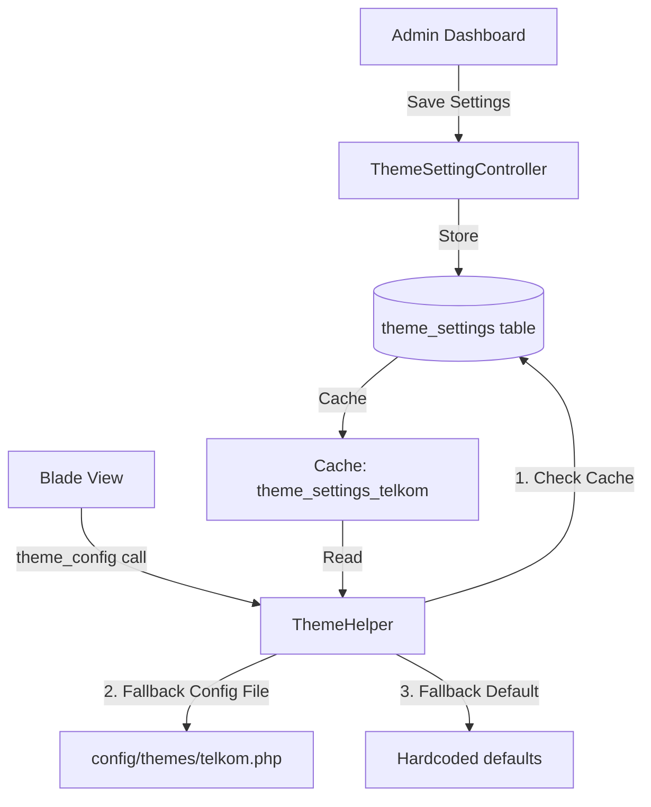
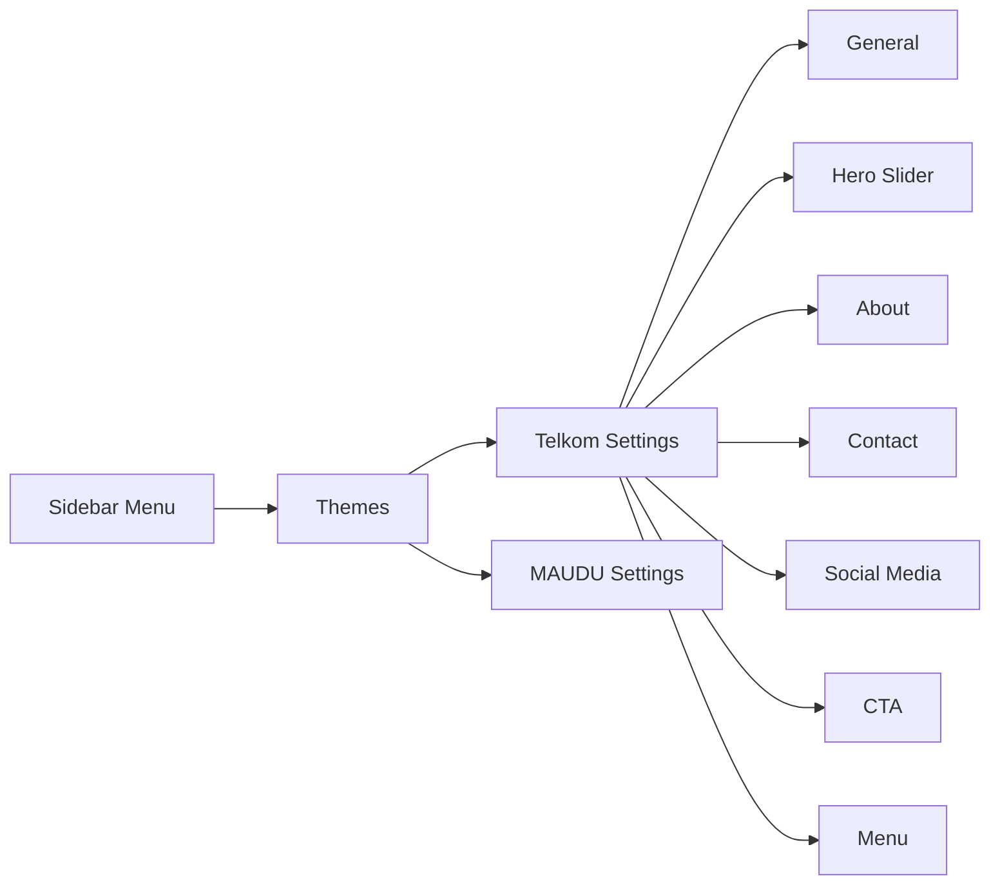

# Rencana: Database Multi-Theme Settings

## Overview

Membuat sistem pengaturan tema yang fleksibel dan dinamis menggunakan database.
Data disimpan di tabel `theme_settings` dengan struktur key-value per tema.
Bisa ditambah tema baru tanpa membuat config file baru.

## Mekanisme



## Database Schema

### Tabel: `theme_settings`

| Kolom | Type | Notes |
|-------|------|-------|
| id | bigint PK | Auto increment |
| theme | string, index | 'telkom', 'maudu', etc. |
| key | string | 'site_name', 'logo', 'cta_title', etc. |
| value | text, nullable | Serialized value (string, json, etc.) |
| type | string | 'text', 'textarea', 'image', 'json', 'url', 'color' |
| group_name | string | 'general', 'hero', 'about', 'contact', 'social', 'cta', 'menu' |
| sort_order | integer | Urutan tampil di form |
| created_at | timestamp | |
| updated_at | timestamp | |

**Unique constraint**: (theme, key)

### Migration File
`2026_07_13_000000_create_theme_settings_table.php`

## Model: `ThemeSetting`

```php
class ThemeSetting extends Model
{
    protected $fillable = ['theme', 'key', 'value', 'type', 'group_name', 'sort_order'];
    
    // Scope: getByTheme
    // Scope: getByGroup
    // Static: getThemeConfig(string $theme) → array
    // Static: saveThemeConfig(string $theme, array $data)
    // Static: seedDefaults(string $theme) → void
}
```

## Updated ThemeHelper

```php
function theme_config($key = null, $default = null)
{
    $theme = config('app.default_theme', 'telkom');
    
    // 1. Check database cache
    $dbConfig = cache("theme_settings_{$theme}");
    if (!$dbConfig) {
        $dbConfig = ThemeSetting::getThemeConfig($theme);
        cache(["theme_settings_{$theme}" => $dbConfig], 3600);
    }
    
    // 2. Merge with config file (config file = fallback defaults)
    $fileConfig = config("themes.{$theme}", []);
    $merged = array_merge($fileConfig, $dbConfig);
    
    // 3. Return value
    if ($key === null) return $merged;
    // ... dot-notation access
}
```

**Prioritas**: Database > Config File > Hardcoded Default

## Controller: `ThemeSettingController`

### Routes
```
GET    admin/themes                    → index (list semua tema)
GET    admin/themes/{theme}/settings   → edit (form settings per tema)
POST   admin/themes/{theme}/settings   → update (simpan settings)
POST   admin/themes/{theme}/seed       → seedDefaults (isi default dari config file)
DELETE admin/themes/{theme}/settings/{id} → destroy (hapus setting)
```

### Methods
- `index()` — List semua tema yang terdaftar
- `edit($theme)` — Form settings per tema dengan grouped sections
- `update($theme, Request $request)` — Validasi + simpan ke database + clear cache
- `seedDefaults($theme)` — Import data dari config file ke database
- `destroy($theme, $id)` — Hapus setting tertentu

## Admin UI

### Halaman: Admin > Themes > {Theme} Settings



### Form Sections (per tema):

1. **General** — site_name, tagline, type, address, phone, email
2. **Logo & Assets** — logo, logo_light, favicon (file upload)
3. **Hero Slider** — hero_images (multi upload)
4. **About / Kepala Sekolah** — kepala_sekolah name, photo, description
5. **Features** — features array (title, desc, icon)
6. **Programs** — program_peminatan / jurusan array
7. **Counter** — counter labels & numbers
8. **Video** — video_url, video_thumbnail
9. **CTA** — cta_title, cta_description, cta_button_url, cta_button_text
10. **Contact** — contact info, map_url, operational_hours
11. **Social Media** — facebook, instagram, youtube, tiktok URLs
12. **Footer** — footer_text, copyright

## File List

### Baru
1. `database/migrations/2026_07_13_000000_create_theme_settings_table.php`
2. `app/Models/ThemeSetting.php`
3. `app/Http/Controllers/ThemeSettingController.php`
4. `resources/views/settings/themes/index.blade.php`
5. `resources/views/settings/themes/edit.blade.php`
6. `resources/views/settings/themes/partials/_general.blade.php`
7. `resources/views/settings/themes/partials/_hero.blade.php`
8. `resources/views/settings/themes/partials/_about.blade.php`
9. `resources/views/settings/themes/partials/_contact.blade.php`
10. `resources/views/settings/themes/partials/_social.blade.php`
11. `resources/views/settings/themes/partials/_cta.blade.php`
12. `database/seeders/ThemeSettingsSeeder.php`

### Diubah
1. `app/Helpers/ThemeHelper.php` — Tambah database priority
2. `routes/web.php` — Tambah routes admin/themes/*
3. `resources/views/settings/index.blade.php` — Tambah link ke Themes

## Urutan Implementasi

1. Buat migration `theme_settings` table
2. Buat model `ThemeSetting`
3. Buat seeder `ThemeSettingsSeeder` (import dari config file)
4. Update `ThemeHelper` — tambah database priority + cache
5. Buat controller `ThemeSettingController`
6. Buat routes admin/themes/*
7. Buat view admin (index + edit dengan partials)
8. Update `settings/index.blade.php` — tambah link Themes
9. Jalankan migration + seeder
10. Test: ubah settings dari admin → cek tampilan berubah

## Status

- [ ] Rencana ini disetujui user
- [ ] Implementasi
