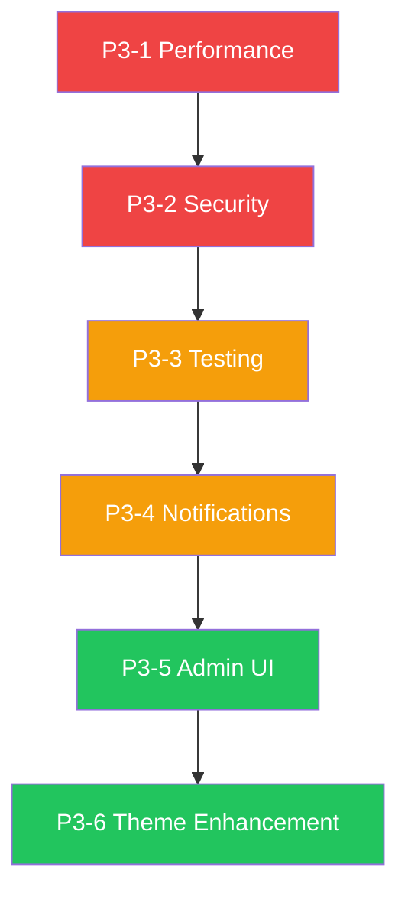

# 🟢 PRIORITY 3: Peningkatan Kualitas & UX — Rencana Prioritas

> Dokumen ini menyusun ulang 6 area peningkatan (items 10-15) berdasarkan urutan prioritas implementasi.

---

## 📊 Analisis Kondisi Saat Ini

| Area | Status | Coverage |
|------|--------|----------|
| Testing | 15 file test (Auth: 6, Feature: 9) | ~30% dari 47 controller |
| Admin UI | Blade statis + Tailwind + Alpine.js | Dashboard 727 baris, belum interaktif |
| Theme System | 3-tier priority sudah jalan | Belum ada preview/inheritance/export |
| Notification | Helper + WebPush sudah ada | Belum ada queue untuk bulk |
| Performance | Database queue + cache sudah ada | Belum ada CDN, eager loading audit |
| Security | SQL injection + XSS test sudah ada | Belum ada rate limiting, CSP headers |

---

## 🎯 Urutan Prioritas Rekomendasi

### P3-1: Performance Optimization 🔴 HIGH
**Mengapa pertama?** — Mempengaruhi UX langsung (page load speed, response time).

**Sub-tasks:**
1. **Eager loading audit** — Cek semua query di controllers, tambahkan `with()` untuk N+1 prevention
2. **Database indexing audit** — Analisis query log, tambah index untuk query lambat
3. **Queue jobs untuk heavy tasks** — Import siswa/guru, export PDF, bulk notification
4. **Cache strategy review** — Tambah cache untuk data statis (settings, pages, partners)
5. **Asset optimization** — Kompresi gambar, minify CSS/JS, pertimbangkan CDN

**File terkait:**
- Semua controllers di [`app/Http/Controllers/`](app/Http/Controllers/)
- [`config/queue.php`](config/queue.php:1) — queue sudah database-based
- [`database/migrations/`](database/migrations/) — untuk index additions

---

### P3-2: Security Hardening 🔴 HIGH
**Mengapa kedua?** — Keamanan adalah fondasi sebelum fitur lain berkembang.

**Sub-tasks:**
1. **Rate limiting middleware** — Terapkan di routes login, API, dan form submission
2. **Content Security Policy headers** — Tambah CSP di middleware response
3. **XSS audit di Blade templates** — Pastikan semua output menggunakan `{{ }}` bukan `{!! !!}`
4. **CSRF protection review** — Cek semua form sudah terlindungi
5. **Security headers** — X-Frame-Options, X-Content-Type-Options, Referrer-Policy

**File terkait:**
- [`bootstrap/app.php`](bootstrap/app.php:13) — middleware configuration
- [`app/Http/Middleware/`](app/Http/Middleware/) — existing middleware
- [`tests/Feature/SecurityTest.php`](tests/Feature/SecurityTest.php:1) — existing security tests

---

### P3-3: Testing Coverage 🟡 MEDIUM
**Mengapa ketiga?** — Setelah performance dan security stabil, testing memastikan tidak ada regression.

**Sub-tasks:**
1. **DashboardController test** — Test statistics, module usage, user growth
2. **LandingController comprehensive test** — Test both themes, buildData(), createStaticPages()
3. **EventController test** — CRUD operations, authorization
4. **InstagramController test** — Feed display, webhook handling
5. **PageController test** — CMS CRUD, versioning, menu system
6. **SettingsController test** — Theme settings update, SEO settings
7. **LetterIn/Out test** — Surat CRUD, format, activity logs
8. **SaranaController test** — CRUD operations

**File terkait:**
- [`tests/Feature/`](tests/Feature/) — existing test directory
- Target: tambah ~20 file test baru

---

### P3-4: Notification System Upgrade 🟡 MEDIUM
**Mengapa keempat?** — Meningkatkan UX komunikasi, tapi bukan kritis.

**Sub-tasks:**
1. **Queue jobs untuk email** — Buat `SendNotificationJob`, `BulkEmailJob`
2. **Email templates** — Buat Blade email templates yang konsisten
3. **Push notification improvements** — Retry mechanism, batch sending
4. **Notification preferences** — User bisa set preferensi notifikasi
5. **Notification history** — Log semua notifikasi yang terkirim

**File terkait:**
- [`app/Helpers/NotificationHelper.php`](app/Helpers/NotificationHelper.php:11) — existing helper
- [`app/Services/WebPushService.php`](app/Services/WebPushService.php:11) — existing service
- [`app/Models/PushSubscription.php`](app/Models/PushSubscription.php) — existing model

---

### P3-5: Admin UI Modernization 🟢 LOW-MEDIUM
**Mengapa kelima?** — UX improvement, tapi bisa incremental tanpa rewrite besar.

**Sub-tasks:**
1. **Chart.js integration** — Tambah chart di dashboard (attendance trends, module usage)
2. **Alpine.js interactivity** — Expand/collapse sections, real-time search, modal confirmations
3. **Live dashboard stats** — Auto-refresh counter cards (polling atau SSE)
4. **Responsive audit** — Pastikan semua halaman admin mobile-friendly
5. **Dark mode** — Pertimbangkan toggle dark/light mode

**File terkait:**
- [`resources/views/dashboards/admin.blade.php`](resources/views/dashboards/admin.blade.php:1) — 727 baris
- [`resources/views/layouts/app.blade.php`](resources/views/layouts/app.blade.php:1) — admin layout
- [`resources/views/layouts/navigation.blade.php`](resources/views/layouts/navigation.blade.php:1) — sudah pakai Alpine.js

---

### P3-6: Theme System Enhancement 🟢 LOW
**Mengapa terakhir?** — Sudah berfungsi dengan baik, enhancement nice-to-have.

**Sub-tasks:**
1. **Theme preview** — Preview tema sebelum mengaktifkan (iframe sandbox)
2. **Theme inheritance** — Base theme → child themes (untuk varian sekolah lain)
3. **Import/export theme settings** — Export/import sebagai JSON
4. **Theme comparison** — Side-by-side comparison dua tema
5. **Theme analytics** — Track which theme sections get most engagement

**File terkait:**
- [`app/Http/Controllers/ThemeSettingController.php`](app/Http/Controllers/ThemeSettingController.php:14) — existing controller
- [`app/Models/ThemeSetting.php`](app/Models/ThemeSetting.php:8) — existing model
- [`config/themes/telkom.php`](config/themes/telkom.php) — theme config
- [`config/themes/maudu.php`](config/themes/maudu.php) — theme config

---

## 📈 Alur Implementasi

---

## ⏭️ Next Steps

Pilih area mana yang ingin diimplementasikan terlebih dahulu. Setiap area bisa dikerjakan secara terpisah dan independent.
