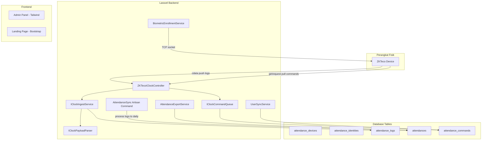
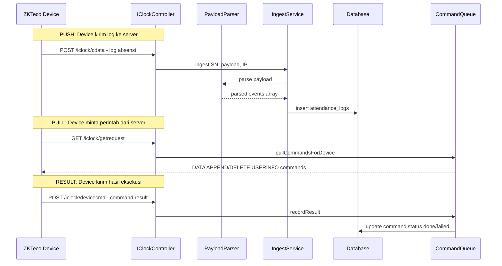

# Ringkasan Lengkap Proyek Absensi ZKTeco - SMK Telekomunikasi Darul Ulum

## 1. Overview

Proyek ini adalah **Sistem Manajemen Absensi Terintegrasi** untuk **SMK Telekomunikasi Darul Ulum**. Dibangun dengan **Laravel 12** + **PHP 8.2+** + **MySQL**, sistem ini mengintegrasikan perangkat absensi fisik **ZKTeco** iClock dengan panel admin web yang lengkap mencakup modul akademik, sarana prasarana, OSIS voting, e-surat, CMS, dan Instagram integration.

---

## 2. Arsitektur Sistem

---

## 3. Modul-modul Utama (Detail Lengkap)

### 3.1 Absensi ZKTeco - Fitur Inti

**Alur Data:**

**Database Tables:**
- `attendance_devices` - Perangkat ZKTeco (serial_number, ip_address, last_seen_at)
- `attendance_identities` - Mapping PIN device ke user/guru/siswa (polymorphic via kind)
- `attendance_logs` - Log mentah dari device (device_pin + log_time + verify_mode + raw)
- `attendances` - Rekap harian (first_in_at, last_out_at, status)
- `attendance_commands` - Antrian perintah ke device (pending/sent/done/failed)

**Service Layer:**
- [`IClockIngestService`](app/Services/ZKTeco/IClockIngestService.php) - Menerima dan memproses log dari device dengan dedup via unique constraint
- [`IClockPayloadParser`](app/Services/ZKTeco/IClockPayloadParser.php) - Parse payload tab-separated dari ZKTeco (PIN, DateTime, Verified, Status)
- [`IClockCommandQueue`](app/Services/ZKTeco/IClockCommandQueue.php) - Queue perintah ke device + tracking status (pending/sent/done/failed)
- [`UserSyncService`](app/Services/ZKTeco/UserSyncService.php) - Sync user web ke device via ADMS commands (add/update/delete/syncAll)
- [`BiometricEnrollmentService`](app/Services/ZKTeco/BiometricEnrollmentService.php) - Enroll fingerprint (0-9 jari), face recognition, RFID via TCP socket port 4370

**Artisan Command:**
- `php artisan attendance:sync --since=YYYY-MM-DD --limit=5000` - Proses log menjadi rekap harian (first_in/last_out)

**Observers:**
- [`AttendanceIdentityObserver`](app/Observers/AttendanceIdentityObserver.php) - Auto-enqueue delete command saat identity dinonaktifkan/dihapus

**Controllers:**
- [`ZKTecoIClockController`](app/Http/Controllers/ZKTecoIClockController.php) - 3 endpoints: cdata (push logs), getrequest (pull commands), devicecmd (command results)
- [`AttendanceController`](app/Http/Controllers/AttendanceController.php) - Dashboard absensi, logs viewer, device management, PIN mapping
- [`AttendanceUserController`](app/Http/Controllers/AttendanceUserController.php) - CRUD user absensi + auto-sync ke device
- [`BiometricEnrollmentController`](app/Http/Controllers/BiometricEnrollmentController.php) - Enroll fingerprint/face/RFID dari web
- [`AttendanceExportController`](app/Http/Controllers/AttendanceExportController.php) - Export rekap harian/periode/summary/user ke Excel
- [`AttendanceReportController`](app/Http/Controllers/AttendanceReportController.php) - Report harian/mingguan/bulanan/per-user/keterlambatan

**Export:**
- [`AttendanceExportService`](app/Services/AttendanceExportService.php) - Generate data untuk export (daily, period, summary, userDetail)
- [`AttendanceExport`](app/Exports/AttendanceExport.php) - Excel export dengan styling (header bold, auto-width, borders)

---

### 3.2 Manajemen User & Role

**Role-based Access Control** menggunakan **Spatie Permission**:

| Role | Akses Utama |
|------|-------------|
| `superadmin` | Full access, manage roles/permissions, user management, Instagram settings |
| `admin` | Dashboard, settings, berita, pages, semua module |
| `guru` | Absensi, guru, siswa, jadwal, lulus |
| `siswa` | View jadwal, lulus check, OSIS voting |
| `sarpras` | Sarana prasarana, barang, maintenance, barcode |
| `osis` | OSIS calon, pemilih, voting |

**Controllers:**
- [`SuperadminController`](app/Http/Controllers/SuperadminController.php) - User CRUD + import/export + Instagram settings
- [`UserManagementController`](app/Http/Controllers/UserManagementController.php) - User management dengan invite system
- [`RoleManagementController`](app/Http/Controllers/RoleManagementController.php) - Role CRUD + assign users
- [`RolePermissionController`](app/Http/Controllers/RolePermissionController.php) - Role & permission management (superadmin only)
- [`PermissionController`](app/Http/Controllers/PermissionController.php) - Permission CRUD + bulk create
- [`ProfileController`](app/Http/Controllers/ProfileController.php) - Profile management

**Middleware:**
- `role:guru|admin|superadmin` - Role-based access
- `permission:kelulusan.view` - Permission-based access
- `verified.email` - Email verification required

---

### 3.3 Dashboard & Analytics

- [`DashboardController`](app/Http/Controllers/DashboardController.php) - Dashboard statistik dengan caching (5 min), module usage calculation, user growth data
- [`AnalyticsController`](app/Http/Controllers/AnalyticsController.php) - Analytics mendalam dengan data export
- [`SystemHealthController`](app/Http/Controllers/SystemHealthController.php) - Health check dashboard
- [`LogMonitoringController`](app/Http/Controllers/LogMonitoringController.php) - View/download/clear Laravel logs

---

### 3.4 Modul Akademik

#### Guru Management
- **Controller**: [`GuruController`](app/Http/Controllers/GuruController.php) (616 lines) - Full CRUD + filter by status/employment/subject + search + sort + import/export
- **Model**: [`Guru`](app/Models/Guru.php) - NIP, nama, gelar, jenis kelamin, status_kepegawaian (PNS/CPNS/GTT/GTY/Honorer), mata_pelajaran (JSON array), jadwal_mengajar
- **Export**: Excel/PDF/JSON/XML
- **Import**: Via [`GuruImport`](app/Imports/GuruImport.php)
- **Relationships**: belongsTo User, hasMany AttendanceIdentity

#### Siswa Management
- **Controller**: [`SiswaController`](app/Http/Controllers/SiswaController.php) - Full CRUD + import/export
- **Model**: [`Siswa`](app/Models/Siswa.php) - NIS/NISN, nama, kelas, jurusan, tahun masuk/lulus, data ortu, nilai_akademik (JSON), ekstrakurikuler (JSON), voting tracking (has_voted_osis, voted_at, voting_ip)
- **Export**: Excel/PDF/JSON/XML
- **Import**: Via [`SiswaImport`](app/Imports/SiswaImport.php)

#### Jadwal Pelajaran
- **Controller**: [`JadwalPelajaranController`](app/Http/Controllers/JadwalPelajaranController.php) - CRUD + calendar view + conflict check + import/export
- **Model**: [`JadwalPelajaran`](app/Models/JadwalPelajaran.php)
- **Export**: Excel/PDF/JSON/XML

#### E-Lulus (Kelulusan)
- **Controller**: [`KelulusanController`](app/Http/Controllers/KelulusanController.php) (764 lines) - Full CRUD + certificate generation + public check + import/export
- **Model**: [`Kelulusan`](app/Models/Kelulusan.php) - NISN, NIS, nama, jurusan, tahun_ajaran, status (lulus/tidak_lulus/mengulang), tracking fields
- **Public Routes**: `/check-graduation` - Public status check tanpa login
- **Certificate**: PDF certificate generation via DomPDF
- **Export**: Excel/PDF/JSON/XML

---

### 3.5 Sarana Prasarana (Sarpras)

**Controller**: [`SarprasController`](app/Http/Controllers/SarprasController.php) (1316 lines) - Modul terbesar!

**Sub-Modul:**
1. **Kategori** - CRUD kategori barang (is_active toggle)
2. **Barang** - Full CRUD + filter by kategori/kondisi/ruang + barcode/QR code generation + import/export + foto
3. **Ruang** - CRUD ruangan (status: aktif/nonaktif)
4. **Sarana** - CRUD pengadaan sarana + pivot table sarana_barang + invoice print
5. **Maintenance** - CRUD perawatan barang (status: pending/dalam_proses/selesai)
6. **Barcode** - Generate barcode/QR code, print, bulk print, scan page

**Models:**
- [`Barang`](app/Models/Barang.php) - kode_barang, nama, kategori_id, merk, model, serial_number, barcode, qr_code, harga_beli, kondisi, ruang_id, foto
- [`KategoriSarpras`](app/Models/KategoriSarpras.php) - Kategori barang
- [`Ruang`](app/Models/Ruang.php) - Ruangan
- [`Maintenance`](app/Models/Maintenance.php) - Perawatan
- [`Sarana`](app/Models/Sarana.php) - Pengadaan + pivot sarana_barang

**Barcode Integration:**
- DNS1DFacade (1D barcode) + DNS2DFacade (QR code)
- Routes: `/barcode/{code}`, `/qrcode/{code}`
- Bulk print, scan page

---

### 3.6 OSIS Voting

**Controller**: [`OSISController`](app/Http/Controllers/OSISController.php) (1187 lines) - Full system pemilihan OSIS

**Sub-Modul:**
1. **Dashboard** - Stats cached (2 min), calons dengan vote count, recent votes
2. **Calon** - CRUD kandidat (nama_ketua, nama_wakil, foto, visi_misi, program_kerja) + import/export
3. **Pemilih** - CRUD pemilih + generate from users + import/export
4. **Voting** - Proses pemilihan dengan anti-fraud (IP tracking, user_agent, one-vote-per-user)
5. **Results** - Hasil voting + analytics + export PDF/JSON/XML
6. **Teacher View** - View khusus guru

**Models:**
- [`Calon`](app/Models/Calon.php) - Kandidat dengan foto ketua/wakil, visi_misi, scopes (active, ordered)
- [`Pemilih`](app/Models/Pemilih.php) - Data pemilih
- [`Voting`](app/Models/Voting.php) - Record投票 dengan valid scope
- [`OsisElection`](app/Models/OsisElection.php) - Sesi pemilihan

**Anti-Fraud:**
- Siswa model tracks: `has_voted_osis`, `voted_at`, `voting_ip`, `voting_user_agent`
- One-vote-per-siswa enforcement

---

### 3.7 E-Surat

**Controllers:**
- [`LetterOutController`](app/Http/Controllers/LetterOutController.php) (275 lines) - Surat keluar dengan auto-numbering
- [`LetterInController`](app/Http/Controllers/LetterInController.php) - Surat masuk
- [`LetterFormatController`](app/Http/Controllers/LetterFormatController.php) - Template format surat

**Models:**
- [`Letter`](app/Models/Letter.php) - type (incoming/outgoing), letter_number, sequence_number, reference_number, letter_date, file_path
- [`LetterFormat`](app/Models/LetterFormat.php) - Template format surat
- [`LetterCounter`](app/Models/LetterCounter.php) - Auto-numbering counter
- [`LetterActivityLog`](app/Models/LetterActivityLog.php) - Activity tracking

**Fitur Khusus:**
- Blocking logic: Surat berikutnya tidak bisa dibuat jika surat sebelumnya belum di-upload scan-nya
- Counter scope: global atau per-unit (unit_code pada user)
- PDF print via DomPDF
- Upload scan surat

---

### 3.8 Instagram Integration

**Controller**: [`InstagramController`](app/Http/Controllers/InstagramController.php) (407 lines)
- OAuth callback untuk Meta Business Login Flow (short-lived -> long-lived token)
- Webhook endpoints (GET verify + POST notifications)
- Feed public kegiatan
- AJAX getPosts

**Service**: [`InstagramService`](app/Services/InstagramService.php) (749 lines)
- Fetch posts dari Instagram Platform API v20.0
- Cache posts 1 hour
- Mock posts sebagai fallback
- Token refresh handling

**Settings:**
- [`InstagramSettingController`](app/Http/Controllers/InstagramSettingController.php) - CRUD settings + test connection + sync + deactivate
- [`InstagramAnalyticsController`](app/Http/Controllers/InstagramAnalyticsController.php) - Analytics + engagement + top posts

**Model**: [`InstagramSetting`](app/Models/InstagramSetting.php) - app_id, app_secret, access_token, user_id, webhook settings

---

### 3.9 CMS & Landing Page

**Controller**: [`PageController`](app/Http/Controllers/PageController.php) (513 lines)
- Full CRUD + publish/unpublish + duplicate
- Versioning (restore, compare versions)
- Menu management (header/footer, sort order, parent-child)
- Templates: default, landing, about, blog, contact, gallery

**Models:**
- [`Page`](app/Models/Page.php) - title, slug, content, status (draft/published/archived), category, is_menu, menu_position, menu_sort_order, parent_id
- [`PageVersion`](app/Models/PageVersion.php) - Version history
- [`PageCategory`](app/Models\PageCategory.php) - Categories

**Landing Page:**
- [`LandingController`](app/Http/Controllers/LandingController.php) (508 lines) - Telkom landing page dengan cached data (siswa count, kelulusan %, testimonials, blogs, partners, events, Instagram posts)

**Public Routes:**
- `/pages` - Public page index
- `/page/{slug}` - Public page show
- `/berita` - Berita public
- `/berita/{slug}` - Berita detail
- `/kegiatan` - Instagram feed

---

### 3.10 Fitur Tambahan

#### Push Notification (VAPID)
- [`WebPushService`](app/Services/WebPushService.php) - Send via Minishlink WebPush library
- [`PushNotificationController`](app/Http/Controllers/PushNotificationController.php) - Subscribe/unsubscribe + VAPID key endpoint
- [`NotificationHelper`](app/Helpers/NotificationHelper.php) - Helper untuk send notification (to user, role, announcement, welcome)
- [`PushSubscription`](app/Models/PushSubscription.php) - endpoint, public_key, auth_token

#### Multi-language (i18n)
- Config: [`config/i18n.php`](config/i18n.php)
- Middleware: [`SetLocale`](app/Http/Middleware/SetLocale.php)
- Languages: EN, ID, AR (RTL support)
- [`LocaleController`](app/Http/Controllers/LocaleController.php) - Switch locale, currency, timezone

#### Audit Logging
- Trait: [`Auditable`](app/Traits/Auditable.php) - Auto-log create/update/delete
- Model: [`AuditLog`](app/Models/AuditLog.php) - user_id, action, auditable_type, auditable_id, old_values, new_values
- Controller: [`AuditLogController`](app/Http/Controllers/AuditLogController.php) - View + export audit logs

#### Notifications
- [`NotificationController`](app/Http/Controllers/NotificationController.php) - View notifications, mark read, mark all read, delete
- [`SystemNotification`](app/Notifications/SystemNotification.php) - Notification type

#### Testimonials
- [`TestimonialController`](app/Http/Controllers/TestimonialController.php) - Public submit + admin approve/reject/toggle featured
- [`TestimonialLinkController`](app/Http/Controllers/TestimonialLinkController.php) - Token-based public testimonial links

#### Berita
- [`BeritaController`](app/Http/Controllers/BeritaController.php) - Full CRUD + image upload + public view

#### Partners & Events
- [`Partner`](app/Models/Partner.php) - Partners/sponsors
- [`Events`](app/Models/Events.php) - School events
- [`EventController`](app/Http/Controllers/EventController.php) - CRUD events

#### Settings
- [`SettingsController`](app/Http/Controllers/SettingsController.php) - General settings, data management, landing page, SEO
- [`DataManagementController`](app/Http/Controllers/DataManagementController.php) - CRUD Kelas, Jurusan, Ekstrakurikuler, Mata Pelajaran

#### Other Features
- **PWA** - Offline mode + installable
- **Responsive Design** - Admin (Tailwind) + Landing (Bootstrap 5)
- **SweetAlert2** - Modal dialogs
- **Chart.js** - Grafik interaktif
- **Alpine.js** - Interactive JS
- **Rate Limiting** - pada import routes (10/minute)
- **CSRF Protection** - Laravel default
- **Email Verification** - admin + auto verification system

---

## 4. Tech Stack

### Backend
- **Laravel 12** - PHP framework
- **MySQL 8.0** - Database
- **Spatie Permission** - RBAC
- **Laravel Excel** (Maatwebsite) - Import/Export
- **DomPDF** - PDF generation
- **Laravel Sanctum** - API auth
- **Milon Barcode** - Barcode/QR code generation
- **Minishlink WebPush** - VAPID push notifications

### Frontend
- **Tailwind CSS 3** - Admin panel
- **Bootstrap 5** - Landing page
- **Alpine.js** - Interactive JS
- **Chart.js** - Grafik
- **SweetAlert2** - Modal dialogs
- **Vite 7** - Asset bundler
- **Font Awesome** - Icons

### Infrastructure
- **VPS Deployment** via [`deploy.sh`](deploy.sh) - Automated deployment script
- **Git-based** deployment workflow (main branch)
- **Database** session/cache/queue drivers

---

## 5. Database Schema Summary

### Core Tables (30+)
- `users` - User system dengan email verification, unit_code
- `roles` / `permissions` / `model_has_roles` / `model_has_permissions` - Spatie RBAC

### Attendance Tables (5)
- `attendance_devices` - ZKTeco devices (serial_number, ip_address, last_seen_at)
- `attendance_identities` - PIN-to-user mapping (kind: user/guru/siswa)
- `attendance_logs` - Raw logs dari device (unique: device + pin + log_time)
- `attendances` - Daily recap (unique: identity + date)
- `attendance_commands` - Command queue ke device (status tracking)

### Academic Tables (6)
- `gurus` - Data guru (NIP, mata_pelajaran JSON)
- `siswas` - Data siswa (NIS/NISN, kelas, jurusan, voting tracking)
- `kelas` - Kelas
- `mata_pelajaran` - Mata pelajaran
- `jadwal_pelajaran` - Jadwal pelajaran
- `kelulusans` - Data kelulusan

### Sarpras Tables (5)
- `kategori_sarpras` - Kategori barang
- `ruang` - Ruangan
- `barang` - Barang/inventaris (barcode, qr_code)
- `maintenance` - Perawatan
- `sarana` + `sarana_barang` - Pengadaan (pivot table)

### CMS Tables (3)
- `pages` - Pages dengan menu support
- `page_categories` - Kategori
- `page_versions` - Version history

### OSIS Tables (4)
- `osis_elections` - Sesi pemilihan
- `calons` - Kandidat
- `pemilihs` - Pemilih
- `votings` - Record投票

### Letter Tables (4)
- `letters` - Surat masuk/keluar
- `letter_formats` - Template format
- `letter_counters` - Auto-numbering
- `letter_activity_logs` - Activity tracking

### Other Tables (8)
- `instagram_settings` - Instagram integration
- `testimonials` / `testimonial_links` - Testimoni
- `audit_logs` - Audit trail
- `push_subscriptions` - Web push
- `notifications` - System notifications
- `partners` - Partners/sponsors
- `events` - School events
- `berita` - News/berita

---

## 6. Key File Locations

### Controllers (40+)
| Controller | Lines | Modul |
|-----------|-------|-------|
| [`SarprasController`](app/Http/Controllers/SarprasController.php) | 1316 | Sarpras (terbesar) |
| [`OSISController`](app/Http/Controllers/OSISController.php) | 1187 | OSIS Voting |
| [`GuruController`](app/Http/Controllers/GuruController.php) | 616 | Guru Management |
| [`PageController`](app/Http/Controllers/PageController.php) | 513 | CMS |
| [`LandingController`](app/Http/Controllers/LandingController.php) | 508 | Landing Page |
| [`InstagramController`](app/Http/Controllers/InstagramController.php) | 407 | Instagram |
| [`KelulusanController`](app/Http/Controllers/KelulusanController.php) | 764 | E-Lulus |
| [`DashboardController`](app/Http/Controllers/DashboardController.php) | 273 | Dashboard |

### Models (35+)
- [`app/Models/`](app/Models/) - Semua Eloquent models

### Services
- [`app/Services/ZKTeco/`](app/Services/ZKTeco/) - ZKTeco integration (5 files)
- [`app/Services/InstagramService.php`](app/Services/InstagramService.php) - Instagram API (749 lines)
- [`app/Services/WebPushService.php`](app/Services/WebPushService.php) - Push notification
- [`app/Services/AttendanceExportService.php`](app/Services/AttendanceExportService.php) - Export attendance

### Views (100+ blade templates)
- [`resources/views/`](resources/views/) - Organized by module

### Routes
- [`routes/web.php`](routes/web.php) - 750 lines, semua routes
- [`routes/auth.php`](routes/auth.php) - Auth routes

### Config
- [`config/attendance.php`](config/attendance.php) - ZKTeco config (iclock_secret, require_user_identity)
- [`config/barcode.php`](config/barcode.php) - Barcode config
- [`config/i18n.php`](config/i18n.php) - Internationalization

---

## 7. Security Features

- Token-based auth untuk ZKTeco endpoints (`ATTENDANCE_ICLOCK_SECRET`)
- Role-based middleware pada semua routes (Spatie)
- Permission-based middleware (granular)
- CSRF protection (Laravel default)
- Rate limiting pada import routes (10/minute)
- Email verification (admin + auto)
- Audit logging pada aktivitas penting
- Anti-fraud voting (IP tracking, user_agent, one-vote-per-siswa)
- Blocking logic pada e-surat (sequential upload requirement)
- Auto-delete user dari device saat dinonaktifkan (Observer pattern)

---

## 8. Deployment

- Script deploy otomatis: [`deploy.sh`](deploy.sh)
- Maintenance mode saat deploy
- Self-healing permission (auto-fix chmod)
- Git pull + composer install + npm build + migrate + cache clear
- PHP-FPM restart
