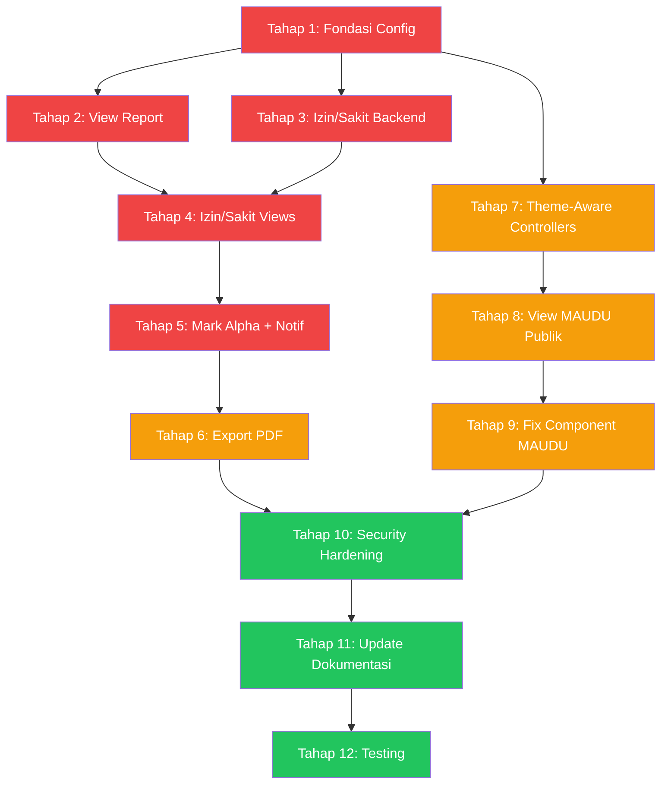

# 🚀 Roadmap Pengembangan Proyek — SMK Telekomunikasi

> **Tanggal:** 2026-08-16
> **Status:** Aktif
> **Tech Stack:** Laravel 12, PHP 8.2+, MySQL, Blade + Bootstrap 5 (Landing), Tailwind + Alpine.js (Admin)

---

## 📊 Kondisi Saat Ini

### File yang Belum Ada (Perlu Dibuat)
| File | Keterangan |
|------|-----------|
| `FEATURES.md` | Dokumentasi lengkap semua fitur proyek |
| `ROADMAP.md` | Rencana pengembangan proyek bertahap |
| `update.sh` | Script deployment incremental untuk production |

### Fitur yang Sudah Berfungsi
- ✅ Landing page multi-theme (Telkom + MAUDU)
- ✅ Dashboard admin dengan analytics
- ✅ CRUD Guru, Siswa, Kelas, Jurusan
- ✅ Absensi ZKTeco iClock (push/pull logs, device management, PIN mapping)
- ✅ Export Excel absensi (harian/periode/summary/user)
- ✅ Report absensi harian
- ✅ Biometric enrollment (fingerprint/face/RFID)
- ✅ OSIS Voting (calon, pemilih, voting, anti-fraud)
- ✅ E-Lulus (kelulusan + sertifikat PDF)
- ✅ E-Surat (surat masuk/keluar + auto-numbering)
- ✅ Sarpras (kategori, barang, ruang, maintenance, barcode/QR)
- ✅ CMS Pages (CRUD + versioning + menu management)
- ✅ Berita (CRUD + public view)
- ✅ Instagram integration (OAuth, webhook, feed)
- ✅ Push notification (VAPID)
- ✅ Multi-language (EN, ID, AR)
- ✅ Audit logging
- ✅ Role & permission (Spatie)
- ✅ Theme settings (database-backed)
- ✅ Async job management
- ✅ Bulk import/export

### Fitur yang BELUM Lengkap
| Fitur | Status | Detail |
|-------|--------|--------|
| Report mingguan/bulanan/keterlambatan/user-detail | ❌ View missing | Controller sudah ada, view belum dibuat |
| Sistem izin/sakit/alpha | ❌ Belum ada | Tidak ada migration, model, controller, atau view |
| Export PDF absensi | ❌ Belum ada | Hanya Excel |
| Notifikasi absensi | ❌ Belum ada | Infrastructure ada, belum diintegrasi |
| Config attendance terpusat | ❌ Belum ada | Tidak ada `config/attendance.php` |
| MAUDU public pages | ❌ Hardcoded Telkom | Berita, pages, e-lulus, kegiatan masih pakai layout Telkom |
| MAUDU header/footer | ❌ Broken links | Menu URL = `#`, tidak ada login button |
| MAUDU breadcrumb | ❌ Tidak ada | Telkom punya, MAUDU belum |
| Security hardening | ⚠️ Partial | Rate limiting belum semua, CSP headers belum ada |
| `update.sh` | ❌ Tidak ada | Hanya ada `deploy.sh` |

---

## 🎯 Rencana Eksekusi Bertahap

### Tahap 1: Fondasi & Config (Maksimal 10 File)

**Tujuan:** Buat fondasi config dan dokumentasi yang dibutuhkan.

| # | Tugas | File | Prioritas |
|---|-------|------|-----------|
| 1.1 | Buat `FEATURES.md` | `FEATURES.md` | 🔴 Tinggi |
| 1.2 | Buat `ROADMAP.md` | `ROADMAP.md` | 🔴 Tinggi |
| 1.3 | Buat `update.sh` | `update.sh` | 🔴 Tinggi |
| 1.4 | Buat `config/attendance.php` | `config/attendance.php` | 🔴 Tinggi |
| 1.5 | Update `.env.example` — tambah vars attendance | `.env.example` | 🔴 Tinggi |
| 1.6 | Buat `plans/roadmap-2026.md` | `plans/roadmap-2026.md` | 🟡 Sedang |

---

### Tahap 2: Lengkapi View Report Absensi (Maksimal 10 File)

**Tujuan:** Buat 4 view Blade yang missing untuk report absensi.

| # | Tugas | File | Prioritas |
|---|-------|------|-----------|
| 2.1 | View report mingguan | `resources/views/attendance/report/weekly.blade.php` | 🔴 Tinggi |
| 2.2 | View report bulanan | `resources/views/attendance/report/monthly.blade.php` | 🔴 Tinggi |
| 2.3 | View report keterlambatan | `resources/views/attendance/report/latecomers.blade.php` | 🔴 Tinggi |
| 2.4 | View report user detail | `resources/views/attendance/report/user-detail.blade.php` | 🔴 Tinggi |

---

### Tahap 3: Sistem Izin/Sakit/Alpha — Database & Backend (Maksimal 10 File)

**Tujuan:** Buat sistem izin/sakit dari nol — migration, model, controller.

| # | Tugas | File | Prioritas |
|---|-------|------|-----------|
| 3.1 | Migration attendance_excuses | `database/migrations/xxxx_create_attendance_excuses_table.php` | 🔴 Tinggi |
| 3.2 | Model AttendanceExcuse | `app/Models/AttendanceExcuse.php` | 🔴 Tinggi |
| 3.3 | Controller AttendanceExcuse | `app/Http/Controllers/AttendanceExcuseController.php` | 🔴 Tinggi |
| 3.4 | Routes izin/sakit | `routes/web.php` (update) | 🔴 Tinggi |

---

### Tahap 4: Sistem Izin/Sakit/Alpha — Views (Maksimal 10 File)

**Tujuan:** Buat 4 view CRUD untuk izin/sakit.

| # | Tugas | File | Prioritas |
|---|-------|------|-----------|
| 4.1 | View index izin/sakit | `resources/views/attendance/excuses/index.blade.php` | 🔴 Tinggi |
| 4.2 | View create izin/sakit | `resources/views/attendance/excuses/create.blade.php` | 🔴 Tinggi |
| 4.3 | View edit izin/sakit | `resources/views/attendance/excuses/edit.blade.php` | 🔴 Tinggi |
| 4.4 | View show izin/sakit | `resources/views/attendance/excuses/show.blade.php` | 🔴 Tinggi |
| 4.5 | Update view attendance index — tambah link ke excuses | `resources/views/attendance/index.blade.php` | 🔴 Tinggi |

---

### Tahap 5: Mark Alpha & Notification (Maksimal 10 File)

**Tujuan:** Buat command untuk menandai alpha dan notifikasi absensi.

| # | Tugas | File | Prioritas |
|---|-------|------|-----------|
| 5.1 | Command MarkAlphaCommand | `app/Console/Commands/MarkAlphaCommand.php` | 🔴 Tinggi |
| 5.2 | Command AttendanceNotifyCommand | `app/Console/Commands/AttendanceNotifyCommand.php` | 🔴 Tinggi |
| 5.3 | Notification AttendanceNotification | `app/Notifications/AttendanceNotification.php` | 🔴 Tinggi |
| 5.4 | Update AttendanceSync — integrasi excused check | `app/Console/Commands/AttendanceSync.php` | 🔴 Tinggi |
| 5.5 | Update scheduler | `routes/console.php` | 🔴 Tinggi |
| 5.6 | Tambah permissions baru | Seeder atau command | 🟡 Sedang |

---

### Tahap 6: Export PDF Absensi (Maksimal 10 File)

**Tujuan:** Tambah export PDF untuk rekap absensi.

| # | Tugas | File | Prioritas |
|---|-------|------|-----------|
| 6.1 | PDF view harian | `resources/views/attendance/pdf/daily.blade.php` | 🟡 Sedang |
| 6.2 | PDF view periode | `resources/views/attendance/pdf/period.blade.php` | 🟡 Sedang |
| 6.3 | PDF view summary | `resources/views/attendance/pdf/summary.blade.php` | 🟡 Sedang |
| 6.4 | Update AttendanceExportService — tambah PDF methods | `app/Services/AttendanceExportService.php` | 🟡 Sedang |
| 6.5 | Update AttendanceExportController — tambah PDF routes | `app/Http/Controllers/AttendanceExportController.php` | 🟡 Sedang |
| 6.6 | Update view export index — tambah tombol PDF | `resources/views/attendance/export/index.blade.php` | 🟡 Sedang |

---

### Tahap 7: Theme-Aware Controllers untuk MAUDU (Maksimal 10 File)

**Tujuan:** Update controllers agar mendeteksi tema aktif dan render view sesuai.

| # | Tugas | File | Prioritas |
|---|-------|------|-----------|
| 7.1 | Update BeritaController — theme-aware | `app/Http/Controllers/BeritaController.php` | 🟡 Sedang |
| 7.2 | Update PageController — theme-aware | `app/Http/Controllers/PageController.php` | 🟡 Sedang |
| 7.3 | Update InstagramController — theme-aware | `app/Http/Controllers/InstagramController.php` | 🟡 Sedang |
| 7.4 | Update KelulusanController — theme-aware public | `app/Http/Controllers/KelulusanController.php` | 🟡 Sedang |

---

### Tahap 8: View MAUDU untuk Halaman Publik (Maksimal 10 File)

**Tujuan:** Buat view MAUDU untuk semua halaman publik.

| # | Tugas | File | Prioritas |
|---|-------|------|-----------|
| 8.1 | Berita index MAUDU | `resources/views/berita/maudu/index.blade.php` | 🟡 Sedang |
| 8.2 | Berita detail MAUDU | `resources/views/berita/maudu/show.blade.php` | 🟡 Sedang |
| 8.3 | Pages index MAUDU | `resources/views/pages/public/index-maudu.blade.php` | 🟡 Sedang |
| 8.4 | Pages detail MAUDU | `resources/views/pages/public/show-maudu.blade.php` | 🟡 Sedang |
| 8.5 | Kegiatan MAUDU | `resources/views/instagram/activities-maudu.blade.php` | 🟡 Sedang |
| 8.6 | E-Lulus check MAUDU | `resources/views/public/elulus/check-maudu.blade.php` | 🟡 Sedang |
| 8.7 | E-Lulus result MAUDU | `resources/views/public/elulus/result-maudu.blade.php` | 🟡 Sedang |
| 8.8 | Breadcrumb MAUDU | `resources/views/components/maudu/breadcrumb.blade.php` | 🟡 Sedang |

---

### Tahap 9: Fix Component MAUDU yang Broken (Maksimal 10 File)

**Tujuan:** Perbaiki links dan navigasi yang broken di tema MAUDU.

| # | Tugas | File | Prioritas |
|---|-------|------|-----------|
| 9.1 | Fix blog component links | `resources/views/components/maudu/blog.blade.php` | 🟡 Sedang |
| 9.2 | Fix events component links | `resources/views/components/maudu/events.blade.php` | 🟡 Sedang |
| 9.3 | Fix header — tambah login button + fix menu URLs | `resources/views/components/maudu/header.blade.php` | 🟡 Sedang |
| 9.4 | Fix footer — fix semua link ke halaman publik | `resources/views/components/maudu/footer.blade.php` | 🟡 Sedang |

---

### Tahap 10: Security Hardening & Quality (Maksimal 10 File)

**Tujuan:** Tingkatkan keamanan dan kualitas kode.

| # | Tugas | File | Prioritas |
|---|-------|------|-----------|
| 10.1 | Rate limiting di routes yang belum ada | `routes/web.php` | 🟢 Rendah |
| 10.2 | Security headers middleware | `app/Http/Middleware/SecurityHeaders.php` | 🟢 Rendah |
| 10.3 | XSS audit di Blade templates | `resources/views/` | 🟢 Rendah |
| 10.4 | N+1 query audit — tambah eager loading | `app/Http/Controllers/` | 🟢 Rendah |

---

### Tahap 11: Update Dokumentasi & Deployment (Maksimal 10 File)

**Tujuan:** Sinkronisasi dokumentasi dan script deployment.

| # | Tugas | File | Prioritas |
|---|-------|------|-----------|
| 11.1 | Update `AGENTS.md` | `AGENTS.md` | 🟡 Sedang |
| 11.2 | Update `deploy.sh` | `deploy.sh` | 🔴 Tinggi |
| 11.3 | Update `update.sh` | `update.sh` | 🔴 Tinggi |
| 11.4 | Update `.env.example` | `.env.example` | 🔴 Tinggi |

---

### Tahap 12: Testing & Validasi (Maksimal 10 File)

**Tujuan:** Jalankan test suite dan validasi semua fitur.

| # | Tugas | File | Prioritas |
|---|-------|------|-----------|
| 12.1 | Jalankan PHPUnit test suite | `tests/` | 🔴 Tinggi |
| 12.2 | Test dual-theme (Telkom + MAUDU) | Manual testing | 🔴 Tinggi |
| 12.3 | Test attendance flow lengkap | Manual testing | 🔴 Tinggi |
| 12.4 | Test deployment script | `deploy.sh` + `update.sh` | 🔴 Tinggi |

---

## 📈 Diagram Alur Eksekusi

---

## ⚠️ Aturan Eksekusi

1. **Maksimal 10 file per tahap** — Tidak boleh batch update serentak
2. **Incremental execution** — Selesaikan tahap 100% sebelum lanjut
3. **Tidak merusak migration production** — Selalu buat migration baru
4. **Database transaction** — Semua operasi CRUD multi-tabel harus pakai `DB::transaction`
5. **Update deploy.sh & update.sh** — Setiap kali ada perubahan dependency atau step baru
6. **Update dokumentasi** — `FEATURES.md`, `ROADMAP.md`, `AGENTS.md` harus sinkron
7. **Git hygiene** — Commit atomic dengan pesan deskriptif
