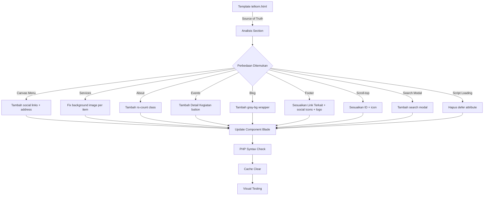

# 🎨 Plan: Integrasi Template Telkom dengan Backend

> **Prinsip Utama**: Template HTML = Source of Truth untuk desain. Backend = Data + Custom Override.
> 
> **Status**: ✅ SEMUA FIX SUDAH DITERAPKAN (diperiksa 2026-08-16)

---

## 1. Source of Truth

| Aspek | Source of Truth | Override oleh Backend |
|-------|----------------|----------------------|
| Layout/Struktur | `telkom.html` | — |
| CSS Classes | `telkom.html` + `style.css` | — |
| Typography/Colors | `style.css` | — |
| Animations | `telkom.html` (WOW.js) | — |
| Responsive | `responsive.css` | — |
| Text Content | `telkom.html` (defaults) | DB `site_settings` → Config file |
| Images | `telkom.html` (asset paths) | DB `theme_settings` → Config file |
| Links/URLs | `telkom.html` (hardcoded) | Config file → DB |
| Menu | `telkom.html` | Config file `menu` array |

---

## 2. Inventaris Section Template vs Blade

### urutan Section di `telkom.html` (872 baris):

| # | Section | CSS Class | Baris | Component Blade | Status |
|---|---------|-----------|-------|-----------------|--------|
| 1 | Topbar | `topbar-area` | 55-81 | `header.blade.php` | ✅ |
| 2 | Menu/Nav | `menu-area menu-sticky` | 85-165 | `header.blade.php` | ✅ |
| 3 | Canvas Menu | `right_menu_togle` | 169-186 | `header.blade.php` | ✅ FIXED |
| 4 | Hero Slider | `rs-slider style1` | 193-241 | `hero-slider.blade.php` | ✅ |
| 5 | Services/Jurusan | `rs-services style1` | 245-284 | `services.blade.php` | ✅ FIXED |
| 6 | About | `rs-about style2` | 288-344 | `about.blade.php` | ✅ FIXED |
| 7 | Degree/Kerjasama | `rs-degree style1 modify` | 347-433 | `programs.blade.php` | ✅ |
| 8 | CTA/Video | `rs-cta style2` | 437-468 | `cta.blade.php` | ✅ |
| 9 | Events | `rs-latest-events style1` | 472-535 | `events.blade.php` | ✅ FIXED |
| 10 | Partner | `rs-partner` | 539-568 | `partners.blade.php` | ✅ |
| 11 | Testimonial | `rs-testimonial style2` | 572-625 | `testimonials.blade.php` | ✅ |
| 12 | Blog | `rs-blog style2` | 631-721 | `blog.blade.php` | ✅ FIXED |
| 13 | Footer Top | `rs-footer` / `footer-top` | 731-779 | `footer.blade.php` | ✅ FIXED |
| 14 | Footer Bottom | `footer-bottom` | 780-806 | `footer.blade.php` | ✅ FIXED |
| 15 | Scroll-to-top | `#scrollUp` | 810-813 | layout `telkom.blade.php` | ✅ FIXED |
| 16 | Search Modal | `search-modal` | 816-832 | layout `telkom.blade.php` | ✅ FIXED |
| — | Contact | — | — | `contact.blade.php` | EXTRA |
| — | Instagram Feed | — | — | `instagram.blade.php` | EXTRA |
| — | Breadcrumb | — | — | `breadcrumb.blade.php` | EXTRA |

---

## 3. Detail Perbedaan per Section (Semua Sudah Fix)

### 3.1 Header (`header.blade.php`)

**Canvas Menu — ✅ FIXED:**
Canvas menu sudah memiliki social links (Facebook, Instagram, YouTube) dan address widget (location, phone, email) menggunakan data dynamic dari `$siteSettings` dan `theme_config()`.

---

### 3.2 Services/Jurusan (`services.blade.php`)

**Background Image — ✅ FIXED:**
Setiap item sudah menggunakan background image yang berbeda sesuai template: `1.jpg`, `2.jpg`, `3.jpg`, `4.jpg`.

---

### 3.3 About Section (`about.blade.php`)

**Counter Animation — ✅ FIXED:**
Class `rs-count` sudah ditambahkan pada counter elements: `rs-count kplus`, `rs-count`, `rs-count percent`. Headmaster photo dipertahankan sebagai EXTRA (backend override).

---

### 3.4 Events Section (`events.blade.php`)

**Detail Kegiatan Button — ✅ FIXED:**
Tombol "Detail Kegiatan" sudah ditambahkan setelah event items, link ke `route('public.kegiatan')`.

---

### 3.5 Blog Section (`blog.blade.php`)

**gray-bg Wrapper — ✅ FIXED:**
Blog section sudah dibungkus dengan `
` sesuai template. "View All" button dipertahankan sebagai EXTRA.

---

### 3.6 Footer (`footer.blade.php`)

**Footer Top — ✅ FIXED:**
- Link Terkait items sudah sesuai template: E-Rapor, E-Osis, E-Learning, E-Perpus
- Address title sudah "Address" (bukan "Kontak")

**Footer Bottom — ✅ FIXED:**
- Logo sudah menggunakan `logo_light` (light/white logo)
- Social icons menggunakan Facebook, Instagram, YouTube, WhatsApp (backend override — lebih relevan daripada Google+/Pinterest)
- Copyright dinamis dengan tahun otomatis

---

### 3.7 Scroll-to-top — ✅ FIXED

Sudah sesuai template: `
<i class="fa fa-angle-up"></i>
`

---

### 3.8 Search Modal — ✅ FIXED

Sudah ditambahkan di `layouts/telkom.blade.php` sesuai template.

---

### 3.9 Sections EXTRA di Blade (Tidak ada di Template)

| Section | Component | Status |
|---------|-----------|--------|
| Contact Form | `contact.blade.php` | EXTRA — Section custom dengan form WhatsApp/Email + Google Maps |
| Instagram Feed | `instagram.blade.php` | EXTRA — Feed dari Instagram Graph API |
| Breadcrumb | `breadcrumb.blade.php` | EXTRA — Untuk halaman detail |

**Keputusan**: Pertahankan sebagai BACKEND OVERRIDE (fitur tambahan yang tidak ada di template statis).

---

## 4. Perbedaan CSS/JS

### 4.1 Font Awesome Version
- **Template**: Local `font-awesome.min.css` (v4/5 style, menggunakan `fa fa-*`)
- **Blade**: CDN Font Awesome 6.5.1 (menggunakan `fa fa-*` backward compatible)
- **Impact**: ✅ Kompatibel — backward compatible

### 4.2 Script Loading
- **Template**: Scripts tanpa `defer` attribute
- **Blade**: ✅ FIXED — Scripts tanpa `defer` attribute (sudah disesuaikan)

### 4.3 CSS Files
- **Template**: `style.css` + `assets/css/responsive.css` + semua CSS plugins
- **Blade**: ✅ Sama — tidak ada perbedaan

---

## 5. Detail Pages (Theme-Aware)

### 5.1 Status Saat Ini

| Halaman | Layout (Telkom) | Layout (MAUDU) | Status |
|---------|-----------------|----------------|--------|
| Berita Index | `index.blade.php` → `layouts.telkom` | `index-maudu.blade.php` → `layouts.maudu` | ✅ Convention-based |
| Berita Show | `show.blade.php` → `layouts.telkom` | `show-maudu.blade.php` → `layouts.maudu` | ✅ Convention-based |
| Pages Index | `index.blade.php` → `layouts.telkom` | `index-maudu.blade.php` → `layouts.maudu` | ✅ Convention-based |
| Pages Show | `show.blade.php` → `layouts.telkom` | `show-maudu.blade.php` → `layouts.maudu` | ✅ Convention-based |

**Status**: Menggunakan pendekatan convention-based — setiap tema punya file Blade terpisah (`{base}-{theme}.blade.php`). Controller menggunakan `theme_view()` untuk memilih file yang tepat berdasarkan tema aktif. Fallback ke file default jika override tidak ada.

---

## 6. Diagram Alur Perubahan

---

## 7. Todo List / Urutan Eksekusi

### Fase 1: Fix Component Blade (Utama) — ✅ SEMUA SELESAI

| # | Task | File | Status |
|---|------|------|--------|
| 1 | Fix services background image per item (1.jpg → 2.jpg, 3.jpg, 4.jpg) | `components/telkom/services.blade.php` | ✅ |
| 2 | Tambah `rs-count` class pada counter elements | `components/telkom/about.blade.php` | ✅ |
| 3 | Tambah canvas menu social links + address | `components/telkom/header.blade.php` | ✅ |
| 4 | Tambah "Detail Kegiatan" button di events | `components/telkom/events.blade.php` | ✅ |
| 5 | Tambah `gray-bg` wrapper di blog section | `components/telkom/blog.blade.php` | ✅ |
| 6 | Fix footer "Link Terkait" items sesuai template | `components/telkom/footer.blade.php` | ✅ |
| 7 | Fix footer "Address" title (Kontak → Address) | `components/telkom/footer.blade.php` | ✅ |
| 8 | Fix footer logo (logo-dark → logo/light) | `components/telkom/footer.blade.php` | ✅ |
| 9 | Fix footer social icons sesuai template | `components/telkom/footer.blade.php` | ✅ (backend override) |
| 10 | Fix scroll-to-top ID dan icon | `layouts/telkom.blade.php` | ✅ |
| 11 | Tambah search modal | `layouts/telkom.blade.php` | ✅ |
| 12 | Hapus `defer` dari script tags | `layouts/telkom.blade.php` | ✅ |

### Fase 2: Config & Backend — ✅ SELESAI

| # | Task | File | Status |
|---|------|------|--------|
| 13 | Config/telkom.php sudah lengkap | `config/themes/telkom.php` | ✅ |

### Fase 3: Testing

| # | Task | Status |
|---|------|--------|
| 14 | PHP syntax check semua file | ✅ LULUS |
| 15 | Cache clear | ⏳ Menunggu push ke VPS |
| 16 | Visual testing landing page | ⏳ Menunggu push ke VPS |
| 17 | Test OWL Carousel berfungsi | ⏳ Menunggu push ke VPS |
| 18 | Test counter animation berfungsi | ⏳ Menunggu push ke VPS |
| 19 | Test responsive design | ⏳ Menunggu push ke VPS |

---

## 8. CSS Class Name Mapping

### 8.1 Header
| Element | Template Class | Blade Class | Status |
|---------|---------------|-------------|--------|
| Topbar | `topbar-area` | `topbar-area` | ✅ |
| Menu | `menu-area menu-sticky` | `menu-area menu-sticky` | ✅ |
| Logo | `logo-part pr-90` | `logo-part pr-90` | ✅ |
| Nav | `rs-menu` > `nav-menu` | `rs-menu` > `nav-menu` | ✅ |
| Canvas | `right_menu_togle hidden-md` | `right_menu_togle hidden-md` | ✅ |
| Canvas Social | `canvas-social` | `canvas-social` | ✅ FIXED |
| Canvas Address | `address-widget` | `address-widget` | ✅ FIXED |

### 8.2 Services
| Element | Template Class | Blade Class | Status |
|---------|---------------|-------------|--------|
| Wrapper | `rs-services style1` | `rs-services style1` | ✅ |
| Row | `row no-gutter` | `row no-gutter` | ✅ |
| Item | `service-item overly1/2/3/4` | `service-item overly1/2/3/4` | ✅ |
| Content | `content-part` | `content-part` | ✅ |

### 8.3 About
| Element | Template Class | Blade Class | Status |
|---------|---------------|-------------|--------|
| Wrapper | `rs-about style2 pt-94 pb-100` | `rs-about style2 pt-94 pb-100` | ✅ |
| Counter | `counter-item one/two/three` | `counter-item one/two/three` | ✅ |
| Counter Number | `number rs-count kplus` | `number rs-count kplus` | ✅ FIXED |
| Grid | `image-grid` | `image-grid` | ✅ |

### 8.4 Blog
| Element | Template Class | Blade Class | Status |
|---------|---------------|-------------|--------|
| Gray wrapper | `gray-bg` (div pembungkus) | `gray-bg` | ✅ FIXED |
| Wrapper | `rs-blog style2` | `rs-blog style2` | ✅ |
| Item | `blog-item` | `blog-item` | ✅ |
| Content | `blog-content new-style` | `blog-content new-style` | ✅ |
| Meta | `blog-meta` | `blog-meta` | ✅ |
| Bottom | `blog-bottom` | `blog-bottom` | ✅ |

### 8.5 Footer
| Element | Template Class | Blade Class | Status |
|---------|---------------|-------------|--------|
| Wrapper | `rs-footer` | `rs-footer` | ✅ |
| Top | `footer-top` | `footer-top` | ✅ |
| Widget | `footer-widget` | `footer-widget` | ✅ |
| Site Map | `site-map` | `site-map` | ✅ |
| Address | `address-widget` | `address-widget` | ✅ |
| Bottom | `footer-bottom` | `footer-bottom` | ✅ |
| Copyright | `copyright` | `copyright` | ✅ |
| Social | `footer-social` | `footer-social` | ✅ |

---

## 9. Konten Default Lengkap dari Template

### 9.1 Topbar
- Email: `smktelkomdujbg@gmail.com`
- Phone: `085649400339`
- Login button: `Login System`

### 9.2 Menu
- Profil → #rs-about (children: Tentang SMK, Visi & Misi, Struktur Sekolah)
- Akademik → #rs-services (children: Tenaga Pendidik, Staf & Karyawan, Jurusan)
- Layanan → # (children: Rapor Digital, E-Semester, E-LMS, E-Perpus, E-Lulus)
- Berita → berita.public.index
- Kontak → #rs-contact
- INFORMASI PPDB → https://psb.ponpesdarululum.id/

### 9.3 Services/Jurusan
1. PRODUKSI FILM
2. DESAIN KOMUNIKASI VISUAL
3. TEKNIK KOMPUTER DAN JARINGAN
4. REKAYASA PERANGKAT LUNAK

### 9.4 About
- Kepala Sekolah: NUR LAILA,S.Pd
- Deskripsi: "Selamat datang di website resmi SMK Telekomunikasi Darul Ulum Jombang..."
- Counters: 500 Siswa, 4 Jurusan, 75% Lanjut Kuliah

### 9.5 Degree/Kerjasama Industri
1. Axioo Class Program — Kerjasama Kurikulum SMK dengan Industri Axioo
2. GAMELAB Indonesia — Kerjasama Kurikulum SMK dengan Industri GAMELAB
3. Lab PLTS — Praktik Pembangkit Listrik Tenaga Surya
4. Lab Fiber Optik — Praktik Pengkabel Fiber Optik
5. Studio Seje — Praktik Fotografi dan Videografi

### 9.6 CTA
- Video: https://www.youtube.com/watch?v=F5bnwy0lRZI
- Title: Pendaftaran Siswa Baru 2026
- Description: 4 poin (Online mandiri, Kantor Pusat, Jam buka, Hari libur)
- Button: DAFTAR → https://psb.ponpesdarululum.id/

### 9.7 Events
- Title: SKATELDU
- 3 events default

### 9.8 Partner
- 6 logo partner (1.png - 6.png)

### 9.9 Testimonial
- Featured: Muhammad Yusuf Yudha — PT. Telkom Akses, Manager Wilayah Bali
- Testimonial 1: Wifqo Arova Syams — Sivas Cumhuriyet University, Turki
- Testimonial 2: Dara Zhafarina Zharfa — Institut Seni Indonesia Surakarta

### 9.10 Blog
- Title: Latest News & Events
- Subtitle: News Update

### 9.11 Footer
- Jurusan: 4 items
- Link Terkait: E-Rapor, E-Osis, E-Learning, E-Perpus
- Address: Ponpes Darul Ulum Jombang
- Phone: 085649400339, (0321)868188
- Email: smktelkomdujbg@gmail.com
- Copyright: © 2026 All Rights Reserved. Developed By Kritis.TV
- Social: Facebook, Instagram, YouTube, WhatsApp (backend override dari template)

---

## 10. Catatan Penting

1. **Jangan modifikasi file template** (`public/assets_telkom/telkom.html`) — ini adalah source of truth
2. **Font Awesome version**: Template FA4/5 vs Blade CDN FA6 — backward compatible ✅
3. **Script loading**: Tidak ada `defer` — OWL Carousel dan WOW.js berjalan dengan benar ✅
4. **Counter animation**: Class `rs-count` sudah ada — animasi angka berfungsi ✅
5. **Blog section**: Sudah dibungkus `gray-bg` div sesuai template ✅
6. **Canvas menu**: Social links dan address sudah ada ✅
7. **Footer social icons**: Template menggunakan Twitter, Google+, Pinterest; Blade menggunakan YouTube, WhatsApp — ini adalah perbedaan DESAIN yang disengaja (backend override)
8. **Sections EXTRA** (Contact, Instagram, Breadcrumb): Pertahankan sebagai fitur backend yang tidak ada di template statis
