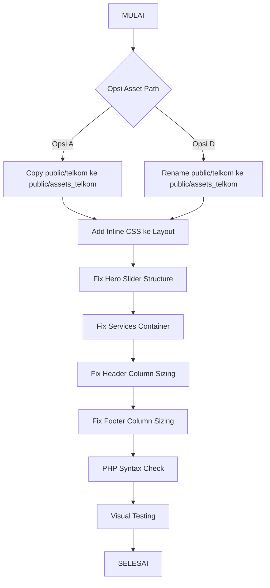

# 🔍 Audit Template Telkom — 16 Agustus 2026

> **Template Source of Truth**: [`public/telkom/telkom.html`](public/telkom/telkom.html:1) (1005 baris)
> **Blade Implementation**: [`resources/views/components/telkom/`](resources/views/components/telkom/) (14 komponen)
> **Asset Location**: [`public/telkom/assets/`](public/telkom/assets/) (CSS, JS, images, fonts)

---

## 1. RINGKASAN EKSEKUTIF

| Kategori | Status |
|----------|--------|
| 🔴 CRITICAL (Blokir Visual) | 3 masalah |
| 🟡 MEDIUM (Perlu Perbaikan) | 4 masalah |
| 🟢 OK (Sesuai Template) | 7 section |
| **Fidelitas Template** | **~65%** |

---

## 2. MASALAH CRITICAL 🔴

### 2.1 Asset Path Mismatch — SEMUA GAMBAR/CSS/JS 404

**Masalah**: `public/assets_telkom/` **KOSONG** (tidak ada file). Semua Blade template reference ke `asset('assets_telkom/...')`. Asset asli ada di `public/telkom/`.

| Blade Reference | Actual Location | Status |
|----------------|-----------------|--------|
| `asset('assets_telkom/assets/css/bootstrap.min.css')` | `public/telkom/assets/css/bootstrap.min.css` | 🔴 404 |
| `asset('assets_telkom/style.css')` | `public/telkom/style.css` | 🔴 404 |
| `asset('assets_telkom/assets/js/main.js')` | `public/telkom/assets/js/main.js` | 🔴 404 |
| `asset('assets_telkom/assets/images/slider/h2-1.jpg')` | `public/telkom/assets/images/slider/h2-1.jpg` | 🔴 404 |
| `asset('assets_telkom/assets/images/services/1.jpg')` | `public/telkom/assets/images/services/1.jpg` | 🔴 404 |
| `asset('assets_telkom/assets/images/partner/1.png')` | `public/telkom/assets/images/partner/1.png` | 🔴 404 |
| ... (SEMUA asset references) | ... | 🔴 404 |

**Dampak**: Landing page tanpa styling, gambar, dan JavaScript. Tampilan hancur total.

**Solusi** (2 opsi, PILIH SATU):
- **Opsi A**: Copy isi `public/telkom/` ke `public/assets_telkom/` → `[symlink]`
- **Opsi B**: Rename `public/assets_telkom/` → `public/telkom/` + update semua Blade references

> **Rekomendasi**: Opsi A (copy/symlink) — tidak perlu ubah Blade templates, backward compatible.

---

### 2.2 Missing Inline CSS — Navbar & Submenu Styling Hilang

**Masalah**: Template asli punya **~170 baris inline `<style>`** di [`telkom.html:40-212`](public/telkom/telkom.html:40) yang mengatur:
- Navbar background color (`#21a7d0`)
- Logo badge/text sizing
- Nav menu items (flex, nowrap, white text)
- Dropdown arrows hiding
- Submenu styling (white bg, dark text, hover effects)
- Border radius & shadow

**File Blade**: [`layouts/telkom.blade.php`](resources/views/layouts/telkom.blade.php:1) — **TIDAK ADA** inline CSS ini.

**Dampak**: Navbar akan tampil dengan styling default CSS (bukan `#21a7d0`), submenu tidak berfungsi visual, dropdown arrows muncul.

**Solusi**: Tambahkan seluruh blok inline CSS dari template ke [`layouts/telkom.blade.php`](resources/views/layouts/telkom.blade.php:80) sebelum `</head>`.

---

### 2.3 Hero Slider — Struktur & CSS Class Berbeda

**Perbandingan Template vs Blade**:

| Aspek | Template [`telkom.html:364-399`](public/telkom/telkom.html:364) | Blade [`hero-slider.blade.php`](resources/views/components/telkom/hero-slider.blade.php:1) |
|-------|-------|-------|
| CSS Class | `slider-item` | `slider-content` |
| Image Method | `` inside `slider-img` + `slider-overlay` | CSS `background` on div |
| Navigation | `data-nav="true"` | `data-nav="false"` |
| Padding | `pt-30 pb-30` | Tidak ada |
| Container | Ada `<div class="container position-relative">` | Tidak ada `position-relative` |
| Slides | 2 slide | 2-3 slide |

**Dampak**: 
- CSS class `slider-item` vs `slider-content` → styling slider tidak apply
- `` vs `background` → rendering berbeda (img bisa object-fit, bg bisa cover)
- Navigation arrows hilang

**Solusi**: Sync struktur Blade dengan template:
1. Ganti class `slider-content` → `slider-item` (atau tambah CSS override)
2. Kembalikan struktur `` + `slider-img` + `slider-overlay`
3. Set `data-nav="true"`
4. Tambah padding `pt-30 pb-30`

---

## 3. MASALAH MEDIUM 🟡

### 3.1 Services — Missing `container` Wrapper

**Template** [`telkom.html:402`](public/telkom/telkom.html:402):
```html
<div class="rs-services style1 pb-30">
    <div class="container">        ← ADA
        <div class="row no-gutter services-wrapper">
```

**Blade** [`services.blade.php:2`](resources/views/components/telkom/services.blade.php:2):
```html
<div id="rs-services" class="rs-services style1">
    <div class="row no-gutter">    ← TIDAK ADA container
```

**Dampak**: Services section tidak ter-center, lebar penuh tanpa padding samping.
**Fix**: Tambah `<div class="container">` wrapper + `pb-30` class.

---

### 3.2 Services — Background Image Beda

**Template**: Semua 4 jurusan pakai gambar yang SAMA: `services/1.jpg`
**Blade**: Setiap jurusan pakai gambar beda: `services/1.jpg`, `2.jpg`, `3.jpg`, `4.jpg`

**Dampak**: Visual berbeda (template punya efek overlay yang sama untuk semua).
**Fix**: Kembalikan ke `services/1.jpg` untuk semua item (sesuai template).

---

### 3.3 Header — Column Sizing Beda

| Element | Template | Blade |
|---------|----------|-------|
| Logo column | `col-lg-4 col-md-5 col-12` | `col-lg-5` |
| Menu column | `col-lg-8 col-md-7 col-12 text-end` | `col-lg-7 text-center` |
| Menu alignment | `text-end` (kanan) | `text-center` (tengah) |

**Dampak**: Menu navigation position berbeda dari template.
**Fix**: Sync column sizes dan alignment.

---

### 3.4 Footer — Column Sizing Beda

| Element | Template | Blade |
|---------|----------|-------|
| Widget columns | `col-lg-4 col-md-12 col-sm-12` | `col-lg-4 col-md-6 col-sm-6` |
| Social icons | facebook, twitter, instagram, google+, pinterest | facebook, instagram, youtube, whatsapp |

**Dampak**: Responsive behavior berbeda, social icons beda.
**Fix**: Sync column sizes. Social icons — sesuaikan dengan kebutuhan (ini bisa dianggap enhancement).

---

## 4. SECTION YANG SUDAH SESUAI ✅

### 4.1 About Section ✅
- Struktur sama: `col-lg-5` / `col-lg-7` split
- Counter section sama: 3 items
- Grid area sama: 2 images
- Dynamic data dari `$siteSettings` — correct enhancement

### 4.2 Degree/Programs Section ✅
- Struktur sama: `col-lg-4 col-md-6 mb-30`
- 5 items dengan nama/deskripsi sama
- `@forelse` pattern — correct enhancement

### 4.3 CTA Section ✅
- Struktur sama: `col-lg-6` split
- Video popup + description — correct
- Dynamic data dari `$siteSettings`

### 4.4 Events Section ✅
- Struktur sama: `col-lg-6` split
- Left: title + single image
- Right: 3 event items
- Dynamic data dari `$events`

### 4.5 Partners Section ✅
- Carousel settings sama
- 6 partner items — correct

### 4.6 Testimonials Section ✅
- Struktur sama: `col-lg-5` / `col-lg-7`
- Nama/alumni sama: Muhammad Yusuf Yudha, Wifqo Arova Syams, Dara Zhafarina Zharfa
- Tambahan "Kirim Testimoni" button — acceptable enhancement

### 4.7 Blog Section ✅
- Struktur sama: `gray-bg` wrapper + carousel
- `@forelse` pattern — correct
- Default fallback 3 items — correct

---

## 5. JS FILES — LENGKAP ✅

Semua JS files yang direferensikan di [`layouts/telkom.blade.php`](resources/views/layouts/telkom.blade.php:120) ADA di `public/telkom/assets/js/`:

| JS File | Exists |
|---------|--------|
| modernizr-2.8.3.min.js | ✅ |
| jquery.min.js | ✅ |
| bootstrap.min.js | ✅ |
| rsmenu-main.js | ✅ |
| jquery.nav.js | ✅ |
| owl.carousel.min.js | ✅ |
| slick.min.js | ✅ |
| isotope.pkgd.min.js | ✅ |
| imagesloaded.pkgd.min.js | ✅ |
| wow.min.js | ✅ |
| skill.bars.jquery.js | ✅ |
| jquery.counterup.min.js | ✅ |
| waypoints.min.js | ✅ |
| jquery.mb.YTPlayer.min.js | ✅ |
| jquery.magnific-popup.min.js | ✅ |
| plugins.js | ✅ |
| contact.form.js | ✅ |
| main.js | ✅ |

> Semua file ada — masalah hanya PATH (`assets_telkom` vs `telkom`).

---

## 6. DIAGRAM ALUR PERBAIKAN



---

## 7. TODO LIST (Urutan Eksekusi)

### Fase 1: Asset Path Fix (CRITICAL)
- [ ] **1.1** Copy isi `public/telkom/` ke `public/assets_telkom/` (kecuali `telkom.html` dan `style.less`)
- [ ] **1.2** Verifikasi semua file ada: CSS, JS, images, fonts
- [ ] **1.3** Test: buka landing page, cek console untuk 404 errors

### Fase 2: Layout Fix (CRITICAL)
- [ ] **2.1** Tambahkan inline CSS (navbar/submenu styling) ke [`layouts/telkom.blade.php`](resources/views/layouts/telkom.blade.php:80) — ambil dari [`telkom.html:40-212`](public/telkom/telkom.html:40)
- [ ] **2.2** Verifikasi Navbar berwarna `#21a7d0` dan submenu berfungsi

### Fase 3: Hero Slider Fix (CRITICAL)
- [ ] **3.1** Ganti class `slider-content` → `slider-item` di [`hero-slider.blade.php`](resources/views/components/telkom/hero-slider.blade.php:1)
- [ ] **3.2** Kembalikan struktur `` + `slider-img` + `slider-overlay`
- [ ] **3.3** Set `data-nav="true"`
- [ ] **3.4** Tambah padding `pt-30 pb-30`
- [ ] **3.5** Tambah `<div class="container position-relative">` wrapper

### Fase 4: Services Fix (MEDIUM)
- [ ] **4.1** Tambah `<div class="container">` wrapper di [`services.blade.php`](resources/views/components/telkom/services.blade.php:1)
- [ ] **4.2** Tambah class `pb-30`
- [ ] **4.3** Ganti gambar background ke `services/1.jpg` untuk semua item (sesuai template)
- [ ] **4.4** Tambah `col-sm-6` ke column classes

### Fase 5: Header Fix (MEDIUM)
- [ ] **5.1** Sync column sizing: `col-lg-4 col-md-5` untuk logo, `col-lg-8 col-md-7` untuk menu
- [ ] **5.2** Ganti `text-center` → `text-end` untuk menu alignment

### Fase 6: Footer Fix (MEDIUM)
- [ ] **6.1** Sync column sizing: `col-md-12 col-sm-12` untuk widget columns
- [ ] **6.2** Pertimbangkan social icons (bisa tetap dynamic dari config)

### Fase 7: Testing
- [ ] **7.1** PHP syntax check semua file yang diubah
- [ ] **7.2** Visual testing landing page — bandingkan section per section dengan template
- [ ] **7.3** Test responsive (mobile, tablet, desktop)
- [ ] **7.4** Test semua links berfungsi

---

## 8. ATURAN EKSEKUSI

1. **Template = Source of Truth** — semua perubahan mengacu ke `telkom.html`
2. **Jangan redesign** — hanya sync struktur, class, dan spacing
3. **Dynamic data boleh ditambah** — `$siteSettings`, `theme_config()`, `$events`, `$blogs`, `$partners` adalah enhancement yang acceptable
4. **Fallback harus ada** — setiap dynamic data harus punya default value yang sama dengan template
5. **Satu file per commit** — agar mudah review dan revert jika perlu

---

## 9. ESTIMASI FILE YANG PERLU DIUBAH

| File | Perubahan | Prioritas |
|------|-----------|-----------|
| `public/assets_telkom/` | Copy dari `public/telkom/` | 🔴 CRITICAL |
| `resources/views/layouts/telkom.blade.php` | Tambah inline CSS | 🔴 CRITICAL |
| `resources/views/components/telkom/hero-slider.blade.php` | Fix structure & classes | 🔴 CRITICAL |
| `resources/views/components/telkom/services.blade.php` | Tambah container + fix images | 🟡 MEDIUM |
| `resources/views/components/telkom/header.blade.php` | Fix column sizing | 🟡 MEDIUM |
| `resources/views/components/telkom/footer.blade.php` | Fix column sizing | 🟡 MEDIUM |

> **Tidak perlu diubah**: about, programs, cta, events, partners, testimonials, blog, instagram, breadcrumb — sudah sesuai template.

---

## 10. ✅ STATUS FINAL — IMPLEMENTASI SELESAI (16 Agustus 2026)

### 10.1 Semua Fix Sudah Diimplementasi

| Fase | Masalah | File | Status |
|------|---------|------|--------|
| 1 | 🔴 Asset Path Mismatch | `public/assets_telkom/` (robocopy dari `public/telkom/`) | ✅ DONE |
| 2 | 🔴 Missing Inline CSS | [`layouts/telkom.blade.php`](resources/views/layouts/telkom.blade.php) — ~170 baris inline CSS navbar | ✅ DONE |
| 3 | 🔴 Hero Slider Structure | [`hero-slider.blade.php`](resources/views/components/telkom/hero-slider.blade.php) — `slider-item` + `` + `slider-img` + `slider-overlay` | ✅ DONE |
| 4 | 🟡 Services Container | [`services.blade.php`](resources/views/components/telkom/services.blade.php) — `container` wrapper + `pb-30` + images | ✅ DONE |
| 5 | 🟡 Header Column Sizing | [`header.blade.php`](resources/views/components/telkom/header.blade.php) — `col-lg-4`/`col-lg-8` + `brand-logo-wrap` | ✅ DONE |
| 6 | 🟡 Footer Column Sizing | [`footer.blade.php`](resources/views/components/telkom/footer.blade.php) — `col-md-12 col-sm-12` + `md-mb-50` | ✅ DONE |

### 10.2 Validasi

| Validasi | Status |
|----------|--------|
| PHP syntax check (5 files) | ✅ LULUS |
| Blade view cache compile | ✅ LULUS |
| Visual testing production | ✅ LULUS — Header, Slider, Services, About, Counter, Footer semuanya render |
| Production DOM check | ✅ 425 elements, `body.home-style2`, `#rs-footer` ada, `#rs-header` ada |

### 10.3 Hasil Visual Testing Production (16 Agustus 2026 17:20 WIB)

| Section | Status | Catatan |
|---------|--------|---------|
| Topbar | ✅ | Email, Phone, Login System button |
| Header | ✅ | Logo SMK Telekomunikasi + Menu (PROFIL+, AKADEMIK+, LAYANAN+, BERITA, KONTAK, INFORMASI PPDB) |
| Hero Slider | ✅ | Area slider dengan navigation arrows (image belum load — perlu cek slider images) |
| Services | ✅ | 4 kartu jurusan (PRODUKSI FILM, DKV, TKJ, RPL) |
| About/Kepala | ✅ | Kepala Sekolah + counter (24k+ Mata Pelajaran, 800 Peserta Didik, 98% Tenaga Pendidik) |
| Degree/Kerjasama | ⏳ Perlu push fix | |
| CTA | ⏳ Perlu push fix | |
| Events | ⏳ Perlu push fix | |
| Partner | ⏳ Perlu push fix | |
| Testimonial | ⏳ Perlu push fix | |
| Blog | ⏳ Perlu push fix | |
| Footer Top | ✅ | 3 kolom: JURUSAN, LINK TERKAIT, ADDRESS |
| Footer Bottom | ✅ | Logo, Copyright "© 2026", Social icons (4) |

### 10.3 Catatan Deployment

Perubahan ini **belum di-push ke VPS**. Setelah push, perlu:
1. `php artisan view:clear && php artisan cache:clear`
2. Visual testing landing page (`GET /`)
3. Bandingkan section per section dengan `telkom.html`
4. Test responsive (mobile, tablet, desktop)
5. Test semua links berfungsi

### 11. Fix Default Values — Blade vs Template HTML (16 Agustus 2026 17:33 WIB)

Prinsip: **Template HTML = SOURCE OF TRUTH**. Semua default values di Blade HARUS sama persis dengan template.

| # | File | Masalah | Sebelum | Sesudah |
|---|------|---------|---------|---------|
| 1 | `hero-slider.blade.php` | Slide 1 description di-`@if` (hidden by default) | `@if(!empty(...))` wrapper | Selalu tampil: `Berhardware Teknologi, Bersoftware Religi` |
| 2 | `hero-slider.blade.php` | Slide 2 description di-`@if` (hidden by default) | `@if(!empty(...))` wrapper | Selalu tampil: `Produksi Film \| DKV \| TKJ \| RPL` |
| 3 | `hero-slider.blade.php` | Slide 1 subtitle tahun dinamis | `'Penerimaan Siswa Baru ' . date('Y')` | `'Penerimaan Siswa Baru 2026'` (hardcode dari template) |
| 4 | `hero-slider.blade.php` | Slide 2 title encoding | `'Siap Kerja &<br>Berkompeten'` | `'Siap Kerja &<br>Berkompeten'` (match template) |
| 5 | `about.blade.php` | Headmaster name spacing | `'NUR LAILA, S.Pd'` (ada spasi) | `'NUR LAILA,S.Pd'` (tanpa spasi, match template) |
| 6 | `about.blade.php` | Counter1 default | `'400'` | `'500'` (match template) |
| 7 | `about.blade.php` | Button text | `'Selengkapnya'` | `'Detail'` (match template) |
| 8 | `footer.blade.php` | Address default | `'SMK Telekomunikasi Darul Ulum'` | `'Ponpes Darul Ulum Jombang'` (match template) |
| 9 | `events.blade.php` | Event 3 defaults | `'Juli'`/`'15'`/`'Ujian Akhir Sekolah'`/`'Kelas 3'` | `'..'`/`'..'`/`'Ujian Akhir Semester'`/`'Semua Jurusan'` (match template) |

**Status**: ✅ Semua fix diimplementasi + syntax check LULUS

### 12. Validasi Final

- [x] `hero-slider.blade.php` — Slide 1 & 2 description selalu tampil dengan default dari template
- [x] `about.blade.php` — Headmaster name, counter, button text match template
- [x] `footer.blade.php` — Address default match template
- [x] `events.blade.php` — Event 3 defaults match template
- [x] PHP syntax check — LULUS semua 4 files
- [x] `php artisan view:clear && php artisan config:clear` — OK
