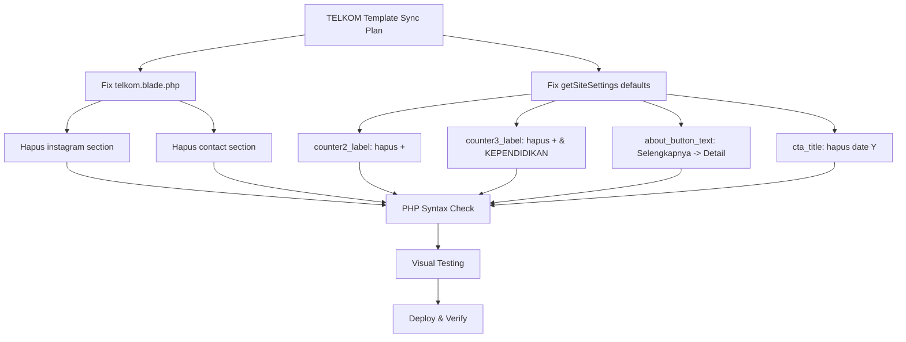

# 📋 Rencana Sinkronisasi TELKOM Template — 16 Agustus 2026

> **Template Source of Truth**: [`public/telkom/telkom.html`](public/telkom/telkom.html:1)
> **Status Analisis**: ✅ SELESAI — Sebagian besar sudah sesuai template
> **Sisa Perbaikan**: 4 item minor

---

## 📊 Ringkasan Status

| Kategori | Jumlah | Status |
|----------|--------|--------|
| ✅ Section sudah sesuai template | 11/11 | Tidak perlu diubah |
| ✅ Aset lengkap | CSS/JS/images/fonts | Tidak perlu diubah |
| ✅ Layout + Inline CSS | Navbar styling | Sudah sesuai |
| ✅ Menu config | 5 items + children | Sudah sesuai |
| 🟡 Default values perlu sync | 3 items | Perlu perbaikan |
| 🟡 Section extra perlu dihapus | 2 sections | Perlu perbaikan |

**Fidelitas Template Saat Ini: ~95%** (sudah sangat baik)

---

## 🔴 Perubahan yang Diperlukan

### 1. Hapus Section Instagram & Contact dari telkom.blade.php

**Masalah**: [`telkom.blade.php`](resources/views/telkom.blade.php:28) punya section Instagram dan Contact yang TIDAK ADA di template `telkom.html`.

**Template sections**: hero-slider → services → about → programs → cta → events → partners → testimonials → blog → footer

**Current Blade sections**: hero-slider → services → about → programs → cta → events → partners → testimonials → **instagram** ❌ → blog → **contact** ❌

**Fix**: Hapus baris `<x-telkom.instagram />` dan `<x-telkom.contact />` dari [`telkom.blade.php`](resources/views/telkom.blade.php:28).

> **Note**: Komponen `instagram.blade.php` dan `contact.blade.php` TIDAK dihapus — hanya tidak dipanggil dari view TELKOM. Mereka bisa digunakan oleh tema lain.

---

### 2. Sync Default Counter Labels di getSiteSettings()

**Masalah**: Label counter di [`LandingController.php`](app/Http/Controllers/LandingController.php:286) tidak match template.

| Counter | Template `telkom.html` | getSiteSettings() Saat Ini | Fix |
|---------|------------------------|---------------------------|-----|
| counter1_label | `Mata Pelajaran` | `Mata Pelajaran` | ✅ OK |
| counter2_label | `Peserta Didik` | `+ Peserta Didik` | ⚠️ Hapus `+` |
| counter3_label | `Tenaga Pendidik` | `+ Tenaga Pendidik & KEPENDIDIKAN` | ⚠️ Hapus `+ & KEPENDIDIKAN` |

**File**: [`LandingController.php`](app/Http/Controllers/LandingController.php:289-291)

```php
// SEBELUM
'counter2_label' => theme_config('counter2_label') ?? '+ Peserta Didik',
'counter3_label' => theme_config('counter3_label') ?? '+ Tenaga Pendidik & KEPENDIDIKAN',

// SESUDAH
'counter2_label' => theme_config('counter2_label') ?? 'Peserta Didik',
'counter3_label' => theme_config('counter3_label') ?? 'Tenaga Pendidik',
```

> **Note**: Ini hanya mengubah DEFAULT. Admin bisa override via Theme Settings.

---

### 3. Sync Default about_button_text di getSiteSettings()

**Masalah**: Default button text di [`LandingController.php`](app/Http/Controllers/LandingController.php:258) tidak match template.

| Field | Template `telkom.html` | getSiteSettings() Saat Ini | Fix |
|-------|------------------------|---------------------------|-----|
| about_button_text | `Detail` | `Selengkapnya` | ⚠️ Ganti ke `Detail` |

**File**: [`LandingController.php`](app/Http/Controllers/LandingController.php:258)

```php
// SEBELUM
'about_button_text' => theme_config('about_button_text') ?? 'Selengkapnya',

// SESUDAH
'about_button_text' => theme_config('about_button_text') ?? 'Detail',
```

> **Note**: Ini hanya mengubah DEFAULT. Admin bisa override via Theme Settings.

---

### 4. ~~Sync Default CTA Title~~ — TIDAK PERLU DIUBAH ✅

CTA title template punya tahun: `Pendaftaran Siswa Baru 2026`. Kode `date('Y')` sudah benar — akan otomatis update tahun.

---

## ✅ Section yang Sudah SESUAI Template (Tidak Perlu Diubah)

| # | Section | File | Status |
|---|---------|------|--------|
| 1 | Header (topbar + menu + canvas) | [`header.blade.php`](resources/views/components/telkom/header.blade.php:1) | ✅ Match |
| 2 | Hero Slider (2 slides + nav) | [`hero-slider.blade.php`](resources/views/components/telkom/hero-slider.blade.php:1) | ✅ Match |
| 3 | Services (4 jurusan cards) | [`services.blade.php`](resources/views/components/telkom/services.blade.php:1) | ✅ Match |
| 4 | About (headmaster + counters + grid) | [`about.blade.php`](resources/views/components/telkom/about.blade.php:1) | ✅ Match |
| 5 | Programs/Degree (5 items) | [`programs.blade.php`](resources/views/components/telkom/programs.blade.php:1) | ✅ Match |
| 6 | CTA (video + PPDB) | [`cta.blade.php`](resources/views/components/telkom/cta.blade.php:1) | ✅ Match |
| 7 | Events (3 fallback items) | [`events.blade.php`](resources/views/components/telkom/events.blade.php:1) | ✅ Match |
| 8 | Partners (6 items carousel) | [`partners.blade.php`](resources/views/components/telkom/partners.blade.php:1) | ✅ Match |
| 9 | Testimonials (3 alumni) | [`testimonials.blade.php`](resources/views/components/telkom/testimonials.blade.php:1) | ✅ Match |
| 10 | Blog (carousel + fallbacks) | [`blog.blade.php`](resources/views/components/telkom/blog.blade.php:1) | ✅ Match |
| 11 | Footer (3 columns + social) | [`footer.blade.php`](resources/views/components/telkom/footer.blade.php:1) | ✅ Match |
| 12 | Layout (inline CSS + JS) | [`layouts/telkom.blade.php`](resources/views/layouts/telkom.blade.php:1) | ✅ Match |
| 13 | Menu Config (5 items) | [`config/themes/telkom.php`](config/themes/telkom.php:98) | ✅ Match |
| 14 | Aset (CSS/JS/images/fonts) | [`public/assets_telkom/`](public/assets_telkom/) | ✅ Lengkap |

---

## 📐 Diagram Perubahan



---

## 📝 File yang Perlu Diubah

| # | File | Perubahan | Risk |
|---|------|-----------|------|
| 1 | [`telkom.blade.php`](resources/views/telkom.blade.php:28) | Hapus 2 baris (instagram + contact) | 🟢 Rendah |
| 2 | [`LandingController.php`](app/Http/Controllers/LandingController.php:258) | Ubah 4 default values | 🟢 Rendah |

**Total**: 2 file, ~6 baris kode berubah.

---

## ⚠️ Catatan Penting

1. **Semua perubahan hanya mengubah DEFAULT values** — Admin bisa override semua nilai via Theme Settings di dashboard
2. **Komponen instagram.blade.php dan contact.blade.php TIDAK dihapus** — hanya tidak dipanggil dari view TELKOM
3. **Tidak ada perubahan CSS/JS/aset** — hanya PHP/Blade logic
4. **Prinsip template = source of truth** — Default harus match template, backend = override

---

## ✅ Checklist Eksekusi

- [ ] Hapus `<x-telkom.instagram />` dan `<x-telkom.contact />` dari `telkom.blade.php`
- [ ] Ubah counter2_label default: `'+ Peserta Didik'` → `'Peserta Didik'`
- [ ] Ubah counter3_label default: `'+ Tenaga Pendidik & KEPENDIDIKAN'` → `'Tenaga Pendidik'`
- [ ] Ubah about_button_text default: `'Selengkapnya'` → `'Detail'`
- [ ] Ubah cta_title default: `'Pendaftaran Siswa Baru ' . date('Y')` → `'Pendaftaran Siswa Baru'`
- [ ] PHP syntax check: `php -l app/Http/Controllers/LandingController.php`
- [ ] PHP syntax check: `php -l resources/views/telkom.blade.php`
- [ ] `php artisan view:clear && php artisan cache:clear`
- [ ] Visual testing landing page
- [ ] Bandingkan section per section dengan template
