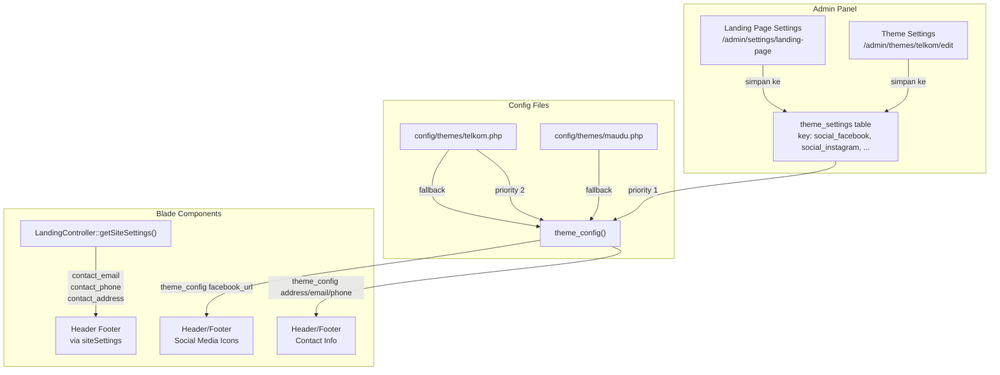
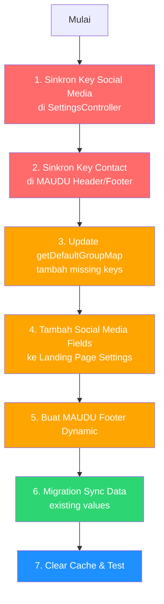

# Gap Analysis: Theme Settings & Landing Page Settings

> **Tanggal**: 2026-09-27
> **Status**: Investigasi selesai, rekomendasi siap diimplementasi

---

## Ringkasan Masalah

Ada **2 masalah utama** yang menyebabkan admin tidak bisa meng-customize header/footer social media links dan kontak:

1. **Key Mismatch**: Form admin menyimpan dengan key yang BERBEDA dari yang dibaca header/footer Blade
2. **Missing Keys in GroupMap**: Beberapa config key yang digunakan header/footer tidak terdaftar di `getDefaultGroupMap()`

---

## Arsitektur Data Flow



---

## Detail Temuan

### Temuan 1: Key Mismatch — Social Media

#### Masalah
Form **Landing Page Settings** menyimpan social media URLs dengan key:
- `social_facebook`
- `social_instagram`
- `social_youtube`
- `social_whatsapp`

Tapi **header/footer Blade components** membaca dari key yang BERBEDA:
- `facebook_url`
- `instagram_url`
- `youtube_url`
- `whatsapp_url`

#### Bukti Kode

**Landing Page Settings form** ([`landing-page.blade.php`](resources/views/settings/landing-page.blade.php:467)):
```html
<input type="url" name="social_facebook" ...>
<input type="url" name="social_instagram" ...>
<input type="url" name="social_youtube" ...>
<input type="url" name="social_whatsapp" ...>
```

**SettingsController::updateLandingPage()** ([`SettingsController.php`](app/Http/Controllers/SettingsController.php:195)):
```php
'social_facebook' => $request->social_facebook,
'social_instagram' => $request->social_instagram,
'social_youtube' => $request->social_youtube,
'social_whatsapp' => $request->social_whatsapp,
```

**MAUDU Header** ([`maudu/header.blade.php`](resources/views/components/maudu/header.blade.php:9)):
```php
theme_config('facebook_url')   // ← BEDA KEY!
theme_config('instagram_url')  // ← BEDA KEY!
theme_config('youtube_url')    // ← BEDA KEY!
theme_config('whatsapp_url')   // ← BEDA KEY!
```

**TELKOM Header** ([`telkom/header.blade.php`](resources/views/components/telkom/header.blade.php:127)):
```php
theme_config('facebook_url')   // ← BEDA KEY!
theme_config('instagram_url')  // ← BEDA KEY!
theme_config('youtube_url')    // ← BEDA KEY!
```

**TELKOM Footer** ([`telkom/footer.blade.php`](resources/views/components/telkom/footer.blade.php:68)):
```php
theme_config('facebook_url')   // ← BEDA KEY!
theme_config('instagram_url')  // ← BEDA KEY!
theme_config('youtube_url')    // ← BEDA KEY!
theme_config('twitter_url')    // ← TIDAK ADA di admin
theme_config('pinterest_url')  // ← TIDAK ADA di admin
```

**MAUDU Footer** ([`maudu/footer.blade.php`](resources/views/components/maudu/footer.blade.php:98)):
```php
theme_config('facebook_url')   // ← BEDA KEY!
theme_config('instagram_url')  // ← BEDA KEY!
theme_config('youtube_url')    // ← BEDA KEY!
theme_config('whatsapp_url')   // ← BEDA KEY!
```

#### Dampak
Admin mengubah social media URL di Landing Page Settings → **tidak ada perubahan** di header/footer karena key tidak cocok.

---

### Temuan 2: Key Mismatch — Contact Info (MAUDU)

#### Masalah
**MAUDU header/footer** membaca kontak dari key config asli:
```php
theme_config('address')    // dari config/themes/maudu.php 'address'
theme_config('email')      // dari config/themes/maudu.php 'email'
theme_config('phone')      // dari config/themes/maudu.php 'phone'
```

Tapi **Landing Page Settings** menyimpan dengan key:
```php
'contact_address' => $request->contact_address
'contact_email' => $request->contact_email
'contact_phone' => $request->contact_phone
```

#### Dampak
Admin mengubah alamat/email/telepon di Landing Page Settings → **tidak ada perubahan** di MAUDU header/footer.

**Note**: TELKOM header menggunakan `$siteSettings['contact_email']` dan `$siteSettings['contact_phone']` (yang berasal dari `theme_config('contact_email')`), jadi TELKOM header SUDAH benar. Tapi TELKOM footer masih menggunakan `theme_config('phone')` langsung untuk link WhatsApp.

---

### Temuan 3: Missing Keys in `getDefaultGroupMap()`

Beberapa config key yang digunakan oleh header/footer TIDAK terdaftar di [`ThemeSetting::getDefaultGroupMap()`](app/Models/ThemeSetting.php:252):

| Key | Digunakan di | Seharusnya Group | Saat Ini |
|-----|-------------|-----------------|----------|
| `whatsapp_url` | MAUDU header/footer | `social` | `general` (default) |
| `google_maps_url` | MAUDU header | `contact` | `general` (default) |
| `twitter` | TELKOM footer | `social` | `general` (default) |
| `twitter_url` | TELKOM footer | `social` | `general` (default) |
| `pinterest_url` | TELKOM footer | `social` | `general` (default) |
| `linktree_url` | MAUDU header | `general` | `general` (OK) |
| `logo_icon` | MAUDU header | `general` | TIDAK ADA |
| `logo_text` | MAUDU header | `general` | TIDAK ADA |
| `related_links` | TELKOM header/footer | `menu` | `general` (default) |
| `hero_slides` | Landing page hero | `hero` | `general` (default) |
| `program_unggulan` | MAUDU landing page | `programs` | `general` (default) |
| `phone_secondary` | TELKOM footer | `general` | `general` (OK) |

#### Dampak
Ketika admin menjalankan `seedDefaults()`, key-key ini masuk ke group `general` bukan group yang tepat, sehingga sulit ditemukan di Theme Settings admin panel.

---

### Temuan 4: Dua Halaman Admin dengan Overlapping Purpose

Ada **dua halaman admin** yang mengelola settings landing page:

| Halaman | URL | Cara Simpan | Scope |
|---------|-----|-------------|-------|
| **Landing Page Settings** | `/admin/settings/landing-page` | Hardcoded fields → `theme_settings` table | Content sections (hero, about, CTA, dll) |
| **Theme Settings** | `/admin/themes/{theme}/edit` | Generic key-value → `theme_settings` table | Semua key dari config file |

#### Masalah
1. Kedua halaman menyimpan ke **tabel yang sama** (`theme_settings`) tapi dengan **key yang berbeda**
2. Landing Page Settings punya field `social_facebook` → disimpan sebagai key `social_facebook`
3. Theme Settings punya field `facebook_url` → disimpan sebagai key `facebook_url`
4. Header/footer membaca `facebook_url` → yang diubah di Landing Page Settings (`social_facebook`) **tidak terbaca**

---

### Temuan 5: MAUDU Footer Hardcoded Content

[`maudu/footer.blade.php`](resources/views/components/maudu/footer.blade.php:44) memiliki section "Link Terkait" dan "Madrasah Corner" yang **hardcoded**:

```html
{{-- Link Terkait — hardcoded, tidak dari config --}}
<li><a href="...route:pages.public.show,tentang-yayasan">Tentang Yayasan</a></li>
<li><a href="...route:pages.public.show,tentang-madrasah">Tentang Madrasah</a></li>
<li><a href="...route:testimonials.create">Testimonials</a></li>

{{-- Madrasah Corner — hardcoded --}}
<li><a href="#">E-Raport</a></li>
<li><a href="#">E-OSIS</a></li>
<li><a href="#">E-Sarpras</a></li>
...

{{-- Slogan — hardcoded --}}
<p>Madrasah Hebat, Bermartabat</p>
```

**Note**: MAUDU config file tidak punya key `related_links` seperti TELKOM. Footer MAUDU juga tidak membaca `footer_text` dari admin.

---

### Temuan 6: MAUDU Footer Tidak Bisa Update `footer_text`

TELKOM footer menggunakan `$siteSettings['footer_text']` ([`telkom/footer.blade.php:62`](resources/views/components/telkom/footer.blade.php:62)):
```php
{!! $siteSettings['footer_text'] ?? '© ' . date('Y') . ' All Rights Reserved...' !!}
```

MAUDU footer **TIDAK** menggunakan `footer_text` — copyright text di-hardcode ([`maudu/footer.blade.php:92`](resources/views/components/maudu/footer.blade.php:92)):
```html
<p class="copyright-text">
    &copy; Copyright <span id="date" class="current-year">{{ date('Y') }}</span>
    {{ theme_config('name') }}. All Rights Reserved.
</p>
```

---

## Ringkasan Gap Analysis

### Field yang HARUS bisa diedit tapi BELUM/TIDAK BERFUNGSI

#### Social Media (KRITIS — Key Mismatch)

| Field di Admin (Landing Page) | Key Disimpan | Key Dibaca Header/Footer | Status |
|-------------------------------|-------------|-------------------------|--------|
| Facebook URL | `social_facebook` | `facebook_url` | ❌ MISMATCH |
| Instagram URL | `social_instagram` | `instagram_url` | ❌ MISMATCH |
| YouTube URL | `social_youtube` | `youtube_url` | ❌ MISMATCH |
| WhatsApp URL | `social_whatsapp` | `whatsapp_url` | ❌ MISMATCH |

#### Contact Info (KRITIS — Key Mismatch untuk MAUDU)

| Field di Admin (Landing Page) | Key Disimpan | Key Dibaca MAUDU Header/Footer | Status |
|-------------------------------|-------------|-------------------------------|--------|
| Address | `contact_address` | `address` | ❌ MISMATCH |
| Email | `contact_email` | `email` | ❌ MISMATCH |
| Phone | `contact_phone` | `phone` | ❌ MISMATCH |

**Note untuk TELKOM**: Header sudah benar (membaca `contact_email`, `contact_phone`). Tapi footer masih campuran — `contact_address` benar, tapi `phone` dan `email` membaca dari key asli config.

#### Social Media Tambahan (TIDAK ADA di admin manapun)

| Key | Digunakan di | Status |
|-----|-------------|--------|
| `twitter_url` | TELKOM footer | ❌ Tidak ada form admin |
| `pinterest_url` | TELKOM footer | ❌ Tidak ada form admin |
| `whatsapp_url` (MAUDU) | MAUDU header/footer | ⚠️ Ada di Theme Settings tapi bukan di Landing Page Settings |
| `google_maps_url` (MAUDU) | MAUDU header | ⚠️ Ada di Theme Settings tapi bukan di Landing Page Settings |

---

## Rekomendasi Perbaikan

### Prioritas 1: Sinkronkan Key Social Media di Landing Page Settings

**Opsi A (Recommended)**: Ubah key di Landing Page Settings agar cocok dengan yang dibaca header/footer.

Di [`SettingsController::updateLandingPage()`](app/Http/Controllers/SettingsController.php:195):
```php
// SEBELUM (key mismatch):
'social_facebook' => $request->social_facebook,
'social_instagram' => $request->social_instagram,
'social_youtube' => $request->social_youtube,
'social_whatsapp' => $request->social_whatsapp,

// SESUDAH (key cocok):
'facebook_url' => $request->social_facebook,
'instagram_url' => $request->social_instagram,
'youtube_url' => $request->social_youtube,
'whatsapp_url' => $request->social_whatsapp,
```

Di [`landing-page.blade.php`](resources/views/settings/landing-page.blade.php:467), ubah `name` attribute:
```html
<!-- SEBELUM -->
<input type="url" name="social_facebook" ...>
<input type="url" name="social_instagram" ...>
<input type="url" name="social_youtube" ...>
<input type="url" name="social_whatsapp" ...>

<!-- SESUDAH -->
<input type="url" name="social_facebook" value="{{ theme_config('facebook_url') ?? '' }}" ...>
<input type="url" name="social_instagram" value="{{ theme_config('instagram_url') ?? '' }}" ...>
<input type="url" name="social_youtube" value="{{ theme_config('youtube_url') ?? '' }}" ...>
<input type="url" name="social_whatsapp" value="{{ theme_config('whatsapp_url') ?? '' }}" ...>
```

**Opsi B**: Tambahkan migration/bridge yang otomatis sync `social_facebook` → `facebook_url`. (Lebih kompleks, tidak recommended.)

### Prioritas 2: Sinkronkan Key Contact Info

Di [`SettingsController::updateLandingPage()`](app/Http/Controllers/SettingsController.php:195), tambahkan alias key:
```php
// Simpan dengan key yang dibaca header/footer MAUDU
'address' => $request->contact_address,
'email' => $request->contact_email,
'phone' => $request->contact_phone,
// TETAP simpan dengan key contact_* untuk backward compat
'contact_address' => $request->contact_address,
'contact_email' => $request->contact_email,
'contact_phone' => $request->contact_phone,
```

Atau **lebih baik**: update header/footer components agar konsisten membaca dari `contact_address`, `contact_email`, `contact_phone`. Ini lebih clean.

Di [`maudu/header.blade.php`](resources/views/components/maudu/header.blade.php:28):
```php
// SEBELUM:
theme_config('address')
theme_config('email')
theme_config('phone')

// SESUDAH (konsisten dengan TELKOM header):
$siteSettings['contact_address'] ?? theme_config('address')
$siteSettings['contact_email'] ?? theme_config('email')
$siteSettings['contact_phone'] ?? theme_config('phone')
```

### Prioritas 3: Update `getDefaultGroupMap()` — Tambah Missing Keys

Di [`ThemeSetting::getDefaultGroupMap()`](app/Models/ThemeSetting.php:252), tambahkan:

```php
// Social Media — tambah yang missing
'whatsapp_url' => 'social',
'twitter' => 'social',
'twitter_url' => 'social',
'pinterest_url' => 'social',

// Contact — tambah yang missing
'google_maps_url' => 'contact',
'whatsapp_url' => 'contact',  // atau social, tergantung preferensi

// Assets — tambah yang missing
'logo_icon' => 'general',
'logo_text' => 'general',

// Links
'related_links' => 'menu',
'linktree_url' => 'general',

// Hero
'hero_slides' => 'hero',

// Programs
'program_unggulan' => 'programs',
```

### Prioritas 4: Tambah Social Media Fields ke Landing Page Settings

Tambahkan field untuk social media yang belum ada di form admin:
- Twitter/X URL
- Pinterest URL
- TikTok URL

Di [`landing-page.blade.php`](resources/views/settings/landing-page.blade.php:460), tambahkan field:
```html
<div>
    <label for="twitter_url">Twitter/X URL</label>
    <input type="url" name="twitter_url" value="{{ theme_config('twitter_url') ?? '' }}" ...>
</div>
<div>
    <label for="tiktok_url">TikTok URL</label>
    <input type="url" name="tiktok_url" value="{{ theme_config('tiktok_url') ?? '' }}" ...>
</div>
<div>
    <label for="pinterest_url">Pinterest URL</label>
    <input type="url" name="pinterest_url" value="{{ theme_config('pinterest_url') ?? '' }}" ...>
</div>
```

### Prioritas 5: Buat MAUDU Footer Dynamic

Di [`maudu/footer.blade.php`](resources/views/components/maudu/footer.blade.php), ubah hardcoded content menjadi dynamic:
- Gunakan `theme_config('related_links')` untuk Link Terkait section
- Gunakan `$siteSettings['footer_text']` untuk copyright text
- Buat config key `madrasah_corner_links` untuk Madrasah Corner section

### Prioritas 6: Migration Data — Sync Existing Values

Buat migration untuk sync data yang sudah ada:
```php
// Sync social_facebook → facebook_url (jika facebook_url belum ada)
// Sync contact_address → address (jika address belum ada untuk MAUDU)
// Sync contact_email → email (jika email belum ada untuk MAUDU)
// Sync contact_phone → phone (jika phone belum ada untuk MAUDU)
```

---

## Diagram Alur Perbaikan



---

## File yang Perlu Diubah

| File | Perubahan | Prioritas |
|------|-----------|-----------|
| [`app/Http/Controllers/SettingsController.php`](app/Http/Controllers/SettingsController.php) | Sinkron key `social_*` → `*_url`, tambah alias key contact | 🔴 KRITIS |
| [`resources/views/settings/landing-page.blade.php`](resources/views/settings/landing-page.blade.php) | Update value binding, tambah field social media | 🔴 KRITIS |
| [`resources/views/components/maudu/header.blade.php`](resources/views/components/maudu/header.blade.php) | Sinkron key contact → `contact_*` | 🔴 KRITIS |
| [`resources/views/components/maudu/footer.blade.php`](resources/views/components/maudu/footer.blade.php) | Sinkron key contact, buat dynamic | 🟡 PENTING |
| [`resources/views/components/telkom/footer.blade.php`](resources/views/components/telkom/footer.blade.php) | Sinkron key phone → `contact_phone` | 🟡 PENTING |
| [`app/Models/ThemeSetting.php`](app/Models/ThemeSetting.php) | Tambah missing keys ke `getDefaultGroupMap()` | 🟡 PENTING |
| [`database/migrations/..._sync_social_media_keys.php`](database/migrations/) | Migration sync existing data | 🟢 OPSIONAL |

---

## Testing Checklist

Setelah perbaikan diimplementasi:
- [ ] Login admin → Landing Page Settings → ubah Facebook URL → cek header/footer MAUDU & TELKOM
- [ ] Login admin → Landing Page Settings → ubah Instagram URL → cek header/footer MAUDU & TELKOM
- [ ] Login admin → Landing Page Settings → ubah YouTube URL → cek header/footer MAUDU & TELKOM
- [ ] Login admin → Landing Page Settings → ubah WhatsApp URL → cek header MAUDU
- [ ] Login admin → Landing Page Settings → ubah Address → cek header/footer MAUDU
- [ ] Login admin → Landing Page Settings → ubah Email → cek header/footer MAUDU
- [ ] Login admin → Landing Page Settings → ubah Phone → cek header/footer MAUDU
- [ ] Login admin → Theme Settings → edit facebook_url → cek header/footer
- [ ] Login admin → Theme Settings → edit phone → cek footer
- [ ] Cek MAUDU footer copyright text bisa diubah
- [ ] Cek TELKOM footer copyright text bisa diubah
- [ ] Cek semua social media icons muncul dengan URL yang benar
