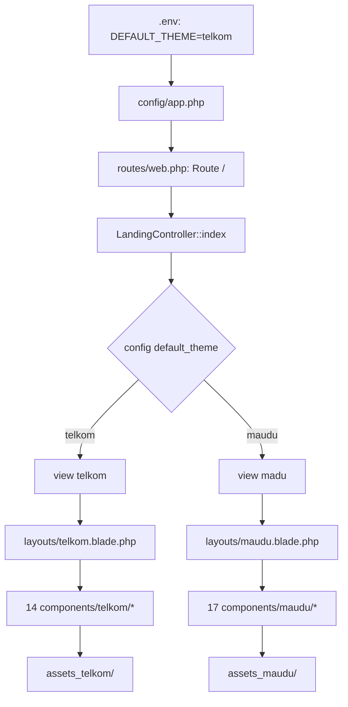

# Rencana Implementasi: Theme Switching Telkom ↔ MAUDU

## Overview

Membuat sistem **theme switching** untuk landing page, di mana route `/` akan menampilkan tema berdasarkan environment variable `DEFAULT_THEME` di `.env`. Kedua tema (Telkom dan MAUDU) menampilkan data dari database yang sama, tetapi **data tertentu bisa dioverride per tema** (misal: jurusan, program peminatan, kontak, social media) sesuai kebutuhan masing-masing sekolah.

---

## Mekanisme Data Override per Tema

Karena kedua sekolah (SMK Telkom dan MA MAUDU) memiliki data yang **berbeda** di beberapa aspek, diperlukan mekanisme override data per tema.

### Strategi: Config File per Tema

Buat file config terpisah untuk setiap tema yang berisi data spesifik sekolah:

```
config/
├── themes/
│   ├── telkom.php    ← Data khusus SMK Telkom
│   └── maudu.php     ← Data khusus MA MAUDU
```

### Data yang Di-Override per Tema

| Data | Telkom (SMK) | MAUDU (MA/MTs) | Sumber |
|------|-------------|----------------|--------|
| **Nama Sekolah** | SMK Telekomunikasi Darul Ulum | MA Unggulan Darul Ulum Rejoso | Config |
| **Tagline** | — | Madrasah Hebat, Bermartabat | Config |
| **Alamat** | Jl. Wahid Hasyim No.128 | Jl. Wonokerto Selatan Peterongan Jombang | Config |
| **Telepon** | 0856-4940-0339 / (0321) 8681-888 | (0321) 868911 | Config |
| **WhatsApp** | 6285649400339 | 628113383722 | Config |
| **Email** | smktelkomdujbg@gmail.com | adminmaudu@gmail.com | Config |
| **Social Media** | smktelkomdarululum | OfficialMaudu / official_maudu | Config |
| **Jurusan/Program** | TKJ, RPL, DKV, Produksi Film | IPA, IPS, Keagamaan | Config |
| **Fitur Unggulan** | E-Library, Sertifikasi, Karya Literasi | Kurikulum Madrasah, Studi Timur Tengah, Tahfidz, Kemasyarakatan | Config |
| **Hero Slider Images** | 3 gambar slider telkom | 3 gambar slider maudu | Config |
| **Kepala Sekolah** | Kepala SMK | Kepala MA | Database + Config |
| **Video YouTube** | Video SMK | Video MAUDU | Config |

### Data yang Tetap Sama (dari Database)

| Data | Keterangan |
|------|------------|
| **Events/Kegiatan** | Semua event dari tabel `events` |
| **Blog/Berita** | Semua blog dari tabel `berita` |
| **Testimonials** | Semua testimonial dari tabel `testimonials` |
| **Partners/Kerjasama** | Semua partner dari tabel `partners` |
| **Instagram Posts** | Semua post dari Instagram API |
| **Siswa Count** | Total siswa aktif |
| **Kelulusan %** | Persentase kelulusan |

### Implementasi Config

```php
// config/themes/telkom.php
return [
    'name' => 'SMK Telekomunikasi Darul Ulum',
    'tagline' => '',
    'address' => 'Ponpes Darul Ulum, Jl. Wahid Hasyim No.128',
    'phone' => '0856-4940-0339',
    'phone_secondary' => '(0321) 8681-888',
    'whatsapp' => '6285649400339',
    'email' => 'smktelkomdujbg@gmail.com',
    'facebook' => 'smktelkomdarululum',
    'instagram' => 'smktelkomdarululum',
    'youtube' => 'smktelkomdarululum',
    'ppdb_url' => 'https://psb.ponpesdarululum.id/',
    'jurusan' => [
        ['name' => 'TKJ', 'desc' => 'Teknik Komputer & Jaringan'],
        ['name' => 'RPL', 'desc' => 'Rekayasa Perangkat Lunak'],
        ['name' => 'DKV', 'desc' => 'Desain Komunikasi Visual'],
        ['name' => 'PROFILM', 'desc' => 'Produksi Film'],
    ],
    'features' => [...],
    'hero_images' => [...],
    'kepala_sekolah' => [...],
    'video_url' => '...',
];
```

```php
// config/themes/maudu.php
return [
    'name' => 'MA Unggulan Darul Ulum Rejoso',
    'tagline' => 'Madrasah Hebat, Bermartabat',
    'address' => 'Jl. Wonokerto Selatan, Peterongan, Jombang',
    'phone' => '(0321) 868911',
    'whatsapp' => '628113383722',
    'email' => 'adminmaudu@gmail.com',
    'facebook' => 'OfficialMaudu',
    'instagram' => 'official_maudu',
    'youtube' => 'OfficialMaudu-f6b',
    'ppdb_url' => 'https://psb.ponpesdarululum.id/',
    'program_peminatan' => [
        ['name' => 'IPA', 'desc' => 'Ilmu Pengetahuan Alam'],
        ['name' => 'IPS', 'desc' => 'Ilmu Pengetahuan Sosial'],
        ['name' => 'Keagamaan', 'desc' => 'Program Keagamaan'],
    ],
    'features' => [...],
    'hero_images' => [...],
    'kepala_madrasah' => [...],
    'video_url' => '...',
];
```

### Cara Akses di Controller & Blade

```php
// Di Controller
$themeConfig = config('themes.' . config('app.default_theme', 'telkom'));
// atau langsung: $themeConfig = theme_config();

// Share ke semua view
View::share('themeConfig', $themeConfig);
```

```blade
<!-- Di Blade Component -->
<h1>{{ $themeConfig['name'] }}</h1>
<p>{{ $themeConfig['address'] }}</p>

<!-- Iterasi jurusan/program -->
@foreach($themeConfig['jurusan'] as $j)
    <div class="card">{{ $j['name'] }} — {{ $j['desc'] }}</div>
@endforeach
```

### Mekanisme Fallback

```php
// Helper function
function theme_config($key = null) {
    $theme = config('app.default_theme', 'telkom');
    $config = config("themes.{$theme}", []);
    
    if ($key) {
        return $config[$key] ?? config("themes.telkom.{$key}");
    }
    
    return $config;
}
```

Jika data tema MAUDU belum tersedia, fallback ke tema Telkom sebagai default.

---

## Alur Arsitektur



---

## Perbandingan Branding

| Aspek | Telkom (SMK) | MAUDU (MA) |
|-------|--------------|------------|
| **Nama** | SMK Telekomunikasi Darul Ulum | MA Unggulan Darul Ulum Rejoso |
| **Tagline** | - | Madrasah Hebat, Bermartabat |
| **Alamat** | Ponpes Darul Ulum, Jl. Wahid Hasyim No.128 | Jl. Wonokerto Selatan, Peterongan, Jombang |
| **Email** | smktelkomdujbg@gmail.com | adminmaudu@gmail.com |
| **Telepon** | 0856-4940-0339 / (0321) 8681-888 | (0321) 868911 |
| **WhatsApp** | 6285649400339 | 628113383722 |
| **PPDB** | psb.ponpesdarululum.id | psb.ponpesdarululum.id / linktr.ee/maudu |
| **Facebook** | smktelkomdarululum | OfficialMaudu |
| **Instagram** | smktelkomdarululum | official_maudu |
| **YouTube** | smktelkomdarululum | OfficialMaudu-f6b |

---

## Perbandingan Struktur Section

```
TELKON (telkom.blade.php)                    MAUDU (index.html)
═══════════════════════════                  ═══════════════════════
1. Header (RS Menu)                          1. Header (Bootstrap Navbar)
2. Hero Slider (Owl Carousel)                2. Hero Slider (Owl Carousel)
3. Services (4 Jurusan)                      3. Feature Area (3 Fitur)
4. About (Kepala Sekolah + Counter)          4. Kepala Madrasah (Campus Life)
5. Programs (Kerjasama Industri)             5. Video Area (YouTube)
6. CTA (Pendaftaran)                         6. Counter Area (3 Counter)
7. Events (Kegiatan)                         7. About Area (Gallery + 4 Program)
8. Partners (Logo Carousel)                  8. Choose Area (3 Program Peminatan)
9. Testimonials (Alumni)                     9. Portfolio Area (Kegiatan IG)
10. Instagram Feed                           10. Testimonial Area (5 Alumni)
11. Blog (Berita)                            11. Partner Area (Logo Carousel)
12. Contact (Form + Maps)                    12. Footer
13. Footer
```

---

## Detail Per Section

### 1. Header

| Aspek | Telkom | MAUDU |
|-------|--------|-------|
| **Wrapper** | `<div class="full-width-header header-style2">` + `<header id="rs-header" class="rs-header">` | `<header class="header">` |
| **Topbar** | `<div class="topbar-area">` dengan flaticon icons | `<div class="header-top">` dengan FontAwesome icons |
| **Navigation** | RS Menu (`<nav class="rs-menu">` + `<ul class="nav-menu">`) | Bootstrap Navbar (`<nav class="navbar navbar-expand-lg">` + `<ul class="navbar-nav">`) |
| **Mobile Menu** | Canvas menu (slide from right) | Bootstrap collapse (`#main_nav`) |
| **Search** | Tidak ada | Search popup (`<div class="search-popup">`) |
| **Logo** | Dark + Light logo (RS Menu style) | Single logo (`<a class="navbar-brand">`) |
| **CTA Button** | Topbar right | Nav right (`<div class="nav-right-btn">`) |

**Menu MAUDU:**
- PROFIL: Yayasan, MAUDU, Prestasi Siswa, Gallery
- AKADEMIK: Tenaga Pendidik, Jurusan, Kalender Akademik, Studi Ekskursi, Studi Kampus, Ekstrakurikuler
- LAYANAN PESERTA DIDIK: E-Siswa & Alumni, E-Raport, E-OSIS, E-Lulus, E-Majalah
- EVENT MAUDU (link langsung)
- INFORMASI PENDAFTARAN (button)

---

### 2. Hero Slider

| Aspek | Telkom | MAUDU |
|-------|--------|-------|
| **CSS Class** | `rs-slider style1` | `hero-section` |
| **Carousel** | Owl Carousel dengan data attributes | Owl Carousel `owl-theme` |
| **Slide Content** | `slider-content slide1/2/3` dengan background image | `hero-single` dengan background image |
| **Content** | Subtitle + Title + Description + Button | Subtitle + Title + Description (tanpa button) |
| **Default Images** | `assets_telkom/assets/images/slider/h2-1.jpg` etc | `assets_maudu/assets/img/slider/slider-1.jpg` etc |

**Slides MAUDU:**
1. "Grand Opening MAUDU Library"
2. "Gedung DPRD Kabupaten Jombang"
3. "Kompetisi Agama, Sains, dan Seni 2024"

---

### 3. Services vs Feature Area

| Aspek | Telkom | MAUDU |
|-------|--------|-------|
| **CSS Class** | `rs-services style1` | `feature-area fa-negative` |
| **Layout** | 4 kolom (3+3+3+3) | 3 kolom (6+6+6) |
| **Content** | 4 Jurusan dengan overlay effect | 3 Fitur dengan icon SVG |
| **Animation** | Hover overlay | Static |

**Fitur MAUDU:**
1. E-LIBRARY — Perpustakaan digital berisi Koleksi materi dalam format elektronik
2. SERTIFIKASI KOMPETENSI — Uji kompetensi yang sistematis dan objektif
3. KARYA LITERASI — Penelitian di Bidang Keislaman, Sains, Teknologi, dan Sosial

---

### 4. About / Kepala Madrasah

| Aspek | Telkom | MAUDU |
|-------|--------|-------|
| **CSS Class** | `rs-about style2` | `campus-life` |
| **Layout** | 2 kolom (5+7) | 2 kolom (6+6) |
| **Left** | Kepala Sekolah (photo + nama + deskripsi) | Photo (content-img) |
| **Right** | 3 counter + 2 grid image | Kepala Madrasah (nama + deskripsi) |
| **Counter** | Siswa, Jurusan, Lanjut Kuliah | *Terpisah di section berikutnya* |

---

### 5. Video Area (Hanya MAUDU)

| Aspek | Keterangan |
|-------|------------|
| **CSS Class** | `video-area py-120` |
| **Content** | Background image + YouTube popup button |
| **YouTube URL** | `https://www.youtube.com/watch?v=ckHzmP1evNU` |
| **Library** | Magnific Popup (`popup-youtube`) |

---

### 6. Counter Area (Hanya MAUDU — terpisah)

| Aspek | Keterangan |
|-------|------------|
| **CSS Class** | `counter-area pt-60 pb-60` |
| **Counters** | 24 Mata Pelajaran, 800+ Peserta Didik, 98+ Tenaga Pendidik |
| **Icons** | SVG icons dari `assets_maudu/assets/img/icon/` |
| **Animation** | CounterUp jQuery plugin |

---

### 7. About Area (Hanya MAUDU)

| Aspek | Keterangan |
|-------|------------|
| **CSS Class** | `about-area py-120` |
| **Layout** | 2 kolom (6+6) |
| **Left** | 3 gallery images + "Gallery Kegiatan MAUDU Rejoso" |
| **Right** | 4 program unggulan dengan icon + judul + deskripsi |
| **CTA** | PPDB ONLINE button + WA KAMI |

**4 Program Unggulan MAUDU:**
1. KURIKULUM MADRASAH — Kolaborasi kurikulum Kepesantrenan, Kemendikbud, Kemenag
2. PROGRAM STUDI KE TIMUR TENGAH — Pembinaan Intensif dan Mediator Pemberangkatan
3. KELAS TAHFIDZ, MUATAN LOKAL KITAB TURATS — Program Tahfidz serta Pembiasaan Siswa
4. PROGRAM KEMASYARAKATAN — Kafilah Sholat Jum'at, TPQ, Bakti Sosial

---

### 8. Choose Area / Program Peminatan (Hanya MAUDU)

| Aspek | Keterangan |
|-------|------------|
| **CSS Class** | `choose-area pt-80 pb-80` |
| **Layout** | 2 kolom (6+6) |
| **Left** | 3 Program Peminatan dengan icon + judul + deskripsi |
| **Right** | Image |

**3 Program Peminatan:**
1. PEMINATAN ILMU PENGETAHUAN ALAM (IPA)
2. PEMINATAN ILMU PENGETAHUAN SOSIAL (IPS)
3. PEMINATAN KEAGAMAAN

---

### 9. Portfolio / Kegiatan (MAUDU) vs Instagram Feed (Telkom)

| Aspek | Telkom | MAUDU |
|-------|--------|-------|
| **CSS Class** | `rs-instagram style2` | `portfolio-area py-120` |
| **Layout** | Grid 6 post (4+4+4) | Grid 6 portfolio (4+4+4) |
| **Content** | IG posts dengan like/comment count | Portfolio items dengan overlay |
| **Data** | `$instagramPosts` dari IG API | Static atau `$instagramPosts` |

---

### 10. Testimonial

| Aspek | Telkom | MAUDU |
|-------|--------|-------|
| **CSS Class** | `rs-testimonial style2` | `testimonial-area ts-bg` |
| **Layout** | 1 featured + 2 card | Owl Carousel 5 card |
| **Featured** | Foto besar + nama + tempat kerja | Tidak ada |
| **Cards** | Foto kecil + nama + kuliah + deskripsi | Star rating + foto + nama + asal |
| **Background** | Default | `ts-bg` (testimonial background) |

---

### 11. Partner

| Aspek | Telkom | MAUDU |
|-------|--------|-------|
| **CSS Class** | `rs-partner` | `partner-area bg` |
| **Layout** | Owl Carousel 5 items | Owl Carousel 10 items |
| **Background** | Gray | Default |
| **Data** | `$partners` dari DB | Static images |

---

### 12. Programs / Kerjasama Industri (Baru di MAUDU)

> Section ini tidak ada di template `index.html` MAUDU, tapi diminta ditambahkan.

| Aspek | Telkom | MAUDU |
|-------|--------|-------|
| **CSS Class Telkom** | `rs-degree style1 modify gray-bg` | — |
| **CSS Class MAUDU** | — | `program-area py-120` (custom) |
| **Layout** | Title + 6 degree cards | Title + kerjasama cards |
| **Data** | `$partners` (fallback ke static) | `$partners` dari DB |

**Rancangan MAUDU:**
- Heading: "Kerjasama & Program Unggulan"
- Subheading: "Kolaborasi dengan berbagai institusi untuk meningkatkan kualitas pendidikan"
- Grid layout: 2-3 kolom menampilkan partner/kerjasama
- Setiap item: Logo + Nama Institusi + Deskripsi singkat
- Menggunakan CSS MAUDU (`site-heading`, `container`, Bootstrap grid)

---

### 13. CTA / Pendaftaran (Baru di MAUDU)

> Section ini tidak ada di template `index.html` MAUDU, tapi diminta ditambahkan.

| Aspek | Telkom | MAUDU |
|-------|--------|-------|
| **CSS Class Telkom** | `rs-cta style2` + `partition-bg-wrap` | — |
| **CSS Class MAUDU** | — | `cta-area py-120` (custom) |
| **Layout** | Video popup kiri + Info daftar kanan | Video popup kiri + Info daftar kanan |
| **Video** | YouTube `F5bnwy0lRZI` | YouTube dari `$siteSettings['video_url']` |

**Rancangan MAUDU:**
- Background: gradient/overlay color MAUDU
- Kiri: Video popup (Magnific Popup) dengan thumbnail
- Kanan: Judul pendaftaran + Info alamat MAUDU + Jam operasional + Langkah cara daftar
- Menggunakan CSS MAUDU (`container`, `row`, Bootstrap grid)
- Data dari `$siteSettings`: video_url, cta_title, cta_description, cta_button_url

---

### 14. Events / Kegiatan (Baru di MAUDU)

> Section ini tidak ada di template `index.html` MAUDU, tapi diminta ditambahkan.

| Aspek | Telkom | MAUDU |
|-------|--------|-------|
| **CSS Class Telkom** | `rs-latest-events style1 bg-wrap` | — |
| **CSS Class MAUDU** | — | `events-area py-120` (custom) |
| **Layout** | Title + 3 event cards dengan date badge | Title + event cards |
| **Data** | `$events` dari DB | `$events` dari DB |

**Rancangan MAUDU:**
- Heading: "Kegiatan Terkini"
- Subheading: "Berbagai kegiatan dan acara menarik di MAUDU"
- List events dengan date badge (bulan + hari)
- Setiap event: Date badge + Judul + Kategori + Link detail
- Menggunakan CSS MAUDU (`site-heading`, `container`, Bootstrap grid)
- WOW.js animation pada setiap item

---

### 15. Blog / Berita (Baru di MAUDU)

> Section ini tidak ada di template `index.html` MAUDU, tapi diminta ditambahkan.

| Aspek | Telkom | MAUDU |
|-------|--------|-------|
| **CSS Class Telkom** | `rs-blog style2` | — |
| **CSS Class MAUDU** | — | `blog-area py-120` (custom) |
| **Layout** | Owl Carousel 3 blog cards | Owl Carousel 3 blog cards |
| **Data** | `$blogs` dari DB | `$blogs` dari DB |

**Rancangan MAUDU:**
- Heading: "Berita & Artikel Terbaru"
- Subheading: "Informasi terkini seputar kegiatan dan prestasi MAUDU"
- Owl Carousel 3 kartu blog
- Setiap kartu: Gambar + Judul + Tanggal + Author + Excerpt
- Menggunakan Owl Carousel MAUDU (`owl.carousel.min.js`)
- Data dari `$blogs`: title, excerpt, image, author, date

---

### 16. Contact / Hubungi Kami (Baru di MAUDU)

> Section ini tidak ada di template `index.html` MAUDU, tapi diminta ditambahkan.

| Aspek | Telkom | MAUDU |
|-------|--------|-------|
| **CSS Class Telkom** | `rs-contact style2` | — |
| **CSS Class MAUDU** | — | `contact-area py-120` (custom) |
| **Layout** | Info kontak + Maps + Form | Info kontak + Maps + Form |
| **Data** | `$siteSettings` + form submit | `$siteSettings` + form submit |

**Rancangan MAUDU:**
- Heading: "Hubungi Kami"
- Subheading: "Jangan ragu untuk menghubungi kami"
- 3 kolom info kontak: Alamat + Telepon/Email + Jam Operasional
- Tombol WhatsApp langsung (nomor MAUDU: 628113383722)
- Google Maps embed (lokasi MAUDU)
- Contact form (nama, email, subjek, pesan)
- Menggunakan CSS MAUDU (`site-heading`, `container`, Bootstrap grid)
- Data dari `$siteSettings`: alamat, telepon, email

---

### 17. Footer

| Aspek | Telkom | MAUDU |
|-------|--------|-------|
| **Wrapper** | `<footer id="rs-footer" class="rs-footer">` | `<footer class="footer-area">` |
| **Shape** | Tidak ada | Footer shape image |
| **Columns** | 3 kolom (Jurusan, Link, Kontak) | 4 kolom (Logo, Link, Corner, Slogan) |
| **Copyright** | `footer-bottom` | `copyright` |
| **Social** | FontAwesome 5 (`fa fa-*`) | FontAwesome 6 (`fab fa-*`) |

---

## File yang Akan Dibuat/Diubah

### File Baru (23 files)

| # | File | Keterangan |
|---|------|------------|
| 1 | `config/themes/telkom.php` | Data spesifik SMK Telkom (jurusan, kontak, sosmed) |
| 2 | `config/themes/maudu.php` | Data spesifik MA MAUDU (program, kontak, sosmed) |
| 3 | `app/Helpers/ThemeHelper.php` | Helper function `theme_config()` |
| 4 | `resources/views/layouts/maudu.blade.php` | Base layout (CSS/JS ke `assets_maudu/`) |
| 5 | `resources/views/components/maudu/header.blade.php` | Bootstrap navbar header |
| 6 | `resources/views/components/maudu/hero-slider.blade.php` | Owl Carousel slider |
| 7 | `resources/views/components/maudu/feature-area.blade.php` | 3 fitur unggulan |
| 8 | `resources/views/components/maudu/about-kepala.blade.php` | Kepala Madrasah |
| 9 | `resources/views/components/maudu/video.blade.php` | Video YouTube popup |
| 10 | `resources/views/components/maudu/counter.blade.php` | Statistik counter |
| 11 | `resources/views/components/maudu/about-area.blade.php` | Gallery + 4 program |
| 12 | `resources/views/components/maudu/choose-area.blade.php` | 3 Program Peminatan |
| 13 | `resources/views/components/maudu/programs.blade.php` | Kerjasama industri (baru) |
| 14 | `resources/views/components/maudu/cta.blade.php` | Video popup + Pendaftaran (baru) |
| 15 | `resources/views/components/maudu/events.blade.php` | Events dengan date badge (baru) |
| 16 | `resources/views/components/maudu/portfolio.blade.php` | Kegiatan MAUDU |
| 17 | `resources/views/components/maudu/testimonial.blade.php` | Testimonial alumni |
| 18 | `resources/views/components/maudu/partner.blade.php` | Partner logos |
| 19 | `resources/views/components/maudu/blog.blade.php` | Blog cards carousel (baru) |
| 20 | `resources/views/components/maudu/contact.blade.php` | Kontak + Maps + Form (baru) |
| 21 | `resources/views/components/maudu/footer.blade.php` | Footer MAUDU |
| 22 | `resources/views/maudu.blade.php` | View utama |

### File yang Diubah (6 files)

| # | File | Perubahan |
|---|------|-----------|
| 23 | `.env` | Tambah `DEFAULT_THEME=telkom` |
| 24 | `.env.example` | Tambah `DEFAULT_THEME=telkom` |
| 25 | `config/app.php` | Tambah `'default_theme' => env('DEFAULT_THEME', 'telkom')` |
| 26 | `app/Http/Controllers/LandingController.php` | Tambah method `index()` + `maudu()` + share `themeConfig` |
| 27 | `routes/web.php` | Route `/` → `LandingController::index()` |

---

## Implementasi Backend

### 1. .env

```env
DEFAULT_THEME=telkom
```

### 2. config/app.php

```php
'default_theme' => env('DEFAULT_THEME', 'telkom'),
```

### 3. LandingController

```php
public function index()
{
    $theme = config('app.default_theme', 'telkom');
    
    $siteSettings = $this->getSiteSettings();
    View::share('siteSettings', $siteSettings);
    
    $data = [
        'siswaCount' => $this->getSiswaCount(),
        'kelulusanPercentage' => $this->getKelulusanPercentage(),
        'testimonials' => $this->getTestimonials(),
        'blogs' => $this->getBlogs(),
        'partners' => $this->getPartners(),
        'events' => $this->getEvents(),
        'instagramPosts' => $this->getInstagramPosts(),
    ];
    
    return view($theme, $data); // 'telkom' atau 'maudu'
}

public function telkom()
{
    return $this->index();
}

public function madu()
{
    return $this->index();
}
```

### 4. routes/web.php

```php
Route::get('/', [\App\Http\Controllers\LandingController::class, 'index'])->name('landing');
```

---

## Urutan Implementasi

1. Setup config (`.env`, `.env.example`, `config/app.php`)
2. Buat `config/themes/telkom.php` dan `config/themes/maudu.php` (data override per tema)
3. Buat `app/Helpers/ThemeHelper.php` (helper function `theme_config()`)
4. Buat `layouts/maudu.blade.php`
5. Buat 17 komponen Blade MAUDU:
   - Yang sudah ada di `index.html`: header, hero-slider, feature-area, about-kepala, video, counter, about-area, choose-area, portfolio, testimonial, partner, footer (12 komponen)
   - Yang baru ditambahkan: programs, cta, events, blog, contact (5 komponen)
6. Buat `resources/views/maudu.blade.php` (view utama)
7. Update `LandingController.php` (method `index()` + `maudu()` + share `themeConfig`)
8. Update `routes/web.php` (dynamic route)
9. Test switching tema via `DEFAULT_THEME`

---

## Urutan Section di maudu.blade.php

```blade
<x-maudu.header />
<x-maudu.hero-slider />
<x-maudu.feature-area />
<x-maudu.about-kepala />
<x-maudu.video />
<x-maudu.counter />
<x-maudu.about-area />
<x-maudu.choose-area />
<x-maudu.programs :partners="$partners" />
<x-maudu.cta />
<x-maudu.events :events="$events" />
<x-maudu.portfolio />
<x-maudu.testimonial :testimonials="$testimonials" />
<x-maudu.partner :partners="$partners" />
<x-maudu.blog :blogs="$blogs" />
<x-maudu.contact />
<x-maudu.footer />
```

---

## Catatan Tambahan untuk 5 Komponen Baru

### Programs (`programs.blade.php`)
- Mengambil data `$partners` dari controller (sudah ada di method `getPartners()`)
- Layout grid Bootstrap: judul section + grid partner cards
- Fallback data statis jika DB kosong (Axioo, GAMELAB, dll — tapi disesuaikan branding MAUDU)

### CTA (`cta.blade.php`)
- Mengambil data `$siteSettings` untuk video_url, cta_title, cta_description
- Layout split: video popup (kiri) + info pendaftaran (kanan)
- WhatsApp button ke nomor MAUDU: 628113383722

### Events (`events.blade.php`)
- Mengambil data `$events` dari controller (sudah ada di method `getEvents()`)
- Layout list dengan date badge
- Fallback data statis jika DB kosong

### Blog (`blog.blade.php`)
- Mengambil data `$blogs` dari controller (sudah ada di method `getBlogs()`)
- Owl Carousel 3 kartu blog
- Fallback data statis jika DB kosong

### Contact (`contact.blade.php`)
- Mengambil data `$siteSettings` untuk kontak info
- Layout: info kontak (kolom kiri) + Google Maps + Contact form (kolom kanan)
- WhatsApp button ke nomor MAUDU: 628113383722

---

## Status

- [x] Analisis struktur Telkom components (14 files)
- [x] Analisis template MAUDU index.html (1097 baris)
- [x] Perbandingan section Telkom vs MAUDU
- [x] Buat rencana implementasi
- [x] Update rencana: tambah 5 komponen (Programs, CTA, Events, Blog, Contact)
- [x] Tambah mekanisme data override per tema (config themes)
- [x] Implementasi — SELESAI (12 Juli 2026)
