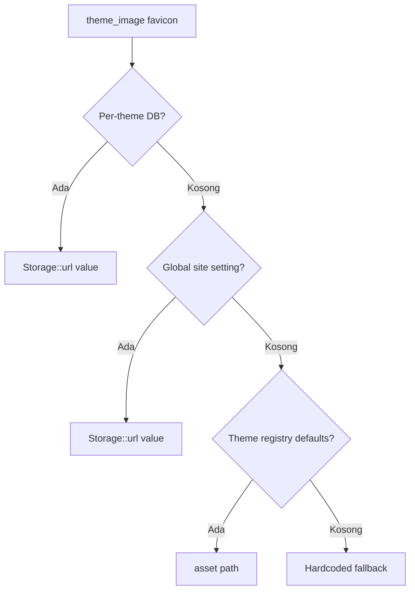
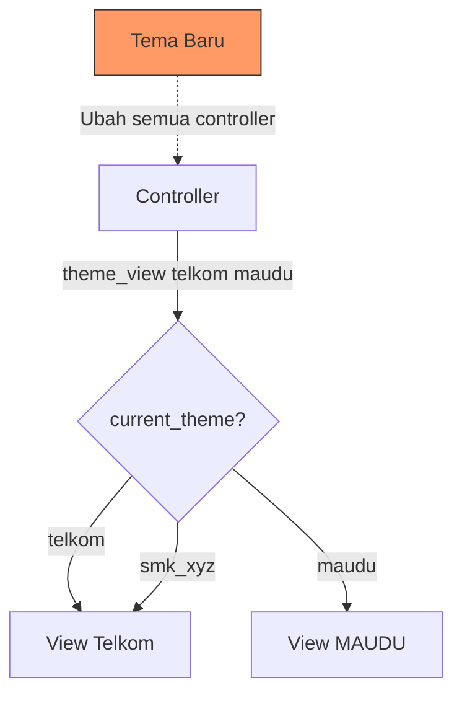
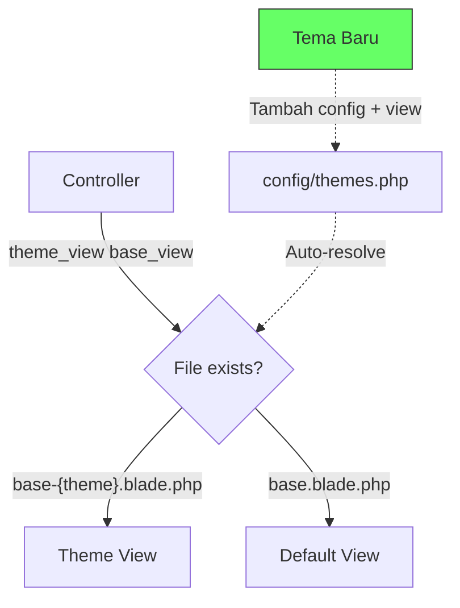

# Plan: Refactoring Theme System — Easy Multi-Theme Maintenance

> **Tanggal:** 2026-07-14
> **Tujuan:** Agar menambah tema baru untuk sekolah lain只需 tambah config + view, tanpa ubah controller atau logic inti.
> **Prinsip:** Convention over Configuration, Zero-Controller-Change untuk tema baru.

---

## Ringkasan Masalah

Saat ini theme system **hardcoded untuk 2 tema** (Telkom & MAUDU). Jika ingin menambah tema ke-3 (misal "SMK XYZ"), developer harus:

1. Ubah `theme_view()` di 4+ controllers (9 panggilan)
2. Ubah `LandingController` (tambah method baru)
3. Tambah `is_xyz()` helper
4. Buat view dengan nama file yang tidak konsisten

**Target:** Menambah tema baru只需:

```
1. Buat config:     config/themes/smk_xyz.php
2. Tambah registry: config/themes.php → available['smk_xyz']
3. Buat layout:     resources/views/layouts/smk_xyz.blade.php
4. Buat landing:    resources/views/smk_xyz.blade.php
5. Buat assets:     public/assets_smk_xyz/
6. Set .env:        DEFAULT_THEME=smk_xyz
7. (Optional) View overrides jika ingin custom
```

**TIDAK perlu ubah:** Controllers, Routes, ThemeHelper, atau views lain.

---

## Inventaris Masalah Hardcoded

### 0. Favicon/Logo Tidak Konsisten Antar Tema

**Dua sistem yang bentrok:** Global (`SettingsController` → `site_setting_*` cache) vs Per-Theme (`ThemeSettingController` → `theme_settings` table).

| Layout | Sumber Favicon | Status |
|--------|---------------|--------|
| `layouts/telkom.blade.php` | `$siteSettings['favicon']` → **Global** | ❌ Abaikan per-theme |
| `layouts/maudu.blade.php` | `$siteSettings['favicon']` → fallback `theme_config('favicon')` | ⚠️ Ada fallback |
| `layouts/app.blade.php` (Dashboard) | `cache('site_setting_favicon')` → **Global** | ❌ Selalu global |
| `layouts/guest.blade.php` (Auth) | `cache('site_setting_favicon')` → **Global** | ❌ Selalu global |
| `layouts/landing.blade.php` | `cache('site_setting_favicon')` → **Global** | ❌ Selalu global |

> **Masalah:** Dashboard dan auth pages selalu tampilkan favicon global, bukan per-theme. Jika admin upload favicon untuk MAUDU di ThemeSettingController, halaman login tetap pakai favicon Telkom.

### 1. `theme_view()` — Hardcoded 2 Parameter

**File:** [`app/Helpers/ThemeHelper.php`](app/Helpers/ThemeHelper.php:160)

```php
// SAAT INI — hanya 2 tema
function theme_view(string $telkom, string $maudu): string
{
    return current_theme() === 'maudu' ? $maudu : $telkom;
}
```

**Dipanggil di 4 controllers (9 tempat):**

| Controller | Line | Panggilan |
|-----------|------|-----------|
| [`BeritaController`](app/Http/Controllers/BeritaController.php:178) | 178 | `theme_view('berita.public.index', 'berita.maudu.index')` |
| [`BeritaController`](app/Http/Controllers/BeritaController.php:192) | 192 | `theme_view('berita.public.show', 'berita.maudu.show')` |
| [`PageController`](app/Http/Controllers/PageController.php:475) | 475 | `theme_view('pages.public.index-telkom', 'pages.public.index-maudu')` |
| [`PageController`](app/Http/Controllers/PageController.php:510) | 510 | `theme_view('pages.public.show-telkom', 'pages.public.show-maudu')` |
| [`InstagramController`](app/Http/Controllers/InstagramController.php:30) | 30 | `theme_view('instagram.activities', 'instagram.activities-maudu')` |
| [`KelulusanController`](app/Http/Controllers/KelulusanController.php:517) | 517 | `theme_view('public.elulus.check', 'public.elulus.check-maudu')` |
| [`KelulusanController`](app/Http/Controllers/KelulusanController.php:548) | 548 | `theme_view('public.elulus.result', 'public.elulus.result-maudu')` |

### 2. `is_telkom()` / `is_maudu()` — Hardcoded Helper

**File:** [`app/Helpers/ThemeHelper.php`](app/Helpers/ThemeHelper.php:114)

```php
function is_telkom() { return current_theme() === 'telkom'; }
function is_maudu() { return current_theme() === 'maudu'; }
```

### 3. `LandingController` — Hardcoded View Names

**File:** [`app/Http/Controllers/LandingController.php`](app/Http/Controllers/LandingController.php:25)

```php
// Line 35 — hardcoded ternary
return view($theme === 'maudu' ? 'maudu' : 'telkom', $data);

// Line 43 — hardcoded method
public function telkom() { return view('telkom', $this->buildData()); }

// Line 54 — hardcoded method
public function maudu() { return view('maudu', $this->buildData()); }
```

### 4. View Naming Tidak Konsisten

| Pattern | Contoh | Status |
|---------|--------|--------|
| `{theme}/file.blade.php` | `berita/maudu/index.blade.php` | ✅ Konsisten |
| `file-{theme}.blade.php` | `pages/public/index-maudu.blade.php` | ⚠️ Beda pattern |
| `file.blade.php` (default) | `berita/public/index.blade.php` | ❌ Tanpa suffix |

### 5. Layout Hardcoded Asset Paths

- [`layouts/telkom.blade.php`](resources/views/layouts/telkom.blade.php:22) — hardcoded `assets_telkom/`
- [`layouts/maudu.blade.php`](resources/views/layouts/maudu.blade.php:25) — hardcoded `assets_maudu/`

### 6. Routes Hardcoded Per Tema

**File:** [`routes/web.php`](routes/web.php:38)

```php
Route::get('/telkom', [LandingController::class, 'telkom']);
Route::get('/maudu', [LandingController::class, 'maudu']);
```

### 7. Tidak Ada Theme Registry

Tidak ada file pusat yang mendefinisikan semua tema yang tersedia.

---

## Rencana Implementasi

### Fase 1: Theme Registry — [`config/themes.php`](config/themes.php)

**Tujuan:** Pusat definisi semua tema. Menambah tema baru = tambah 1 entry di sini.

```php
<?php
// config/themes.php

return [
    // Theme aktif (override via .env DEFAULT_THEME)
    'default' => env('DEFAULT_THEME', 'telkom'),

    // Semua tema yang tersedia
    'available' => [
        'telkom' => [
            'name'          => 'SMK Telekomunikasi Darul Ulum',
            'short_name'    => 'SMK Telkom',
            'type'          => 'SMK',
            'view'          => 'telkom',              // landing page view
            'layout'        => 'layouts.telkom',      // base layout
            'assets_path'   => 'assets_telkom',
            'components'    => 'components.telkom',    // Blade component namespace
            'colors' => [
                'primary'   => '#00529C',
                'secondary' => '#003366',
            ],
        ],
        'maudu' => [
            'name'          => 'MA Unggulan Darul Ulum Rejoso',
            'short_name'    => 'MAUDU',
            'type'          => 'MA',
            'view'          => 'maudu',
            'layout'        => 'layouts.maudu',
            'assets_path'   => 'assets_maudu',
            'components'    => 'components.maudu',
            'colors' => [
                'primary'   => '#1a5632',
                'secondary' => '#0d3d21',
            ],
        ],
        // 🆕 Tambah tema baru di sini — controller TIDAK perlu diubah
        // 'smk_xyz' => [
        //     'name'        => 'SMK XYZ',
        //     'short_name'  => 'SMK XYZ',
        //     'type'        => 'SMK',
        //     'view'        => 'smk_xyz',
        //     'layout'      => 'layouts.smk_xyz',
        //     'assets_path' => 'assets_smk_xyz',
        //     'components'  => 'components.smk_xyz',
        //     'colors'      => ['primary' => '#ff0000', 'secondary' => '#cc0000'],
        // ],
    ],
];
```

**Note:** Config `config/themes/telkom.php` dan `config/themes/maudu.php` tetap dipertahankan untuk theme-specific settings (contact info, social media, menu, dll). [`config/themes.php`](config/themes.php) adalah **registry** untuk metadata tema.

---

### Fase 2: Refactor [`ThemeHelper`](app/Helpers/ThemeHelper.php)

#### 2.1 Tambah Helper Baru

```php
/**
 * Get current theme info from registry.
 */
function theme_info(string $key = null, mixed $default = null): mixed
{
    $themes = config('themes.available', []);
    $current = current_theme();

    if (!isset($themes[$current])) {
        return $default;
    }

    if ($key === null) {
        return $themes[$current];
    }

    return $themes[$current][$key] ?? $default;
}

/**
 * Get all available theme names.
 */
function available_themes(): array
{
    return array_keys(config('themes.available', []));
}

/**
 * Generic theme check — replaces is_telkom(), is_maudu(), etc.
 */
function is_theme(string $theme): bool
{
    return current_theme() === $theme;
}

/**
 * Resolve URL — supports 'route:name' syntax in config menus.
 */
function resolve_theme_url(string $url): string
{
    if (str_starts_with($url, 'route:')) {
        $routeName = substr($url, 6);
        try {
            return route($routeName);
        } catch (\Exception $e) {
            return '#';
        }
    }
    return $url;
}
```

#### 2.2 Refactor `theme_view()` — Convention-Based

```php
/**
 * Return the correct view name based on active theme.
 *
 * Strategy:
 *   1. Check $overrides[theme_name] (explicit override)
 *   2. Check if {base}-{theme}.blade.php exists (convention)
 *   3. Fallback to {base} view (default)
 *
 * @param string $base      Base view name (e.g., 'berita.public.index')
 * @param array  $overrides Explicit overrides per theme, e.g., ['maudu' => 'berita.maudu.index']
 * @return string Resolved view name
 */
function theme_view(string $base, array $overrides = []): string
{
    $theme = current_theme();

    // 1. Explicit override
    if (isset($overrides[$theme])) {
        return $overrides[$theme];
    }

    // 2. Convention: {base}-{theme}.blade.php
    $themed = "{$base}-{$theme}";
    $path = resource_path('views/' . str_replace('.', '/', $themed) . '.blade.php');
    if (file_exists($path)) {
        return $themed;
    }

    // 3. Fallback to base view
    return $base;
}
```

#### 2.3 Pertahankan `is_telkom()` & `is_maudu()` (Backward Compat)

```php
/**
 * @deprecated Use is_theme('telkom') instead
 */
function is_telkom(): bool
{
    return current_theme() === 'telkom';
}

/**
 * @deprecated Use is_theme('maudu') instead
 */
function is_maudu(): bool
{
    return current_theme() === 'maudu';
}
```

#### 2.4 Refactor `theme_asset()` — Auto-Resolve

```php
/**
 * Generate asset URL for current theme.
 * Auto-resolves from theme_info registry.
 */
function theme_asset(string $path): string
{
    $assetsPath = theme_info('assets_path') ?? theme_config('assets_path', 'assets_telkom');
    return asset("{$assetsPath}/{$path}");
}
```

---

### Fase 3: Refactor [`LandingController`](app/Http/Controllers/LandingController.php)

#### 3.1 Refactor `index()` — Generic

```php
public function index()
{
    $theme = current_theme();

    $themeConfig = theme_config();
    View::share('themeConfig', $themeConfig);
    View::share('currentTheme', $theme);

    $data = $this->buildData();

    // Convention: view name = theme name (telkom.blade.php, maudu.blade.php)
    // Fallback: 'welcome' if theme view doesn't exist
    $view = theme_view($theme);
    return view($view, $data);
}
```

#### 3.2 Pertahankan `telkom()` & `maudu()` (Backward Compat Routes)

```php
/**
 * Direct route /telkom — backward compat
 * @deprecated Use /?theme=telkom or set DEFAULT_THEME=telkom
 */
public function telkom()
{
    View::share('themeConfig', theme_config());
    View::share('currentTheme', 'telkom');
    return view('telkom', $this->buildData());
}

/**
 * Direct route /maudu — backward compat
 * @deprecated Use /?theme=maudu or set DEFAULT_THEME=maudu
 */
public function maudu()
{
    View::share('themeConfig', theme_config());
    View::share('currentTheme', 'maudu');
    return view('maudu', $this->buildData());
}
```

---

### Fase 4: Update Controllers — Simplify `theme_view()` Calls

#### 4.1 [`BeritaController`](app/Http/Controllers/BeritaController.php)

**Sebelum:**
```php
return view(theme_view('berita.public.index', 'berita.maudu.index'), compact('beritas', 'featured'));
```

**Sesudah:**
```php
return view(theme_view('berita.public.index'), compact('beritas', 'featured'));
```

> Convention: tema MAUDU punya `berita/maudu/index.blade.php` — tapi karena base view adalah `berita.public.index` (dot notation), file convention-nya adalah `berita/public/index-maudu.blade.php`. Jadi perlu rename atau pakai override.

**Opsi A (Recommended) — Rename views untuk konsistensi:**

```
# Rename untuk pattern {base}-{theme}
berita/maudu/index.blade.php       → berita/public/index-maudu.blade.php
berita/maudu/show.blade.php        → berita/public/show-maudu.blade.php
```

**Opsi B — Pakai override eksplisit:**
```php
return view(theme_view('berita.public.index', [
    'maudu' => 'berita.maudu.index',
]), compact('beritas', 'featured'));
```

> **Rekomendasi:** Opsi A (rename) untuk konsistensi. Pattern `{base}-{theme}.blade.php` lebih mudah diprediksi.

#### 4.2 Semua Controller — Update Calls

| Controller | Sebelum | Sesudah (Opsi A) |
|-----------|---------|-------------------|
| `BeritaController:178` | `theme_view('berita.public.index', 'berita.maudu.index')` | `theme_view('berita.public.index')` |
| `BeritaController:192` | `theme_view('berita.public.show', 'berita.maudu.show')` | `theme_view('berita.public.show')` |
| `PageController:475` | `theme_view('pages.public.index-telkom', 'pages.public.index-maudu')` | `theme_view('pages.public.index')` |
| `PageController:510` | `theme_view('pages.public.show-telkom', 'pages.public.show-maudu')` | `theme_view('pages.public.show')` |
| `InstagramController:30` | `theme_view('instagram.activities', 'instagram.activities-maudu')` | `theme_view('instagram.activities')` |
| `KelulusanController:517` | `theme_view('public.elulus.check', 'public.elulus.check-maudu')` | `theme_view('public.elulus.check')` |
| `KelulusanController:548` | `theme_view('public.elulus.result', 'public.elulus.result-maudu')` | `theme_view('public.elulus.result')` |

---

### Fase 5: Standardisasi View Naming

#### 5.1 Convention Baru

```
# Pattern: {path}/{base}-{theme}.blade.php
resources/views/
├── berita/
│   ├── public/
│   │   ├── index.blade.php              # Default (Telkom)
│   │   └── index-maudu.blade.php        # MAUDU override
│   └── public/
│       ├── show.blade.php               # Default (Telkom)
│       └── show-maudu.blade.php         # MAUDU override
├── pages/
│   └── public/
│       ├── index.blade.php              # Default (Telkom)
│       ├── index-telkom.blade.php       # ← HAPUS (duplikat)
│       └── index-maudu.blade.php        # MAUDU override
├── instagram/
│   ├── activities.blade.php             # Default (Telkom/generic)
│   └── activities-maudu.blade.php       # MAUDU override
├── public/
│   └── elulus/
│       ├── check.blade.php              # Default (Telkom)
│       ├── check-maudu.blade.php        # MAUDU override
│       ├── result.blade.php             # Default (Telkom)
│       └── result-maudu.blade.php       # MAUDU override
├── layouts/
│   ├── telkom.blade.php                 # Layout Telkom
│   ├── maudu.blade.php                  # Layout MAUDU
│   └── landing.blade.php               # Generic layout
├── telkom.blade.php                     # Landing page Telkom
├── maudu.blade.php                      # Landing page MAUDU
└── components/
    ├── telkom/                          # Components Telkom
    └── maudu/                           # Components MAUDU
```

#### 5.2 File yang Perlu Direname/Rename

| Sebelum | Sesudah | Alasan |
|---------|---------|--------|
| `berita/maudu/index.blade.php` | `berita/public/index-maudu.blade.php` | Konsisten pattern `{base}-{theme}` |
| `berita/maudu/show.blade.php` | `berita/public/show-maudu.blade.php` | Konsisten pattern `{base}-{theme}` |
| `pages/public/index-telkom.blade.php` | `pages/public/index.blade.php` | Default view = Telkom, tidak perlu suffix |
| `pages/public/show-telkom.blade.php` | `pages/public/show.blade.php` | Default view = Telkom, tidak perlu suffix |

#### 5.3 File yang TIDAK Berubah

- `layouts/telkom.blade.php` — tetap (layout berbeda dari content view)
- `layouts/maudu.blade.php` — tetap
- `telkom.blade.php` — tetap (landing page = theme name)
- `maudu.blade.php` — tetap
- `components/telkom/*` — tetap
- `components/maudu/*` — tetap

---

### Fase 6: Refactor Layout Templates

#### 6.1 [`layouts/telkom.blade.php`](resources/views/layouts/telkom.blade.php)

**Sebelum (hardcoded):**
```html
<link rel="icon" type="image/x-icon" href="{{ asset('assets_telkom/assets/images/fav.png') }}">
<link rel="stylesheet" href="{{ asset('assets_telkom/assets/css/bootstrap.min.css') }}">
```

**Sesudah (dynamic via theme_info):**
```html
<link rel="icon" type="image/x-icon" href="{{ asset(theme_info('assets_path') . '/assets/images/fav.png') }}">
<link rel="stylesheet" href="{{ asset(theme_info('assets_path') . '/assets/css/bootstrap.min.css') }}">
```

> **Note:** Ini opsional. Layout per tema memang berbeda struktur CSS-nya, jadi hardcoded di layout masih acceptable. Yang penting **content views** dan **controllers** sudah generic.

#### 6.2 Rekomendasi

Pertahankan layout hardcoded per tema karena:
- Setiap tema punya CSS framework berbeda (Telkom = custom, MAUDU = Bootstrap)
- Struktur HTML head berbeda
- Component loading berbeda

**Yang penting di-refactor:** Content views + controllers, bukan layout.

---

### Fase 6b: Unify Favicon/Logo Resolution — [`theme_image()` Helper`](app/Helpers/ThemeHelper.php)

**Tujuan:** Semua layout (dashboard, auth, landing) tampilkan favicon/logo yang benar sesuai tema aktif.

#### 6b.1 Helper `theme_image()` — 4-Tier Resolution

```php
/**
 * Resolve theme image (favicon, logo, etc.) with 4-tier fallback:
 *   1. Per-theme DB (theme_settings table — admin editable)
 *   2. Per-theme config (config/themes/{theme}.php)
 *   3. Global site setting (site_settings table — SettingsController)
 *   4. Hardcoded default from theme registry (config/themes.php)
 *
 * @param string $key         Image key (e.g., 'favicon', 'logo', 'logo_light')
 * @param string $defaultPath Fallback path if nothing found
 * @return string             Asset URL
 */
function theme_image(string $key, string $defaultPath = ''): string
{
    // 1. Per-theme DB (ThemeSettingController)
    $themeValue = theme_config($key);
    if ($themeValue && !str_starts_with($themeValue, '#')) {
        return Storage::url($themeValue);
    }

    // 2. Global site setting (SettingsController)
    $globalValue = cache("site_setting_{$key}");
    if ($globalValue && !str_starts_with($globalValue, '#')) {
        return Storage::url($globalValue);
    }

    // 3. Theme registry default
    $registryDefault = theme_info("default_{$key}");
    if ($registryDefault) {
        return asset($registryDefault);
    }

    // 4. Hardcoded fallback
    return $defaultPath ? asset($defaultPath) : '';
}
```

#### 6b.2 Update Theme Registry — Default Images

```php
// config/themes.php → available array
'telkom' => [
    // ... existing fields ...
    'defaults' => [
        'favicon'  => 'assets_telkom/assets/images/fav.png',
        'logo'     => 'assets_telkom/assets/images/logo/logo.png',
        'logo_light' => 'assets_telkom/assets/images/logo/logo-light.png',
    ],
],
'maudu' => [
    // ... existing fields ...
    'defaults' => [
        'favicon'  => 'assets_maudu/assets/img/logo/favicon.png',
        'logo'     => 'assets_maudu/assets/img/logo/logo.png',
        'logo_light' => 'assets_maudu/assets/img/logo/logo-light.png',
    ],
],
```

#### 6b.3 Update Semua Layouts

**`layouts/app.blade.php` (Dashboard):**

```blade
<!-- Sebelum -->
@if (cache('site_setting_favicon'))
    <link rel="icon" type="image/x-icon" href="{{ Storage::url(cache('site_setting_favicon')) }}">
@else
    <link rel="icon" type="image/x-icon" href="{{ asset('assets_telkom/assets/images/fav.png') }}">
@endif

<!-- Sesudah -->
<link rel="icon" type="image/x-icon" href="{{ theme_image('favicon', theme_info('defaults.favicon', 'assets_telkom/assets/images/fav.png')) }}">
```

**`layouts/guest.blade.php` (Auth/Login):**

```blade
<!-- Sebelum — hardcoded assets_telkom -->
<link rel="icon" type="image/x-icon" href="{{ asset('assets_telkom/assets/images/fav.png') }}">

<!-- Sesudah — dynamic per theme -->
<link rel="icon" type="image/x-icon" href="{{ theme_image('favicon', theme_info('defaults.favicon', 'assets_telkom/assets/images/fav.png')) }}">
```

**`layouts/telkom.blade.php` & `layouts/maudu.blade.php`:**

```blade
<!-- Sebelum (maudu) -->
@if (!empty($siteSettings['favicon']))
    <link rel="icon" ... href="{{ Storage::url($siteSettings['favicon']) }}">
@else
    <link rel="icon" ... href="{{ asset(theme_config('favicon')) }}">
@endif

<!-- Sesudah — semua layout sama -->
<link rel="icon" type="image/x-icon" href="{{ theme_image('favicon', theme_info('defaults.favicon', 'assets_telkom/assets/images/fav.png')) }}">
```

#### 6b.4 Update `theme_info()` Helper

Tambahkan key `defaults` di registry:

```php
function theme_image_default(string $key): string
{
    return theme_info("defaults.{$key}", '');
}
```

#### 6b.5 Layout Login/Auth — Logo per Tema

```blade
<!-- layouts/guest.blade.php — logo -->

```

#### 6b.6 Prioritas Resolusi



---

### Fase 7: Refactor Header/Footer — Dynamic dari Config

#### 7.1 Header — Menu dari `theme_config('menu')`

**File:** [`resources/views/components/maudu/header.blade.php`](resources/views/components/maudu/header.blade.php)

**Sebelum:** Hardcoded menu dengan route names langsung di Blade.

**Sesudah:** Dynamic dari config dengan `resolve_theme_url()`:

```blade
@foreach (theme_config('menu', []) as $item)
    <li class="nav-item {{ !empty($item['children']) ? 'dropdown' : '' }}">
        <a class="nav-link {{ !empty($item['children']) ? 'dropdown-toggle' : '' }}"
           href="{{ resolve_theme_url($item['url'] ?? '#') }}"
           @if (!empty($item['children'])) role="button" data-bs-toggle="dropdown" @endif>
            {{ $item['label'] }}
        </a>
        @if (!empty($item['children']))
            <ul class="dropdown-menu">
                @foreach ($item['children'] as $child)
                    <li>
                        <a class="dropdown-item" href="{{ resolve_theme_url($child['url'] ?? '#') }}">
                            {{ $child['label'] }}
                        </a>
                    </li>
                @endforeach
            </ul>
        @endif
    </li>
@endforeach
```

#### 7.2 Config MAUDU — Update Menu URLs

**File:** [`config/themes/maudu.php`](config/themes/maudu.php:138)

```php
'menu' => [
    [
        'label' => 'PROFIL',
        'url' => '#',
        'children' => [
            ['label' => 'Yayasan', 'url' => 'route:pages.public.show,profil-yayasan'],
            ['label' => 'MAUDU', 'url' => 'route:pages.public.show,profil-maudu'],
            ['label' => 'Prestasi Siswa', 'url' => 'route:pages.public.show,prestasi-siswa'],
            ['label' => 'Gallery', 'url' => 'route:public.kegiatan'],
        ],
    ],
    [
        'label' => 'BERITA',
        'url' => 'route:berita.public.index',
    ],
    [
        'label' => 'KEGIATAN',
        'url' => 'route:public.kegiatan',
    ],
    [
        'label' => 'LAYANAN',
        'url' => '#',
        'children' => [
            ['label' => 'E-Lulus', 'url' => 'route:public.graduation.check'],
            ['label' => 'E-Raport', 'url' => '#'],
            ['label' => 'E-OSIS', 'url' => '#'],
        ],
    ],
],
```

**Note:** `resolve_theme_url()` akan resolve `route:public.graduation.check` → `route('public.graduation.check')`.

#### 7.3 Login Button — Dynamic

```blade
<div class="nav-right">
    @auth
        <a class="btn btn-primary" href="{{ route('admin.dashboard') }}">
            <i class="fas fa-tachometer-alt"></i> Dashboard
        </a>
    @else
        <a class="btn btn-outline-primary" href="{{ route('login') }}">
            <i class="fas fa-sign-in-alt"></i> Login
        </a>
    @endauth
    <a class="btn btn-primary ms-2" href="{{ theme_config('ppdb_url', '#') }}" target="_blank">
        DAFTAR SEKARANG
    </a>
</div>
```

> Login button sudah generik — tidak perlu diubah.

---

### Fase 8: Routes — Dynamic Theme Route

**File:** [`routes/web.php`](routes/web.php:37)

**Tambah route dinamis:**

```php
// Dynamic theme route — akses /{theme_name} langsung
Route::get('/{theme}', function (string $theme) {
    $available = config('themes.available', []);

    if (!isset($available[$theme])) {
        abort(404, 'Tema tidak ditemukan: ' . $theme);
    }

    // Override theme for this request
    config(['app.default_theme' => $theme]);
    app()->make(\Illuminate\Contracts\Cache\Factory::class)->flush();

    return app(\App\Http\Controllers\LandingController::class)->index();
})->name('landing.theme')->where('theme', '[a-z_]+');
```

**Pertahankan direct routes (backward compat):**

```php
Route::get('/telkom', [\App\Http\Controllers\LandingController::class, 'telkom'])->name('landing.telkom');
Route::get('/maudu', [\App\Http\Controllers\LandingController::class, 'maudu'])->name('landing.maudu');
```

---

## Diagram Arsitektur — Sebelum vs Sesudah

### Sebelum (Hardcoded 2 Tema)



### Sesudah (Convention-Based)



---

## Checklist File yang Perlu Dibuat/Diubah

### File Baru

| # | File | Deskripsi |
|---|------|-----------|
| 1 | `config/themes.php` | Theme registry — pusat definisi semua tema + defaults |

### File yang Diubah

| # | File | Perubahan |
|---|------|-----------|
| 1 | `app/Helpers/ThemeHelper.php` | Refactor `theme_view()`, tambah `theme_info()`, `theme_image()`, `is_theme()`, `resolve_theme_url()`, `available_themes()` |
| 2 | `app/Http/Controllers/LandingController.php` | Refactor `index()` jadi generik |
| 3 | `app/Http/Controllers/BeritaController.php` | Simplify `theme_view()` calls (hapus 2nd param) |
| 4 | `app/Http/Controllers/PageController.php` | Simplify `theme_view()` calls (hapus 2nd param) |
| 5 | `app/Http/Controllers/InstagramController.php` | Simplify `theme_view()` calls (hapus 2nd param) |
| 6 | `app/Http/Controllers/KelulusanController.php` | Simplify `theme_view()` calls (hapus 2nd param) |
| 7 | `resources/views/components/maudu/header.blade.php` | Dynamic menu dari config + `resolve_theme_url()` |
| 8 | `config/themes/maudu.php` | Update menu URLs ke format `route:name` |
| 9 | `routes/web.php` | Tambah dynamic theme route |
| 10 | `resources/views/layouts/app.blade.php` | Ganti hardcoded favicon ke `theme_image()` |
| 11 | `resources/views/layouts/guest.blade.php` | Ganti hardcoded favicon/logo ke `theme_image()` |
| 12 | `resources/views/layouts/telkom.blade.php` | Ganti `$siteSettings['favicon']` ke `theme_image()` |
| 13 | `resources/views/layouts/maudu.blade.php` | Ganti fallback logic ke `theme_image()` |
| 14 | `resources/views/layouts/landing.blade.php` | Ganti hardcoded favicon ke `theme_image()` |

### File yang Direname (Reorganisasi)

| # | Sebelum | Sesudah |
|---|---------|---------|
| 1 | `berita/maudu/index.blade.php` | `berita/public/index-maudu.blade.php` |
| 2 | `berita/maudu/show.blade.php` | `berita/public/show-maudu.blade.php` |
| 3 | `pages/public/index-telkom.blade.php` | `pages/public/index.blade.php` |
| 4 | `pages/public/show-telkom.blade.php` | `pages/public/show.blade.php` |

---

## Urutan Eksekusi

```
Fase 1: Buat config/themes.php (registry + defaults)
  ↓
Fase 2: Refactor ThemeHelper.php (helper baru + theme_view generik + theme_image)
  ↓
Fase 3: Refactor LandingController.php (index generik)
  ↓
Fase 4: Update 4 controllers (simplify theme_view calls)
  ↓
Fase 5: Rename views untuk konsistensi naming
  ↓
Fase 6a: (Optional) Refactor layout asset paths
  ↓
Fase 6b: Unify favicon/logo resolution — update 5 layouts pakai theme_image()
  ↓
Fase 7: Refactor header/footer (dynamic dari config)
  ↓
Fase 8: Tambah dynamic route di web.php
  ↓
Fase 9: Testing — set DEFAULT_THEME=maudu, test semua rute + favicon per tema
  ↓
Fase 10: Clear cache & final verification
```

---

## Panduan: Menambah Tema Baru

Setelah refactoring selesai, untuk menambah tema "SMK XYZ":

### Step 1: Buat Config

```php
// config/themes/smk_xyz.php
return [
    'name' => 'SMK XYZ',
    'short_name' => 'SMK XYZ',
    'type' => 'SMK',
    'assets_path' => 'assets_smk_xyz',
    // ... contact info, social media, menu, dll
];
```

### Step 2: Tambah Registry

```php
// config/themes.php → available array
'smk_xyz' => [
    'name'        => 'SMK XYZ',
    'short_name'  => 'SMK XYZ',
    'type'        => 'SMK',
    'view'        => 'smk_xyz',
    'layout'      => 'layouts.smk_xyz',
    'assets_path' => 'assets_smk_xyz',
    'components'  => 'components.smk_xyz',
    'colors'      => ['primary' => '#ff0000', 'secondary' => '#cc0000'],
    'defaults'    => [
        'favicon'    => 'assets_smk_xyz/images/favicon.png',
        'logo'       => 'assets_smk_xyz/images/logo.png',
        'logo_light' => 'assets_smk_xyz/images/logo-light.png',
    ],
],
```

### Step 3: Buat Layout

```html
<!-- resources/views/layouts/smk_xyz.blade.php -->
<!-- Copy dari layouts/telkom.blade.php -->
<!-- Gunakan theme_image() untuk favicon/logo — OTOMATIS benar -->
<link rel="icon" type="image/x-icon" href="{{ theme_image('favicon', theme_info('defaults.favicon')) }}">
<link rel="stylesheet" href="{{ asset(theme_info('assets_path') . '/css/style.css') }}">
```

### Step 4: Buat Landing Page

```html
<!-- resources/views/smk_xyz.blade.php -->
@extends(theme_info('layout'))
@section('content')
    <!-- Hero, About, Programs, etc. -->
@endsection
```

### Step 5: Buat Assets

```bash
mkdir -p public/assets_smk_xyz/css
mkdir -p public/assets_smk_xyz/images
# Copy dan customize CSS/images
# Upload favicon/logo via admin: Theme Settings → SMK XYZ
```

### Step 6: Set Environment

```env
DEFAULT_THEME=smk_xyz
```

### Step 7: (Optional) View Overrides

Jika ingin custom view untuk halaman berita/detail:

```html
<!-- resources/views/berita/public/index-smk_xyz.blade.php -->
@extends(theme_info('layout'))
<!-- Custom berita page for SMK XYZ -->
```

> Jika tidak buat view override, otomatis fallback ke `berita/public/index.blade.php` (default).

### Step 8: Upload Branding via Admin

```
Admin → Theme Settings → SMK XYZ → General
├── Upload favicon (akan disimpan di theme-settings/smk_xyz/favicon)
├── Upload logo
├── Upload logo_light
└── Lainnya (headmaster_photo, video_thumbnail, dll)
```

> Favicon/logo akan otomatis tampil di: landing page, dashboard admin, halaman login — sesuai tema aktif.

### Step 9: Clear Cache & Test

```bash
php artisan cache:clear
php artisan view:clear
php artisan config:clear
php artisan serve
```

---

## Catatan Penting

1. **Backward Compatibility** — `is_telkom()`, `is_maudu()`, route `/telkom`, `/maudu` tetap dipertahankan. Tandai sebagai `@deprecated`.

2. **Convention > Configuration** — `theme_view()` otomatis resolve view berdasarkan naming convention. Override eksplisit hanya untuk kasus khusus.

3. **Config Layers** — `config/themes.php` (registry) → `config/themes/{theme}.php` (settings) → Database `theme_settings` (admin editable). 3-tier tetap dipertahankan.

4. **Layout Tidak Di-Refactor** — Layout per tema memang berbeda strukturnya. Yang di-refactor adalah content views dan controllers.

5. **Cache Strategy** — Setelah refactor, pastikan clear `theme_settings_{theme}` cache saat menambah tema baru.

6. **Favicon/Logo Resolution** — `theme_image()` helper resolve dengan 4-tier fallback: per-theme DB → global site setting → theme registry default → hardcoded. Semua layout (dashboard, auth, landing) pakai helper ini.

7. **Backward Compat — Global Settings** — `SettingsController` tetap bisa upload favicon/logo global (untuk fallback). `ThemeSettingController` upload per-theme (untuk override). Prioritas: per-theme > global.

8. **Testing Checklist** — Untuk setiap tema baru, test:
   - [ ] Landing page (`GET /`)
   - [ ] Berita index (`GET /berita`)
   - [ ] Berita detail (`GET /berita/{slug}`)
   - [ ] Pages index (`GET /pages`)
   - [ ] Pages detail (`GET /page/{slug}`)
   - [ ] Kegiatan (`GET /kegiatan`)
   - [ ] E-Lulus check (`GET /check-graduation`)
   - [ ] E-Lulus result (`POST /check-graduation`)
   - [ ] Header navigation links
   - [ ] Footer links
   - [ ] Login button
   - [ ] Responsive design
   - [ ] **Favicon di dashboard admin** (`/admin`) — harus favicon tema aktif
   - [ ] **Favicon di halaman login** (`/login`) — harus favicon tema aktif
   - [ ] **Logo di halaman login** — harus logo tema aktif
   - [ ] **Favicon di landing page** — harus favicon tema aktif
   - [ ] **Upload favicon via Theme Settings** — muncul di semua halaman
